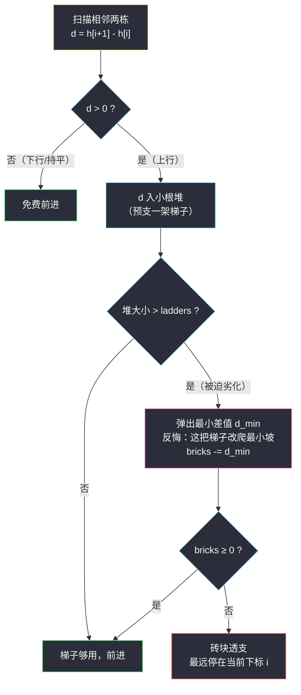
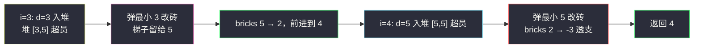

# 可以到达的最远建筑（反悔堆 · 梯子优先 + 最小差值反悔）

## 一、问题描述

给你一个整数数组 `heights` 表示建筑物的高度，另给你一些砖块 `bricks` 和梯子 `ladders`。

从下标 `0` 出发旅程开始，在移动过程中你可以：

- 如果当前建筑的高度**大于等于**下一栋（`heights[i] >= heights[i+1]`），不需要任何资源直接移动；
- 如果**下一栋更高**，你可以选择**用一架梯子**（可跨越任意高度差），或者用 `h[i+1] - h[i]` **块砖块**。

返回你可以到达的**最远**建筑物的下标（从 0 开始计数）。

> 🔗 LeetCode 1642：https://leetcode.cn/problems/furthest-building-you-can-reach/
>
> 数据范围：`1 <= heights.length <= 10^5`，`1 <= heights[i] <= 10^9`，`0 <= bricks <= 10^9`，`0 <= ladders <= heights.length`。

**示例 1**

```
输入：heights = [4,2,7,6,9,14,12], bricks = 5, ladders = 1
输出：4
解释：2→7 用梯子；6→9 用 3 块砖；9→14 需 5 块砖但只剩 2 块，停在 4。
```

**直观理解**

下行免费，麻烦全在上行。梯子是「无代价资源」（再高的坡也一架搞定），砖块是「总量受限资源」。反悔堆的核心思想：**先用梯子**（把上行差值塞进小根堆记账）；当梯子不够时**被迫劣化**——从堆里挑**最小的差值**改用砖块（把梯子腾出来给现在这个更大的坡）；如果连最小差值都买不起，说明任何方案都到不了，就地停下。

---

## 二、暴力解法

枚举每条上行用梯子还是砖块的组合（DFS 回溯）：

```python
class Solution:
    def furthestBuilding(self, heights: List[int], bricks: int, ladders: int) -> int:
        n = len(heights)
        ups = [heights[i+1] - heights[i] for i in range(n - 1)
               if heights[i+1] > heights[i]]      # 所有上行差值

        best = 0
        def dfs(idx, b, l, pos):                  # 处理第 idx 个上行差值
            nonlocal best
            best = max(best, pos)
            if idx == len(ups):
                return
            d = ups[idx]
            if l > 0:                             # 用梯子
                dfs(idx + 1, b, l - 1, pos + steps[idx])
            if b >= d:                            # 用砖
                dfs(idx + 1, b - d, l, pos + steps[idx])
        ...
```

（`steps[idx]` 需额外记录每个上行差值对应能前进到哪一段。）

### 复杂度

- **时间**：上行段数为 `m` 时最坏 `O(2^m)`，`n = 10^5` 完全不可行。
- **空间**：`O(m)` 递归栈。

### 🔴 瓶颈在哪里

组合爆炸的根源是「每个坡独立二选一」。但注意：**梯子之间无差别、砖块按量计费**——那么最优结构一定是「最大的若干个坡用梯子，其余小坡用砖」。这种「总量守恒、逐项可换」的结构正是反悔贪心的舞台。

---

## 三、优化探索（核心章节）

> 📚 本题在灵茶题单中属于 **§5.5 反悔堆**（数据结构 · 堆 B 路）：先用无代价资源（梯子），被迫劣化时反悔换回——把堆中最小的差值改成砖块，砖不足即停。

### 3.1 观察特征

| 特征 | 说明 |
|------|------|
| 下行免费 | 只有正差值 `d = h[i+1] - h[i] > 0` 消耗资源 |
| 梯子无差别 | 一架梯子能跨越任意差值 → 应该留给**大坡** |
| 砖块按量计费 | 买**小坡**最便宜 |
| 资源守恒 | 每条上行恰用一种资源 → 「最大 k 个坡用梯子」型结构 |

### 3.2 反悔堆：先预支梯子，不够再反悔

从左到右扫每一段上行 `d`：

1. **先把 `d` 入小根堆**——含义是「预支一架梯子给这个坡」。堆中始终是「当前由梯子服务的差值集合」。
2. 若 `len(heap) > ladders`，说明梯子不够，**反悔**：弹出堆中最小差值 `d_min`，改用砖块 `bricks -= d_min`。为什么挑最小的？反悔的代价是花砖，当然赎回最便宜的坡，把梯子留给堆中更大的坡。
3. 若 `bricks < 0`，砖块透支——注意此时赎回的已经是最小差值，更大的更买不起 → 无论怎么换都不够，**最远就是当前下标 `i`**，停止。



### 3.3 为什么反悔是对的（交换论证）

设扫描到位置 `i` 时堆大小超过 `ladders`。任何能通过前 `i` 段的方案，都等价于「选 `ladders` 段用梯、其余段用砖」。于是**砖块总花费 = （前 i 段差值总和）−（用梯的 ladders 段差值总和）**，要让砖够用，就要让用梯的差值总和尽可能大——即**最大的 `ladders` 个差值用梯**。

反悔堆在小根堆上动态维护的正是「目前见过的最大的 `ladders` 个差值」：每来一个新差值就先收进候选，超出名额就淘汰当前最小的。淘汰谁谁改用砖，`bricks` 逐段扣减；一旦扣成负数，说明「最大的 ladders 个用梯」也救不了，任何方案都不行——停。这正是灵神反悔堆模板的「先用无代价资源，被迫劣化时反悔换回」。

### 3.4 一句话核心

> **上行差值一律先入小根堆领梯子；堆超员就弹最小差值改砖；砖透支就地停下。**

---

## 四、代码实现

### Python（主解：反悔堆）

```python
class Solution:
    def furthestBuilding(self, heights: List[int], bricks: int, ladders: int) -> int:
        heap = []                                  # 小根堆：当前用梯子的差值集合
        for i in range(len(heights) - 1):
            d = heights[i + 1] - heights[i]
            if d <= 0:                             # 下行/持平，免费
                continue
            heapq.heappush(heap, d)                # 预支一架梯子
            if len(heap) > ladders:                # 梯子不够 → 反悔
                bricks -= heapq.heappop(heap)       # 最小差值改用砖块
                if bricks < 0:                     # 连最小的坡都买不起
                    return i                       # 最远停在 i
        return len(heights) - 1                    # 一路走到底
```

**变量含义**

| 变量 | 含义 |
|------|------|
| `heap` | 小根堆，保存「当前由梯子跨越的差值」，大小恒 ≤ `ladders` |
| `bricks` | 剩余砖块，每次反悔减去被赎回的最小差值 |
| `i` | 当前所在下标；砖透支时它就是答案 |

**循环不变式**：处理完第 `i` 段后，若未返回，则「用梯子走过前 `i` 段中最大的 `min(上行数, ladders)` 个差值、其余上行用砖且砖未透支」——即当前位置可达，且堆中集合是前 `i+1` 段的最优梯子分配。

### Java（最优解同思路）

```java
class Solution {
    public int furthestBuilding(int[] heights, int bricks, int ladders) {
        PriorityQueue<Integer> heap = new PriorityQueue<>();   // 小根堆
        for (int i = 0; i + 1 < heights.length; i++) {
            int d = heights[i + 1] - heights[i];
            if (d <= 0) continue;
            heap.offer(d);
            if (heap.size() > ladders) {
                bricks -= heap.poll();
                if (bricks < 0) return i;
            }
        }
        return heights.length - 1;
    }
}
```

---

## 五、具体例子演示

以示例 1 `heights = [4,2,7,6,9,14,12]`，`bricks = 5`，`ladders = 1` 走主解。

**逐步跟踪（堆内容、砖块余量、反悔动作）**

| i | 走向 | d | 动作 | 堆（用梯差值） | bricks | 结果 |
|---|------|---|------|----------------|--------|------|
| 0 | 4→2 | -2 | 下行免费 | [] | 5 | 到 1 |
| 1 | 2→7 | +5 | 入堆，堆 1 ≤ 1 | [5] | 5 | 到 2 |
| 2 | 7→6 | -1 | 下行免费 | [5] | 5 | 到 3 |
| 3 | 6→9 | +3 | 入堆 [3,5] 超 1 → 弹 3 改砖 | [5] | 5-3=2 | 到 4 |
| 4 | 9→14 | +5 | 入堆 [5,5] 超 1 → 弹 5 改砖 | [5] | 2-5=-3 | **透支，返回 4** |

第 `i=3` 步是关键的**反悔**：来的是小坡 `3`，堆里原有的 `5` 更大——梯子继续留给大坡 `5`，新来的小坡用 3 块砖。第 `i=4` 步再来大坡 `5` 时，堆中最小还是 `5`，反悔要价 5 块砖但只剩 2 块 → 透支，最远 `4` ✓。

**自编补充例**：`heights = [4,12,2,7,3,18,20,45,39]`，`bricks = 10`，`ladders = 2`。

| i | 走向 | d | 动作 | 堆 | bricks |
|---|------|---|------|----|--------|
| 0 | 4→12 | +8 | 入堆，2 ≤ 2 | [8] | 10 |
| 1 | 12→2 | -10 | 免费 | [8] | 10 |
| 2 | 2→7 | +5 | 入堆 [5,8]，2 ≤ 2 | [5,8] | 10 |
| 3 | 7→3 | -4 | 免费 | [5,8] | 10 |
| 4 | 3→18 | +15 | 入堆 [5,8,15] 超 2 → 弹 5 | [8,15] | 5 |
| 5 | 18→20 | +2 | 入堆 [2,8,15] 超 2 → 弹 2 | [8,15] | 3 |
| 6 | 20→45 | +25 | 入堆 [8,15,25] 超 2 → 弹 8 | [15,25] | 3-8=-5 < 0 → 返回 6 |

验证：能到 6 的方案（梯给 8、15，砖买 5、2 共 7 ≤ 10）存在；到 7 需再跨 25，资源不够 ✓。



---

## 六、复杂度分析

| 方法 | 时间 | 空间 | 说明 |
|------|------|------|------|
| 回溯暴力 | `O(2^m)`（`m` 为上行段数） | `O(m)` | 不可行 |
| 反悔堆（主解） | `O(n log n)` | `O(n)` | 至多 `n` 次 push、`n` 次 pop，每次 `O(log n)` |

---

## 七、对比总结

**反悔贪心 vs 普通贪心 vs DP**

| 方法 | 思路 | 局限 |
|------|------|------|
| 普通贪心 | 每次上行「小的用砖、大的用梯」 | 局部决策无法撤销，后到的更大坡会推翻前面 |
| DP | 状态 =（位置，剩余砖，剩余梯） | 砖量 `10^9`，状态爆炸 |
| **反悔堆** | 决策可撤销：梯子先到先得，超员时赎回最便宜的换成砖 | 无（本题最优） |

**易错点**

1. **先入堆再判超员**：顺序不能反，否则新差值没有参与「最大 ladders 个」的竞争。
2. **弹的是最小差值**（赎回最便宜的），不是当前新来的差值——除非新来的恰是最小。
3. 透支判定在减砖之后 `bricks < 0`，而不是比较 `bricks < d_min` 前先减，两种写法等价，但返回下标是 `i`（当前所在，尚未跨过第 `i` 段）。
4. `d <= 0` 的段完全跳过（连入堆都不要），否则免费段会占用堆名额。
5. 一趟扫完没透支 → 返回 `n - 1`（走到最后一栋）。

**模板（反悔堆 · 无代价资源优先，Python）**

```python
heap = []                          # 小根堆：无代价资源（梯子）正在服务的差值
for i in range(n - 1):
    d = a[i + 1] - a[i]
    if d <= 0:
        continue
    heapq.heappush(heap, d)        # 先用无代价资源
    if len(heap) > limit:          # 资源不够 → 反悔
        cost -= heapq.heappop(heap) # 最小代价项改用付费资源
        if cost < 0:               # 付费资源透支 → 停
            return i
```

---

## 八、举一反三

| 题目 | 关系 |
|------|------|
| [407. 接雨水 II](https://leetcode.cn/problems/trapping-rain-water-ii/) | 反悔堆同族思想：小根堆逐层「最矮先走」决定水位 |
| [1648. 销售价值减少的颜色球](https://leetcode.cn/problems/sell-diminishing-valued-colored-balls/) | 「先用最便宜、被迫劣化」的堆贪心骨架 |
| [630. 课程表 III](https://leetcode.cn/problems/course-schedule-iii/) | 经典反悔堆：超时就退掉耗时最长的课换更短的 |
| [1383. 最大的团队表现值](https://leetcode.cn/problems/maximum-performance-of-a-team/) | 堆维护「保留 k 个最优、其余反悔淘汰」的姊妹结构 |
| [LCP 33. 蓄水](https://leetcode.cn/problems/o8SXZn/) | 「梯子/砖块」双资源分配的直观简化版（枚举梯子数 + 排序贪心） |

同批姊妹篇：[#3607 电网维护](power-grid-maintenance.md)（懒删除堆）、[#2653 滑动子数组的美丽值](sliding-subarray-beauty.md)（对顶堆）——堆家族的另外两件兵器。

**思想迁移**

- 见到「两种资源、一种免费一种限量」的结构，先想**反悔堆**：免费资源先到先得，超员时赎回**最小代价**项换成付费资源。
- 判停条件是「付费资源透支」，且透支发生在**最便宜的反悔**上——这一步保证了停下的位置就是全局最优。
- 口诀：**「免费先入堆，超员弹最小；砖头一透支，原地即最远。」**
