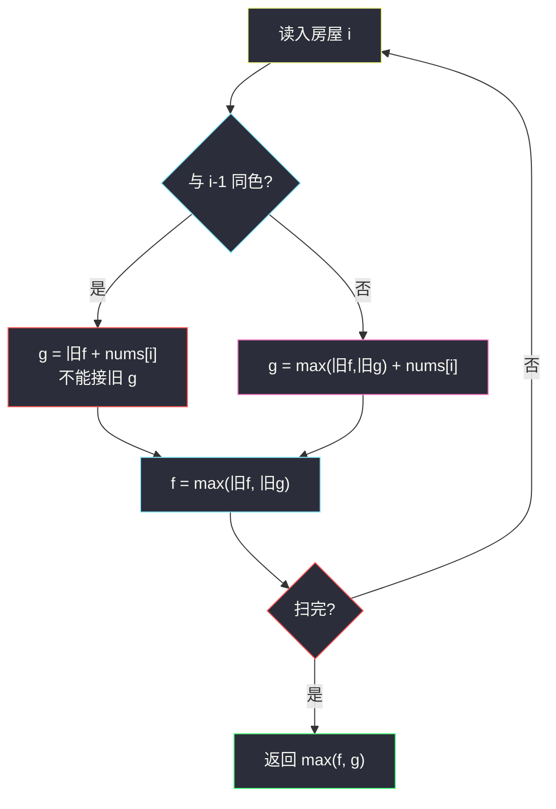

# 3840. 打家劫舍 V（House Robber V）

> 题目来源：[https://leetcode.cn/problems/house-robber-v/](https://leetcode.cn/problems/house-robber-v/)
>
> 灵茶题单小节定位：§1.2 打家劫舍（线性 DP；约束从「相邻不能偷」改成「同色相邻不能偷」）

## 一、问题描述

你是一名专业小偷，计划偷窃沿街的房屋。每间房屋藏有现金，并由带颜色代码的安全系统保护。

给定两个长度为 `n` 的整数数组 `nums` 和 `colors`：`nums[i]` 是第 `i` 间的金额，`colors[i]` 是颜色代码。

**仅当两间相邻房屋颜色相同**时，你不能同时偷它们。颜色不同的相邻房屋**可以都偷**。

返回能偷到的最大金额。

**数据范围**：

- `1 <= n == nums.length == colors.length <= 10⁵`
- `1 <= nums[i], colors[i] <= 10⁵`

`n = 10⁵` 必须 `O(n)`。金额和最大约 `10¹⁰`，用 64 位整数。

**示例 1**：

```text
输入：nums = [1,4,3,5], colors = [1,1,2,2]
输出：9
解释：偷下标 1 和 3（金额 4+5）。二者不相邻。
也可验证 4+3=7（下标 1、2，颜色 1≠2，相邻合法）更小。
```

**示例 2**：

```text
输入：nums = [3,1,2,4], colors = [2,3,2,2]
输出：8
解释：偷 0、1、3（3+1+4）。0 与 1 颜色不同故相邻也可偷；3 与 1 不相邻。
```

**示例 3**：

```text
输入：nums = [10,1,3,9], colors = [1,1,1,2]
输出：22
解释：偷 0、2、3（10+3+9）。0 与 2 不相邻；2 与 3 颜色不同。
```

**核心思考点**：这不是经典「相邻一律不能偷」。把房屋看成一条链，边权约束只出现在**同色相邻对**上。线性 DP 仍只需要两个状态：偷 / 不偷当前，转移按「与上一间是否同色」分叉。

## 二、暴力解法

### 思路

每个房屋选或不选，共 `2^n` 个子集。对每个子集检查：若选了 `i-1` 和 `i` 且 `colors[i-1] == colors[i]`，则非法；合法者取金额和的最大。

### 代码

```python
def robBrute(nums: list[int], colors: list[int]) -> int:
    n = len(nums)
    best = 0
    for mask in range(1 << n):
        ok, s, prev = True, 0, False
        for i in range(n):
            if mask >> i & 1:
                if prev and colors[i] == colors[i - 1]:
                    ok = False
                    break
                s += nums[i]
                prev = True
            else:
                prev = False
        if ok:
            best = max(best, s)
    return best
```

### 复杂度

- 时间：`O(n·2^n)`——`n ≤ 20` 可对拍，`n = 10⁵` 不可用。
- 空间：`O(1)`。

## 三、优化探索

### 3.1 最优子结构只依赖「上一间偷没偷」⭐

走到房屋 `i` 时，历史只通过「`i-1` 偷了没有」影响当前。设：

- `f`：不偷当前房屋时的最大金额
- `g`：偷当前房屋时的最大金额

初始：`f = 0`，`g = nums[0]`（只有一间，必可偷）。

### 3.2 同色 / 异色两条转移 ⭐⭐

记转移前的旧值为 `old_f, old_g`。

**同色**（`colors[i] == colors[i-1]`）：相邻不能都偷。

```text
f = max(old_f, old_g)      # 不偷 i，上一间随意
g = old_f + nums[i]         # 偷 i，上一间必须不偷
```

**异色**：相邻无约束。

```text
f = max(old_f, old_g)
g = max(old_f, old_g) + nums[i]
```

异色时 `g` 其实等于 `新 f + nums[i]`，因为不偷 `i` 的最优就是上一间的最优。

### 3.3 同句赋值，切勿先改 f 再算 g ⭐

若写成：

```text
f = max(f, g)
g = f + nums[i]     # 同色时错：用的是新 f，不是旧 f
```

同色会被算成「上一间最优 + 当前」，等于无约束，示例 1 会得到 `1+4+3+5` 的错误路径。必须先用旧值算完再一起写入（元组赋值或临时变量）。



核心一句：**同色时偷当前只能接「不偷上一间」；异色则偷不偷上一间都能接。**

## 四、代码实现

### 主解：两个滚动变量

```python
class Solution:
    def rob(self, nums: List[int], colors: List[int]) -> int:
        f, g = 0, nums[0]
        for i in range(1, len(nums)):
            if colors[i - 1] == colors[i]:
                f, g = max(f, g), f + nums[i]
            else:
                f, g = max(f, g), max(f, g) + nums[i]
        return max(f, g)
```

Python 元组赋值**先算完右边**再拆包：同色分支里 `f + nums[i]` 用的是旧 `f`；异色分支里两个 `max(f, g)` 都用旧值。等价的显式写法：

```python
old_f, old_g = f, g
f = max(old_f, old_g)
if colors[i - 1] == colors[i]:
    g = old_f + nums[i]
else:
    g = f + nums[i]          # 此时 f 已是 max(old_f, old_g)
```

Java 必须拆临时变量，并全程 `long`：

```java
class Solution {
    public long rob(int[] nums, int[] colors) {
        long f = 0, g = nums[0];
        for (int i = 1; i < nums.length; i++) {
            if (colors[i - 1] == colors[i]) {
                long ng = f + nums[i];
                f = Math.max(f, g);
                g = ng;
            } else {
                long ng = Math.max(f, g) + nums[i];
                f = Math.max(f, g);
                g = ng;
            }
        }
        return Math.max(f, g);
    }
}
```

### 细节说明

- **`n = 1`**：循环不执行，返回 `nums[0]`。
- **全异色**：每次 `g` 都加上当前值，答案为全部之和（金额为正，没有理由故意不偷）。
- **全同色**：退化为经典打家劫舍 I：`g` 只能接旧 `f`。
- **Java 必须用 `long`**：`n·nums[i]` 可达 `10¹⁰`。
- **同句覆盖反例**：示例 1 若先 `f = max(f,g)` 再 `g = f + nums[i]`，`i=1` 会得到 `g=1+4=5`，最终错成 12（四间全偷）。

## 五、例子演示

**示例 1：`nums = [1,4,3,5], colors = [1,1,2,2]`**

| i | 颜色关系 | 旧 f, g | 新 f | 新 g | max |
|---|----------|---------|------|------|-----|
| 0 | — | — | 0 | 1 | 1 |
| 1 | 同色 1=1 | 0, 1 | max(0,1)=**1** | 0+4=**4** | 4 |
| 2 | 异色 1≠2 | 1, 4 | **4** | 4+3=**7** | 7 |
| 3 | 同色 2=2 | 4, 7 | **7** | 4+5=**9** | **9** |

- `i=1` 同色：偷 4 只能接「不偷 0」，不能 1+4。
- `i=3` 同色：`g=4+5=9` 对应偷下标 1 和 3；`f=7` 对应偷 1 和 2。答案 **9** ✅。

**示例 2：`[3,1,2,4]` 配 `[2,3,2,2]`**

| i | 关系 | 新 f | 新 g |
|---|------|------|------|
| 0 | — | 0 | 3 |
| 1 | 异色 | 3 | 3+1=4 |
| 2 | 异色 | 4 | 4+2=6 |
| 3 | 同色 | 6 | 4+4=**8** |

`g=8` 即 3+1+4（跳过同色的下标 2）。返回 **8** ✅。

**示例 3：`[10,1,3,9]` 配 `[1,1,1,2]`**

| i | 关系 | 新 f | 新 g |
|---|------|------|------|
| 0 | — | 0 | 10 |
| 1 | 同色 | 10 | 0+1=1 |
| 2 | 同色 | 10 | 10+3=13 |
| 3 | 异色 | 13 | 13+9=**22** |

10+3+9。`i=1` 的 `g=1` 几乎没用：同色段里偷小的 `1` 还得放弃 `10`，最优是隔着偷 0 和 2，再因异色接上 3。返回 **22** ✅。

**全同色退化**：`nums=[2,7,9,3], colors=[1,1,1,1]` 即打家劫舍 I，答案 `2+9=11`（不能 2+9+3，末尾 3 与 9 同色相邻）。DP：`g` 始终只能接旧 `f`。

## 六、复杂度分析

设 `n` 为房屋数：

- **时间复杂度：`O(n)`**——每个房屋常数次转移。
- **空间复杂度：`O(1)`**——只滚动 `f, g`。

## 七、对比总结

| 维度 | 子集枚举 | 主解滚动 DP |
|------|----------|-------------|
| 时间 | `O(n·2^n)` | `O(n)` |
| 约束处理 | 扫相邻对 | 转移时看同色与否 |
| 易错点 | 无 | **先改 f 再算 g** |

**套路归纳**：打家劫舍家族的共同骨架是「偷 / 不偷」两个滚动值。变体只改**谁不能和上一间同时偷**：I 是任意相邻，II 是首尾成环，本题是同色相邻。把约束翻译成「`g` 接 `old_f` 还是接 `max(old_f, old_g)`」即可。金额为正时异色段会倾向全偷，但代码不必特判，转移已覆盖。

## 八、举一反三

1. **[198. 打家劫舍](https://leetcode.cn/problems/house-robber/)**：任意相邻不能同时偷，即本题「全同色」特例。
2. **[213. 打家劫舍 II](https://leetcode.cn/problems/house-robber-ii/)**：环上首尾不能同时偷，拆成「偷首不偷尾 / 不偷首」两次线性 DP。
3. **[337. 打家劫舍 III](https://leetcode.cn/problems/house-robber-iii/)**：树形版本，父子不能同时偷，还是一对 `(不偷, 偷)`。
4. **[740. 删除并获得点数](https://leetcode.cn/problems/delete-and-earn/)**：值域上的打家劫舍（选 x 则不能选 x-1 / x+1）。
5. **[1388. 3n 块披萨](https://leetcode.cn/problems/pizza-with-3n-slices/)**：环上不相邻选取，打家劫舍 II 的加强。

**同族互引**：同目录经典线性 DP 见 `maximum-subarray-sum-with-one-deletion.md`（也是两个滚动状态）；本题把「相邻冲突」换成颜色谓词，骨架相同。
