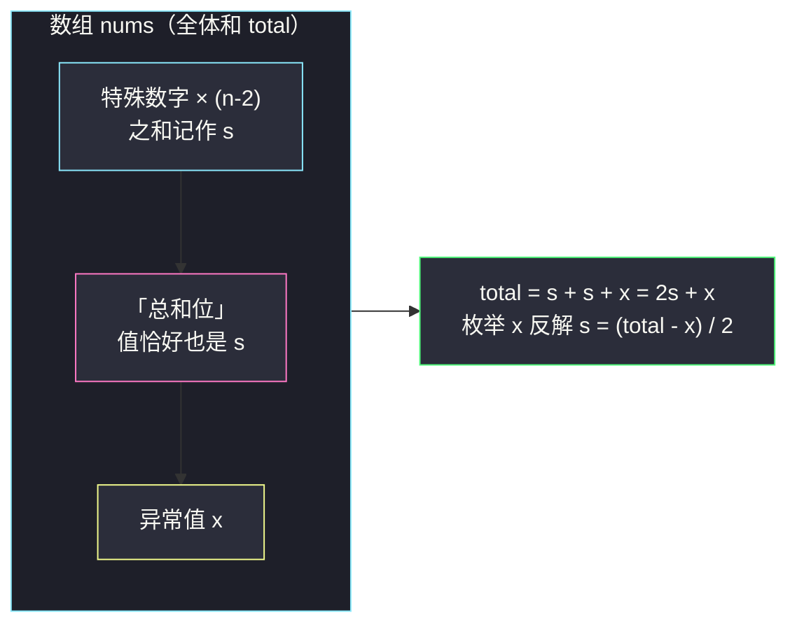
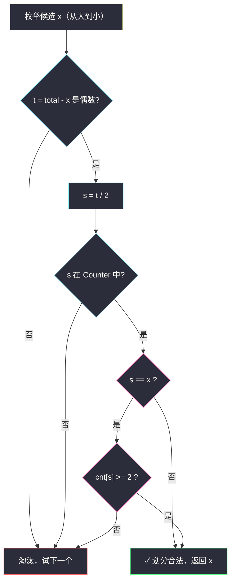
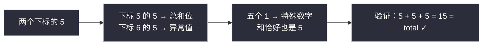

# 识别数组中的最大异常值（总和恒等式 + 哈希计数验证）

## 一、问题描述

给你一个整数数组 `nums`，它恰好由以下三部分组成：

- `n - 2` 个**特殊数字**；
- 这 `n - 2` 个特殊数字的**总和**（它自己也是数组中的一个元素）；
- 一个**异常值**。

这三者对应的下标互不相同（但**值可以相同**）。返回**可能的最大异常值**；若不存在合法划分则返回 `-1`。

> 🔗 LeetCode 3371：https://leetcode.cn/problems/identify-the-largest-outlier-in-an-array/
>
> 数据范围：`3 <= nums.length <= 10^5`，`-1000 <= nums[i] <= 1000`。

**示例 1**

```
输入：nums = [2,3,5,10]
输出：10
解释：特殊数字是 2、3（和为 5），数组里的 5 是总和，10 是异常值。
```

**示例 2**

```
输入：nums = [-2,-1,-3,-6,4]
输出：4
解释：特殊数字是 -2、-1、-3（和为 -6），数组里的 -6 是总和，4 是异常值。
```

**示例 3**

```
输入：nums = [1,1,1,1,1,5,5]
输出：5
解释：五个 1 是特殊数字（和为 5），一个 5 充当总和，另一个 5 充当异常值——
      值相同但下标不同，划分依然合法。
```

**直观理解**

数组里藏着一条**恒等式**：全体元素之和 = 特殊数字之和 + 总和位 + 异常值。设特殊数字之和为 `s`、异常值为 `x`，则 `total = s + s + x = 2s + x`。只要枚举 `x`，就能**反解出 `s`**，再去哈希表里 O(1) 验证 `s` 是否真的存在于数组——这是灵神题单 **§0.1 枚举右维护左** 中「用哈希表把 O(n) 的验证压成 O(1)」思想的又一种用法。

---

## 二、暴力解法

枚举「异常值」与「总和位」各占哪个下标（两者不同），验证剩余 `n - 2` 个数之和是否恰好等于总和位的值：

```python
class Solution:
    def getLargestOutlier(self, nums: List[int]) -> int:
        n, total = len(nums), sum(nums)
        ans = None                            # 合法异常值的最大值
        for i in range(n):                    # 假设 nums[i] 是异常值 x
            for j in range(n):                # 假设 nums[j] 是总和位
                if i != j and total - nums[i] - nums[j] == nums[j]:
                    ans = nums[i] if ans is None else max(ans, nums[i])
        return -1 if ans is None else ans     # 剩余和 == 总和位的值 → 划分合法
```

注意这里**不能用 `ans = -1` 起手再 `max(ans, nums[i])`**：异常值本身可以是负数（例如 `nums = [-7,-7,4,-6,-2,8,7,8,2]` 中唯一合法的异常值是 `-7`），`max(-1, -7)` 会把它错误地抬成 `-1`、混淆「无解」语义。必须用 `None` 标记「尚未找到」。

### 复杂度

- **时间**：`O(n²)`。`n = 10^5` 时约 `10^10` 次判定，严重超时。
- **空间**：`O(1)`。

### 🔴 瓶颈在哪里

内层循环做的全部事情，本质是回答一个问题：**「去掉 `x` 之后，剩余的数里能不能拿出一个当总和位，且其余和恰好等于它？」**。这个问题不用逐个 `j` 去试——恒等式 `total = 2s + x` 告诉我们 `s` 是唯一被确定的，只需要一次「存在性 + 计数」查询。

---

## 三、优化探索（核心章节）

> 📚 本题在灵茶题单中属于 **§0.1 枚举右，维护左**（常用数据结构 A · 哈希表）家族。与 #1512 那类「在线先查后存」略有不同：本题的配对条件**与左右顺序无关**（`x` 与 `s` 只要都存在于数组、下标不同即可），所以把哈希表**离线一次性建好**，再枚举候选 `x` 逐个查询，同样成立。核心思想不变：**用哈希表把每次 O(n) 的验证降到 O(1)**。

### 3.1 总和恒等式

设 `n - 2` 个特殊数字之和为 `s`，「总和位」的值就是 `s`，「异常值」为 `x`，则：

```text
total = s (特殊数字) + s (总和位) + x (异常值) = 2s + x
```

这条恒等式对**任何合法划分**都成立；反过来，若某个 `x` 与 `s = (total - x) / 2` 都能对应到数组中互异的下标，划分就成立（剩余 `n - 2` 个数的和自动等于 `total - x - s = s`）。**充分必要，不会多也不会漏。**



### 3.2 枚举 x，三步 O(1) 验证

对每个候选 `x`（必须是数组中的元素）：

1. `t = total - x` 必须是**偶数**（否则 `s` 非整数，直接淘汰）；
2. `s = t / 2` 必须存在于数组中（哈希表 O(1) 查询）；
3. **下标互异**：若 `s == x`，该值需要出现**至少 2 次**（一个下标当总和位、一个当异常值）；若 `s != x`，各出现一次即可。



### 3.3 为什么要「从大到小」

答案要**最大**异常值，所以把数组去重后**降序**枚举，第一个通过三步验证的 `x` 即答案，无需扫完全部。值域只有 `[-1000, 1000]` 时也可以建 `2001` 个桶按值从大到小扫，两种写法复杂度同级。

### 3.4 示例 3 为什么能返回 5——同值不同下标

`nums = [1,1,1,1,1,5,5]`，`total = 15`。候选 `x = 5` 时 `s = (15 - 5) / 2 = 5`，`s == x`！此时需要两个下标的 `5`：一个当总和位、一个当异常值——`cnt[5] = 2` 恰好够用，合法。这正是「三要素下标互异、值可相同」的题设带来的唯一陷阱，**计数表（Counter）天然解决**：`s != x` 查 `cnt[s] >= 1`，`s == x` 查 `cnt[s] >= 2`。

### 3.5 一句话核心

> **`total = 2s + x`：枚举数组元素当 `x`，反解 `s = (total - x) / 2`，用哈希计数表 O(1) 验证存在性与同值计数；降序枚举，首个合法者即最大异常值。**

---

## 四、代码实现

### Python（主解：Counter + 降序枚举）

```python
from collections import Counter

class Solution:
    def getLargestOutlier(self, nums: List[int]) -> int:
        cnt = Counter(nums)                # 值 -> 出现次数（离线建表）
        total = sum(nums)
        for x in sorted(cnt, reverse=True):    # 去重后从大到小枚举候选 x
            t = total - x                  # 应等于 2s
            if t % 2:                      # 奇数：s 非整数
                continue
            s = t // 2
            if s in cnt and (cnt[s] >= 2 if s == x else True):
                return x
        return -1
```

**变量含义**

| 变量 | 含义 |
|------|------|
| `total` | 全体元素之和 `2s + x` |
| `x` | 当前假设的异常值（必为数组元素） |
| `s = (total - x) / 2` | 反解出的特殊数字之和（即总和位的值） |
| `cnt[s] >= 2 if s == x` | 同值时需要两个下标：总和位 + 异常值 |

**正确性说明**：`x` 与 `s` 一旦在数组中找到互异下标，剩余 `n - 2` 个元素之和自动等于 `total - x - s = s`，划分自动成立；反之任何合法划分都满足恒等式，枚举到那个 `x` 时必被验收。**充要，不重不漏。**

### Java（注意负数取余与整除）

```java
// 识别数组中的最大异常值
// 测试链接 : https://leetcode.cn/problems/identify-the-largest-outlier-in-an-array/
class Solution {
    public int getLargestOutlier(int[] nums) {
        Map<Integer, Integer> cnt = new HashMap<>();
        int total = 0;
        for (int x : nums) {                       // 离线建表
            cnt.merge(x, 1, Integer::sum);
            total += x;
        }
        List<Integer> vals = new ArrayList<>(cnt.keySet());
        vals.sort(Comparator.reverseOrder());      // 从大到小枚举
        for (int x : vals) {
            int t = total - x;                     // 应等于 2s
            if (t % 2 != 0) continue;              // 负奇数 % 2 == -1，同样 != 0
            int s = t / 2;                         // t 已保证偶数，整除无损
            Integer c = cnt.get(s);
            if (c == null) continue;
            if (s == x && c < 2) continue;         // 同值需要两个下标
            return x;
        }
        return -1;
    }
}
```

---

## 五、具体例子演示

### 示例 1：nums = [2,3,5,10]

`total = 20`，`cnt = {2:1, 3:1, 5:1, 10:1}`。降序枚举候选 `x`，逐步跟踪判定表：

| 候选 x | t = 20 - x | t 是偶数? | s = t / 2 | s 在 cnt? | s == x? | 判定 |
|--------|-----------|-----------|-----------|-----------|---------|------|
| 10 | 10 | 是 | 5 | 是（cnt=1） | 否 | **✓ 合法，返回 10** |
| 5 | 15 | 否 | — | — | — | ✗ 淘汰 |
| 3 | 17 | 否 | — | — | — | ✗ 淘汰 |
| 2 | 18 | 是 | 9 | 否（cnt 无 9） | — | ✗ 淘汰 |

第一个候选 `10` 就通过验证：特殊数字 `2 + 3 = 5`，总和位是 `5`，异常值 `10` ✓。

### 示例 2：nums = [-2,-1,-3,-6,4]

`total = -8`，降序枚举：候选 `x = 4` 时 `t = -12`（偶数），`s = -6`，`cnt[-6] = 1`，`s != x` → 合法，返回 `4` ✓（特殊数字 `-2 + -1 + -3 = -6`，总和位 `-6`，异常值 `4`）。注意负数也能被整除逻辑正确处理。

### 示例 3：nums = [1,1,1,1,1,5,5]——同值分支

`total = 1*5 + 5*2 = 15`，`cnt = {1:5, 5:2}`。降序枚举：

| 候选 x | t = 15 - x | 偶数? | s = t / 2 | cnt[s] | s == x?（需 cnt ≥ 2） | 判定 |
|--------|-----------|-------|-----------|--------|------------------------|------|
| 5 | 10 | 是 | 5 | 2 | 是，`2 >= 2` 通过 | **✓ 返回 5** |
| 1 | 14 | 是 | 7 | 0 | — | ✗ 淘汰 |



同一组值 `5` 身兼「特殊数字之和、总和位、异常值」三种身份中的两种（值相同、下标不同），`cnt >= 2` 检查正是为此而生；若数组只有一个 `5`（如 `[1,1,1,1,1,5]`，`total = 10`，`x = 5 → s = 2.5` 非整数淘汰；`x = 1 → s = 4.5` 淘汰），将返回 `-1`。

---

## 六、复杂度分析

| 方法 | 时间 | 空间 | 说明 |
|------|------|------|------|
| 暴力双枚举 | `O(n²)` | `O(1)` | `n = 10^5` 超时 |
| 恒等式 + 哈希（主解） | `O(n + u log u)` | `O(u)` | `u` 为去重后元素个数（受值域限制 `u ≤ 2001`，排序开销极小） |

由于值域 `[-1000, 1000]`，`u log u` 实际是常数级；即使值域放大到任意整数，本解法也只随 `u` 增长，仍是近线性。

---

## 七、对比总结

**「总和恒等式」家族**——数组整体和携带的结构信息，一次遍历就能榨出来：

| 题 | 恒等式/性质 | 用哈希做什么 |
|----|-------------|--------------|
| #3371 本篇 | `total = 2s + x` | 枚举 `x` 反解 `s`，查存在性 + 同值计数 |
| #645 错误的集合 | 重复值与缺失值的和差关系 | 计数定位重复 |
| #268 丢失的数字 | `总和 − 实际和 = 缺失值` | 无需哈希，纯数学 |
| #1 两数之和 | `x + y == target` | 查 `target - x` 存在性 |

**「枚举候选 + 哈希 O(1) 验证」与 §0.1 的关系**

- #1512 / #2441 / #2364：配对有**顺序约束**（`i < j`），必须**在线先查后存**；
- 本篇：配对**与顺序无关**（下标互异即可），可以**离线建全表再枚举查询**，代价是要处理同值下标冲突（`cnt >= 2`）。

**易错点**

1. **同值陷阱**：`s == x` 时只查「存在」会误判——必须 `cnt[s] >= 2`（示例 3 全靠这一步）。
2. **奇偶判断**：Python 的 `t % 2` 对负数返回非负（`-13 % 2 == 1`），直接判真即可；Java/C++ 中 `t % 2` 对负奇数是 `-1`，条件要写 `!= 0` 而不是 `== 1`。
3. 候选 `x` 必须枚举**数组中真实存在的元素**（异常值本身占一个下标）。
4. 无解要返回 `-1`，别忘兜底。
5. **异常值可以是负数**：例如 `nums = [-7,-7,4,-6,-2,8,7,8,2]` 唯一合法异常值是 `-7`。用 `ans = -1` 起手再 `max(ans, x)` 会把负数答案抬成 `-1`、混淆「无解」语义；主解「降序枚举返回首个合法值」天然规避此坑。

**模板（总和恒等式 + 计数验证，Python）**

```python
cnt = Counter(nums)
total = sum(nums)
for x in sorted(set(nums), reverse=True):   # 候选从大到小
    if (total - x) % 2:
        continue
    s = (total - x) // 2
    if s in cnt and cnt[s] >= (2 if s == x else 1):
        return x
return -1
```

---

## 八、举一反三

| 题目 | 关系 |
|------|------|
| [1. 两数之和](https://leetcode.cn/problems/two-sum/) | 同为「枚举候选 + 哈希 O(1) 验证搭档」，搭档从 `s` 换成 `target - x` |
| [454. 四数相加 II](https://leetcode.cn/problems/4sum-ii/) | 把两数之和的一半结果存进哈希再枚举另一半，规模更大的「建表 + 查询」 |
| [645. 错误的集合](https://leetcode.cn/problems/set-mismatch/) | 总和恒等式家族：用和与平方和（或计数表）定位重复/缺失 |
| [268. 丢失的数字](https://leetcode.cn/problems/missing-number/) | 总和恒等式最简形态，可顺带练习异或解法 |
| [1512. 好数对的数目](https://leetcode.cn/problems/number-of-good-pairs/) | 同批 `number-of-good-pairs.md`，对比「在线先查后存」的顺序敏感版 |
| [2364. 统计坏数对的数目](https://leetcode.cn/problems/count-number-of-bad-pairs/) | 同批 `count-number-of-bad-pairs.md`，哈希计数 + 正难则反 |
| [2441. 与对应负数同时存在的最大正整数](https://leetcode.cn/problems/largest-positive-integer-that-exists-with-its-negative/) | 同批 `largest-positive-integer-that-exists-with-its-negative.md`，存在性查询的取 max 版 |

**思想迁移**

- 题面给出「数组的和/平均数/总和位」这类**全局结构信息**，先写出**恒等式**，再枚举一个未知量、反解另一个，验证交给哈希。
- 枚举答案类题目（要最大/最小），把候选**排序后按优先级枚举**，第一个合法的就能提前返回。
- 口诀：**「总和拆三份，两 s 一 x；枚举 x 反解 s，计数表里验下标。」**
