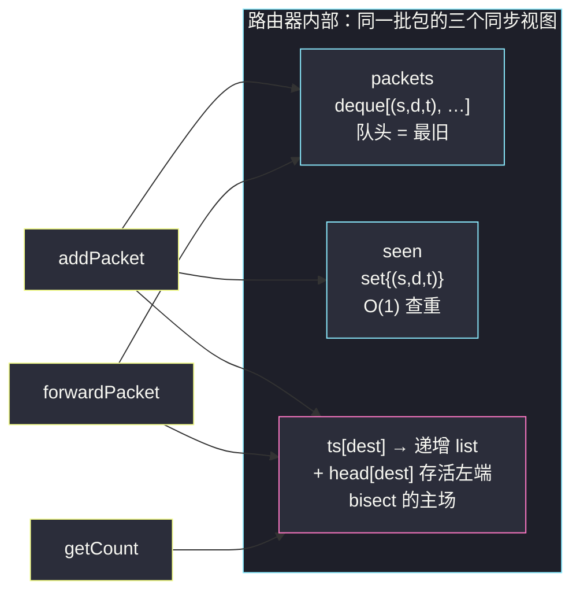
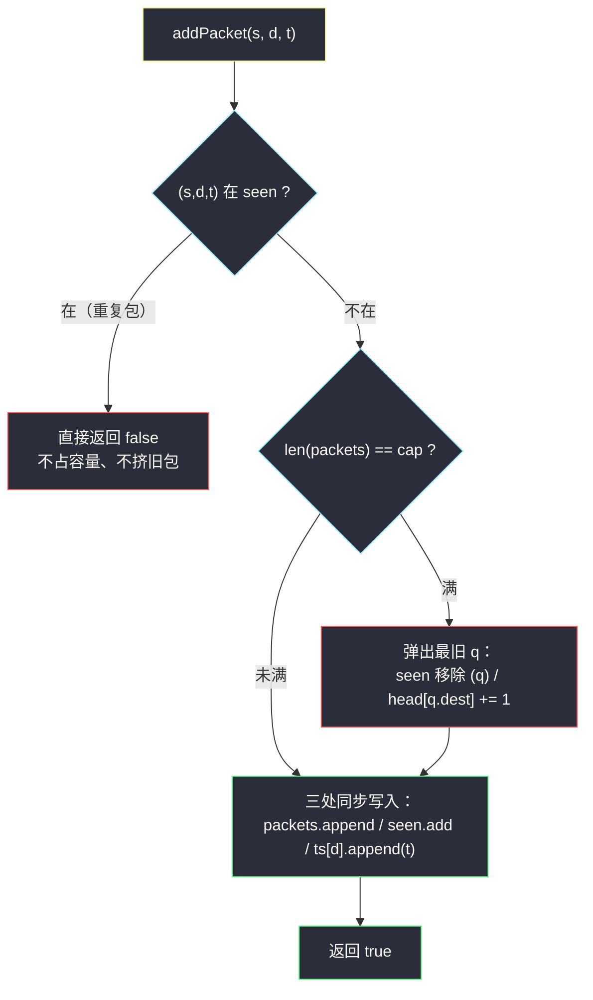

# 设计路由器（数据结构设计 × 二分查找运用）

## 一、问题描述

要求实现一个内存受限的路由器 `Router`，数据包由 `(source, destination, timestamp)` 三元组描述，需要支持三个操作：

| 方法 | 语义 |
|------|------|
| `Router(memoryLimit)` | 初始化，路由器内**同时最多存 `memoryLimit` 个包** |
| `addPacket(s, d, t)` | 若路由器中**已存在**相同 `(s, d, t)` 的包，返回 `false`；否则加入（容量已满时先挤掉**最旧**的包），返回 `true` |
| `forwardPacket()` | 无包返回 `[]`；否则弹出**最旧**的包 `p`，返回 `[p.source, p.destination, ts]`，其中 `ts` 是 `p.destination` 的**尚未转发过的最早时间戳**（该时间戳随即视为已转发） |
| `getCount(dest, t)` | 返回当前仍在路由器中的、`destination == dest` 且 `timestamp >= t` 的包的个数 |

> 🔗 LeetCode 3508：https://leetcode.cn/problems/implement-router/
>
> 数据范围：`2 <= memoryLimit <= 10^5`，`1 <= source, destination <= 2*10^5`，`1 <= timestamp <= 10^9`，总操作次数最多 `10^5`。**题目保证所有 `addPacket` 调用的 `timestamp` 严格递增**——这条保证是本题能用二分的关键，下面会反复用到。

**示例 1**

```
Router(3)
addPacket(1, 4, 90)  -> true
addPacket(2, 5, 90)  -> true
addPacket(1, 4, 90)  -> false   # (1,4,90) 已在库，重复
addPacket(3, 5, 95)  -> true
addPacket(4, 5, 105) -> true    # 已满，挤掉最旧的 (1,4,90)
forwardPacket()      -> [2, 5, 90]
addPacket(5, 2, 110) -> true
getCount(5, 100)     -> 1       # 在库的 dest=5 包：(3,5,95)、(4,5,105)，其中 ts>=100 的只有 1 个
```

**直观理解**

四个操作拆开看，前三个都是「队列 + 哈希集合」能 `O(1)` 搞定的常规设计题；真正的考点藏在 `getCount`：它要在某个 destination 的**时间戳集合**上数「`>= t` 的个数」——这正是灵神题单 §1.2 反复练的 **lower bound 计数**套路：`个数 = 总数 - 第一个 >= t 的下标`。所以这道设计题的内核，其实是一道二分查找题。

---

## 二、暴力解法

用一个列表存所有在库的包，逐操作线性处理：

```python
class Router:
    def __init__(self, memoryLimit: int):
        self.cap = memoryLimit
        self.packets = []                      # [(s, d, t), ...] 按到达顺序

    def addPacket(self, s: int, d: int, t: int) -> bool:
        if (s, d, t) in self.packets:          # O(n) 查重
            return False
        if len(self.packets) == self.cap:
            self.packets.pop(0)                # O(n) 挤最旧
        self.packets.append((s, d, t))
        return True

    def forwardPacket(self):
        if not self.packets:
            return []
        return list(self.packets.pop(0))       # O(n)

    def getCount(self, dest: int, t: int) -> int:
        return sum(1 for s, d, ts in self.packets if d == dest and ts >= t)   # O(n) 全扫
```

### 复杂度

- **时间**：单次操作 `O(n)`，最坏 `10^5` 次操作 × `O(10^5)` 扫描 = `10^10` 量级，必然超时。
- **空间**：`O(min(q, cap))`，`q` 为操作次数。

### 🔴 瓶颈在哪里

三处 `O(n)`：查重靠线性扫、`pop(0)` 整体搬移、`getCount` 全量过滤。每一处都有对应的标准武器：哈希集合查重、双端队列弹出、**有序序列上二分计数**。

---

## 三、优化探索（核心章节）

> 📚 本题在灵茶题单中属于 **§1.2 二分查找**（运用），是该小节里把 lower bound 嵌进系统设计题的压轴之作。二分模板与 §1.1 的 `search-insert-position.md`（同目录）一脉相承。

### 3.1 按操作选数据结构

| 操作 | 需要 | 选型 |
|------|------|------|
| 查重 `(s,d,t)` | `O(1)` 成员判断 | `set` |
| 弹最旧 / 挤最旧 | 队头 `O(1)` 弹出 | `deque` |
| `getCount` 计数 | 有序时间戳 + 二分 | `dict[dest] → list` + `bisect_left` |

三个结构是**同一批包的三个视图**，任何包的进出都要三处同步——这是本题最容易写漏的地方。

### 3.2 时间戳为什么天然有序

`getCount` 要二分，前提是该 destination 的时间戳序列**有序**。这一步不用我们排序：题目保证 `addPacket` 的时间戳严格递增，而每个包入队时把自己的 `t` 追加到 `ts[dest]` 尾部——所以 **`ts[dest]` 天然严格递增，append 即有序**，二分的入场券是白送的。

### 3.3 关键设计：head 懒删除指针

包离开路由器只有两条路：被挤出（容量满）或被 `forwardPacket` 转发。两条路弹出的都是**最旧**的包；又因为时间戳全局递增，被弹出包的时间戳必然是 `ts[它的 dest]` 中最小的那个，也就是列表**头部**的元素。

所以「从 `ts[dest]` 移除最早时间戳」不需要真的 `pop(0)`（对 list 是 `O(n)`），给每个 dest 维护一个**存活左端 `head[dest]`**：

- 弹出一个包（无论挤出还是转发）→ `head[它的 dest] += 1`，`O(1)`；
- 该 dest 仍在库的时间戳区间 = `[head[dest], len(ts[dest]))`。

顺带一个漂亮的观察：`forwardPacket` 弹出的是全局最旧的包，它的时间戳也就是自己 dest 列表的队头——**题目绕着弯描述的「尚未转发过的最早时间戳」，恰好就等于被弹出包自己的 timestamp**，所以取 `ts[d][head[d]]` 一步到位。

### 3.4 getCount：lower bound 计数（本题的二分内核）

在存活区间 `[head, len)` 上数「`ts >= t` 的个数」。设 `check(i) = (lst[i] >= t)`，由于 `lst` 递增，`check` 左假右真——**求最小的满足 `check` 的下标**，正是灵神「求最小」模板：满足则 `r = mid`：

```python
idx = bisect_left(lst, t, head)     # 第一个 >= t 的绝对下标
count = len(lst) - idx              # 存活总数 - 左侧小于 t 的个数
```

`bisect_left` 自带 `lo` 参数，从 `head` 起搜，被消费过的前缀完全不碰。

### 3.5 结构图与流程



`addPacket` 的完整决策流程（注意三个视图的同步顺序）：



### 3.6 一句话核心

> **deque 管顺序、set 管查重、`dict[dest] → 递增时间戳列表` 管 `getCount`；弹出（挤出或转发）一律 `head[dest] += 1` 懒删除；`getCount = len - bisect_left(lst, t, head)`。**

---

## 四、代码实现

### Python（主解）

```python
from bisect import bisect_left
from collections import deque

class Router:
    def __init__(self, memoryLimit: int):
        self.cap = memoryLimit
        self.packets = deque()   # 到达顺序存 (s, d, t)，队头 = 最旧
        self.seen = set()        # 在库的 (s, d, t)，O(1) 查重
        self.ts = {}             # dest → 时间戳列表（append 即严格递增）
        self.head = {}           # dest → ts 列表的存活左端（懒删除指针）

    def addPacket(self, source: int, destination: int, timestamp: int) -> bool:
        key = (source, destination, timestamp)
        if key in self.seen:                  # 重复包：直接拒绝，不动容量
            return False
        if len(self.packets) == self.cap:     # 满了：挤掉最旧包
            s0, d0, t0 = self.packets.popleft()
            self.seen.remove((s0, d0, t0))
            self.head[d0] += 1                # d0 的最早时间戳随之失效
        self.packets.append(key)              # 三个视图同步写入
        self.seen.add(key)
        self.ts.setdefault(destination, []).append(timestamp)
        self.head.setdefault(destination, 0)
        return True

    def forwardPacket(self) -> List[int]:
        if not self.packets:
            return []
        s, d, _ = self.packets.popleft()      # 弹出最旧包
        t = self.ts[d][self.head[d]]          # 该 dest 尚未转发的最早时间戳
        self.head[d] += 1                     # 消费掉
        return [s, d, t]

    def getCount(self, dest: int, timestamp: int) -> int:
        lst = self.ts.get(dest)
        if not lst:
            return 0
        # 存活区间 [head, len) 上找第一个 >= timestamp 的下标
        return len(lst) - bisect_left(lst, timestamp, self.head.get(dest, 0))
```

**变量含义**

| 变量 | 含义 |
|------|------|
| `packets` | 到达顺序的包队列，队头永远是最旧包 |
| `seen` | 在库三元组集合，`addPacket` 查重 |
| `ts[dest]` | 该 dest 的全部历史时间戳（含已失效），天然递增 |
| `head[dest]` | 存活左端：`[head, len)` 才是仍在路由器中的时间戳 |
| `bisect_left(lst, t, head)` | 从存活左端起，第一个 `>= t` 的绝对下标 |

### Java（最优解同款写法）

```java
class Router {
    private final int cap;
    private final ArrayDeque<int[]> packets = new ArrayDeque<>();
    private final HashSet<String> seen = new HashSet<>();          // 三个 int 超过 63 位，用字符串做 key 最稳
    private final HashMap<Integer, ArrayList<Integer>> ts = new HashMap<>();
    private final HashMap<Integer, Integer> head = new HashMap<>();

    public Router(int memoryLimit) { cap = memoryLimit; }

    public boolean addPacket(int s, int d, int t) {
        if (!seen.add(s + "#" + d + "#" + t)) return false;        // add 返回 false 即已存在
        if (packets.size() == cap) {                               // 挤掉最旧包
            int[] q = packets.pollFirst();
            seen.remove(q[0] + "#" + q[1] + "#" + q[2]);
            head.merge(q[1], 1, Integer::sum);                     // 最早时间戳失效
        }
        packets.addLast(new int[]{s, d, t});
        ts.computeIfAbsent(d, k -> new ArrayList<>()).add(t);
        head.putIfAbsent(d, 0);
        return true;
    }

    public int[] forwardPacket() {
        int[] p = packets.pollFirst();
        if (p == null) return new int[0];
        int t = ts.get(p[1]).get(head.get(p[1]));                  // 尚未转发的最早时间戳
        head.merge(p[1], 1, Integer::sum);
        return new int[]{p[0], p[1], t};
    }

    public int getCount(int dest, int timestamp) {
        List<Integer> lst = ts.get(dest);
        if (lst == null) return 0;
        int lo = head.getOrDefault(dest, 0), hi = lst.size();      // 手写 bisect_left
        while (lo < hi) {
            int mid = (lo + hi) >>> 1;
            if (lst.get(mid) < timestamp) lo = mid + 1;            // 小于 t：往右
            else hi = mid;                                          // >= t：满足则收缩，求最小下标
        }
        return lst.size() - lo;
    }
}
```

---

## 五、具体例子演示

以示例 1（`memoryLimit = 3`）端到端跟踪三个视图的状态，箭头左边是队头：

| 操作 | packets（队头→队尾） | seen 变化 | ts / head 变化 | 返回 |
|------|----------------------|-----------|----------------|------|
| add(1,4,90) | (1,4,90) | +{(1,4,90)} | ts[4]=[90], head[4]=0 | `true` |
| add(2,5,90) | (1,4,90)(2,5,90) | +{(2,5,90)} | ts[5]=[90], head[5]=0 | `true` |
| add(1,4,90) | 不变 | 重复，拒绝 | 不变 | `false` |
| add(3,5,95) | (1,4,90)(2,5,90)(3,5,95) | +{(3,5,95)} | ts[5]=[90,95] | `true` |
| add(4,5,105) | 满 → 挤 (1,4,90)；剩 (2,5,90)(3,5,95)(4,5,105) | −{(1,4,90)} | head[4]=1；ts[5]=[90,95,105] | `true` |
| forward | 弹 (2,5,90)；剩 (3,5,95)(4,5,105) | −{(2,5,90)} | 取 t=ts[5][0]=90；head[5]=1 | `[2,5,90]` |
| add(5,2,110) | (3,5,95)(4,5,105)(5,2,110) | +{(5,2,110)} | ts[2]=[110], head[2]=0 | `true` |

最后 `getCount(5, 100)`：存活区间 `[head[5]=1, len=3)`，即时间戳 `{95, 105}`。二分找第一个 `>= 100` 的下标（`check(mid) = lst[mid] >= 100`，满足则 `hi = mid`，求最小下标）：

| 轮次 | lo | hi | mid | lst[mid] | >= 100 ? | 染色 | 动作 |
|------|----|----|-----|----------|----------|------|------|
| 1 | 1 | 3 | 2 | 105 | ✓ | 蓝 | `hi = 2` |
| 2 | 1 | 2 | 1 | 95 | ✗ | 红 | `lo = 2` |

`lo == hi == 2`，计数 = `len(lst) - 2 = 3 - 2 = 1` ✓。

**验证 head 的正确性**：此刻若继续 `getCount(4, 90)`——ts[4]=[90] 但 head[4]=1，存活区间为空，直接返回 0。被挤出的包确实不再计入，懒删除指针与真实语义严丝合缝。

---

## 六、复杂度分析

| 操作 | 时间 | 说明 |
|------|------|------|
| `addPacket` | `O(1)` 均摊 | set/deque 均为 `O(1)`；挤旧包也只做一次弹出 |
| `forwardPacket` | `O(1)` | 队头弹出 + 下标访问 |
| `getCount` | `O(log q)` | 存活区间上一次二分 |

- **总时间**：`O(q log q)`，`q <= 10^5`，约 `10^5 × 17 ≈ 2*10^6` 次基本运算。
- **空间**：`O(min(q, cap))`——三个视图都只装在库的包；`ts[dest]` 列表虽保留历史元素，但总追加次数 ≤ 成功的 `addPacket` 次数 ≤ `q`，线性。

---

## 七、对比总结

**与纯二分题的关系**：把 `getCount` 单拎出来，就是「有序数组中数 `>= t` 的个数」——和同目录 `count-the-number-of-fair-pairs.md` 用的 lower bound 是同一个知识点；本题只是给它套上了系统设计的壳，额外考察**多视图同步**的工程能力。§1.1 的 `search-insert-position.md` 练的是模板本身，§1.2 的本题练的是「把模板嵌进数据结构」。

**易错点**

1. **三视图漏同步**：挤出旧包时忘记 `seen.remove` 或忘记 `head += 1`，是提交 WA 的头号原因。任何包进出，`packets / seen / ts+head` 必须一起动。
2. **重复包不占容量**：`addPacket` 查到重复要**立即**返回 `false`，不能先挤旧包再判断。
3. **getCount 用 `bisect_left` 而非 `bisect_right`**：题目是 `>= t` 计数；若是 `> t` 才轮到 `bisect_right`。
4. **别真去 `pop(0)`**：list 头部弹出是 `O(n)`，`head` 懒删除才是正解；同理也别每次排序——「时间戳递增」的题目保证就是让你白拿有序性的。
5. Java 把 `(s,d,t)` 压进一个 `long` 需要 66 位，必然溢出，用字符串或嵌套 Map 做 key。

---

## 八、举一反三

| 题目 | 关系 |
|------|------|
| [2080. 区间内查询数字的频率](https://leetcode.cn/problems/range-frequency-queries/) | **最强同族**：`dict → 有序下标列表 + bisect` 计数，几乎是本题 `getCount` 的单拎版 |
| [981. 基于时间的键值存储](https://leetcode.cn/problems/time-based-key-value-store/) | 同款「dict → 有序时间戳 + bisect_right」结构 |
| [146. LRU 缓存](https://leetcode.cn/problems/lru-cache/) | 同为「哈希 + 双端队列」的设计题，挤最旧逻辑与本题互为镜像 |
| [1146. 快照数组](https://leetcode.cn/problems/snapshot-array/) | 设计题里藏二分的另一例（有序版本号上二分） |
| 同目录 [search-insert-position.md](search-insert-position.md) | lower bound 模板的原产地（§1.1） |
| 同目录 [count-the-number-of-fair-pairs.md](count-the-number-of-fair-pairs.md) | lower bound 计数的纯数组版练习 |

**思想迁移**

- 系统设计题先列「每个操作要什么复杂度」，再一个操作一个数据结构地拼；多个结构描述同一批数据时，**同步点必须收敛到一个函数/一处逻辑**里。
- 「有序 + 数个数」永远先想 `bisect_left`：`count(>= t) = len - lower_bound(t)`。
- 删除永远发生在序列两端时，优先考虑**偏移指针懒删除**，别硬扛搬移成本。
