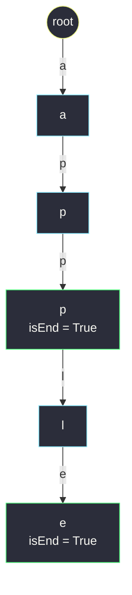
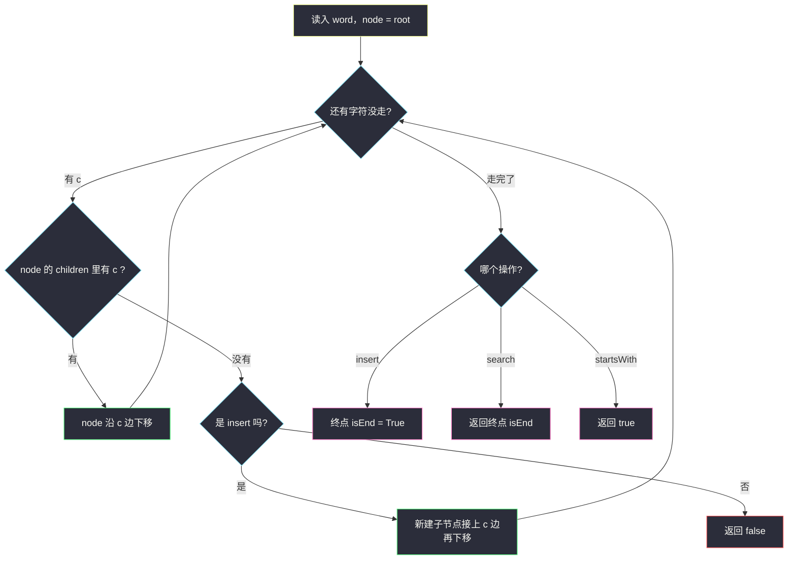

# 实现 Trie（前缀树）（把共享前缀折进一棵树的模板根基）

## 一、问题描述

**Trie**（发音同 "try"），即**前缀树**，是一种专门管理字符串集合的树形结构：把每个字符串按字符拆开、**字符放边上**，公共前缀自然共享同一段路径。请你实现 Trie 类：

- `Trie()`：初始化前缀树对象；
- `void insert(String word)`：向前缀树中插入字符串 `word`；
- `boolean search(String word)`：若 `word` **作为完整单词**在树中（此前插入过），返回 `true`，否则 `false`；
- `boolean startsWith(String prefix)`：若此前插入的某个单词**以 `prefix` 为前缀**，返回 `true`，否则 `false`。

> 🔗 LeetCode 208：https://leetcode.cn/problems/implement-trie-prefix-tree/
>
> 数据范围：`1 <= word.length, prefix.length <= 2000`，只含小写英文字母；`insert` / `search` / `startsWith` 的总调用次数 `<= 3 * 10^4`。

**示例**

```
输入
["Trie", "insert", "search", "search", "startsWith", "insert", "search"]
[[], ["apple"], ["apple"], ["app"], ["app"], ["app"], ["app"]]
输出
[null, null, true, false, true, null, true]

解释
- insert("apple") 后：树中恰有单词 "apple"
- search("apple")    → true ：完整单词存在
- search("app")      → false：路径存在，但没有单词恰好在 "app" 处结束
- startsWith("app")  → true ："apple" 以 "app" 开头
- insert("app") 之后：search("app") → true
```

**直观理解**

`search` 用哈希表也能做到近 `O(1)`，真正卡脖子的是 `startsWith`：前缀只是「半个单词」，而哈希表按**完整字符串**做键，拿半个键什么都查不到。另一方面，一批字符串往往**共享大量前缀**（`apple`、`apply`、`app` 的前三个字符完全一样），让公共前缀共享同一份内存和同一条查找路径，正是 Trie 的全部卖点——它是灵茶题单 §6.x 字典树专题的第一块积木，后面的通配符搜索、0-1 Trie、前缀计数都从它长出来。

---

## 二、暴力解法

### 暴力：哈希集合存所有单词

```python
class Trie:
    def __init__(self):
        self.words = set()

    def insert(self, word: str) -> None:
        self.words.add(word)                                   # O(L)

    def search(self, word: str) -> bool:
        return word in self.words                              # O(L)

    def startsWith(self, prefix: str) -> bool:
        return any(w.startswith(prefix) for w in self.words)   # O(n * L)
```

- **时间**：`insert` / `search` 均 `O(L)`；`startsWith` 要**逐个**扫描集合里的 `n` 个单词、每个做一次 `O(L)` 的前缀比较，合计 `O(n * L)`；
- **空间**：`O(插入总字符数)`，且 `apple`、`apply` 这类共享前缀的单词**各自完整存一份**，前缀毫不共享。

### 🔴 瓶颈在哪里

`startsWith` 没有任何索引可用：哈希把每个单词当成不可拆分的整体，而查询恰恰只关心「开头那几个字符」。一边是大量重复存储的前缀字符，一边是逐词全量比较——缺的是一个把**字符序列**组织成**树形索引**的结构。

---

## 三、优化探索（核心章节）

> 📚 本题在灵茶题单中属于 **§6.1 字典树 Trie（基础）**，是整个 §6.x 专题的模板根基：节点只有 `children`（出边集合）+ `isEnd`（词尾标记）两件东西。后续 [#211 添加与搜索单词](design-add-and-search-words-data-structure.md)（通配符 DFS）、[#2416 字符串的前缀分数和](sum-of-prefix-scores-of-strings.md)（节点挂计数）都是在这块积木上加零件。

### 3.1 关键观察：公共前缀 = 公共路径

把每个单词的字符**放边上**、从根往下走：走到节点 `X` 时，路径上各边字符连起来就是某个前缀。插入 `apple` 再插入 `app` 之后：



两个要点：

1. **根节点不存字符**：第一个字符是根的第一条出边；
2. 第二次 `insert("app")` **没有新建任何节点**——`a → p → p` 这段路早已铺好，只是**在第二个 `p` 上盖章 `isEnd = True`**。

### 3.2 节点结构：children + isEnd

| 部件 | 作用 | 实现 A：26 叉数组 | 实现 B：dict |
|------|------|-------------------|--------------|
| `children` | 该节点往下的所有出边 | 长度 26 的数组，下标 `ord(c) - ord('a')` | `{字符: 子节点}` |
| `isEnd` | 是否有单词**恰好**在此结束 | 布尔 | 布尔 |

为什么必须有 `isEnd`：插入 `apple` 后，树里**存在**通往 `app` 的路径，但没有任何单词在 `app` 结束——`search("app")` 必须回答 `false`，`startsWith("app")` 却要回答 `true`。**路径存在 ≠ 单词存在**，`isEnd` 就是区分二者的那枚图章。

### 3.3 三个操作 = 同一套「沿字符串游走」

| 操作 | 走法 | 走完后 |
|------|------|--------|
| `insert(word)` | 缺边就**补边**，永远走得通 | 终点 `isEnd = True` |
| `search(word)` | 缺边立刻失败 | 返回终点的 `isEnd` |
| `startsWith(p)` | 缺边立刻失败 | 走通了就是 `true` |



### 3.4 数组版与 dict 版怎么选

- **数组版**（`children[26]`）：查边是纯下标访问，最快；代价是每个节点固定占 26 个指针。字母表小、查询密集时首选，也是 Java 的常规写法；
- **dict 版**：按需建边，节点更瘦；字符集未知或很大（Unicode）时的唯一选择，Python 写起来最顺手。

本题 26 个小写字母、总调用 3 万次，两者都轻松通过；灵神模板两种都给。下面主解用 **dict 版**（最能凸显「节点 = 出边集合 + isEnd」的本质），再补数组版与 Java。

### 3.5 一句话核心

> **字符放边上、单词终点盖章：insert 缺边补边、查询缺边即败；`search` 看图章，`startsWith` 走通就行。**

---

## 四、代码实现

### Python 主解（dict 版）

```python
class Trie:
    def __init__(self):
        self.children = {}       # 出边：字符 -> 子节点
        self.is_end = False      # 是否有单词恰好在这里结束

    def insert(self, word: str) -> None:
        node = self
        for c in word:
            if c not in node.children:       # 缺边
                node.children[c] = Trie()    # 补边
            node = node.children[c]          # 下移
        node.is_end = True                   # 词尾盖章

    def search(self, word: str) -> bool:
        node = self._walk(word)
        return node is not None and node.is_end

    def startsWith(self, prefix: str) -> bool:
        return self._walk(prefix) is not None

    def _walk(self, s: str):
        """沿 s 的字符一路下移；中途缺边返回 None"""
        node = self
        for c in s:
            if c not in node.children:
                return None
            node = node.children[c]
        return node
```

### Python 数组版（26 叉）

```python
class Trie:
    def __init__(self):
        self.children = [None] * 26     # 下标 = ord(c) - ord('a')
        self.is_end = False

    def insert(self, word: str) -> None:
        node = self
        for c in word:
            i = ord(c) - ord('a')
            if node.children[i] is None:
                node.children[i] = Trie()
            node = node.children[i]
        node.is_end = True

    def search(self, word: str) -> bool:
        node = self._find(word)
        return node is not None and node.is_end

    def startsWith(self, prefix: str) -> bool:
        return self._find(prefix) is not None

    def _find(self, s: str):
        node = self
        for c in s:
            node = node.children[ord(c) - ord('a')]
            if node is None:
                return None
        return node
```

**变量含义**

| 变量 | 含义 |
|------|------|
| `node` | 游标：当前走到的 Trie 节点 |
| `children[c]` | 从当前节点沿字符 `c` 下去的子节点 |
| `is_end` | 词尾图章，区分「路径存在」与「单词存在」 |
| `_walk` / `_find` | `search` 与 `startsWith` 共用的游走函数，返回终点或 `None` |

### Java（数组版）

```java
class Trie {
    private Trie[] children = new Trie[26];
    private boolean isEnd;

    public void insert(String word) {
        Trie node = this;
        for (int i = 0; i < word.length(); i++) {
            int ch = word.charAt(i) - 'a';
            if (node.children[ch] == null) {
                node.children[ch] = new Trie();
            }
            node = node.children[ch];
        }
        node.isEnd = true;
    }

    public boolean search(String word) {
        Trie node = walk(word);
        return node != null && node.isEnd;
    }

    public boolean startsWith(String prefix) {
        return walk(prefix) != null;
    }

    private Trie walk(String s) {
        Trie node = this;
        for (int i = 0; i < s.length() && node != null; i++) {
            node = node.children[s.charAt(i) - 'a'];
        }
        return node;
    }
}
```

---

## 五、具体例子演示

把官方示例端到端走一遍。初始只有空 `root`。

**第 1 步：`insert("apple")`**——边走边补：

| 读到字符 | 当前节点 | 有这条边吗 | 动作 |
|----------|----------|------------|------|
| `a` | root | 没有 | 新建 `a`，下移 |
| `p` | a | 没有 | 新建，下移 |
| `p` | p | 没有 | 新建，下移 |
| `l` | p | 没有 | 新建，下移 |
| `e` | l | 没有 | 新建，下移 |
| 词读完 | e | — | `e.is_end = True` |

**第 2 步：`search("apple")`**

| 读到字符 | 当前节点 | 有这条边吗 | 动作 |
|----------|----------|------------|------|
| `a` → `e` | root → a → p → p → l → e | 每步都有 | 一路下移 |
| 词读完 | e | — | `e.is_end = True` → **返回 true** |

**第 3 步：`search("app")`**——前三个字符全部命中：

| 读到字符 | 当前节点 | 有这条边吗 | 动作 |
|----------|----------|------------|------|
| `a` | root | 有 | 下移到 a |
| `p` | a | 有 | 下移到 p |
| `p` | p | 有 | 下移到第二个 p |
| 词读完 | 第二个 p | — | `is_end = False` → **返回 false** |

路径存在、图章没盖——这正是 3.2 节说的「`search` 与 `startsWith` 的唯一区别在 `is_end`」。

**第 4 步：`startsWith("app")`**：游走过程与第 3 步**完全相同**，走完返回 **true**（根本不看图章）。

**第 5 步：`insert("app")`**——体会共享：

| 读到字符 | 当前节点 | 有这条边吗 | 动作 |
|----------|----------|------------|------|
| `a` | root | **有** | 直接下移（不新建） |
| `p` | a | **有** | 直接下移 |
| `p` | p | **有** | 直接下移 |
| 词读完 | 第二个 p | — | `is_end: False → True` |

整次插入**零新建节点**，只补了一枚图章（对照 3.1 节的树图：`apple` 与 `app` 共享 `a → p → p`）。

**第 6 步：`search("app")`** → 走到第二个 `p`，`is_end = True` → **true**。

六步与示例输出 `true, false, true, true` 完全吻合。

---

## 六、复杂度分析

设单词长 `L`、前缀长 `P`、集合规模 `n`、插入总字符数 `S`：

| 方案 | insert | search | startsWith | 空间 |
|------|--------|--------|------------|------|
| 哈希集合 | `O(L)` | `O(L)` | `O(n * L)` | `O(S)`，前缀不共享 |
| Trie（本篇） | `O(L)` | `O(L)` | `O(P)` | `O(S)` 个节点，数组版每节点再 × 26 指针 |

- Trie 每次操作的代价只与**自己这串字符的长度**有关，与集合里存了多少单词无关——`startsWith` 从 `O(n * L)` 降到 `O(P)`，是结构层面的胜利；
- 空间上只有真正出现过的字符路径才占节点，且公共前缀只存一份；数组版的 26 指针在题设规模下毫无压力。

---

## 七、对比总结

| | 哈希集合 | Trie |
|---|----------|------|
| 完整单词查询 | `O(L)`，够快 | `O(L)`，不输 |
| 前缀查询 | `O(n * L)`，全表扫描 | `O(P)`，树上游走 |
| 前缀共享 | 否，各存各的 | 是，同前缀同路径 |
| 可扩展性 | 只能精确匹配 | 挂计数、配通配、上二进制全都行得通 |

**易错点**

1. **根节点不放字符**：第一个字符对应根的第一条出边，别把首字符塞进根里；
2. **`is_end` 盖在「最后一个字符对应的节点」上**，不是在它下面再挂一个哨兵节点；
3. `insert` 已存在的单词（或别人路径的前缀）**只补图章**，不要重复建路；
4. 数组版下标换算是 `ord(c) - ord('a')`，写成 `ord('a') - ord(c)` 会全盘错位；
5. `search` 与 `startsWith` 共用游走逻辑时，终点为 `None` 对 `startsWith` 而言已是结论（`false`），但**走通时**返回 `true` 不能再看 `is_end`。

---

## 八、举一反三

| 题目 | 关系 |
|------|------|
| [211. 添加与搜索单词 - 数据结构设计](https://leetcode.cn/problems/design-add-and-search-words-data-structure/) | 本批姊妹篇（§6.2）：在本篇节点上加「`.` 通配 → 枚举出边 DFS」，见 `design-add-and-search-words-data-structure.md` |
| [2416. 字符串的前缀分数和](https://leetcode.cn/problems/sum-of-prefix-scores-of-strings/) | 本批姊妹篇（§6.1）：节点挂「经过计数 cnt」，见 `sum-of-prefix-scores-of-strings.md` |
| [648. 单词替换](https://leetcode.cn/problems/replace-words/) | insert 全部词根后，对每个单词沿树走到**第一个 isEnd** 即最短词根 |
| [677. 键值映射](https://leetcode.cn/problems/map-sum-pairs/) | `isEnd` 位置改挂 val，查询改为子树求和——「节点挂业务信息」的初阶版 |
| [1804. 实现 Trie II](https://leetcode.cn/problems/implement-trie-ii-prefix-tree/) | 同时维护「以…为前缀的单词数」与「等于…的单词数」，本篇 + #2416 的合体 |
| [14. 最长公共前缀](https://leetcode.cn/problems/longest-common-prefix/) | 反面对照：也能建 Trie 走到第一个分叉，但纵向扫描更轻——体会何时值得建树 |

**思想迁移**

- 「**前缀 = 根到某节点的路径**」是 Trie 的第一性原理：凡是查询以「字符串的开头若干字符」为对象的场景（输入法自动补全、拼写检查、路由最长前缀匹配、IP 前缀聚合），第一反应都该是它；
- `isEnd` 提示了一个通用手法：**节点除了结构信息，还可以挂业务标记**（词频、编号、计数）。后面的 #211（通配 DFS）、#2416（cnt 前缀分数）、乃至 0-1 Trie 上的最值统计，都在重复这一招；
- 口诀：**「字符走边不进点，词尾盖章才算完；insert 缺边就补，查询缺边即返。」**
