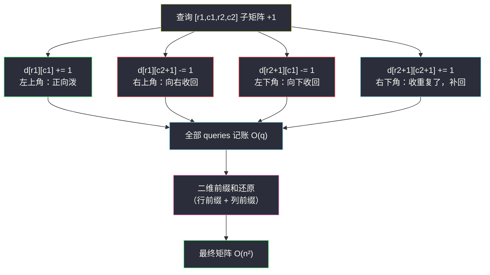

# 子矩阵元素加 1 的整数矩阵（二维差分 · 四角标记）

## 一、问题描述

给你一个正整数 `n`，表示你有一个 `n x n` 的矩阵，初始时**所有元素都是 0**。
另给你一个下标从 **0** 开始的二维整数数组 `queries`。

对每个 `queries[i] = [row1i, col1i, row2i, col2i]`，你需要执行一次操作：把**子矩阵**中位于 `(row1i, col1i)` ~ `(row2i, col2i)`（含边界）的每个元素全部加 `1`。

返回执行完所有操作后的矩阵。

> 🔗 LeetCode 2536：https://leetcode.cn/problems/increment-submatrices-by-one/
>
> 数据范围：`1 <= n <= 500`，`1 <= queries.length <= 10^4`，`0 <= row1i <= row2i < n`，`0 <= col1i <= col2i < n`。

**示例 1**

```
输入：n = 3, queries = [[1,1,2,2],[0,0,1,1]]
输出：[[1,1,0],[1,2,1],[0,1,1]]
解释：第一个查询把右下 2x2 子矩阵 +1，第二个查询把左上 2x2 子矩阵 +1，
重叠格 (1,1) 被加了两次，得到 2。
```

**示例 2**

```
输入：n = 2, queries = [[0,0,1,1]]
输出：[[1,1],[1,1]]
```

**直观理解**

「多次区间修改、最后一次性查询」是**差分**的标准信号：每次修改不必真的扫子矩阵，只在一个标记矩阵的**四个角**上做 `+1 / -1` 的记账，全部修改做完后用**二维前缀和**一遍还原。这与一维差分「改两端、最后扫一遍」完全同构，只是从「两个端点」升级成「四个角」。

---

## 二、暴力解法

对每个查询老老实实双重循环，把子矩阵每个格子 `+1`：

```python
class Solution:
    def rangeAddQueries(self, n: int, queries: List[List[int]]) -> List[List[int]]:
        mat = [[0] * n for _ in range(n)]
        for r1, c1, r2, c2 in queries:
            for i in range(r1, r2 + 1):        # 行扫描子矩阵
                for j in range(c1, c2 + 1):
                    mat[i][j] += 1
        return mat
```

### 复杂度

- **时间**：`O(q · n²)`。最坏 `10^4 × 500² = 2.5 × 10^9` 次累加，Python 下必然超时。
- **空间**：`O(n²)`（结果矩阵本身）。

### 🔴 瓶颈在哪里

同一个格子会被不同查询反复触碰，而每个查询的代价却是整个子矩阵的面积。「先把所有修改记账、最后统一还原」就能把每次修改的代价压到 `O(1)`。

---

## 三、优化探索（核心章节）

> 📚 本题在灵茶题单中属于 **§2.2 二维差分**。灵神的讲法与一维差分一脉相承：一维区间加 `[l, r] + x` 等价于 `d[l] += x、d[r+1] -= x`，最后**做一遍前缀和**还原；二维只是把「区间」变成「子矩阵」，把「改两端」变成「改四角」，把「一维前缀和」变成「二维前缀和」。

### 3.1 先回忆一维差分

设 `d[i] = a[i] - a[i-1]`（`d[0] = a[0]`），那么对区间 `[l, r]` 整体加 `x`：

```
d[l]   += x
d[r+1] -= x
```

两次修改 `O(1)`；所有修改做完后对 `d` 做一遍前缀和即还原出 `a`。核心直觉是：**前缀和会把 `d[l]` 处的 `+x` 自动「泼」给 `l` 之后的所有位置，再用 `d[r+1]` 处的 `-x` 把 `r` 之后的部分收回来**，泼出去又收回来的差，恰好是 `[l, r]`。

### 3.2 升到二维：为什么是四个角

把「泼出去又收回来」分别在**行、列两个方向**各做一次。对子矩阵 `[r1, c1] ~ [r2, c2]` 整体 `+1`，在标记矩阵 `d`（尺寸 `(n+1) x (n+1)`，多出一行一列当缓冲）上打四个角：

```
d[r1][c1]     += 1     # 左上：开始泼
d[r1][c2+1]   -= 1     # 右上：向右收回
d[r2+1][c1]   -= 1     # 左下：向下收回
d[r2+1][c2+1] += 1     # 右下：右、下各收一次，多收了一份，补回来
```

**直观核对**：还原时对 `d` 做二维前缀和，`(i, j)` 的值等于 `d` 中左上角 `(0,0) ~ (i,j)` 这块的求和（行、列各做一次前缀）。

| 位置 | 左上 `+1` 生效？ | 右上 `-1` 生效？ | 左下 `-1` 生效？ | 右下 `+1` 生效？ | 合计 |
|------|------|------|------|------|------|
| 子矩阵内部 `(r1..r2, c1..c2)` | ✓ | ✗（列 ≥ c2+1 才生效） | ✗（行 ≥ r2+1 才生效） | ✗ | **+1** |
| 右侧 `(r1..r2, >c2)` | ✓ | ✓ | ✗ | ✗ | 0 |
| 下方 `(>r2, c1..c2)` | ✓ | ✗ | ✓ | ✗ | 0 |
| 右下角 `(>r2, >c2)` | ✓ | ✓ | ✓ | ✓ | 0 |

四个角各管一个方向，叠加后增量为 `+1` 的区域恰好是子矩阵本身。



### 3.3 还原 = 二维前缀和，两遍一维前缀搞定

不需要背「上 + 左 − 左上」的容斥递推式，最不容易错的写法是**分两遍做一维前缀**：

1. 每一行内部从左到右累加（行前缀）；
2. 每一列内部从上到下累加（列前缀）。

两遍结束后 `d[i][j]` 恰好就是 `Σ d[r][c] (r ≤ i, c ≤ j)`，即还原矩阵。这与同目录姊妹篇 [二维异或前缀和](find-kth-largest-xor-coordinate-value.md) 的递推殊途同归——那篇是「造查询」，本篇是「收修改」，前缀和与差分本来就是互逆运算。

### 3.4 边界与实现细节

- **缓冲行列**：`r2+1`、`c2+1` 最大会到 `n`，所以标记矩阵开 `(n+1) x (n+1)`，索引 `0..n`。
- **原地还原**：标记矩阵做完前缀和本身就是答案矩阵的左上 `n x n` 块，可以直接切出来返回，无需另开矩阵（额外空间仅一行一列缓冲）。
- **修改次数多、查询只有最后一次**：这是差分的黄金场景；若修改和查询交替出现，才需要树状数组那类在线结构。

### 3.5 一句话核心

> **子矩阵加 1 = 四角记账 `+1 / −1 / −1 / +1`，全部记完账后行前缀 + 列前缀一遍还原，单次修改 `O(1)`、总复杂度 `O(n² + q)`。**

---

## 四、代码实现

### Python（主解：二维差分 + 两遍前缀原地还原）

```python
class Solution:
    def rangeAddQueries(self, n: int, queries: List[List[int]]) -> List[List[int]]:
        N = n + 1
        d = [[0] * (N + 1) for _ in range(N + 1)]   # 略大的标记矩阵，(0,0)~(n,n) 都能用
        for r1, c1, r2, c2 in queries:              # 四角记账，每次 O(1)
            d[r1][c1] += 1
            d[r1][c2 + 1] -= 1
            d[r2 + 1][c1] -= 1
            d[r2 + 1][c2 + 1] += 1
        for i in range(N + 1):                      # 第一遍：每行做行前缀
            row = d[i]
            for j in range(1, N + 1):
                row[j] += row[j - 1]
        for j in range(N + 1):                      # 第二遍：每列做列前缀
            for i in range(1, N + 1):
                d[i][j] += d[i - 1][j]
        return [d[i][:n] for i in range(n)]         # 左上 n x n 即答案
```

**变量含义**

| 变量 | 含义 |
|------|------|
| `d` | 差分（标记）矩阵，尺寸 `(n+2) x (n+2)`，角标记的落点永不越界 |
| `d[r1][c1] += 1` 等 | 一次子矩阵加 1 的四个记账动作 |
| 行前缀 + 列前缀 | 两遍一维前缀 = 二维前缀和，把记账还原成真实增量 |

**循环不变式**：第一遍结束时 `d[i][j] = 行 i 上 [0..j] 列的标记和`；第二遍结束时 `d[i][j] = 以 (0,0)~(i,j) 为框的标记总和`，即矩阵 `(i, j)` 格子被加的总次数。

> 说明：标记矩阵开 `(n+1) x (n+1)`（索引 `0..n`）就足够放下 `r2+1 / c2+1 = n` 的角；上面代码开了 `(n+2)` 略宽松，两遍前缀循环从 1 起步天然跳过第 0 行/列缓冲，不影响正确性。若追求紧凑，可用 `N = n + 1` 并让前缀循环只跑 `0..n`。

### 紧凑版（`N = n + 1`，逻辑与推导严格对齐）

```python
class Solution:
    def rangeAddQueries(self, n: int, queries: List[List[int]]) -> List[List[int]]:
        N = n + 1
        d = [[0] * N for _ in range(N)]
        for r1, c1, r2, c2 in queries:
            d[r1][c1] += 1
            d[r1][c2 + 1] -= 1
            d[r2 + 1][c1] -= 1
            d[r2 + 1][c2 + 1] += 1
        for i in range(N):                          # 行前缀（角标记列号 ≤ n = N-1，够用）
            for j in range(1, N):
                d[i][j] += d[i][j - 1]
        for j in range(N):                          # 列前缀
            for i in range(1, N):
                d[i][j] += d[i - 1][j]
        return [d[i][:n] for i in range(n)]
```

---

## 五、具体例子演示

### 例 1：n = 3, queries = [[1,1,2,2],[0,0,1,1]]

标记矩阵 `d` 为 `4 x 4`（索引 `0..3`），初始全 0。

**第一步：逐轮打角标记（每轮给出当前 `d` 的完整状态）**

轮 1：查询 `[1,1,2,2]` → `d[1][1]+=1`、`d[1][3]-=1`、`d[3][1]-=1`、`d[3][3]+=1`

| d | c=0 | c=1 | c=2 | c=3 |
|---|-----|-----|-----|-----|
| **r=0** | 0 | 0 | 0 | 0 |
| **r=1** | 0 | **+1** | 0 | **-1** |
| **r=2** | 0 | 0 | 0 | 0 |
| **r=3** | 0 | **-1** | 0 | **+1** |

轮 2：查询 `[0,0,1,1]` → `d[0][0]+=1`、`d[0][2]-=1`、`d[2][0]-=1`、`d[2][2]+=1`

| d | c=0 | c=1 | c=2 | c=3 |
|---|-----|-----|-----|-----|
| **r=0** | **+1** | 0 | **-1** | 0 |
| **r=1** | 0 | +1 | 0 | -1 |
| **r=2** | **-1** | 0 | **+1** | 0 |
| **r=3** | 0 | -1 | 0 | +1 |

两轮记账做完，没有任何一格被真实 `+1` 过——全部信息压缩进了 8 个角标记。

**第二步：行内前缀（每行从左到右累加）**

| 行前缀后 | c=0 | c=1 | c=2 | c=3 |
|---|-----|-----|-----|-----|
| **r=0** | 1 | 1 | 0 | 0 |
| **r=1** | 0 | 1 | 1 | 0 |
| **r=2** | -1 | -1 | 0 | 0 |
| **r=3** | 0 | -1 | -1 | 0 |

以 r=0 行为例：`[1, 0, -1, 0]` → 行前缀 `[1, 1, 0, 0]`，`+1` 泼到第 0、1 列，`-1` 在第 2 列收回，第 2、3 列归零——一维差分的还原已经在行方向完成。

**第三步：列方向前缀（每列从上到下累加）**

| 列前缀后 | c=0 | c=1 | c=2 | c=3 |
|---|-----|-----|-----|-----|
| **r=0** | 1 | 1 | 0 | 0 |
| **r=1** | 1 | 2 | 1 | 0 |
| **r=2** | 0 | 1 | 1 | 0 |
| **r=3** | 0 | 0 | 0 | 0 |

**第四步：切出左上 `3 x 3` 即答案**

```
[[1, 1, 0],
 [1, 2, 1],
 [0, 1, 1]]
```

逐格核对：`(1,1)` 同时落在两个查询的子矩阵里 → 2 ✓；`(2,0)` 只在 `[1,1,2,2]` 之外、`[0,0,1,1]` 之外 → 0 ✓；`(2,1)` 只被 `[1,1,2,2]` 覆盖 → 1 ✓。

### 例 2：n = 2, queries = [[0,0,1,1]]

单查询、角落在边界：`d[0][0]+=1`、`d[0][2]-=1`、`d[2][0]-=1`、`d[2][2]+=1`。行、列前缀后左上 `2 x 2` 全为 1，输出 `[[1,1],[1,1]]` ✓。可以看到 `r2+1 = 2`、`c2+1 = 2` 恰好用到了缓冲行列——这正是标记矩阵要多开一圈的原因。

---

## 六、复杂度分析

| 方法 | 时间 | 空间 | 说明 |
|------|------|------|------|
| 暴力逐格加 | `O(q · n²)` | `O(n²)` | 单次修改扫整个子矩阵 |
| 二维差分 | `O(n² + q)` | `O(n²)` | 记账 `O(1)/次`，还原 `O(n²)` 一遍 |

- **时间**：记账 `q` 次、每次 `O(1)`；还原固定 `O(n²)`（输出矩阵本身就要填 `n²` 个数，这是下界）。
- **空间**：标记矩阵与答案同阶 `O(n²)`，原地还原后无实质额外开销。

---

## 七、对比总结

**差分与前缀和：互逆运算的两面**

| | 一维 | 二维 |
|----|------|------|
| 区间/子矩阵加 `+x` | `d[l]+=x`，`d[r+1]-=x` | 四角 `+x / -x / -x / +x` |
| 还原 | 一遍前缀和 | 行前缀 + 列前缀 |
| 单次修改代价 | `O(1)` | `O(1)` |
| 典型题 | #1109 航班预订统计 | 本题 #2536 |

**易错点**

1. **四个角写反**：右上、左下是 `-1`，右下是 `+1`。记不住就回忆「右下角被右、下各收了一次，收重复必须补回」。
2. **缓冲行列**：`r2+1`、`c2+1` 会取到 `n`，标记矩阵至少开 `(n+1) x (n+1)`，否则越界。
3. **还原顺序**：行前缀、列前缀先做哪个都行（求和可交换），但两遍都要做、方向都要一致。
4. **别在记账阶段做前缀**：所有查询记完账再还原；边记边还原会把后面的标记错算进已还原的部分。

**模板（二维差分 + 还原，Python 版）**

```python
N = n + 1
d = [[0] * N for _ in range(N)]
for r1, c1, r2, c2 in queries:      # 子矩阵 [r1,c1]~[r2,c2] 整体 +1
    d[r1][c1] += 1
    d[r1][c2 + 1] -= 1
    d[r2 + 1][c1] -= 1
    d[r2 + 1][c2 + 1] += 1
for i in range(N):                  # 还原：行前缀
    for j in range(1, N):
        d[i][j] += d[i][j - 1]
for j in range(N):                  # 还原：列前缀
    for i in range(1, N):
        d[i][j] += d[i - 1][j]
# d[i][j]（i,j < n）即最终矩阵
```

---

## 八、举一反三

| 题目 | 关系 |
|------|------|
| [304. 二维区域和检索 - 矩阵不可变](https://leetcode.cn/problems/range-sum-query-2d-immutable/) | 二维**前缀和**侧的姊妹题：预处理 `O(n²)`，单点查询 `O(1)` |
| [1314. 矩阵区域和](https://leetcode.cn/problems/matrix-block-sum/) | 二维前缀和 + 边界裁剪，与本题共用「行前缀 + 列前缀」还原骨架 |
| [1109. 航班预订统计](https://leetcode.cn/problems/corporate-flight-bookings/) | 一维版差分：区间订票 `[l, r] + k` 改两端，最后扫一遍 |
| [1252. 奇数值单元格的数目](https://leetcode.cn/problems/cells-with-odd-values-in-a-matrix/) | 行、列各自一维差分计数，再合成奇偶判断 |
| [2132. 用邮票贴满网格图](https://leetcode.cn/problems/stamping-the-grid/) | 二维差分 + 二维前缀和的 Hard 综合：判定每个位置被多少邮票覆盖 |
| [1738. 找出第 K 大的异或坐标值](https://leetcode.cn/problems/find-kth-largest-xor-coordinate-value/) | 同目录姊妹篇 `find-kth-largest-xor-coordinate-value.md`：二维前缀和（差分的逆运算） |

**思想迁移**

- 「**多次修改、一次查询**」→ 差分；「**一次预处理、多次查询**」→ 前缀和。两者互逆，同一份二维容斥直觉在两侧通用。
- 四角标记可以按「行差分、列差分」两步拆开记：先对每行做一维差分（左右两端），再对「端点列」做纵向差分（上下两端），拆开写就不怕记错符号。
- 口诀：**「左上泼、右下补，右上左下各收一；记完账再做前缀，行一遍来列一遍。」**
