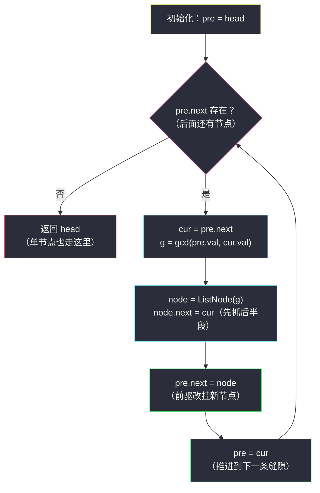
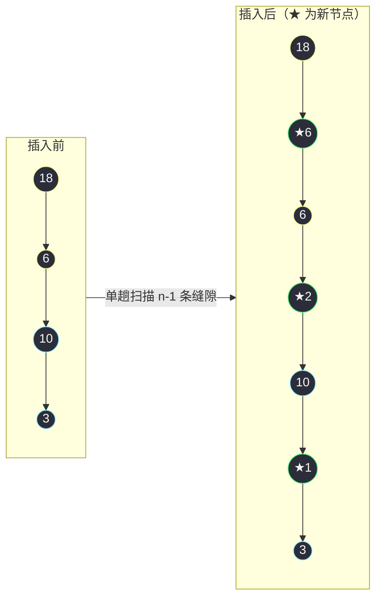

# 2807. 在链表中插入最大公约数(Insert Greatest Common Divisors in Linked List)

> 题目来源：[https://leetcode.cn/problems/insert-greatest-common-divisors-in-linked-list/](https://leetcode.cn/problems/insert-greatest-common-divisors-in-linked-list/)
>
> 灵茶题单小节：§链表·双指针原地插入练习（第 110 场双周赛 Q2）

## 一、问题描述

给你一个链表的头 `head`，每个节点包含一个整数值。

在**相邻节点之间**，请你插入一个**新的节点**，节点值为这两个相邻节点值的**最大公约数**。

请你返回插入之后的链表。

两个数的**最大公约数**（gcd）是可以被两个数字整除的最大正整数。

**数据范围**：

- 链表中节点数目在 `[1, 5000]` 之间
- `1 <= Node.val <= 1000`

**示例 1**：

```text
输入：head = [18,6,10,3]
输出：[18,6,6,2,10,1,3]
解释：
- 18 和 6 的最大公约数为 6，插入第一和第二个节点之间。
- 6 和 10 的最大公约数为 2，插入第二和第三个节点之间。
- 10 和 3 的最大公约数为 1，插入第三和第四个节点之间。
所有相邻节点之间都插入完毕，返回链表。
```

**示例 2**：

```text
输入：head = [7]
输出：[7]
解释：没有相邻节点，所以返回初始链表。
```

**核心思考点**：本题把两件小事拼在一起——**链表的「原地插入」**与**数论的「辗转相除」**。插入一个节点本质只需三根指针接两条边；gcd 则是每个计算机学生的第一课。真正的考点是：你能不能**不重建链表**，单趟遍历就把 `n-1` 个新节点逐一挂进缝隙里，把额外空间压到 `O(1)`（不计输出本身）。

## 二、暴力解法

### 思路

最朴素的等价做法：把链表值抄进数组，逐对计算 gcd 得到新序列，再按新序列**重建一条全新的链表**。

它完全正确，也完全不优雅：

- 整条链被「读出来 → 拆掉 → 重砌」，原节点全部作废；
- 多出 `O(n)` 的数组与 `O(n)` 的重建节点——但题目答案本来就要 `2n-1` 个节点，真正的浪费在于**原节点没能复用**。

它依然有存在价值：作为后面对拍验证的**正确性基准**，一行的「数组逐对插值」语义没有任何歧义空间。

### 代码

```python
class ListNode:
    def __init__(self, val=0, next=None):
        self.val = val
        self.next = next

from math import gcd

def insertGCDsBrute(head: ListNode) -> ListNode:
    # 1) 抄值进数组
    vals, node = [], head
    while node:
        vals.append(node.val)
        node = node.next
    # 2) 相邻值对之间插入 gcd，拼出新序列
    new_vals = [vals[0]]
    for i in range(len(vals) - 1):
        new_vals.append(gcd(vals[i], vals[i + 1]))   # 夹在中间的新值
        new_vals.append(vals[i + 1])
    # 3) 按新序列重建整条链表
    dummy = ListNode()
    cur = dummy
    for v in new_vals:
        cur.next = ListNode(v)
        cur = cur.next
    return dummy.next
```

### 复杂度

- 时间：`O(n log M)`，`M` 为节点最大值（gcd 单次为 `O(log M)`）。
- 空间：`O(n)`，辅助数组 + 全新重建的节点。

## 三、优化探索

### 3.1 难点拆解：往「缝隙」里挂一个节点

「在第 `a` 个与第 `a+1` 个节点之间插入 `x`」的指针动作，教科书只有两行：

```text
node = ListNode(x)      # 造新节点
node.next = pre.next    # 新节点先抓住后半段（原 cur）
pre.next = node         # 前驱再改挂新节点
```

关键顺序与 #24 两两交换如出一辙：**新节点必须先抓住后半段，前驱才能放手**——顺序颠倒会把 `cur` 起的整段链弄丢。只要遍历是「盯着一条缝隙、处理完推进到下一条缝隙」的单向扫描，全程就只需要 `pre/cur` 两根指针，零重建。

### 3.2 gcd 是怎么算的：辗转相除 30 秒复习

`gcd(a, b) = gcd(b, a mod b)`，边界 `gcd(a, 0) = a`。原理：能同时整除 `a` 和 `b` 的数，必然也能整除 `a mod b = a - kb`；反之亦然——两数的公因数集合在辗转相除中**完全不变**，问题规模却每步至少折半量级地收缩，直到余数归零。

```python
def my_gcd(a: int, b: int) -> int:
    while b:
        a, b = b, a % b    # 公因数集合不变，b 趋向 0
    return a               # gcd(a, 0) = a
```

Python 标准库 `math.gcd` 就是它的工业实现（C 层），平时直接用；手写版用于讲解与语言迁移。本题值域仅到 1000，gcd 成本可忽略，但把 `O(log M)` 讲清楚是数论题解的基本功。

### 3.3 单趟能不能成？——能

从左到右扫：`pre` 与 `cur = pre.next` 是「当前缝隙」两侧。算 `g = gcd(pre.val, cur.val)`，建节点挂进缝隙；然后 `pre = cur`、`cur = cur.next`，移到下一条缝隙。单节点链表循环体一次都不进，原样返回——示例 2 天然被覆盖。



注意推进用的是 `pre = cur`——`cur` 是**原链**的下一个节点，而新插入的 `node` 挂在它前面，不属于「下一条缝隙」的左侧。若误写成 `pre = pre.next`（跳到新节点上），就会去算 `gcd(cur.val, g)`，序列全错。

### 3.4 为什么说 gcd 是 `O(log M)` 的：最坏是斐波那契

辗转相除每步 `b` 至少减半吗？不一定——`a mod b` 可以比 `b/2` 小得多，也可以几乎不比 `b` 小？不，关键不等式是 `a mod b < b`，且若 `b > a/2` 则 `a mod b = a - b < a/2`。真正支配步数的是经典结论：**让辗转相除转得最慢的输入是相邻斐波那契数**——`gcd(F(k+1), F(k))` 恰好要走 `k` 步，而 `F(k)` 指数增长，所以步数是 `O(log M)`。直观记忆：每两轮，余数规模至少砍半，`M ≤ 1000` 时最多十来轮就归零，比一次链表指针操作贵不了多少。

## 四、代码实现

```python
from math import gcd

class ListNode:
    def __init__(self, val=0, next=None):
        self.val = val
        self.next = next

def insertGreatestCommonDivisors(head: ListNode) -> ListNode:
    pre = head                            # 每条缝隙的左侧节点
    while pre.next:                       # 右侧还有节点 ⇒ 缝隙存在
        cur = pre.next                    # 缝隙右侧节点
        node = ListNode(gcd(pre.val, cur.val))   # 缝隙里要插入的新值
        node.next = cur                   # ① 新节点先抓住后半段
        pre.next = node                   # ② 前驱再改挂新节点
        pre = cur                         # ③ 推进：下一条缝隙的左侧是 cur
    return head                           # 头节点从不被改挂，直接返回


# ------- 验证辅助：数组 ⇄ 链表 -------
def build_list(vals: list) -> ListNode:
    dummy = ListNode()
    cur = dummy
    for v in vals:
        cur.next = ListNode(v)
        cur = cur.next
    return dummy.next

def list_to_vals(head: ListNode) -> list:
    vals = []
    while head:
        vals.append(head.val)
        head = head.next
    return vals
```

### 细节说明

- **头永不变**：插入永远发生在「缝隙」里，第一条缝隙也在头节点之后，`head` 从头到尾都是答案的头——这正是本题不需要 dummy 的原因（对照 #24：它交换头对、头会变，必须 dummy）。
- **两行接线的顺序是铁律**：`node.next = cur` 必须在 `pre.next = node` 之前。本题里即便顺序写反也「碰巧」不丢链（`cur` 已被局部变量持有），但养成「先抓后半段再放手前驱」的肌肉记忆，在会丢链的题（#24、#92）里能救命。
- **`gcd` 参数顺序无关**：`gcd(a, b) = gcd(b, a)`，辗转相除第一步就会自动交换。
- **值域全是正数**：题目保证 `1 <= val`，不存在 `gcd(0, 0)` 这类退化输入，无需特判。

## 五、例子演示

以 `head = 18 → 6 → 10 → 3` 为例（示例 1）：

| 轮次 | pre | cur | g = gcd | 插入后的链表 |
|---|---|---|---|---|
| 初始 | — | — | — | `18 → 6 → 10 → 3` |
| 1 | 18 | 6 | gcd(18,6)=6 | `18 → **6** → 6 → 10 → 3` |
| 2 | 6 | 10 | gcd(6,10)=2 | `18 → 6 → 6 → **2** → 10 → 3` |
| 3 | 10 | 3 | gcd(10,3)=1 | `18 → 6 → 6 → 2 → 10 → **1** → 3` |
| 收尾 | 3 | 无（`pre.next` 为空） | — | 返回 `18 → 6 → 6 → 2 → 10 → 1 → 3` ✅ |

注意第 2 轮的 `pre = 6` 是**原链**里排在 18 后面的那个 6，而不是第 1 轮新插入的 6——新旧两个 6 值相同纯属巧合（gcd(18,6) 恰为 6），指针语义上它们是两个不同节点。



**手算两例辗转相除**（表格中第一轮的操作）：

| 求 gcd(18, 6) | | 求 gcd(10, 3) | |
|---|---|---|---|
| (18, 6) → (6, 18 mod 6) = (6, 0) | 余数归零，答 6 | (10, 3) → (3, 10 mod 3) = (3, 1) | 未归零 |
| | | (3, 1) → (1, 3 mod 1) = (1, 0) | 余数归零，答 1 |

18 恰是 6 的倍数，一轮就结束；10 与 3 互质，多绕一轮才归零——互质对（答案是 1）是插入节点里最常见的值。

**边界演示**：

- `head = [7]`：`pre.next` 为空，循环体不执行，返回单节点链 ✅（示例 2）。
- `head = [4,6]`：一轮插入 gcd(4,6)=2，得 `4 → 2 → 6`，收尾。
- 极端 `n = 5000` 全为 1000：每条缝隙插入 gcd(1000,1000)=1000，答案长 `9999`，单趟扫描毫无压力。

## 六、复杂度分析

设 `n` 为链表长度，`M` 为节点最大值（本题 `M ≤ 1000`）：

- **时间复杂度：`O(n log M)`**
  - 每条缝隙一次 gcd（`O(log M)`）加两次指针赋值（`O(1)`），共 `n-1` 条缝隙。
- **空间复杂度：`O(1)`**
  - 不计必须产出的 `n-1` 个新节点，全程只用 `pre/cur/node` 三个指针变量。暴力版的数组与重建链在此全部省去。

## 七、对比总结

| 维度 | 暴力（数组重建） | 原地插入主解 |
|---|---|---|
| 时间 | `O(n log M)` | `O(n log M)` |
| 额外空间 | `O(n)` 数组 + 重建原节点作废 | `O(1)` 指针（新节点是产出本身） |
| 原节点复用 | ❌ 全部丢弃重建 | ✅ 原节点原地保留 |
| 代码心智 | 三段式，最直白 | 双指针单循环 |
| 教学 | 对拍基准 | **面试首选** |

| 易错点 | 说明 |
|---|---|
| 接线顺序颠倒 | 「先抓后半段、再放手前驱」是链表插入铁律，本题侥幸不炸，换题必炸 |
| `pre` 推进到新节点 | 应推进到**原链**的 `cur`；跳上新生节点会算错下一条缝隙的 gcd |
| 手写 gcd 忘边界 | 循环条件是 `while b:`，返回 `a`；`b` 为 0 时 `gcd(a,0)=a` |
| 单节点链表特判 | 循环条件 `pre.next` 天然处理，无需 if |

**一句话**：读缝、算 gcd、两行接线、推进——链表插入类题目的全部动作就这四拍。

## 八、举一反三

1. **[24. 两两交换链表中的节点](https://leetcode.cn/problems/swap-nodes-in-pairs/)**（站内 `swap-nodes-in-pairs.md`）：同为「缝隙里做文章」的双指针题，但那里头节点会换、必须 dummy——对照着刷，体会「头变不变」对模板的取舍。
2. **[2181. 合并零之间的节点](https://leetcode.cn/problems/merge-nodes-in-between-nodes/)**：同为单趟扫描原地改链，那里是「区间折叠求和」，与本题「缝隙插值」互为镜像。
3. **[1669. 合并两个链表](https://leetcode.cn/problems/merge-in-between-linked-lists/)**：区间整段替换，练「前驱抓住 + 后半段接管」的指针火候。
4. **[1071. 字符串的最大公因子](https://leetcode.cn/problems/greatest-common-divisor-of-strings/)**：gcd 思想从整数搬到字符串的经典迁移，复习「公因子集合不变」的证明思路。
5. **[1979. 找出数组的最大公约数](https://leetcode.cn/problems/find-greatest-common-divisor-of-array/)**：纯 gcd 无链表的热身，检验 `math.gcd` 与手写辗转相除的熟练度。

**同族互引**：本篇与本批 `double-a-number-represented-as-a-linked-list.md`（#2816）同属「链表·原地操作」小节：一个往缝隙**插入**、一个从尾部**进位**，指针基本功完全同源，适合连刷。

另可与「哑节点删除族」的 `partition-list.md`（#86）对读：插入、删除、分区三类操作共享同一套「前驱 + 接线顺序」心智模型，刷完三篇，链表指针题的模板就齐了。
