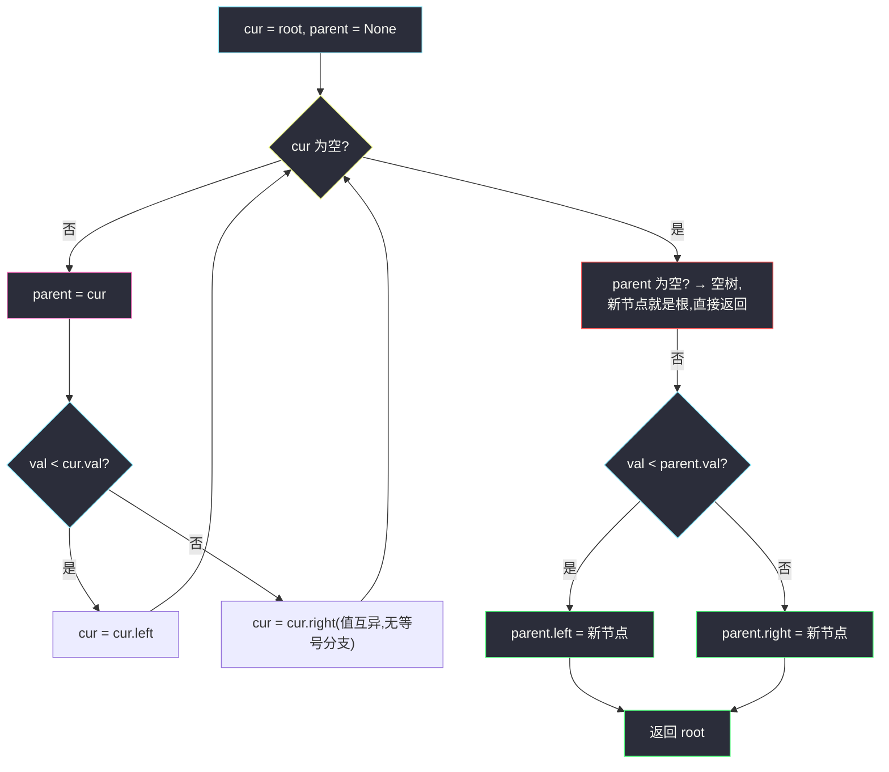
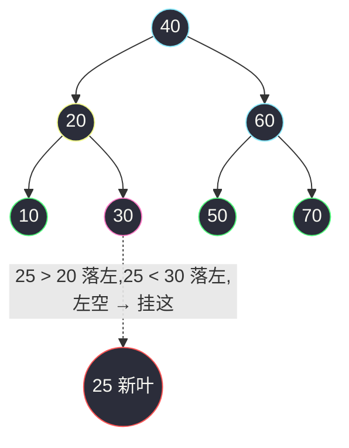

# 701. 二叉搜索树中的插入操作(Insert into a Binary Search Tree)

> 🔗 LeetCode 701:https://leetcode.cn/problems/insert-into-a-binary-search-tree/
>
> 📚 灵茶题单小节:§2.11 插入/删除节点
>
> 同族文章:[#783 二叉搜索树节点最小距离](minimum-distance-between-bst-nodes.md)(中序有序性的打开方式)、[#2476 二叉搜索树最近节点查询](closest-nodes-queries-in-a-binary-search-tree.md)(中序展开 + 二分,站内)。

## 一、问题描述

给定**二叉搜索树(BST)**的根节点 `root` 和要插入树中的值 `value`,将值插入 BST,返回插入后 BST 的根节点。

输入数据**保证**,新值和原 BST 中的任意节点值都**不同**。

注意,可能存在多种有效的插入方式,只要树在插入后仍保持为 BST 即可。你可以返回**任意有效的结果**。

**示例 1**

```text
输入:root = [4,2,7,1,3], val = 5
输出:[4,2,7,1,3,5]
解释:另一个满足题目要求可以通过的树是 [5,2,7,1,3,null,null,null,null,null,4]——
     把 5 换成新根、4 挂到最右下,同样合法。
```

**示例 2**

```text
输入:root = [40,20,60,10,30,50,70], val = 25
输出:[40,20,60,10,30,50,70,null,null,25]
```

**示例 3**

```text
输入:root = [], val = 5
输出:[5]
```

> 数据范围:树中节点数 `[0, 10⁴]`,`-10⁸ <= Node.val <= 10⁸`,所有 `Node.val` 互不相同,`-10⁸ <= val <= 10⁸`,保证 `val` 不在原 BST 中。

**直观理解**:BST 上"找一个值该去的位置"是唯一的搜索路径——比当前小往左、比当前大往右,一路走到底遇到的空位就是 `val` 的家。因为值互异,没有"相等"分支,路径唯一且无歧义;把新节点挂成**叶子**,不惊动任何现有节点,原树的所有 BST 性质原封不动。这题真正的教学点是:**BST 的"搜索"与"插入"共用同一条下降路径**——会用一个就会另一个。

**约束解读**:`n ≤ 10⁴` 但没承诺树平衡——链形退化时树高可达 `10⁴`,递归版插入会一路嵌套 10⁴ 层;这也是本文主解选择迭代版的原因之一。另一个隐藏信息是"任意有效结果":它把题目从"维护特定形状"降格为"维护 BST 性质",替你扫清了旋转、颜色等自平衡话题——大胆挂叶即可。

## 二、暴力解法

不管什么树,只要最后"是 BST 且包含全部值"就算赢——最笨的做法:中序遍历取出全部值(利用 BST 中序有序),把 `val` 二分插入有序数组,再用**有序数组重建一棵平衡 BST**(递归取中点做根)。

```python
class Solution:
    def insertIntoBST(self, root: Optional[TreeNode], val: int) -> Optional[TreeNode]:
        # 第一段:中序收集(天然有序)
        vals = []

        def inorder(node):
            if node is None:
                return
            inorder(node.left)
            vals.append(node.val)
            inorder(node.right)

        inorder(root)

        # 第二段:有序数组中二分插入 val
        import bisect
        pos = bisect.bisect_left(vals, val)
        vals.insert(pos, val)

        # 第三段:有序数组重建平衡 BST
        def build(lo, hi):
            if lo > hi:
                return None
            mid = (lo + hi) // 2
            node = TreeNode(vals[mid])
            node.left = build(lo, mid - 1)
            node.right = build(mid + 1, hi)
            return node

        return build(0, len(vals) - 1)
```

### 复杂度

- 时间:`O(n log n)`——中序 `O(n)`,二分 `O(log n)` 列表插入 `O(n)`,重建 `O(n)`;瓶颈其实是 `vals.insert` 的搬移与建树总量。
- 空间:`O(n)`(值数组 + 重建的整棵新树)。

它甚至把原树**整个扔掉重建**了——正确性最稳,但完全没有利用"只插一个值"的增量性质。而题目特意声明"任意有效结果",就是暗示你:不必重建、不必旋转,**最小改动**即可。

## 三、优化探索

### 观察 1:搜索路径唯一,空位即挂点

值互异 ⇒ `val` 与任何节点的比较结果非左即右,不存在歧义。从根出发一路下降,必然终止在某个空指针处——这个空位就是唯一合法的叶子挂点。

**为什么挂叶子一定保持 BST 性质**:下降过程中每次"往左"都意味着 `val < node.val`(于是 `val` 进入该左子树合法)、每次"往右"意味着 `val > node.val`。沿途所有节点对 `val` 的约束恰好就是"它属于最终空位"的充分条件;而挂成叶子后,新节点不遮挡任何现有节点的子树。换句话说,**搜索路径本身就完成了合法性证明**。

### 观察 2:递归与迭代,一回事两种写法

- 递归版:`dfs(node)` 返回"插入后的子树根"——`node` 为空就返回新节点;否则按大小递归左/右,并把返回值接回去。写起来最短,但树深 `O(h)`,链形 10⁴ 节点在 Python 有爆栈风险。
- 迭代版:一个游标 `cur` 下降,同时记住它的父节点 `parent`,走到空位后按 `val` 与 `parent.val` 的大小挂左/挂右。**全程只改一个指针**,无递归、无重建。



### 观察 3:为什么不旋转

AVL/红黑树的插入要旋转,是因为它们**额外承诺平衡**。本题只承诺 BST——挂叶子后树依然合法,只是可能更"歪"。想练习旋转可以后续做 #701 的姊妹题 #450(删除,那里"找前驱/后继补位"比插入更讲究),但本题考点不在平衡。

插入与删除的操作量级对照(预习 #450 用):

| 操作 | 情形 | 动作 | 改动指针数 |
|---|---|---|---|
| 插入 | 任何 | 走到空位挂叶 | 1 |
| 删除 | 叶节点 | 直接摘除 | 1 |
| 删除 | 单孩子 | 孩子上提接父 | 1 |
| 删除 | 双孩子 | 前驱/后继补位 + 递归删前驱 | ≥ 2 |

一句话:插入永远是最轻的情形,删除要分档讨论——先把本题的"路径下降"练熟,#450 只是在同样的路径上多做几步手术。

## 四、代码实现

```python
class Solution:
    def insertIntoBST(self, root: Optional[TreeNode], val: int) -> Optional[TreeNode]:
        node = TreeNode(val)                  # 待挂的新叶子
        if root is None:                      # 空树:新节点即根
            return node
        cur = root
        while True:
            if val < cur.val:                 # 值互异,无等值分支
                if cur.left is None:
                    cur.left = node           # 找到空位,挂左
                    return root
                cur = cur.left
            else:                             # val > cur.val
                if cur.right is None:
                    cur.right = node          # 找到空位,挂右
                    return root
                cur = cur.right
```

### 细节说明

- **空树是合法输入**:`n` 的下界是 0(示例 3),`root is None` 必须最先处理;主循环假设 `root` 非空,边界前置到函数开头。
- **`while True` 一定终止**:每次循环 `cur` 严格下降一层,树有限,最多 `h` 步内必遇空位;不需要额外的循环条件。
- **只改一个指针**:与递归版"整条返回链逐层接回"相比,迭代版只在最终空位处写一次 `cur.left/right`——副作用最小,也最适合讲解"原树未被惊动"。
- **递归版参考**(代码更短,链形深树慎用):

```python
class Solution:
    def insertIntoBST(self, root: Optional[TreeNode], val: int) -> Optional[TreeNode]:
        if root is None:
            return TreeNode(val)              # 空位:新节点成为这棵子树的根
        if val < root.val:
            root.left = self.insertIntoBST(root.left, val)
        else:
            root.right = self.insertIntoBST(root.right, val)
        return root
```

递归版把"父节点的孩子指针"写成返回值接回,空位处返回新节点即完成挂接——同一逻辑换个记账方式。

- **返回的为什么一定是原 root**:迭代版从未改动 `root` 指针本身(空树除外),挂接发生在树内部;递归版逐层返回原节点。两种写法都天然满足"返回插入后的根"。

## 五、例子演示

**示例 2** `root = [40,20,60,10,30,50,70]`, `val = 25` 端到端:



| 步骤 | cur | 比较 | 动作 |
|---|---|---|---|
| 1 | 40 | `25 < 40` | 左有 20,`cur = 20` |
| 2 | 20 | `25 > 20` | 右有 30,`cur = 30` |
| 3 | 30 | `25 < 30` | 左为空 → **`30.left = 25`**,返回 |

最终层序 `[40,20,60,10,30,50,70,null,null,25]` ✅ 与官方输出一致。中序自检:`10,20,25,30,40,50,60,70` 依然严格递增,BST 性质保持。

**示例 1** `root = [4,2,7,1,3]`, `val = 5`:`5 > 4 → cur=7`;`5 < 7 → 7 左空,挂 5`。输出 `[4,2,7,1,3,5]` ✅。题面给的另一种合法答案 `[5,2,7,1,3,…,4]`(5 当根、4 挂最右下)也通过——它对应"重建式"插入,印证"任意有效结果"的宽容。

**反例警示:挂错空位立刻破坏 BST**。同一棵 `[4,2,7,1,3]`,若偷懒没走完搜索路径、把 5 挂到 3 的右孩子空位(`3.right = 5`):中序变成 `1,2,3,5,4,7`——`5 > 4` 出现在 4 之前,有序性破坏,再用 [#98 验证二叉搜索树](https://leetcode.cn/problems/validate-binary-search-tree/) 的中序检查一扫就露馅。这不是"挂叶子"的错,而是**没走完比较下降**的错:每个空位都对应一条独一无二的合法路径,中序检查是验证插入正确性的最快手段。

| 挂法 | 下降路径 | 中序 | 合法? |
|---|---|---|---|
| `7.left = 5`(正确) | 4→右→7→左空 | `1,2,3,4,5,7` | ✅ |
| `3.right = 5`(错误) | 提前停靠 | `1,2,3,5,4,7` | ❌ 5 番于 4 前面 |
| `1.left = 5`(错误) | 提前停靠 | `5,1,2,3,4,7` | ❌ 5 跑到最小侧 |

**边界用例速查**:

| 用例 | 输入 | 期望(一种) | 考点 |
|---|---|---|---|
| 空树 | `[], val=5` | `[5]` | `n` 下界为 0 |
| 单节点往左 | `[5], val=3` | `[5,3]` | 挂左分支 |
| 单节点往右 | `[5], val=8` | `[5,null,8]` | 挂右分支 |
| 走到底 | `[4,2,7,1,3], val=5` | `[4,2,7,1,3,5]` | 两步下降即空位 |
| 链形插极值 | `[1,2,3,4], val=5` | `[1,2,3,4,null,5]` | 一路向右到底,耗时 `O(n)` |
| 负值 | `[-10⁸,…]` | — | 比较用整数语义,无陷阱 |

链形插极值一行值得多看一眼:主解耗时 `O(n)` 全程向右,这是 BST 退化的代价——也正是 #108("有序数组建平衡 BST")存在的意义,本文八、有链。

### 常见错误清单

- **忘判空树**:`n` 可以是 0,直接进循环会拿 `None.val` 抛 `AttributeError`。
- **写出等值分支**:`if val == cur.val` 纯属多余——题目保证互异;若真写了等值分支反而要回答"重复值插哪边"这种题面不存在的问题。
- **返回新节点而非 root**:有人顺手 `return node`(新叶子),忘了题目要"插入后的树的根";递归版按结构写自然正确,手拼迭代版时容易在 return 上翻车。
- **用层序数组下标找位置**:BST 的位置由**值比较**决定,层序数组里 `val` 的下标与树中位置没有直接对应(参见 [#865](smallest-subtree-with-all-the-deepest-nodes.md) 五章对层序陷阱的警示)。

## 六、复杂度分析

- **时间:`O(h)`**——下降路径长度 = 树高;平衡树 `O(log n)`,链形最坏 `O(n)`。对比暴力的 `O(n log n)`,插入连整树都没碰,只走了一条根到叶的路径。
- **空间:`O(1)`**——迭代版只有 `cur`/`node` 两个引用;递归版为 `O(h)` 栈。

## 七、对比总结

| 解法 | 时间 | 空间 | 改动范围 | 备注 |
|---|---|---|---|---|
| 中序收集 + 二分插入 + 重建(暴力) | `O(n log n)` | `O(n)` | 整树重建 | 稳但浪费,完全没用增量性 |
| 递归下降挂叶 | `O(h)` | `O(h)` | 一条路径 | 最短代码,深树爆栈风险 |
| **迭代下降挂叶(本文)** | `O(h)` | `O(1)` | 一个指针 | 无环境假设,讲解首选 |

| 易错点 | 说明 |
|---|---|
| 空树边界 | `n = 0` 合法,必须先行返回 |
| 等值分支画蛇添足 | 值互异是题面保证,写出 `==` 分支说明没读清约束 |
| 把"挂叶"与"旋转"混为一谈 | BST 只要求有序不要求平衡;旋转是 AVL/红黑树的话题 |
| 递归版在链形树上爆栈 | `n = 10⁴` 且不保证平衡,迭代版才是环境无关解 |

**一句话**:BST 的插入 = **搜索的副产品**——搜索找位置,顺手挂叶子;`O(h)` 的开销与查询同价,这是 BST 结构"增量可维护"的根基。

## 八、举一反三

- [#450 删除二叉搜索树中的节点](https://leetcode.cn/problems/delete-node-in-a-bst/):姊妹题,删除要处理"单孩子/双孩子(找前驱或后继补位)",比插入讲究得多——插入挂叶、删除接枝,一对操作合看才完整。
- [#700 二叉搜索树中的搜索](https://leetcode.cn/problems/search-in-a-binary-search-tree/):本文下降循环去掉"挂叶"就是它——先会 700 再来 701,体感"插入 = 搜索 + 落位"。
- [#98 验证二叉搜索树](https://leetcode.cn/problems/validate-binary-search-tree/):插入后自检的正确性工具(中序有序,见 [#783](minimum-distance-between-bst-nodes.md) 的证明)。
- [#108 将有序数组转换为二叉搜索树](https://leetcode.cn/problems/convert-sorted-array-to-binary-search-tree/):本文暴力解第三段"中点递归建树"的完整版——从数组到平衡 BST。
- [#173 二叉搜索树迭代器](https://leetcode.cn/problems/binary-tree-iterator/):把"下降路径"做成惰性栈,与本文迭代下降互为对照。

> **框架总结**:BST 三连问——**找(700)、插(701)、删(450)**——共享同一条"比较下降"路径。插入是其中最温柔的:路径尽头空位即答案,连回头的必要都没有。
