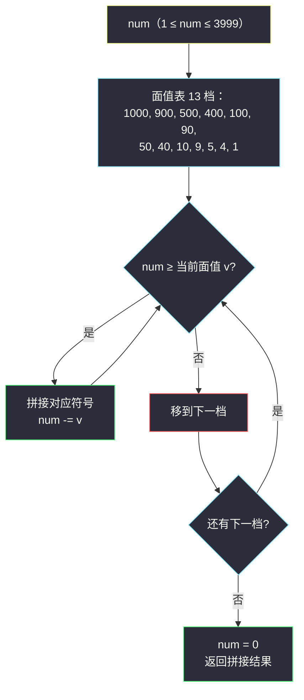

# 整数转罗马数字（贪心面值表 · 13 档逐档扣减）

## 一、问题描述

给你一个整数 `num`（`1 <= num <= 3999`），把它转换成**罗马数字**。

罗马数字由七种符号组成，对应值如下：

| 符号 | I | V | X | L | C | D | M |
|------|---|---|---|---|---|---|---|
| 数值 | 1 | 5 | 10 | 50 | 100 | 500 | 1000 |

罗马数字的计数规则：

- 数值**并列相加**：`III = 3`、`VIII = 8`（同一符号最多连续出现 3 次，如 `4` 不写作 `IIII`）；
- **小值在大值左边相减**：只允许 6 种减法组合 `IV = 4`、`IX = 9`、`XL = 40`、`XC = 90`、`CD = 400`、`CM = 900`；
- 一个数的标准罗马表示是**唯一**的。

> 🔗 LeetCode 12：https://leetcode.cn/problems/integer-to-roman/
>
> 数据范围：`1 <= num <= 3999`。
>
> 📚 本题出自灵茶题单 **Part A（灵茶基础一百题）**。

**示例 1**

```
输入：num = 3
输出："III"
```

**示例 2**

```
输入：num = 58
输出："LVIII"
解释：50 + 5 + 3 = 58，即 L + V + III。
```

**示例 3**

```
输入：num = 1994
输出："MCMXCIV"
解释：1000 + 900 + 90 + 4 = 1994，即 M + CM + XC + IV。
```

**直观理解**

把 6 种减法组合 `CM`、`CD`、`XC`、`XL`、`IX`、`IV` 与 7 个基本符号**一起**当作「面值」，得到从大到小排列的 **13 档面值表**。转换 = 兑换零钱：每一步扣掉「不超过剩余数的最大面值」，拼上对应符号，直到扣完。贪心从大面值走起，一步都不用回溯。

---

## 二、暴力解法

最朴素的想法：递归搜索拼法——每一步从 13 档中枚举一个面值不超过剩余数的档位，扣减后递归，直到剩余为 0。

```python
PAIRS = [(1000, "M"), (900, "CM"), (500, "D"), (400, "CD"),
         (100, "C"), (90, "XC"), (50, "L"), (40, "XL"),
         (10, "X"), (9, "IX"), (5, "V"), (4, "IV"), (1, "I")]

class Solution:
    def intToRoman(self, num: int) -> str:
        def dfs(remain: int) -> str:
            if remain == 0:
                return ""
            for v, sym in PAIRS:                 # 从大面值往小试
                if v <= remain:
                    return sym + dfs(remain - v) # 取第一个能扣的，直接返回
            return ""
        return dfs(num)
```

### 复杂度

- **时间**：每次递归线性扫 13 档、递归深度 ≤ 15（最多拼 `MMMDCCCLXXXVIII` 这样 15 个字符），`O(13 · 15)` 级别——对 `num ≤ 3999` 而言是常数，**实际能过**。
- **空间**：`O(15)` 递归栈。

### 🔴 瓶颈在哪里

这份「暴力」其实已经隐含贪心（取第一个能扣的档），但代码结构暴露了两个没想清楚的问题：

1. 为什么「取最大可扣面值」一定正确，不用回溯？
2. 每步都从 1000 开始线性扫，能不能免掉这层循环？

把这两点想透，代码就塌缩成一层 `while` 循环——这正是贪心面值表的形态。

---

## 三、优化探索（核心章节）

> 📚 本题在灵茶题单 **Part A（灵茶基础一百题）** 中，讲法即**贪心面值表**：`1000 / 900 / 500 / 400 / 100 / 90 / 50 / 40 / 10 / 9 / 5 / 4 / 1` 共 13 档，逐档扣减拼接。

### 3.1 罗马数字 = 逐位独立映射

把 `num` 按十进制位拆开：千、百、十、个位彼此**完全独立**，互不进位、互不影响（千位只用 `M`，百位只用 `C/D/CM/CD`，依此类推）。每个位上的数字 0~9 的表示是固定套路：

| 位值 | 1 | 2 | 3 | 4 | 5 | 6 | 7 | 8 | 9 |
|------|---|---|---|---|---|---|---|---|---|
| 个位 | I | II | III | IV | V | VI | VII | VIII | IX |
| 十位 | X | XX | XXX | XL | L | LX | LXX | LXXX | XC |
| 百位 | C | CC | CCC | CD | D | DC | DCC | DCCC | CM |
| 千位 | M | MM | MMM | — | — | — | — | — | — |

规律：每个位只用 4 种**基元**——「×1」「×3」（加法叠 1~3 个）、「×4」（小前大后减法）、「×9」（减法）。`5` 是独立的第三种符号（V/L/D）。

### 3.2 13 档面值表 = 位映射的扁平化

把上表「压平」成 13 个原子面值：每位上的每种基元恰好是一个原子——

```
1000 M | 900 CM | 500 D | 400 CD | 100 C | 90 XC | 50 L | 40 XL
| 10 X | 9 IX | 5 V | 4 IV | 1 I
```

**贪心正确性**：从最大面值 `1000` 开始逐档扣减，等价于先处理千位（扣尽 `M`），再处理百位（`num` 剩余不足 1000 时，百位 9/4 的减法基元 `CM/CD` 恰好比 `D`/`C` 更大、优先被扣），然后十位、个位。因为**每个位的表示是唯一的**（上表逐列唯一），且档位排序与「先高位后低位、位内先 9 再 5 再 4 再 1」完全一致，贪心不会做出错误选择。

**次数上限自检**：`M` 最多 3 次（`num ≤ 3999`）；`C`、`X`、`I` 最多 3 次（有 `CM/CD`、`XC/XL`、`IX/IV` 档兜底，凑 4 必走减法档）；`D/L/V` 与六个减法档最多 1 次——所以结果串最长 `3+1+1+1 + 3+1+1+1 + 3+1+1+1 + 3 = 15` 个字符（`3888 = MMMDCCCLXXXVIII`）。



### 3.3 两种实现形态

- **逐档扣减**（`while num >= v`）：通用、直观，循环体摊还 `O(15)`；
- **打表逐位拼接**：预置 4 组各 10 个字符串，按 `num // 1000`、`num // 100 % 10`… 直接索引拼接，`O(1)` 且零分支判断。打表法其实是 3.1 位映射表的直接翻译，两者数学上完全等价。

### 3.4 一句话核心

> 把 6 个减法组合并进面值表凑成 **13 档**，从大到小**逐档扣减拼接**——贪心即正解，`O(1)` 时间。

---

## 四、代码实现

### Python 主解（13 档贪心逐档扣减）

```python
class Solution:
    def intToRoman(self, num: int) -> str:
        pairs = [                      # 13 档：面值从大到小
            (1000, "M"), (900, "CM"),
            (500, "D"),  (400, "CD"),
            (100, "C"),  (90, "XC"),
            (50, "L"),   (40, "XL"),
            (10, "X"),   (9, "IX"),
            (5, "V"),    (4, "IV"),
            (1, "I"),
        ]
        ans = []
        for v, sym in pairs:
            while num >= v:            # 本档能扣几次扣几次
                num -= v
                ans.append(sym)
            if num == 0:
                break
        return "".join(ans)
```

**变量含义**

| 变量 | 含义 |
|------|------|
| `pairs` | 13 档（面值, 符号），从大到小；减法组合 `CM/CD/XC/XL/IX/IV` 是原子面值 |
| `num` | 尚未兑换的剩余值，单调递减到 0 |

**循环不变式**：处理完第 `k` 档后，`num < pairs[k].v`——比当前档大的面值已全部扣尽。

### Python 变体（打表逐位拼接）

```python
class Solution:
    def intToRoman(self, num: int) -> str:
        TH = ["", "M", "MM", "MMM"]
        H  = ["", "C", "CC", "CCC", "CD", "D", "DC", "DCC", "DCCC", "CM"]
        T  = ["", "X", "XX", "XXX", "XL", "L", "LX", "LXX", "LXXX", "XC"]
        O  = ["", "I", "II", "III", "IV", "V", "VI", "VII", "VIII", "IX"]
        return (TH[num // 1000] + H[num // 100 % 10]
                + T[num // 10 % 10] + O[num % 10])
```

### Java（最优解同款，逐档扣减）

```java
class Solution {
    public String intToRoman(int num) {
        int[] vals = {1000, 900, 500, 400, 100, 90, 50, 40, 10, 9, 5, 4, 1};
        String[] syms = {"M", "CM", "D", "CD", "C", "XC", "L",
                         "XL", "X", "IX", "V", "IV", "I"};
        StringBuilder sb = new StringBuilder();
        for (int i = 0; i < vals.length && num > 0; i++) {
            while (num >= vals[i]) {
                num -= vals[i];
                sb.append(syms[i]);
            }
        }
        return sb.toString();
    }
}
```

---

## 五、具体例子演示

### 例 1：num = 1994（示例 3）

逐档扣减全跟踪（13 档一档不落）：

| 档 | 面值 | 符号 | 判断 | num 变化 | 拼接结果 |
|----|------|------|------|----------|----------|
| 1 | 1000 | M | 1994 ≥ 1000 → 扣 | 1994 → 994 | `M` |
| 2 | 900 | CM | 994 ≥ 900 → 扣 | 994 → 94 | `MCM` |
| 3 | 500 | D | 94 < 500 → 跳过 | 94 | `MCM` |
| 4 | 400 | CD | 94 < 400 → 跳过 | 94 | `MCM` |
| 5 | 100 | C | 94 < 100 → 跳过 | 94 | `MCM` |
| 6 | 90 | XC | 94 ≥ 90 → 扣 | 94 → 4 | `MCMXC` |
| 7 | 50 | L | 4 < 50 → 跳过 | 4 | `MCMXC` |
| 8 | 40 | XL | 4 < 40 → 跳过 | 4 | `MCMXC` |
| 9 | 10 | X | 4 < 10 → 跳过 | 4 | `MCMXC` |
| 10 | 9 | IX | 4 < 9 → 跳过 | 4 | `MCMXC` |
| 11 | 5 | V | 4 < 5 → 跳过 | 4 | `MCMXC` |
| 12 | 4 | IV | 4 ≥ 4 → 扣 | 4 → 0 | `MCMXCIV` |
| 13 | 1 | I | num = 0，提前结束 | 0 | **`MCMXCIV`** ✓ |

**对照位分解验证**：`1994 = 1|9|9|4` → 千位 1（`M`）+ 百位 9（`CM`）+ 十位 9（`XC`）+ 个位 4（`IV`）→ `MCMXCIV`，逐位映射与贪心扣减结果一致 ✓。

### 例 2：num = 58（示例 2）

| 档 | 面值 | 符号 | 判断 | num | 拼接结果 |
|----|------|------|------|-----|----------|
| 1~5 | ≥ 100 各档 | — | 全部跳过 | 58 | `` |
| 6 | 50 | L | 扣 | 58 → 8 | `L` |
| 7~10 | ≥ 9 各档 | — | 跳过 | 8 | `L` |
| 11 | 5 | V | 扣 | 8 → 3 | `LV` |
| 12 | 4 | IV | 3 < 4 跳过 | 3 | `LV` |
| 13 | 1 | I | 扣 3 次 | 3 → 2 → 1 → 0 | `LVIII` ✓ |

### 例 3：num = 3（示例 1）

只有第 13 档 `I` 生效，`while` 循环扣 3 次 → `III` ✓。


---

## 六、复杂度分析

| 方法 | 时间 | 空间 | 说明 |
|------|------|------|------|
| 递归搜索 | `O(13 · 15)` | `O(15)` | 对本题规模是常数，但结构冗余 |
| 13 档贪心 | `O(1)` | `O(1)` | 结果最长 15 字符，外层 13 档内层总扣减 ≤ 15 次 |
| 打表逐位拼接 | `O(1)` | `O(1)` | 4 次除法/取模 + 4 次索引 |

注意这里的 `O(1)` 是因为 `num ≤ 3999` 把一切量都钉死为常数；若把罗马数字规则抽象到任意进制类似物，逐档扣减是 `O(档数 + 结果长度)`。

---

## 七、对比总结

本题是灵茶题单 **Part A（灵茶基础一百题）** 中的经典模拟/贪心题，与同批 RBS 题（§3.4 括号族）不同族，但共享「**先拆规则、再写代码**」的方法论：

| 视角 | 做法 | 一句话 |
|------|------|--------|
| 暴力递归 | 每步枚举可扣面值 | 能过但暴露「没想清楚为什么不用回溯」 |
| **13 档贪心** | 减法组合当原子面值 | 本篇主解，与位分解严格等价 |
| 打表拼接 | 位映射表直接索引 | 最短代码，位分解的直译 |

**贪心为什么对（再强调）**：面值表不是任意零钱系统——13 档与十进制位分解一一对应，每个位的表示唯一，从大扣到小不会出现「扣了大的导致小的拼不出」的情况（对照：零钱面值 `{1, 3, 4}` 凑 6，贪心 `4+1+1` 劣于 `3+3`——那是因为该系统没有位结构）。本题的贪心正确性来自**罗马数字规则本身就是按位定义的**。

**易错点**

1. 面值表漏掉某个减法组合（如漏 `XL`），`40` 会错拼成 `XXXX`。
2. 档序必须严格从大到小，否则 `9` 会先扣 `5` 再拼 `IIII`。
3. `while` 写成 `if`：同档多次（`III`、`MMM`）会丢。
4. `num = 0` 后不必再扫剩余档（小优化，不影响正确性）。

---

## 八、举一反三

| 题目 | 关系 |
|------|------|
| [13. 罗马数字转整数](https://leetcode.cn/problems/roman-to-integer/) | 逆过程：右小左减的线性扫描，与本题互为对偶 |
| [273. 整数转换英文表示](https://leetcode.cn/problems/integer-to-english-words/) | 同为「按位规则映射」的进阶版（三分位 + 十九以下特表） |
| [168. Excel 表列名称](https://leetcode.cn/problems/excel-sheet-column-title/) | 另一种「进制但无零」的位映射陷阱（`k-1` 偏移） |
| [171. Excel 表列序号](https://leetcode.cn/problems/excel-sheet-column-number/) | #168 的逆过程，同 #12/#13 的对偶关系 |
| [482. 密钥格式化](https://leetcode.cn/problems/license-key-formatting/) | 字符串分段重组的轻量练习 |
| [3412. 计算字符串的镜像分数](https://leetcode.cn/problems/find-mirror-score-of-a-string/) | 同批 `find-mirror-score-of-a-string.md`（§3.1 栈）：字母按镜像规则映射 + 栈配对 |

**思想迁移**

- 见到「规则拼串」题，先把规则**表格化**（本题 13 档 / 位映射表），再决定用循环贪心还是直接打表。
- 「贪心是否安全」取决于结构而不取决于直觉：有位结构（每档唯一分解）贪心无忧；零钱系统则要 DP 兜底。
- 口诀：**「六种减法进面值，十三档位大到微；逐档扣减拼符号，位位独立不回追。」**
