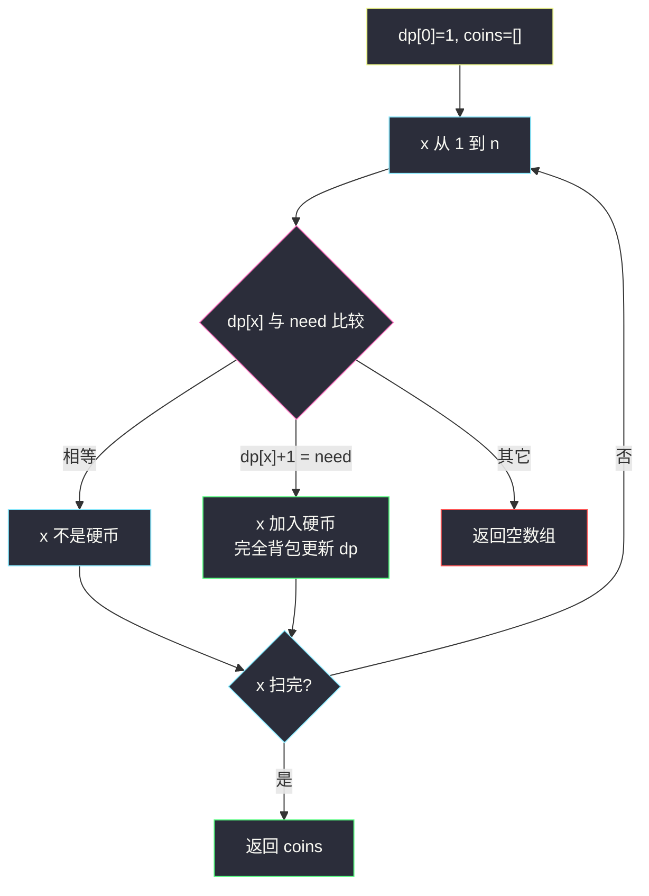

# 3592. 硬币面值还原（Inverse Coin Change）

> 题目来源：[https://leetcode.cn/problems/inverse-coin-change/](https://leetcode.cn/problems/inverse-coin-change/)
>
> 灵茶题单小节定位：§3.2 完全背包

## 一、问题描述

给你一个**从 1 开始计数**的整数数组 `numWays`，`numWays[i]` 表示用某一组**固定面值**的硬币（每种可用无限次，组合不计顺序）凑出总金额 `i` 的方法数。

面值都是不超过 `numWays.length` 的互异正整数，但具体集合已经丢失。请还原这组面值（升序）。若不存在任何集合能生成该 `numWays`，返回空数组。

**数据范围**：

- `1 <= numWays.length <= 100`
- `0 <= numWays[i] <= 2 · 10^8`

**示例 1**：

```text
输入：numWays = [0,1,0,2,0,3,0,4,0,5]
输出：[2,4,6]
解释：金额 1 无法凑；2 只有 [2]；4 有 [2,2] 与 [4]；6 有 [2,2,2]、[2,4]、[6]……与表一致。
```

**示例 2**：

```text
输入：numWays = [1,2,2,3,4]
输出：[1,2,5]
解释：金额 1 一种；2 两种（[1,1] 与 [2]）；5 在已有 1、2 的方案上再多恰好一种 [5]。
```

**示例 3**：

```text
输入：numWays = [1,2,3,4,15]
输出：[]
解释：没有任何面值集合能生成该数组。
```

**核心思考点**：这是「完全背包求组合数」的**反问题**。正问题：已知硬币，`dp[0]=1`，对每个面值正向更新 `dp`。反问题：从小到大看金额 `x`，当前 `dp[x]` 是「只用已经确定的更小面值」的方案数；它和 `numWays[x-1]` 的差额只可能是 0（`x` 不是硬币）或 1（`x` 必须是新硬币）。差额不是 1 就失败。

## 二、暴力解法

### 思路

可能的面值只在 `1..n` 里。枚举全部 `2^n` 个子集，用完全背包算出方案数数组，与 `numWays` 比较。与主解的「逐金额反推」独立。

### 代码

```python
def findCoinsBrute(numWays: list[int]) -> list[int]:
    n = len(numWays)

    def ways(coins: list[int]) -> list[int]:
        dp = [0] * (n + 1)
        dp[0] = 1
        for c in coins:
            for j in range(c, n + 1):
                dp[j] += dp[j - c]
        return dp[1:]

    for mask in range(1 << n):
        coins = [i + 1 for i in range(n) if mask >> i & 1]
        if ways(coins) == list(numWays):
            return coins
    return []
```

### 复杂度

- 时间：`O(2^n · n · |coins|)`。`n = 100` 不可用；对拍缩到 `n ≤ 10`。
- 空间：`O(n)`。

## 三、优化探索

### 3.1 组合数的完全背包长什么样 ⭐

不计顺序，硬币循环在外、金额从小到大：

```text
dp[0] = 1
对每个硬币 c:
    对 j = c..n:
        dp[j] += dp[j - c]
```

`dp[x]` 是用「已加入的硬币」凑 `x` 的方案数。新硬币 `c` 一旦加入，所有 `≥ c` 的金额都会被更新，且因为 `j` 从小到大，同一枚 `c` 可以用多次。

### 3.2 从小到大，差额只能是 0 或 1 ⭐⭐

面值互异且 ≤ `n`，是否包含 `x` 由金额 `x` 自己决定：

处理到 `x` 时，比 `x` 小的硬币已经全部敲定，`dp[x]` 里**还没有**硬币 `x`。

- 若 `x` 不是硬币：方案数不变，必须 `dp[x] == numWays[x-1]`。
- 若 `x` 是硬币：在原有方案之外，恰好多一种「一枚 `x`」（`dp[x] += dp[0]`）。更大的 `2x、3x` 要等后面的金额才检查。所以必须 `numWays[x-1] == dp[x] + 1`。

其它差额（少了、或多了不止 1）都无法靠「以后再加大硬币」补救——大硬币改变不了更小金额。

判定通过后若加入 `x`，立刻用上面那段完全背包把 `dp[x..n]` 更新掉，再看 `x+1`。

### 3.3 集合是唯一的 ⭐

每个 `x` 的「是 / 不是硬币」被差额唯一钉死，所以要么无解，要么只有这一组。不必搜索多种可能。

若把更新写成 0-1 的**逆序** `j` 从 `n` 降到 `x`，硬币 `x` 只能用一次：示例 1 加完 2 之后 `dp[4]` 仍是 0 而不是 1（缺少 `[2,2]`），下一步会误判。正问题 518 与本题共用「外硬币、内金额从小到大」。



## 四、代码实现

### 主解：按金额反推 + 完全背包更新

```python
class Solution:
    def findCoins(self, numWays: list[int]) -> list[int]:
        n = len(numWays)
        dp = [0] * (n + 1)
        dp[0] = 1
        coins = []
        for x in range(1, n + 1):
            need = numWays[x - 1]
            if dp[x] == need:
                continue
            if dp[x] + 1 == need:
                coins.append(x)
                for j in range(x, n + 1):
                    dp[j] += dp[j - x]
            else:
                return []
        return coins
```

### 细节说明

- **下标**：`numWays` 是 1-index 语义，金额 `x` 对应 `numWays[x-1]`。
- **更新方向必须从小到大**：`for j in range(x, n+1): dp[j] += dp[j-x]` 才是完全背包；若写成 0-1 的逆序，硬币 `x` 只能用一次，示例 1 的 `[2,2]` 会丢。
- **`need < dp[x]`**：已有小硬币方案已经超过题目给出的数，无解。
- **`need > dp[x] + 1`**：加入一枚 `x` 只多 1 种，补不上，失败。示例 3 在金额 4 处就是这种。
- **全 0**：每个 `x` 都是 `dp[x]==0==need`，得到空面值集。空集对正金额的方案数确实全是 0；与「无解返回 []」在返回值上无法区分，题面允许。
- **方案数上限 `2·10^8`**：Python `int` 不用担心中间溢出；若换固定宽度整数，更新时可能超过题目范围，超过本身就会在后续比较中失败。
- **正算对照**：还原出 `coins` 之后，用同一段完全背包再跑一遍 `dp[1..n]`，必须与 `numWays` 逐格相等。对拍时一半用例从随机硬币集正算生成（合法），一半直接随机 `numWays`（多半非法），各 200 组、`n ≤ 10`，暴力枚举 `2^n` 个子集交叉验证。合法集合是唯一的，所以反推结果必须与生成时用的硬币集相同。

## 五、例子演示

**示例 2：`numWays = [1,2,2,3,4]`（金额 1..5）**

| x | 加入前 dp[x] | need | 决策 | 加入后 dp[1..5] |
|---|---|---|---|---|
| 1 | 0 | 1 | 差额 1，加硬币 1 | `[1,1,1,1,1]` |
| 2 | 1 | 2 | 差额 1，加硬币 2 | `[1,2,2,3,3]` |
| 3 | 2 | 2 | 相等，不加 | 不变 |
| 4 | 3 | 3 | 相等，不加 | 不变 |
| 5 | 3 | 4 | 差额 1，加硬币 5 | `[1,2,2,3,4]` |

返回 `[1,2,5]`。

**示例 1：`numWays = [0,1,0,2,0,3,0,4,0,5]`（金额 1..10）**

没有硬币 1，所有奇数金额一直是 0。

| x | 加入前 dp[x] | need | 决策 | 更新后若干格 |
|---|---|---|---|---|
| 1 | 0 | 0 | 不加 | 奇数保持 0 |
| 2 | 0 | 1 | 加 2 | dp[2]=1, dp[4]=1, dp[6]=1, dp[8]=1, dp[10]=1 |
| 3 | 0 | 0 | 不加 | |
| 4 | 1 | 2 | 加 4 | dp[4]=2, dp[6]=2, dp[8]=3, dp[10]=3 |
| 5 | 0 | 0 | 不加 | |
| 6 | 2 | 3 | 加 6 | dp[6]=3, dp[8]=4, dp[10]=5 |
| 8 | 4 | 4 | 不加 | |
| 10 | 5 | 5 | 不加 | |

返回 `[2,4,6]`。金额 8 的 4 种是 `[2×4]`、`[2×2+4]`、`[2+6]`、`[4×2]`，与官方表一致。

**示例 3：`[1,2,3,4,15]`**

加入 1、2 后金额 3 的 `dp[3]=2` 但 `need=3`，差额为 1，于是被迫加 3。更新后 `dp[4]=5`，而 `need=4`：既不是相等也不是 `+1`，返回 `[]`。哪怕后面再加 5 也救不了金额 4——大面值改不了更小的格子。

## 六、复杂度分析

设 `n = len(numWays)`：

- **时间复杂度：`O(n²)`**——每个被加入的硬币对 `n` 个金额各更新一次，硬币数 ≤ `n`。
- **空间复杂度：`O(n)`**——`dp` 与答案数组。

## 七、对比总结

| 维度 | 枚举子集再正算 | 反推完全背包 |
|---|---|---|
| 时间 | `O(2^n · n²)` | `O(n²)` |
| 是否唯一 | 搜到第一个即停 | 每个金额强制判定 |
| 典型失败 | 扫完全部子集 | 差额不是 0 或 1 |

**套路归纳**：完全背包组合数的增量在「新面值 `c`」上对金额 `c` **恰好 +1**（`dp[0]=1`）。凡是「已知 `dp`、还原物品」的反问题，都沿着容量从小到大，看当前格与目标的差是否等于「把该容量当作新物品」的那一次贡献。正问题（518. 零钱兑换 II）把硬币当输入；本题把 `dp` 当输入，硬币当输出，转移式同一个。

## 八、举一反三

1. **[518. 零钱兑换 II](https://leetcode.cn/problems/coin-change-ii/)**：本题的正问题，完全背包组合数。
2. **[322. 零钱兑换](https://leetcode.cn/problems/coin-change/)**：完全背包最小值，转移方向相同、目标不同。
3. **[377. 组合总和 Ⅳ](https://leetcode.cn/problems/combination-sum-iv/)**：完全背包**排列**数，硬币循环在内，与本题「组合」互为对照。
4. **[2466. 统计构造好字符串的方案数](https://leetcode.cn/problems/count-ways-to-build-good-strings/)**：同目录 `count-ways-to-build-good-strings.md`，步长版完全背包。
5. **[2915. 和为目标值的最长子序列的长度](https://leetcode.cn/problems/length-of-the-longest-subsequence-that-sums-to-target/)**：同目录那篇是 0-1；本题是完全。两篇对着看更新方向就不会写反。

**同族互引**：§3.2 完全背包的正反两面——正向是「硬币 → 方案数」，本题是「方案数 → 硬币」。差额只能是 0/1 来自「新面值对自身金额只贡献 `dp[0]`」这一条。
