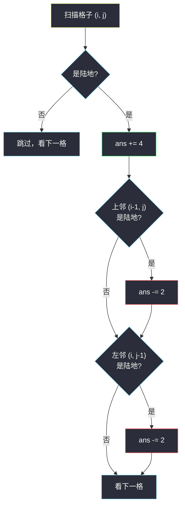

# 岛屿的周长（网格图 DFS · 周长贡献法）

## 一、问题描述

给定 `row x col` 的二维网格 `grid`，`1` 表示陆地、`0` 表示水。网格中**恰好有一个岛屿**（一块四连通的陆地），并且岛上**没有湖**（内部不含水格）。求这个岛屿的周长。

> 🔗 LeetCode 463：https://leetcode.cn/problems/island-perimeter/
>
> 数据范围：`1 <= row, col <= 100`，`grid[i][j]` 为 `0` 或 `1`；保证恰有一个岛屿且无湖。

**示例 1**

```
输入：grid = [[0,1,0,0],[1,1,1,0],[0,1,0,0],[1,1,0,0]]
输出：16
```

岛屿形状（`#` 为陆地、`.` 为水）：

```
. # . .
# # # .
. # . .
# # . .
```

**直观理解**

周长就是岛屿「暴露在外」的边的总长：陆地格的每条边，只要邻接的是**水**或者**网格边界外**，就贡献 1。数法有两条路线：要么逐条边去数（逐格扫描或 DFS），要么把周长摊到每块陆地上——先记 4 条边，再扣掉和邻居共享的边。后者就是**周长贡献法**，本题的最优解。

---

## 二、暴力解法

最直接的做法：枚举每个陆地格，检查它的 4 个方向，邻居**越界或是水**就说明这条边暴露，周长加一。

```python
class Solution:
    def islandPerimeter(self, grid: List[List[int]]) -> int:
        m, n = len(grid), len(grid[0])
        DIRS = (1, 0), (-1, 0), (0, 1), (0, -1)   # 下 上 右 左
        ans = 0
        for i in range(m):
            for j in range(n):
                if grid[i][j] == 0:
                    continue
                for dx, dy in DIRS:
                    x, y = i + dx, j + dy
                    if not (0 <= x < m and 0 <= y < n) or grid[x][y] == 0:
                        ans += 1                    # 这条边暴露在外
        return ans
```

### 复杂度

- **时间**：`O(mn)`，每个陆地格做常数次邻居检查。
- **空间**：`O(1)`。

### 🔴 瓶颈在哪里

`O(mn)` 已经线性，没有复杂度上的瓶颈；可优化的是**写法与常数**：4 次邻居检查有重复视角，也没有「先加后减」的整体公式。另外它逐格扫描，没有利用「岛屿是连通块」的结构——DFS 视角虽然在本题不更快，却是同族题（#695 岛屿面积、#1034 边界着色、#1020 飞地）的通用武器，值得一并掌握。

---

## 三、优化探索（核心章节）

> 📚 本题出自灵茶题单 **「网格图 DFS 基础 · 一、网格图 DFS」** 小节，是网格 DFS 的入门题：核心套路是**周长贡献法**，并借此熟悉方向数组、越界判断、访问标记这套模板。

### 3.1 贡献法：每块陆地记 4，减去相邻陆地数

把周长拆到每块陆地头上：

```
周长 = Σ （4 − 该陆地格的相邻陆地格数）
```

一块陆地孤立存在时贡献 4 条边；每有一个陆地邻居，就有一条边被两块陆地共享、不再暴露，从 4 里减掉邻居个数即可，无需找连通块。

### 3.2 更省的写法：只看左和上

共享边会被两侧格子同时看到：A 的右邻居是 B，等价于 B 的左邻居是 A。所以**每对相邻陆地只检查一次**——只看「左邻居」和「上邻居」：

```
每块陆地：      ans += 4
上邻居是陆地：  ans -= 2      # A、B 各少 1 条，合计 −2
左邻居是陆地：  ans -= 2
```

邻居检查从 4 次减到 2 次，而且 `i > 0`、`j > 0` 天然保证邻居在界内，连越界判断都省了。



### 3.3 DFS 版本：为什么还要会它

贡献法其实不依赖「只有一个岛」——多个岛时逐格贡献依然正确。真正需要 DFS 的场景是：题目**只给一个起点**（如 #1034 只染起点所在分量），或要**逐块处理连通分量**（如 #695 每个岛的面积）。DFS 把「暴露边」的判断放进递归终止条件，越界与水合二为一：

```python
def dfs(i: int, j: int) -> int:
    # 走出网格或踩到水：这条边暴露，贡献 1
    if not (0 <= i < m and 0 <= j < n) or grid[i][j] == 0:
        return 1
    if grid[i][j] == 2:          # 访问标记：陆地原地淹成 2
        return 0
    grid[i][j] = 2
    return sum(dfs(i + dx, j + dy) for dx, dy in DIRS)
```

网格 DFS 模板三要素，本 lane 各题反复出现：

1. **方向数组 `DIRS`**：上下左右写成元组列表，一个 for 代替四份复制粘贴；
2. **越界判断放在递归入口**：`0 <= i < m and 0 <= j < n`，与「是水」合并成同一个 return；
3. **访问标记**：能原地改值就直接改（本题淹成 `2`），省一个 `visited` 数组。

注意：`m, n` 最大 100，全陆极端情况递归深度可达 `10^4`，Python 下建议改显式栈或调大递归上限。

### 3.4 一句话核心

> 周长 = 每块陆地的 4，减去每对相邻陆地的 2；`ans += 4`、看左看上各 `-2`，一趟扫描 `O(mn)`、`O(1)` 额外空间，连 DFS 都不用。

---

## 四、代码实现

### Python（主解：贡献法，只看左上）

```python
class Solution:
    def islandPerimeter(self, grid: List[List[int]]) -> int:
        m, n = len(grid), len(grid[0])
        ans = 0
        for i in range(m):
            for j in range(n):
                if grid[i][j] == 0:
                    continue
                ans += 4                              # 每块陆地先记 4 条边
                if i > 0 and grid[i - 1][j] == 1:     # 上邻是陆地
                    ans -= 2
                if j > 0 and grid[i][j - 1] == 1:     # 左邻是陆地
                    ans -= 2
        return ans
```

**变量含义**：`ans` 为周长累计；`i > 0 and grid[i-1][j] == 1` / `j > 0 and grid[i][j-1] == 1` 分别表示上邻 / 左邻在界内且是陆地——这对格子共享 2 条边。

### Python（DFS 版对比：淹 2 标记 + 递归统计暴露边）

```python
class Solution:
    def islandPerimeter(self, grid: List[List[int]]) -> int:
        m, n = len(grid), len(grid[0])
        DIRS = (1, 0), (-1, 0), (0, 1), (0, -1)

        def dfs(i: int, j: int) -> int:
            if not (0 <= i < m and 0 <= j < n) or grid[i][j] == 0:
                return 1                      # 越界或踩水：一条暴露边
            if grid[i][j] == 2:               # 已访问
                return 0
            grid[i][j] = 2                    # 原地标记
            return sum(dfs(i + dx, j + dy) for dx, dy in DIRS)

        for i in range(m):
            for j in range(n):
                if grid[i][j] == 1:
                    return dfs(i, j)          # 只有一个岛，找到即返回
        return 0
```

两条小细节：水格 / 越界的邻居返回 1 后**不再扩散**，所以每条陆地-非陆地的边恰好从陆地一侧被统计一次；主循环找到第一个陆地就 `return`，因为岛上任意格子都能走遍全岛。

---

## 五、具体例子演示

### 例 1：贡献法逐格计算

`grid` 如示例 1，按行优先扫描 7 个陆地格：

| 陆地格 | +4 | 上邻陆地？ | 左邻陆地？ | 本格净贡献 | ans 累计 |
|--------|----|-----------|-----------|------------|----------|
| (0,1) | +4 | 否（i=0 出界侧） | 否 (0,0)=0 | +4 | 4 |
| (1,0) | +4 | 否 (0,0)=0 | 否（j=0 出界侧） | +4 | 8 |
| (1,1) | +4 | 是 (0,1)，−2 | 是 (1,0)，−2 | 0 | 8 |
| (1,2) | +4 | 否 (0,2)=0 | 是 (1,1)，−2 | +2 | 10 |
| (2,1) | +4 | 是 (1,1)，−2 | 否 (2,0)=0 | +2 | 12 |
| (3,0) | +4 | 否 (2,0)=0 | 否（j=0 出界侧） | +4 | 16 |
| (3,1) | +4 | 是 (2,1)，−2 | 是 (3,0)，−2 | 0 | 16 |

**验证**：7 块陆地 × 4 = 28，相邻陆地对共 6 对 × 2 = 12，28 − 12 = **16** ✓

### 例 2：DFS 版递归调用轨迹

从 `(0,1)` 出发，方向按 `DIRS` 顺序（下、上、右、左），`#` 为调用发生序：

| # | 进入 dfs | 标记（淹 2）后 | 下 (1,0) | 上 (-1,0) | 右 (0,1) | 左 (0,-1) | 该层返回 |
|---|----------|----------------|----------|-----------|----------|-----------|----------|
| 1 | (0,1) | (0,1)→2 | 递归 → #2 | 越界 +1 | 水 +1 | 水 +1 | 13+3 = **16** |
| 2 | (1,1) | (1,1)→2 | 递归 → #3 | 已访 0 | 递归 → #6 | 递归 → #7 | 7+0+3+3 = 13 |
| 3 | (2,1) | (2,1)→2 | 递归 → #4 | 已访 0 | 水 +1 | 水 +1 | 5+0+1+1 = 7 |
| 4 | (3,1) | (3,1)→2 | 越界 +1 | 已访 0 | 水 +1 | 递归 → #5 | 1+0+1+3 = 5 |
| 5 | (3,0) | (3,0)→2 | 越界 +1 | 水 +1 | 已访 0 | 越界 +1 | 3 |
| 6 | (1,2) | (1,2)→2 | 水 +1 | 水 +1 | 水 +1 | 已访 0 | 3 |
| 7 | (1,0) | (1,0)→2 | 水 +1 | 水 +1 | 已访 0 | 越界 +1 | 3 |

访问结束后矩阵快照（2 = 已访问的陆地）：

```
0 2 0 0
2 2 2 0
0 2 0 0
2 2 0 0
```

两条路殊途同归：贡献法扣的是「陆地—陆地共享边」，DFS 数的是「陆地—水/外界」的边，是同一条周长的两种切法。

---

## 六、复杂度分析

| 方法 | 时间 | 空间 | 说明 |
|------|------|------|------|
| 逐边统计（暴力） | `O(mn)` | `O(1)` | 每个陆地格查 4 个方向 |
| 贡献法（只看左上） | `O(mn)` | `O(1)` | 每个陆地格查 2 个方向，常数更小 |
| DFS 版 | `O(mn)` | `O(mn)` | 递归栈最坏与陆地数同阶 |

---

## 七、对比总结

**同族题的统一框架**：网格图上「只关心某一个连通块」的统计题，都可以套「方向数组 + 越界判断 + 访问标记」的 DFS 模板；本题特殊在于「无湖 + 唯一岛屿」，使得**逐格贡献**不依赖连通性也能算对，成为最短解。

| 方法 | 优点 | 局限 |
|------|------|------|
| 贡献法 | `O(1)` 空间、无递归、好写好记 | 只回答「周长」这类可逐格分解的量 |
| DFS 版 | 模板通用，直接迁移到 #695 / #1034 / #1020 | 要处理访问标记与递归深度 |

**易错点**

1. **共享边要减 2 而不是 1**：一对相邻陆地让周长总共少 2（双方各少 1），只减 1 会把答案算大。
2. **只看左上即可，别看四个方向**：四个方向都减会把每对陆地扣两次。
3. 本题「无湖」是题设红利：若岛内有湖，湖岸也是周长的一部分（参见 #827 的讨论），贡献法要改。
4. DFS 版用「淹 2」做标记时，**2 既不是 0 也不是 1**，判断水 / 陆地条件才不会被自己污染。

---

## 八、举一反三

| 题目 | 关系 |
|------|------|
| [695. 岛屿的最大面积](https://leetcode.cn/problems/max-area-of-island/) | 同一 DFS 模板数格子个数，本题「淹 2」换成计数累加 |
| [2658. 网格中的最大鱼数](https://leetcode.cn/problems/maximum-number-of-fish-in-a-grid/) | 分量求和代替分量计数，见同批 `maximum-number-of-fish-in-a-grid.md` |
| [1034. 边界着色](https://leetcode.cn/problems/coloring-a-border/) | DFS 遍历分量时顺带判断「贴边 / 邻格异色」，见同批 `coloring-a-border.md` |
| [1020. 飞地的数量](https://leetcode.cn/problems/number-of-enclaves/) | 从边界反向 DFS 淹没，见同批 `number-of-enclaves.md` |
| [1254. 统计封闭岛屿的数目](https://leetcode.cn/problems/number-of-closed-islands/) | 同套路数岛屿个数，注意 0 是陆地，见同批 `number-of-closed-islands.md` |
| [827. Making A Large Island](https://leetcode.cn/problems/making-a-large-island/) | 分量编号 + 周长/面积思想的进阶综合 |

**思想迁移**

- 凡是「**每块陆地独立贡献、邻居之间互相抵扣**」的量（周长、暴露边数），优先想贡献法，不必强行 DFS。
- 凡是「**整体看一个连通块**」的量（面积、鱼数总和、边界格子集合），用「方向数组 + 访问标记」的 DFS 模板。
- 口诀：**「每格先记四，左上各减二；若要整块算，DFS 淹标记。」**
