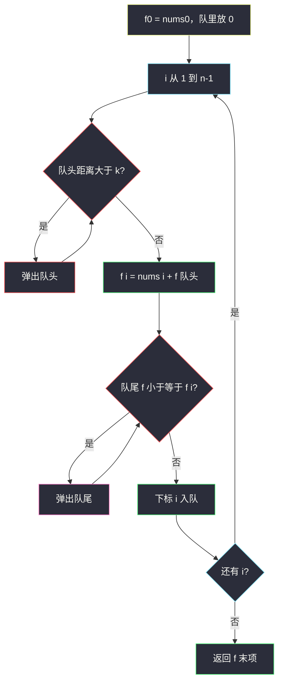

# 1696. 跳跃游戏 VI（Jump Game VI）

> 题目来源：[https://leetcode.cn/problems/jump-game-vi/](https://leetcode.cn/problems/jump-game-vi/)
>
> 灵茶题单小节定位：§11.3 单调队列优化 DP

## 一、问题描述

下标从 0 开始的整数数组 `nums` 和整数 `k`。你从下标 0 出发，每次可向前跳 **1 到 k** 步，且不能跳出数组。必须到达下标 `n-1`。得分是路径上**经过的格子值之和**（可为负）。返回能得到的最大得分。

**数据范围**：

- `1 <= nums.length, k <= 10^5`
- `-10^4 <= nums[i] <= 10^4`

n 达到 1e5，必须 `O(n)`（或 `O(n log n)`），`O(nk)` 会 TLE。

**示例 1**：

```text
输入：nums = [1,-1,-2,4,-7,3], k = 2
输出：7
解释：路径 1 → -1 → 4 → 3，下标 0,1,3,5，和为 7。
```

**示例 2**：

```text
输入：nums = [10,-5,-2,4,0,3], k = 3
输出：17
解释：路径 10 → 4 → 3，下标 0,3,5，和为 17。
```

**示例 3**：

```text
输入：nums = [1,-5,-20,4,-1,3,-6,-3], k = 2
输出：0
```

**核心思考点**：到达 i 时，上一步只能来自 `[i-k, i-1]` 里得分最大的那个位置：

```text
f[i] = nums[i] + max{ f[j] | j ∈ [i-k, i-1] }
f[0] = nums[0]
```

窗口每次右端 +1、左端最多 +1，是滑动窗口最大值，用**单调队列** `O(1)` 取 max，总 `O(n)`。正数尽量踩、负数能跳过就跳过（受 k 限制）。

## 二、暴力解法

### 思路

按转移方程对每个 i 扫一遍窗口。正确，但 n = k = 1e5 时 `O(nk)` 不可用。本章只作对照。

### 代码

```python
def maxResultBrute(nums: list[int], k: int) -> int:
    n = len(nums)
    f = [-(10**18)] * n
    f[0] = nums[0]
    for i in range(1, n):
        best = max(f[j] for j in range(max(0, i - k), i))
        f[i] = nums[i] + best
    return f[-1]
```

### 复杂度

- 时间：`O(nk)`。
- 空间：`O(n)`。

## 三、优化探索

### 3.1 窗口是滑动的 ⭐

i 变成 i+1 时，合法来源从 `[i-k, i-1]` 变成 `[i+1-k, i]`：丢掉左端 i-k（若还在），加入新右端 i。这是定长（边界处变长）滑动窗口的 max。

### 3.2 单调队列维护候选下标 ⭐⭐

队内下标**从左到右 f 值严格递减**（相等也可弹出，因为更靠右的同样大、窗口更晚过期）：

1. **过期**：队头 `j` 满足 `i - j > k` 则弹出（跳不到 i）。
2. **取 max**：队头就是当前窗口最大 `f[j]`，`f[i] = nums[i] + f[队头]`。
3. **维护递减**：队尾 `f` ≤ `f[i]` 则弹出（i 更新、更年轻）。
4. **入队** i。

每个下标至多入队、出队一次，`O(n)`。

队列里存下标而不是值：既要比较 `f[j]`，又要判断 `i-j` 是否超 k。



### 3.3 不变式：队头永远是窗口 max

队列从队头到队尾下标递增、`f` 递减。于是：

- 队头是窗口里 `f` 最大的合法下标（过期的已经被弹掉）。
- 队尾弹出不会丢掉真正的 max：被弹的 `f[j] ≤ f[i]`，且 j 比 i 先过期，以后窗口里 i 仍在时 j 绝不会单独成为更优来源。

反例直觉：若改成递增队列，队头是最小值，本题要 max，方向就反了。滑动窗口最大值（#239）与本题是同一条队列，只是本题多了「用 max 去更新 DP」。

### 3.4 和 1425 的一点差别

[1425. 带限制的子序列和](https://leetcode.cn/problems/constrained-subsequence-sum/) 允许「不选 i」，方程多一个 `max(0, 窗口max)` 或等价地 `f[i] = nums[i] + max(0, max f[j])`。本题路径必须从 0 连通到 n−1，**不能不选**中间的强制落点——你只能通过把落点选在窗口内的最优 j 来「跳过」其它格子。两题队列代码几乎逐行能抄。

**核心一句**：`f[i] = nums[i] + 窗口 max`，窗口用单调队列，不要每次重新扫 k 格。

## 四、代码实现

### 主解：单调队列

```python
from collections import deque

class Solution:
    def maxResult(self, nums: list[int], k: int) -> int:
        n = len(nums)
        f = [0] * n
        f[0] = nums[0]
        q = deque([0])                       # 存下标，f 递减
        for i in range(1, n):
            while q and i - q[0] > k:        # 队头过期
                q.popleft()
            f[i] = nums[i] + f[q[0]]
            while q and f[q[-1]] <= f[i]:    # 队尾无竞争力
                q.pop()
            q.append(i)
        return f[-1]
```

### 对照：Java 默写版

```java
import java.util.ArrayDeque;
import java.util.Deque;

class Solution {
    public int maxResult(int[] nums, int k) {
        int n = nums.length;
        int[] f = new int[n];
        f[0] = nums[0];
        Deque<Integer> q = new ArrayDeque<>();
        q.addLast(0);
        for (int i = 1; i < n; i++) {
            while (!q.isEmpty() && i - q.peekFirst() > k) {
                q.pollFirst();
            }
            f[i] = nums[i] + f[q.peekFirst()];
            while (!q.isEmpty() && f[q.peekLast()] <= f[i]) {
                q.pollLast();
            }
            q.addLast(i);
        }
        return f[n - 1];
    }
}
```

`Deque` 用 `ArrayDeque`，队头 `peekFirst` / `pollFirst`，队尾 `peekLast` / `pollLast`，与 Python `deque` 一一对应。

### 细节说明

- **从 i=1 起循环**：i=0 已处理。若写成 `for i in range(n)` 且 `f` 初值全 0，则 `f[0] = nums[0] + f[0]` 碰巧等于 `nums[0]`，但队里会先有一个 0 再被弹出重入，更绕，不建议。
- **`<=` 不是 `<`**：同样的 f，右边的下标更晚过期，左边没有留的价值。
- **必须经过 0 和 n−1**：不能「不选起点」。负数也得加上，若 k 允许则跳过中间的负格。
- **n=1**：循环不进入，返回 `nums[0]`。
- **k=1**：队列里永远只有前一个下标，退化为 `f[i] = f[i-1] + nums[i]`（整段前缀和）。

## 五、例子演示

**示例 1：`nums = [1,-1,-2,4,-7,3]`，`k = 2`**

逐步跟踪队头 / 队尾。队列写「下标(f 值)」，左边是队头。

| i | nums[i] | 过期弹出 | 算 f[i] | 弹队尾 | 入队后 q | f[i] |
|---|---|---|---|---|---|---|
| 0 | 1 | — | 1 | — | `0(1)` | 1 |
| 1 | -1 | 无 | 1 + f[0] = 0 | f[0]=1 > 0，不弹 | `0(1), 1(0)` | 0 |
| 2 | -2 | 无 | -2 + f[0] = -1 | 1 的 0 ≤ -1？否；0 的 1 > -1 | `0(1), 1(0), 2(-1)` | -1 |
| 3 | 4 | `3-0=3>2` 弹 0 | 4 + f[1] = 4 | 弹 2、弹 1（-1、0 都 ≤ 4） | `3(4)` | 4 |
| 4 | -7 | 无 | -7 + f[3] = -3 | 4 ≤ -3？否 | `3(4), 4(-3)` | -3 |
| 5 | 3 | `5-3=2` 未过期 | 3 + f[3] = **7** | 弹 4（-3 ≤ 7） | `3(4), 5(7)` | 7 |

返回 **7**。最优路径回溯：5 来自队头 3，3 来自当时队头 1，1 来自 0 → 下标 `0,1,3,5`，值 `1,-1,4,3`。

**示例 2：`[10,-5,-2,4,0,3]`，`k=3`**

| i | 窗口来源 | f[i] | 说明 |
|---|---|---|---|
| 0 | — | 10 | |
| 1 | 0 | 5 | 10-5 |
| 2 | 0 | 8 | 跳过 -5 |
| 3 | 0 | **14** | 10+4，跳过两负 |
| 4 | 3 | 14 | 14+0 |
| 5 | 3 | **17** | 14+3 |

k=3 允许 0→3、3→5。返回 17。

**示例 3：`[1,-5,-20,4,-1,3,-6,-3]`，k=2**（官方输出 0）

| i | 合法 j | max f[j] | f[i] |
|---|---|---|---|
| 0 | — | — | 1 |
| 1 | 0 | 1 | -4 |
| 2 | 0,1 | 1 | -19 |
| 3 | 1,2 | -4 | 0 |
| 4 | 2,3 | 0 | -1 |
| 5 | 3,4 | 0 | 3 |
| 6 | 4,5 | 3 | -3 |
| 7 | 5,6 | 3 | **0** |

不能从 0 直接跳到 3（步长 3 > k）。路径之一：0→1→3→5→7，和 `1-5+4+3-3=0`。

**单点**：`[5]`，任意 k，答案 5，队列只有 0。

**全相等正数**：`[1,1,1]`，k=2，踩全部得 3 优于跳过（正数没有跳过的理由）。

**全负、k 允许跳过**：`[-1,-2,-3]`，k=2。

| i | 过期 | 队头 | f[i] | 队列 |
|---|---|---|---|---|
| 0 | — | — | -1 | `0(-1)` |
| 1 | 无 | 0 | -3 | `0(-1), 1(-3)` |
| 2 | 无 | 0 | **-4** | 弹 1（-3 ≤ -4），`0(-1), 2(-4)` |

答案 -4 = 起点加终点，跳过了中间 -2。若误当成必须走完所有格会得到 -6。

**k=1 退化**：每次窗口只有 i−1，队列始终一个元素，`f` 就是前缀和，与是否单调无关。

## 六、复杂度分析

- **时间复杂度：`O(n)`**——每个下标入队、出队至多一次；过期检查均摊 `O(1)`。
- **空间复杂度：`O(n)`**——`f` 数组 + 队列（队列长度 ≤ k+1 ≤ n）。若只需要答案，`f` 可用队列里的值代替额外数组，仍 `O(k)` 队列 + 仍需能按下标取 f，实践中保留 `f` 最清晰。

## 七、对比总结

| 维度 | 暴力扫窗口 | 线段树 / 堆 | 单调队列（主解） |
|---|---|---|---|
| 时间 | `O(nk)` | `O(n log n)` | `O(n)` |
| 维护 | 无 | 区间 max | 双端队列递减 |
| 代码量 | 最短但不进 1e5 | 偏重 | 十来行默写 |

**易错点**：

1. **队内存 f 值不存下标**：过期判断需要下标。
2. **先入队再算 `f[i]`**：会用到自己，窗口不含 i。必须先算再入。
3. **过期写成 `i - q[0] >= k`**：一步跳 k 格是合法的，`>` 才过期。从 j 到 i 的步长是 `i-j`，要 `1 ≤ i-j ≤ k`。
4. **正数想跳过**：最大化得分时正数必踩（可从更优前驱绕过来再踩它）；负数才考虑跳过。
5. **忘记路径含起点**：`f[0] = nums[0]` 不是 0。

**套路归纳**：形如 `f[i] = a[i] + max/min_{j∈[i-k,i-1]} f[j]`（或再加别的只依赖 i 的项）一律单调队列。堆也能做，多一个 log，还要懒删除。

## 八、举一反三

1. **[1425. 带限制的子序列和](https://leetcode.cn/problems/constrained-subsequence-sum/)**：几乎同一方程，可「不选」当前，单调队列模板孪生题。
2. **[239. 滑动窗口最大值](https://leetcode.cn/problems/sliding-window-maximum/)**：没有 DP，只剩单调队列本身。
3. **[2398. 预算内的最多机器人数目](https://leetcode.cn/problems/maximum-number-of-robots-within-budget/)**：窗口 max + 窗口和，队列 + 前缀和。
4. **[55. 跳跃游戏](https://leetcode.cn/problems/jump-game/)** / **[45. 跳跃游戏 II](https://leetcode.cn/problems/jump-game-ii/)**：能否到达 / 最少步数，贪心即可，没有「格子带分」。
5. **[1871. 跳跃游戏 VII](https://leetcode.cn/problems/jump-game-vii/)**：字符限制下的能否到达，可用差分数组或队列 BFS。

**同族互引**：本批另外四题是状压 / 矩阵幂 / 轮廓，和本题不是同一优化器。单调队列优化 DP 的识别口诀就是「转移来自长度为 k 的一段连续下标的 max/min」。
