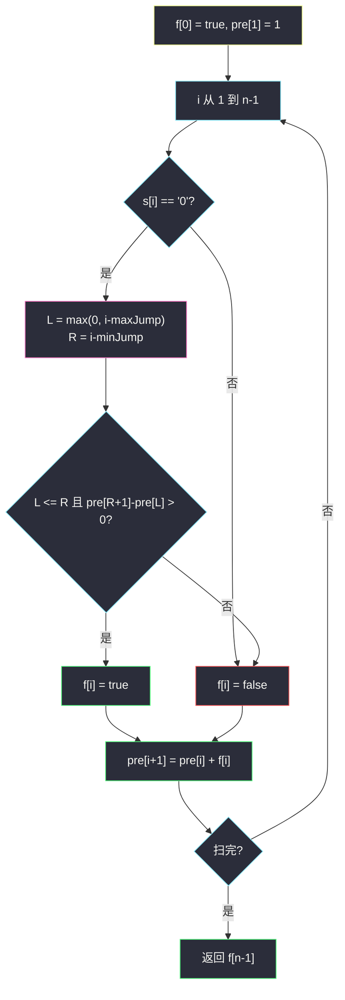

# 1871. 跳跃游戏 VII（Jump Game VII）

> 题目来源：[https://leetcode.cn/problems/jump-game-vii/](https://leetcode.cn/problems/jump-game-vii/)
>
> 灵茶题单小节定位：§11.1 前缀和优化 DP

## 一、问题描述

给你下标从 0 开始的二进制字符串 `s`，以及整数 `minJump`、`maxJump`。一开始你在下标 `0`，且 **`s[0]` 一定是 `'0'`**。当同时满足：

- `i + minJump ≤ j ≤ min(i + maxJump, n-1)`
- `s[j] == '0'`

就可以从 `i` 跳到 `j`。问能否到达下标 `n-1`。

**数据范围**：

- `2 <= s.length <= 10^5`
- `s[i]` 为 `'0'` 或 `'1'`，`s[0] == '0'`
- `1 <= minJump <= maxJump < s.length`

**示例 1**：

```text
输入：s = "011010", minJump = 2, maxJump = 3
输出：true
解释：0 → 3 → 5。
```

**示例 2**：

```text
输入：s = "01101110", minJump = 2, maxJump = 3
输出：false
```

**核心思考点**：`n = 10^5`，从每个可达点再扫 `[minJump, maxJump]` 会退化成 `O(n²)`。`f[i]` 只依赖于一段历史 `f[i-maxJump .. i-minJump]` 里有没有可达的 `0`——这段区间求和 / 计数可以前缀和或滑动窗口 `O(1)` 完成。

## 二、暴力解法

### 思路

BFS / DFS：从 0 出发，对每个点枚举整个跳跃区间里的 `'0'`。用 `vis` 避免重复入队，但每个点仍可能被前面很多点扫描到，最坏 `O(n · (maxJump-minJump+1))`。

### 代码

```python
from collections import deque

def canReachBrute(s: str, minJump: int, maxJump: int) -> bool:
    n = len(s)
    vis = [False] * n
    q = deque([0])
    vis[0] = True
    while q:
        i = q.popleft()
        if i == n - 1:
            return True
        for j in range(i + minJump, min(i + maxJump, n - 1) + 1):
            if s[j] == '0' and not vis[j]:
                vis[j] = True
                q.append(j)
    return False
```

### 复杂度

- 时间：最坏 `O(n²)`，`n = 10^5` 超时。
- 空间：`O(n)`。

## 三、优化探索

### 3.1 可达 DP：只问「左边窗口里有没有可达点」⭐⭐

`f[i] = true` 当且仅当 `s[i] == '0'` 且存在可达下标 `j` 满足 `i-maxJump ≤ j ≤ i-minJump`（越界截断）。若写成

```text
f[i] = (s[i]=='0') and any(f[j] for j in [L, R])
```

内层是 `O(n)`，总 `O(n²)`。注意到我们只要「窗口内可达个数是否 > 0」，把 `f` 看成 0/1 数组，**前缀和 `pre[k] = f[0]+…+f[k-1]`**：

```text
L = max(0, i - maxJump)
R = i - minJump
f[i] = (s[i]=='0') and (L ≤ R) and (pre[R+1] - pre[L] > 0)
pre[i+1] = pre[i] + (1 if f[i] else 0)
```

`i` 从左到右，查 `pre` 时窗口已全部算完。这就是 §11.1「前缀和优化 DP」的标准形：转移来源是下标连续一段，把 `Σ / any / min / max` 换成前缀结构。

### 3.2 滑动窗口计数：同一件事的滚动写法 ⭐

`i` 增加 1 时，窗口右端 `i-minJump` 新进来，左端 `i-maxJump-1` 滑出去。维护窗口内 `f == true` 的个数 `cnt`：

```text
if i >= minJump and f[i - minJump]: cnt += 1
if i >  maxJump and f[i - maxJump - 1]: cnt -= 1
f[i] = (s[i]=='0') and cnt > 0
```

`O(1)` 额外空间（除开 `f` 本身）。与前缀和完全等价，面试写哪一种都行。

### 3.3 只有落在 `'0'` 上才可达 ⭐

`s[i]=='1'` 时 `f[i]` 必须是 false，**仍要更新前缀**（加 0）。不要把 `'1'` 当成跳板——题面禁止。`s[n-1]=='1'` 直接 false。



## 四、代码实现

### 主解：前缀和优化可达 DP

```python
class Solution:
    def canReach(self, s: str, minJump: int, maxJump: int) -> bool:
        n = len(s)
        pre = [0] * (n + 1)
        pre[1] = 1
        f = [False] * n
        f[0] = True
        for i in range(1, n):
            if s[i] == '0':
                L = max(0, i - maxJump)
                R = i - minJump
                f[i] = L <= R and pre[R + 1] - pre[L] > 0
            pre[i + 1] = pre[i] + int(f[i])
        return f[-1]
```

### 对照：滑动窗口计数

```python
class Solution:
    def canReach(self, s: str, minJump: int, maxJump: int) -> bool:
        n = len(s)
        f = [False] * n
        f[0] = True
        cnt = 0
        for i in range(1, n):
            if i >= minJump and f[i - minJump]:
                cnt += 1
            if i > maxJump and f[i - maxJump - 1]:
                cnt -= 1
            f[i] = s[i] == '0' and cnt > 0
        return f[-1]
```

### 细节说明

- **`R = i-minJump` 可能为负**：此时窗口还没形成，`L ≤ R` 为假，不能跳。
- **前缀下标**：`pre[k]` 表示前 `k` 个位置（`0..k-1`）的可达个数，所以窗口 `[L, R]` 的和是 `pre[R+1]-pre[L]`。
- **BFS 指针优化**：有人用队列 +「下一轮只从上次扫到的最右继续」，也能 `O(n)`。本质仍是「每个下标只被考虑一次」，与窗口思想同源；前缀和更好对齐 §11.1。

## 五、例子演示

**示例 1：s = `"011010"`, minJump = 2, maxJump = 3**

下标：`0:0, 1:1, 2:1, 3:0, 4:1, 5:0`。逐步（`pre` 为更新后）：

| i | s[i] | 窗口 [L,R] | pre[R+1]-pre[L] | f[i] | pre[0..i+1] |
|---|---|---|---|---|---|
| 0 | 0 | — | — | **T** | `[0,1]` |
| 1 | 1 | 不看（非 0） | — | F | `[0,1,1]` |
| 2 | 1 | 不看 | — | F | `[0,1,1,1]` |
| 3 | 0 | [0,1] | pre[2]-pre[0]=1 | **T** | `[0,1,1,1,2]` |
| 4 | 1 | 不看 | — | F | `[0,1,1,1,2,2]` |
| 5 | 0 | [2,3] | pre[4]-pre[2]=1 | **T** | … |

`f[5] = true` ✅。窗口 [2,3] 里只有下标 3 可达。

**示例 2：s = `"01101110"`, minJump = 2, maxJump = 3**

| i | s[i] | 窗口 | 窗口内可达数 | f[i] |
|---|---|---|---|---|
| 0 | 0 | — | — | T |
| 1 | 1 | — | — | F |
| 2 | 1 | — | — | F |
| 3 | 0 | [0,1] | 1 | **T** |
| 4 | 1 | — | — | F |
| 5 | 1 | — | — | F |
| 6 | 1 | — | — | F |
| 7 | 0 | [4,5] | 0 | **F** |

末位是 `'0'` 但窗口 [4,5] 全不可达（那两格还是 `'1'`），回不去 3。返回 **false** ✅。

## 六、复杂度分析

设 `n = len(s)`：

- **时间复杂度：`O(n)`**——每格常数次前缀查询 / 窗口更新。
- **空间复杂度：`O(n)`**——`f` 与 `pre`；滑动窗口可只留 `f`。

## 七、对比总结

| 维度 | 区间 BFS | 前缀和 DP | 滑动窗口 |
|---|---|---|---|
| 时间 | 最坏 `O(n²)` | `O(n)` | `O(n)` |
| 查询 | 真扫区间 | `pre` 差分 | 进出各一次 |
| 易错 | 超时 | `L>R` 未判 | 滑出下标 `i-maxJump-1` |

**套路归纳**：**转移源是下标连续段时，把内层枚举换成前缀和 / 滑动窗口**。`any` 用计数，`sum` 用前缀和，`min/max` 用单调队列（见 #2944）。跳跃游戏这一族：能跳多远用贪心（#55/#45），「必须落在特定格子」用可达 DP。

## 八、举一反三

1. **[55. 跳跃游戏](https://leetcode.cn/problems/jump-game/)**：从 i 可跳任意 `≤ nums[i]`，贪心维护最右即可。
2. **[45. 跳跃游戏 II](https://leetcode.cn/problems/jump-game-ii/)**：最少跳跃次数，贪心分层。
3. **[1306. 跳跃游戏 III](https://leetcode.cn/problems/jump-game-iii/)**：左右固定步长，图 BFS。
4. **[1696. 跳跃游戏 VI](https://leetcode.cn/problems/jump-game-vi/)**：窗口 max 优化 DP，与本题窗口「是否存在」同一骨架。
5. **[403. 青蛙过河](https://leetcode.cn/problems/frog-jump/)**：落点必须是石头，状态多一维步长。

**同族互引**：§11.1 前缀和优化 DP 的入门题；窗口最值进阶见 `minimum-number-of-coins-for-fruits.md`（#2944）。同目录暂无 #55，本篇可与 Kadane 篇对照「线性扫一遍」的手感。
