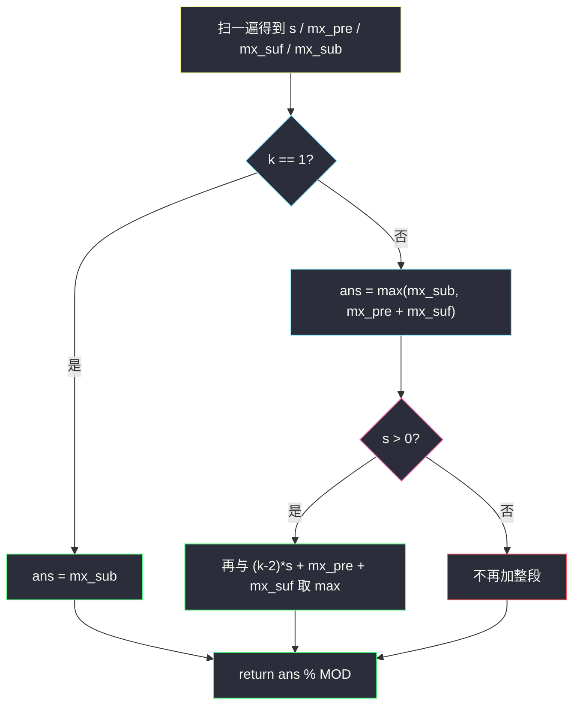

# 1191. K 次串联后最大子数组之和（K Concatenation Maximum Sum）

> 题目来源：[https://leetcode.cn/problems/k-concatenation-maximum-sum/](https://leetcode.cn/problems/k-concatenation-maximum-sum/)
>
> 灵茶题单小节定位：§1.3 最大子数组和（最大子段和）

## 一、问题描述

给定整数数组 `arr` 和整数 `k`。把 `arr` **重复 k 次**得到新数组（例如 `arr = [1,2]`、`k = 3` 得到 `[1,2,1,2,1,2]`），求新数组的**最大子数组和**。官方注明：子数组长度可以是 0，此时和为 0。答案可能很大，对 `10^9 + 7` 取模。

**数据范围**：

- `1 <= arr.length <= 10^5`
- `1 <= k <= 10^5`
- `-10^4 <= arr[i] <= 10^4`

**示例 1**：

```text
输入：arr = [1,2], k = 3
输出：9
解释：拼接后 [1,2,1,2,1,2]，整段和 9。
```

**示例 2**：

```text
输入：arr = [1,-2,1], k = 5
输出：2
解释：最优取某一处的 [1,1]（跨越两次相邻拷贝的交界），和为 2。
```

**示例 3**：

```text
输入：arr = [-1,-2], k = 7
输出：0
解释：全负，空子数组和为 0（官方允许为空）。
```

**核心思考点**：不能真去拼 `n·k` 长度（`10^10`）。最大子数组要么落在 **1 段**里，要么跨过 **恰好 1 次交界**（右后缀 + 左前缀），要么在 `sum(arr) > 0` 时再吞掉中间 `k-2` 段完整拷贝。这是 Kadane 在「周期拼接」上的分类。

## 二、暴力解法

### 思路

物理拼接 `arr * k`，做一次允许空段的 Kadane：当前和变负就重开，答案与 0 取 max。

### 代码

```python
MOD = 10**9 + 7

def kConcatenationMaxSumBrute(arr: list[int], k: int) -> int:
    a = arr * k
    best = 0
    cur = 0
    for x in a:
        cur = max(x, cur + x)
        best = max(best, cur)
    return max(best, 0) % MOD
```

### 复杂度

- 时间：`O(n·k)`。`n = k = 10^5` 不可用。
- 空间：`O(n·k)`（可滚成 `O(1)`，时间仍爆）。

## 三、优化探索

### 3.1 最优段最多跨全体拷贝，但形状只有三种 ⭐⭐

记 `s = sum(arr)`。拼接串是 `arr` 的周期重复。任意非空子数组在周期上的形态：

1. **不跨交界**：就是单段 `arr` 的最大子段，记 `mx_sub`（Kadane；与 0 取 max 即允许空）。
2. **跨恰好一个交界**：必为「某次拷贝的后缀 + 下一次拷贝的前缀」。最优值 = `mx_suf + mx_pre`。
3. **跨至少两段完整拷贝**：中间可以塞 `t` 段完整 `arr`。若 `s ≤ 0`，多塞一段只会变差，退回情况 1 或 2；若 `s > 0`，中间越多越好，最多塞 `k-2` 段（两端还要留给前后缀），即 `(k-2)·s + mx_pre + mx_suf`。

`k = 1` 没有交界，只剩情况 1。

### 3.2 一遍扫出四个量 ⭐

一次遍历维护前缀和 `s`（扫完即总和）：

```text
mx_pre = max(前缀和)          # 最大前缀，可 0
mi_pre = min(前缀和)          # 最小前缀（可 0 或负）
mx_sub = max(s - mi_pre)     # 标准前缀差 = 最大子段（含空则为 ≥0）
mx_suf = s - mi_pre          # 总和减最小前缀 = 最大后缀
```

`mx_suf` 的直觉：丢掉最亏的那段前缀，剩下就是最优后缀（若 `mi_pre = 0` 则整段都是后缀）。

### 3.3 先比大小，最后取模 ⭐

`(k-2)·s` 最大约 `10^5 · 10^5 · 10^4 = 10^14`，比较必须用**未取模**的整数；Python 无溢出。若先模再比，`10^9+6` 会被当成比 0 大，全错。官方允许空段，全负时 `mx_sub = 0`，答案 0——**不是**最大元素（那是「子数组非空」时的规则，与本题官方示例 3 不符）。



## 四、代码实现

### 主解：Kadane 分类

```python
class Solution:
    def kConcatenationMaxSum(self, arr: list[int], k: int) -> int:
        MOD = 10**9 + 7
        s = mx_pre = mi_pre = mx_sub = 0
        for x in arr:
            s += x
            mx_pre = max(mx_pre, s)
            mi_pre = min(mi_pre, s)
            mx_sub = max(mx_sub, s - mi_pre)
        ans = mx_sub
        if k == 1:
            return ans % MOD
        mx_suf = s - mi_pre
        ans = max(ans, mx_pre + mx_suf)
        if s > 0:
            ans = max(ans, (k - 2) * s + mx_pre + mx_suf)
        return ans % MOD
```

### 细节说明

- **`mx_pre` 初值 0**：允许空前缀。全负时前缀和一路向下，`mx_pre` 停在 0。
- **`mx_sub` 初值 0**：空子数组；Kadane 用 `s - mi_pre` 自动覆盖非空正段。
- **`k = 2` 且 `s > 0`**：`(k-2)*s = 0`，第三项等于第二项，无害。
- **`mx_pre + mx_suf` 会不会把同一段算两次？** 不会。前缀来自「下一拷贝」，后缀来自「上一拷贝」，两段物理上相邻不重叠。若两者都取整段，和为 `2s`，对应选中整整两份 `arr`，`k ≥ 2` 时合法。

## 五、例子演示

**示例 1：arr = [1,2], k = 3**

逐步前缀：

| 扫到 | 前缀和 s | mx_pre | mi_pre | mx_sub = s-mi_pre |
|---|---|---|---|---|
| 1 | 1 | 1 | 0 | 1 |
| 2 | 3 | **3** | 0 | **3** |

`s = 3 > 0`，`mx_suf = 3-0 = 3`。

- k=1 的话是 3；
- 跨一界：`3+3 = 6`（两份）；
- 加中间 k-2=1 份：`3 + 3+3 = 9`。

答案 **9** ✅。每一步都用未取模值比较。

**示例 2：arr = [1,-2,1], k = 5**

| 扫到 | s | mx_pre | mi_pre | mx_sub |
|---|---|---|---|---|
| 1 | 1 | 1 | 0 | 1 |
| -2 | -1 | 1 | **-1** | 1 |
| 1 | 0 | 1 | -1 | 1 |

`s = 0`（不走第三支），`mx_suf = 0-(-1) = 1`，跨界 `1+1 = 2`。中间加整段无增益。答案 **2** ✅，对应交界处的 `[1] + [1]`。

**示例 3：arr = [-1,-2], k = 7**

| 扫到 | s | mx_pre | mi_pre | mx_sub |
|---|---|---|---|---|
| -1 | -1 | 0 | -1 | 0 |
| -2 | -3 | 0 | -3 | 0 |

`s = -3 < 0`，跨界 `0 + (-3-(-3)) = 0`。答案 **0** ✅。若误用「非空 Kadane」会得到 `-1`，与官方示例冲突。

## 六、复杂度分析

设 `n = len(arr)`：

- **时间复杂度：`O(n)`**——与 `k` 无关。
- **空间复杂度：`O(1)`**。

## 七、对比总结

| 维度 | 物理拼接 Kadane | 主解分类 |
|---|---|---|
| 时间 | `O(nk)` | `O(n)` |
| 关键 | 真数组 | 1 段 / 跨 1 界 / 中间 (k-2) 段 |
| 取模 | 末尾 | 先比后模 |
| 全负 | 0（官方空段） | 同左 |

**套路归纳**：**周期拼接的最大子段 = 单段 Kadane + 跨界「最大后缀+最大前缀」+ 总和为正时的整段倍增**。环形最大子数组（#918）是 `k=2` 且「不能把两头拼成超过 n」的近亲；本题 `k` 很大，反而因为周期一致更好分类。看见「重复 k 次再 Kadane」，先问总和正负，再问跨几段。

## 八、举一反三

1. **[53. 最大子数组和](https://leetcode.cn/problems/maximum-subarray/)**：`k = 1` 且子数组非空的基座。
2. **[918. 环形子数组的最大和](https://leetcode.cn/problems/maximum-sum-circular-subarray/)**：环 = 跨一次首尾，答案 `max(普通 Kadane, total - 最小子段)`，注意全负。
3. **[1186. 删除一次得到子数组最大和](https://leetcode.cn/problems/maximum-subarray-sum-with-one-deletion/)**：Kadane 加一维状态，见同目录 `maximum-subarray-sum-with-one-deletion.md`。
4. **[152. 乘积最大子数组](https://leetcode.cn/problems/maximum-product-subarray/)**：负号翻转，双状态 max/min。
5. **[1749. 任意子数组和的绝对值的最大值](https://leetcode.cn/problems/maximum-absolute-sum-of-any-subarray/)**：同时维护最大 / 最小子段。

**同族互引**：§1.3 最大子段和；与 `maximum-subarray-sum-with-one-deletion.md` 同属 Kadane 家族，一篇管「删一个」，本篇管「重复 k 次」。
