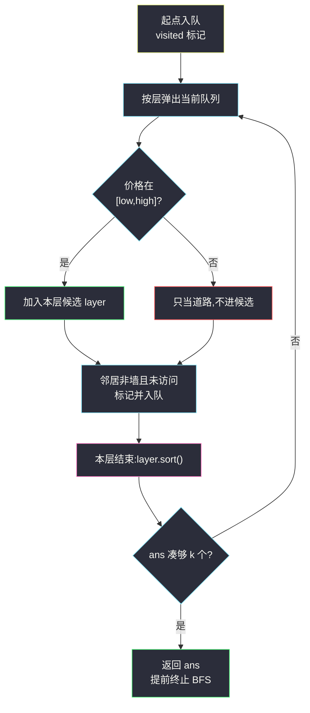

# 价格范围内最高排名的 K 样物品(BFS 分层收集 + 多关键字排序)

## 一、问题描述

给你一个下标从 0 开始、大小 `m x n` 的二维整数数组 `grid`,表示商店地图。`grid[i][j]` 的含义:

- `0`:空单元格,可以自由通行;
- `1`:墙,不能通行;
- 大于 `1` 的整数:该格子放着一件价格为 `grid[i][j]` 的商品,可以通行。

另给定价格区间 `pricing = [low, high]`、起点 `start = [startRow, startCol]`(起点上必有商品,即 `grid[start] > 1`)与整数 `k`。

从起点出发,每步可以走到**上下左右**相邻的可通行格子。你需要把所有**价格落在 `[low, high]` 内**的商品格找出来,按下面四个关键字**升序**排序,返回排在前面的 `k` 个格子的坐标 `[row, col]`:

1. 到起点的**距离**(起点到达该格的最少步数);
2. 商品**价格**;
3. **行**坐标;
4. **列**坐标。

> 🔗 LeetCode 2146:https://leetcode.cn/problems/k-highest-ranked-items-within-a-price-range/
>
> 数据范围:`1 <= m, n <= 100`,`grid[i][j]` 为 `0`、`1` 或 `2 <= grid[i][j] <= 10^9`,`2 <= low <= high`,`1 <= k <= m * n`,起点格子 `grid[start] > 1`。

**示例 1**(演示网格,格式与官方一致)

```text
grid = [[1,3,2,0,5],
        [2,1,8,0,1],
        [0,0,6,0,4],
        [9,1,5,0,0]]
pricing = [2,6], start = [1,0], k = 5
输出:[[1,0],[2,2],[3,2],[0,2],[2,4]]
```

起点 `(1,0)` 自己就是价格 2 的商品(距离 0,直接入围);价格 8 的 `(1,2)` 与价格 9 的 `(3,0)` 因不在 `[2,6]` 内被过滤,但**仍可通行**(是道路的一部分)。

**示例 2**

```text
同一张网格,k = 8
输出:[[1,0],[2,2],[3,2],[0,2],[2,4],[0,1],[0,4]]
```

候选一共只有 7 个,不足 `k` 时全部返回。

**直观理解**

这是「网格 BFS 最短路」的**带过滤 TopK 版**:BFS 的第 `d` 层恰好是所有距离为 `d` 的格子——距离是第一关键字,而 BFS 天然按距离从小到大一层层产出候选。每层内再做 `(价格, 行, 列)` 的排序,凑够 `k` 个立即收工。

---

## 二、暴力解法

对每个格子**单独**跑一次 BFS 求它到起点的距离,再把所有满足价格条件的格子按四关键字排序取前 `k` 个:

```python
class Solution:
    def highestRankedKItems(self, grid: List[List[int]], pricing: List[int],
                            start: List[int], k: int) -> List[List[int]]:
        m, n = len(grid), len(grid[0])
        low, high = pricing

        def bfs(sx: int, sy: int) -> int:          # 从 (sx,sy) 到 start 的距离
            q = deque([(sx, sy, 0)])
            seen = {(sx, sy)}
            while q:
                x, y, d = q.popleft()
                if [x, y] == start:
                    return d
                for nx, ny in ((x+1, y), (x-1, y), (x, y+1), (x, y-1)):
                    if 0 <= nx < m and 0 <= ny < n and (nx, ny) not in seen \
                            and grid[nx][ny] != 1:
                        seen.add((nx, ny))
                        q.append((nx, ny, d + 1))
            return -1                               # 与起点不连通

        cand = []
        for i in range(m):
            for j in range(n):
                if low <= grid[i][j] <= high:       # 先筛商品
                    d = bfs(i, j)
                    if d >= 0:
                        cand.append((d, grid[i][j], i, j))
        cand.sort()
        return [[x, y] for _, _, x, y in cand[:k]]
```

### 复杂度

- **时间**:`O((mn)²)`——`mn` 个格子各跑一次 BFS,每次 `O(mn)`。`m = n = 100` 时约 `10^8` 次格子访问,严重超时。
- **空间**:`O(mn)`。

### 🔴 瓶颈在哪里

距离信息被重复计算了几万次。事实上**一次从起点出发的 BFS 就能同时得到所有格子的距离**——把「逐点求距离」压成「单源多目标」。

---

## 三、优化探索(核心章节)

> 📚 本题出自灵茶题单一期 **§二、网格图 BFS**,模板要点:**先按业务条件筛候选,再按距离/坐标序排序**——BFS 逐层扩展天然提供距离序,业务过滤(价格区间)在收集时顺手完成。

### 3.1 观察特征

| 特征 | 说明 |
|------|------|
| 距离是第一关键字 | BFS 首次到达某格的层数即最短距离,无需单独算 |
| 四关键字复合排序 | 距离由层号天然给出,层内只需 `(价格, 行, 列)` 三关键字 |
| 墙 `1` 不可走,商品/空格可走 | BFS 扩展时跳过 `grid[nx][ny] == 1` 即可 |
| 只需要前 `k` 个 | 距离序优先 → 凑够 `k` 个就能提前终止 BFS |

### 3.2 关键一步:单源 BFS + 元组排序

`dist, price, row, col` 恰好都是「小的排前面」,Python 的元组比较天然按字典序——**把每个候选写成四元组直接 `sort()`** 就完成了全部排序逻辑:

```python
while queue and len(ans) < k:
    layer = []
    for _ in range(len(queue)):      # 处理当前层(同一距离)
        x, y = queue.popleft()
        if low <= grid[x][y] <= high:
            layer.append((grid[x][y], x, y))   # 层内只存 (价格, 行, 列)
    layer.sort()                     # 补上层内的三关键字
    ...
```

### 3.3 提前终止:凑够 k 个就停

答案按距离优先排序,若处理完第 `d` 层后已凑够 `k` 个候选,那么第 `d+1` 层及以后的候选距离必然更大,**不可能**挤进前 `k`——外层 `while len(ans) < k` 直接剪掉剩余 BFS。最坏情况(候选极少)也只会多扫几层,复杂度不变。

### 3.4 ⚠️ 经典坑

1. **起点自己也是候选**:距离 0 的商品若价格在区间内必须入选(示例 1 的 `(1,0)`)。
2. **过滤 ≠ 不可走**:价格不在区间内的商品格、空格都是合法道路,BFS 照走;只有 `1` 是墙。
3. **visited 标记写在入队时**,否则同一格被多个邻居重复入队,队列爆炸。
4. 层内候选必须排序后再进答案,不能按弹出顺序直接进——同层内弹出顺序不保证 `(价格, 行, 列)` 有序。



### 3.5 一句话核心

> **一次 BFS 拿全部距离,层号即第一关键字;层内 `(价格,行,列)` 排序,凑够 k 提前收工。**

---

## 四、代码实现

### Python(主解:分层收集 + 提前终止)

```python
class Solution:
    def highestRankedKItems(self, grid: List[List[int]], pricing: List[int],
                            start: List[int], k: int) -> List[List[int]]:
        m, n = len(grid), len(grid[0])
        low, high = pricing
        q = deque([tuple(start)])
        vis = [[False] * n for _ in range(m)]
        vis[start[0]][start[1]] = True
        ans = []
        while q and len(ans) < k:
            layer = []                          # 本层候选: (价格, 行, 列)
            for _ in range(len(q)):             # 固定本层长度,逐个弹出
                x, y = q.popleft()
                if low <= grid[x][y] <= high:   # 业务过滤:价格区间
                    layer.append((grid[x][y], x, y))
                for nx, ny in ((x+1, y), (x-1, y), (x, y+1), (x, y-1)):
                    if 0 <= nx < m and 0 <= ny < n and not vis[nx][ny] \
                            and grid[nx][ny] != 1:      # 1 是墙
                        vis[nx][ny] = True              # 入队即标记
                        q.append((nx, ny))
            layer.sort()                        # 层内三关键字
            for _, x, y in layer:
                if len(ans) == k:
                    break
                ans.append([x, y])
        return ans
```

**变量含义**

| 变量 | 含义 |
|------|------|
| `q` | BFS 队列,初始只含起点 |
| `vis[x][y]` | 该格是否已入过队(距离已确定) |
| `layer` | 当前层的候选商品,`(价格, 行, 列)` 三元组 |
| `ans` | 最终答案,长度不超过 `k` |

**循环不变式**:外层 `while` 每轮开始时,`ans` 中所有候选的距离都严格小于本轮层的距离,且已按四关键字有序——因此只要本轮结束够 `k` 个,答案前缀不会再被推翻。

### Java(最优解环节)

```java
class Solution {
    public List<List<Integer>> highestRankedKItems(int[][] grid, int[] pricing,
                                                   int[] start, int k) {
        int m = grid.length, n = grid[0].length, low = pricing[0], high = pricing[1];
        boolean[][] vis = new boolean[m][n];
        Deque<int[]> q = new ArrayDeque<>();
        q.offer(start);
        vis[start[0]][start[1]] = true;
        List<List<Integer>> ans = new ArrayList<>();
        while (!q.isEmpty() && ans.size() < k) {
            List<int[]> layer = new ArrayList<>();
            for (int t = q.size(); t > 0; t--) {
                int[] p = q.poll();
                if (low <= grid[p[0]][p[1]] && grid[p[0]][p[1]] <= high)
                    layer.add(p);
                int[][] dirs = {{1, 0}, {-1, 0}, {0, 1}, {0, -1}};
                for (int[] d : dirs) {
                    int x = p[0] + d[0], y = p[1] + d[1];
                    if (0 <= x && x < m && 0 <= y && y < n && !vis[x][y]
                            && grid[x][y] != 1) {
                        vis[x][y] = true;
                        q.offer(new int[]{x, y});
                    }
                }
            }
            layer.sort((a, b) -> {
                int pa = grid[a[0]][a[1]], pb = grid[b[0]][b[1]];   // 先比价格
                if (pa != pb) return Integer.compare(pa, pb);
                if (a[0] != b[0]) return Integer.compare(a[0], b[0]);   // 再比行
                return Integer.compare(a[1], b[1]);
            });
            for (int[] p : layer) {
                if (ans.size() == k) break;
                List<Integer> tmp = new ArrayList<>();
                tmp.add(p[0]);
                tmp.add(p[1]);
                ans.add(tmp);
            }
        }
        return ans;
    }
}
```

---

## 五、具体例子演示

用第一章的演示网格端到端走一遍。`pricing = [2,6]`(价格 8、9 被过滤),`start = [1,0]`,`k = 5`:

```text
列:    0  1  2  3  4
行0:   1  3  2  0  5
行1:  [S] 1  8  0  1      S = 起点 (1,0),价格为 2
行2:   0  0  6  0  4
行3:   9  1  5  0  0
```

**BFS 队列状态表**(层内按队列 FIFO 顺序弹出,邻居按 下/上/右/左 尝试;粗体为进入 `layer` 的候选):

| 距离 d | 弹出格 | 价格 | 入 layer? | 新入队(标记 visited) |
|--------|--------|------|-----------|------------------------|
| 0 | (1,0) | 2 | **是** | (0,0)=1 墙✗,(1,1)=1 墙✗,(2,0) |
| 1 | (2,0) | 0 | 否(非商品) | (3,0),(2,1) |
| 2 | (3,0) | 9 | 否(超区间) | — |
| 2 | (2,1) | 0 | 否 | (2,2) |
| 3 | (2,2) | 6 | **是** | (3,2),(1,2),(2,3) |
| 4 | (3,2) | 5 | **是** | (3,3) |
| 4 | (1,2) | 8 | 否(超区间) | (0,2),(1,3) |
| 4 | (2,3) | 0 | 否 | (2,4) |
| 5 | (3,3) | 0 | 否 | (3,4) |
| 5 | (0,2) | 2 | **是** | (0,3),(0,1) |
| 5 | (1,3) | 0 | 否 | — |
| 5 | (2,4) | 4 | **是** | — |

**逐层结算**(层内排序 + 凑够 `k`):

| d | layer 排序后 | ans 累计 | 停? |
|---|--------------|----------|-----|
| 0 | (2,1,0) → `[1,0]` | 1 个 | 否,队列非空 |
| 1 | 空 | 1 个 | 否 |
| 2 | 空 | 1 个 | 否 |
| 3 | (6,2,2) → `[2,2]` | 2 个 | 否 |
| 4 | (5,3,2) → `[3,2]` | 3 个 | 否 |
| 5 | (2,0,2) → `[0,2]`,(4,2,4) → `[2,4]` | **5 个** | **是,终止 BFS** |

第 5 层结算完 `len(ans) == 5 == k`,外层循环退出——第 6、7 层的 `(0,1)`(价格 3)与 `(0,4)`(价格 5)不再访问,这正是提前终止省下的部分(第 5 层里由 `(0,2)` 新入队的 `(0,1)` 也在结算后作废)。

**最终输出**:`[[1,0],[2,2],[3,2],[0,2],[2,4]]` ✓(与第一章示例 1 一致;`k = 8` 时继续扫完第 6、7 层,再补 `[0,1],[0,4]`。)

---

## 六、复杂度分析

| 方法 | 时间 | 空间 | 说明 |
|------|------|------|------|
| 逐点 BFS 暴力 | `O((mn)²)` | `O(mn)` | 距离重复计算,超时 |
| 单源 BFS + 全收集排序 | `O(mn log(mn))` | `O(mn)` | 也能过,但不利用 TopK |
| 分层收集 + 提前终止(主解) | `O(mn log(mn))` 最坏 | `O(mn)` | 候选充足时远快于上者:BFS 到凑够 k 的层即停 |

空间:BFS 队列 + visited 数组 + 答案,均为 `O(mn)` 量级;层内 `layer` 不超过一层大小 `O(max(m, n))`。

---

## 七、对比总结

**同构链**——网格 BFS 家族四连,差别只在「BFS 层上叠加什么业务」:

| 题 | BFS 之上叠加的业务 |
|----|--------------------|
| #1091 二进制矩阵中的最短路径 | 无,只问终点层数 |
| #1162 地图分析 | 多源起点 + 全图最大层数 |
| #1926 迷宫中离入口最近的出口 | 到达边界即返回层号 |
| #2146 本篇 | 业务过滤(价格区间)+ 四关键字排序 TopK |

**易错点**

1. 墙是 `1`,商品(含价格超区间的)和空格 `0` 都是路——把「过滤」和「通行」混为一谈是最常见错误。
2. 起点自身可能是答案(距离 0),忘了会漏。
3. `k` 大于候选总数时返回全部候选,不要越界。
4. 层内必须显式排序;只靠入队顺序不能保证 `(价格, 行, 列)` 有序。
5. visited 标记写在**入队时**,写在出队时同一格会被重复入队。

**模板(分层收集 TopK,Python)**

```python
while q and len(ans) < k:
    layer = []
    for _ in range(len(q)):          # 处理一层 = 一个距离值
        x, y = q.popleft()
        if 满足业务条件(x, y):
            layer.append((次级关键字..., x, y))
        for nx, ny in 四方向:
            if 界内 and 未访问 and 可通行:
                标记; 入队
    layer.sort()
    ans += layer[:k - len(ans)]      # 截取至多凑满 k 个
```

---

## 八、举一反三

| 题目 | 关系 |
|------|------|
| [1091. 二进制矩阵中的最短路径](https://leetcode.cn/problems/shortest-path-in-binary-matrix/) | 同目录 `shortest-path-in-binary-matrix.md`:网格 BFS 分层的基础模板 |
| [1926. 迷宫中离入口最近的出口](https://leetcode.cn/problems/nearest-exit-from-entrance-in-maze/) | 同目录 `nearest-exit-from-entrance-in-maze.md`:单源 BFS + 出口条件过滤 |
| [1162. 地图分析](https://leetcode.cn/problems/as-far-from-land-as-possible/) | 同目录 `as-far-from-land-as-possible.md`:多源 BFS,层信息的另一种用法 |
| [973. 最接近原点的 K 个点](https://leetcode.cn/problems/k-closest-points-to-origin/) | 无网格版「多关键字排序取前 K」 |
| [2545. 根据第 K 场考试的分数排序](https://leetcode.cn/problems/sort-the-students-by-their-kth-score/) | 纯多关键字排序,体会「排序键」设计的独立性 |

**思想迁移**

- **距离信息免费**:凡是「按离起点的距离排序/筛选」的问题,BFS 的层序就是答案的雏形,不需要任何排序算法去算距离。
- **过滤与排序分离**:业务条件(价格区间)只决定谁进候选,不影响图的连通性——两件事分开写,代码立刻清晰。
- **TopK 提前终止**:当排序的第一优先级恰好是 BFS 的产出顺序时,`k` 天然成为 BFS 的刹车片;更进一步还可以用大小为 `k` 的堆在层内维护 TopK,把 `O(mn log(mn))` 降到 `O(mn log k)`,本题规模下收益有限。
