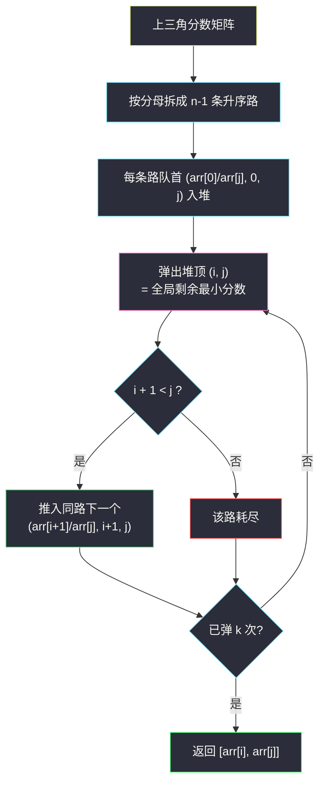
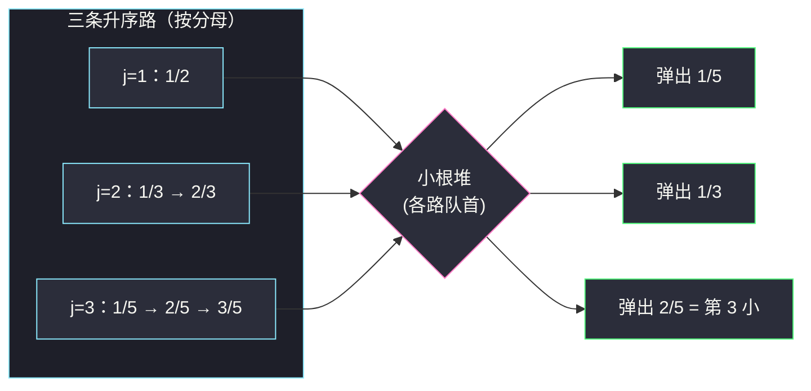

# 第 K 个最小的质数分数（多路归并小根堆 · 第 K 小）

## 一、问题描述

给你一个**按递增顺序排序**的质数数组 `arr`（元素互不相同），以及一个整数 `k`。

数组中 `i < j` 的每对下标 `(i, j)` 构成一个分数 `arr[i] / arr[j]`。请返回第 `k` 小的分数所对应的 **`[分子, 分母]`**。

> 🔗 LeetCode 786：https://leetcode.cn/problems/k-th-smallest-prime-fraction/
>
> 数据范围：`2 <= arr.length <= 1000`，`1 <= arr[i] <= 3 * 10^4`，`arr` 严格递增且全为质数，`1 <= k <= arr.length * (arr.length - 1) / 2`。

**示例 1**

```
输入：arr = [1,2,3,5], k = 3
输出：[2,5]
解释：所有分数排序后为
1/5, 1/3, 2/5, 1/2, 3/5, 2/3
第 3 小的是 2/5，返回 [2, 5]。
```

**示例 2**

```
输入：arr = [1,7], k = 1
输出：[1,7]
```

**直观理解**

所有分数摆成一张「上三角矩阵」：**固定分母一列看，分子越大分数越大**（分母不变、分子递增）。也就是说每个分母 `arr[j]` 对应一条**升序序列（一条「路」）**，全局第 k 小就在这些路的**归并流**里产生——标准的**多路归并取第 k 小**问题（灵神题单 §5.3）。

---

## 二、暴力解法

枚举全部 `n(n-1)/2` 个分数，排序后取第 `k` 个。分数不能化简（分子分母都是质数，且 `arr[0]` 可能是 1），直接用 `(分子, 分母)` 二元组参与排序，以**交叉相乘**作为比较依据。

```python
class Solution:
    def kthSmallestPrimeFraction(self, arr: List[int], k: int) -> List[int]:
        frs = []
        for i in range(len(arr)):
            for j in range(i + 1, len(arr)):
                frs.append((arr[i], arr[j]))
        frs.sort(key=lambda f: f[0] / f[1])     # 浮点排序，见 3.3 的精度讨论
        return list(frs[k - 1])
```

### 复杂度

- **时间**：`O(n² log n)`——生成约 `5 * 10^5` 个分数再全量排序。
- **空间**：`O(n²)`。

### 🔴 瓶颈在哪里

我们只想要第 `k` 小的**一个**分数，却把所有分数都生成、都排了序。`n = 1000` 时约 `5 * 10^5` 个元素、Python 内存与常数都偏紧。更关键的是浪费：**分数之间有结构**——固定分母内部分数已有序，这批「有序的路」正是多路归并的舞台。

---

## 三、优化探索（核心章节）

> 📚 本题在灵茶题单中属于 **§5.3 堆 · 第 K 小/大**。模板要点：**第 K 小可用堆扩展或多路归并**——把候选集合拆成若干条各自有序的「路」，每条路只把「下一个候选」放进小根堆，弹 k 次堆顶即得第 k 小。

### 3.1 把上三角拆成「每分母一条路」

对固定分母下标 `j`，候选分子是 `arr[0], arr[1], ..., arr[j-1]`，对应分数：

```
arr[0]/arr[j] < arr[1]/arr[j] < ... < arr[j-1]/arr[j]
```

——分母不变、分子递增 ⇒ 分数严格递增。于是有 `n - 1` 条路（`j = 1, 2, ..., n-1`），第 `j` 条路恰好有 `j` 个元素。全局第 k 小 = 这 `n - 1` 条升序路的**归并结果**的第 k 个。

### 3.2 归并：堆里永远只放每条路的「队首」

初始把每条路的第一个元素（即 `arr[0]/arr[j]`，记 `(值, i=0, j)`）入堆，堆大小 `n - 1`：

- 弹出堆顶 = 当前未取走的分数中最小者；
- 弹出 `(i, j)` 后，把它所在路的**下一个** `arr[i+1]/arr[j]` 入堆（若 `i + 1 < j` 还存在）；
- 第 `k` 次弹出的就是全局第 `k` 小。

为什么对：堆顶永远是「每条路剩余部分的最小值」中的最小值，即全局剩余最小——与归并排序多指针合并的论证完全一致。

### 3.3 浮点比较安全吗

堆里要比分数大小。直接存 `arr[i] / arr[j]` 的 double 有没有风险？做个定量分析：

- 任意两个**不同**分数 `a/b ≠ c/d`，其差 `|a/b - c/d| = |ad - bc| / (bd) >= 1 / (3 * 10^4)^2 ≈ 1.1e-9`（分子是正整数，至少差 1）；
- double 的相对误差约 `2^-52 ≈ 2.2e-16`，分数值不超过 1，单次除法绝对误差不超过 `2.2e-16`，两个商之差的误差不超过 `4.4e-16`。

误差比最小间距小**三个数量级**以上，本题数据范围内 double 比较绝不会翻转顺序。若追求绝对严谨（或数据更极端），可改用**交叉相乘**比较：`a/b < c/d ⟺ a*d < c*b`（见 Java 版 comparator，乘积 ≤ `9 * 10^8` 不溢出 int）。

### 3.4 副路线：二分答案 + 双指针计数

另一条 §5.3 通用路线：对答案 `x ∈ (0, 1)` 二分，统计 `cnt(x)` = 分数 ≤ x 的个数：

- `cnt(x)` 随 `x` 单调不减 → 具备二分性；
- 每次计数用双指针：`j` 从小到大扫分母，分子指针 `i` 单调不减（因为阈值 `x * arr[j]` 随 `j` 增大），一趟 `O(n)`；
- 找到最小 `x` 使 `cnt(x) >= k`；计数时顺带记录「≤ x 的最大分数」，收敛后它就是第 k 小。

由于分数间距 ≥ `1.1e-9`，二分约 50 次即可把区间压到远小于间距。这条路在「只需排名、不需实体」的题里（如 #668、#719）几乎是唯一选择，本题两条路都通，主解取更直观的多路归并。



### 3.5 一句话核心

> 每个分母一条升序路，堆中只放各路队首；第 k 次弹出的堆顶即第 k 小分数。

---

## 四、代码实现

### Python（主解：多路归并小根堆）

```python
import heapq

class Solution:
    def kthSmallestPrimeFraction(self, arr: List[int], k: int) -> List[int]:
        n = len(arr)
        h = [(arr[0] / arr[j], 0, j) for j in range(1, n)]   # 每条路的队首
        heapq.heapify(h)
        for _ in range(k - 1):                               # 先弹出前 k-1 个
            _, i, j = heapq.heappop(h)
            if i + 1 < j:                                    # 同路还有下一个分子
                heapq.heappush(h, (arr[i + 1] / arr[j], i + 1, j))
        _, i, j = h[0]                                       # 第 k 小：当前堆顶
        return [arr[i], arr[j]]
```

**变量含义**

| 变量 | 含义 |
|------|------|
| `h` | 三元组 `(分数值, 分子下标 i, 分母下标 j)` 的小根堆，大小 ≤ n-1 |
| `i + 1 < j` | 分子下标必须严格小于分母下标（`i < j` 的约束） |
| `h[0]` | 弹完 k-1 个后的堆顶，即第 k 小 |

**循环不变式**：任意时刻，堆中恰好保存「每条未耗尽的路的下一个候选分数」，堆顶即全局剩余最小。

**细节**：循环跑 `k - 1` 次而非 `k` 次，最后用 `h[0]` 偷看答案，省一次弹出；`(i, j)` 随分数一起存，弹出时才知道该往哪条路续推。

### Python（副解：二分答案 + 双指针计数）

```python
class Solution:
    def kthSmallestPrimeFraction(self, arr: List[int], k: int) -> List[int]:
        n = len(arr)
        lo, hi = 0.0, 1.0
        ans = [arr[0], arr[1]]
        for _ in range(50):                      # 区间压到远小于分数最小间距
            mid = (lo + hi) / 2
            cnt, i = 0, 0                        # i：分子指针，随 j 单调不减
            best = (0.0, 1, 1)                   # ≤ mid 的最大分数（值, 分子, 分母）
            for j in range(1, n):
                while i < j and arr[i] <= mid * arr[j]:
                    i += 1                       # [0, i) 都满足 arr[i]/arr[j] <= mid
                cnt += i
                if i > 0 and arr[i - 1] / arr[j] > best[0]:
                    best = (arr[i - 1] / arr[j], arr[i - 1], arr[j])
            if cnt >= k:                         # 第 k 小 <= mid，往左收敛
                hi = mid
                ans = [best[1], best[2]]
            else:
                lo = mid
        return ans
```

### Java（多路归并：交叉相乘比较器，彻底避开浮点）

```java
class Solution {
    public int[] kthSmallestPrimeFraction(int[] arr, int k) {
        int n = arr.length;
        PriorityQueue<int[]> pq = new PriorityQueue<>((a, b) ->
            arr[a[0]] * arr[b[1]] - arr[b[0]] * arr[a[1]]);     // (i, j)，交叉乘比较
        for (int j = 1; j < n; j++) pq.offer(new int[]{0, j});
        for (int t = 1; t < k; t++) {
            int[] p = pq.poll();
            if (p[0] + 1 < p[1]) pq.offer(new int[]{p[0] + 1, p[1]});
        }
        int[] p = pq.peek();
        return new int[]{arr[p[0]], arr[p[1]]};
    }
}
```

交叉乘 `arr[i1] * arr[j2] - arr[i2] * arr[j1]` 两项均 ≤ `9 * 10^8`，int 不溢出。

---

## 五、例子演示

### 例 1：arr = [1,2,3,5], k = 3

三条路（分母 2、3、5）各自升序：

| 路（分母） | 序列 |
|------------|------|
| j=1（/2） | 1/2 |
| j=2（/3） | 1/3 < 2/3 |
| j=3（/5） | 1/5 < 2/5 < 3/5 |

初始堆 = 三条路的队首：`(1/2, 0, 1)`、`(1/3, 0, 2)`、`(1/5, 0, 3)`。循环只执行 `k - 1 = 2` 次弹出，随后看堆顶即得第 k 小。逐步跟踪（堆内容按值序展示）：

| 轮 | 弹出堆顶 (i, j) | 分数值 | 推入同路下一个 | 操作后堆内容（值序） | 已确定的全局序 |
|----|------------------|--------|----------------|----------------------|----------------|
| 1 | (0, 3) | 1/5 = 0.20 | (1, 3)：2/5 | (1/3,0,2), (2/5,1,3), (1/2,0,1) | 第 1 小 = 1/5 |
| 2 | (0, 2) | 1/3 ≈ 0.33 | (1, 2)：2/3 | (2/5,1,3), (1/2,0,1), (2/3,1,2) | 第 2 小 = 1/3 |
| 看堆顶 | (1, 3)（不弹出） | 2/5 = 0.40 | — | 堆顶 = (2/5, 1, 3) | **第 3 小 = 2/5** |

循环弹完 2 次后堆顶为 `(2/5, 1, 3)`，返回 `[arr[1], arr[3]] = [2, 5]` ✓

**为什么第 1 次弹出的一定是 1/5**：堆中三元素是各路队首，也是各路剩余部分的最小值，堆顶 = 最小值中的最小 = 全局最小。弹出后同路补位，论证逐轮成立。

### 例 2：arr = [1,7], k = 1

只有一条路 `j = 1`，初始堆 = `(1/7, 0, 1)`。`k - 1 = 0` 次循环，直接看堆顶 → 返回 `[1, 7]` ✓

### 二分答案路线在同例上的快照

以 `mid = 0.45` 为例：`j=1`（分母 2）：`1 <= 0.45*2 = 0.9`? 否 → `cnt += 0`；`j=2`（分母 3）：`1 <= 1.35` ✓ → `i=1`，`cnt += 1`（分数 1/3）；`j=3`（分母 5）：阈值 2.25，`1 <= 2.25` ✓、`2 <= 2.25` ✓、`3 <= 2.25` 否 → `cnt += 2`。合计 `cnt(0.45) = 3 >= k = 3` → 答案 ≤ 0.45，同时记录到 ≤ 0.45 的最大分数 2/5 → `[2, 5]` ✓



---

## 六、复杂度分析

| 方法 | 时间 | 空间 | 说明 |
|------|------|------|------|
| 暴力全排序 | `O(n² log n)` | `O(n²)` | 生成所有分数 |
| **多路归并堆** | `O((n + k) log n)` | `O(n)` | 建堆 `O(n)`；弹 k 次各 `O(log n)`，第 k 小早出即停 |
| 二分 + 计数 | `O(n log(1/ε))` | `O(1)` | 约 50 轮，每轮双指针 `O(n)` |

多路归并最坏 `k = n(n-1)/2` 时退化为 `O(n² log n)`，与暴力同阶但常数小、且第 k 小往往远早于全部弹出；空间从 `O(n²)` 降到 `O(n)` 是实打实的收益。

---

## 七、对比总结

**「第 K 小/大」两大流派（§5.3）**

| 流派 | 通用姿势 | 适用信号 |
|------|----------|----------|
| 堆（多路归并 / 大小为 k 的堆） | 候选拆成有序路，堆放各路队首，弹 k 次 | 候选有**内部顺序结构**，或只需前 k 个 |
| 二分答案 + 计数 | 对值域二分，`O(n)` 计数 ≤ mid 的个数 | 只需排名即可判定，值域可二分 |

本题两条路都通，是绝佳的对照练习。

**易错点**

1. **`i + 1 < j` 的边界**：分子下标必须严格小于分母下标，等号出现就会把 `arr[j]/arr[j] = 1` 这类非法分数混进来。
2. **弹 k-1 次看堆顶**：不是弹 k 次（弹空最后一条路会 IndexError / 空堆异常）。
3. **浮点比较**：本题数据范围内 double 安全（见 3.3 定量分析），但不经思考地到处用浮点比较分数是坏习惯——Java 用交叉乘比较器更稳。
4. **返回的是 [分子, 分母] 原值**，不是下标、不是约分后的值（质数保证天然最简）。

**模板（多路归并取第 k 小）**

```python
h = [(路首值, 路号, 路内指针) for 每条路]
heapify(h)
for _ in range(k - 1):
    _, r, p = heappop(h)
    if 路r还有 p + 1:
        heappush(h, (下一个值, r, p + 1))
return h[0]
```

---

## 八、举一反三

| 题目 | 关系 |
|------|------|
| [373. 查找和最小的 K 对数字](https://leetcode.cn/problems/find-k-pairs-with-smallest-sums/) | 多路归并取第 k 小的正名题：两有序数组配对，一路一指针，结构完全同构 |
| [378. 有序矩阵中第 K 小元素](https://leetcode.cn/problems/kth-smallest-element-in-a-sorted-matrix/) | 每行一路的归并，或二分 + 计数（按行单调统计 ≤ mid） |
| [668. 乘法表中第 K 小的数](https://leetcode.cn/problems/kth-smallest-number-in-multiplication-table/) | 值域巨大、实体无穷 → 只能二分 + 每行 `⌊mid / j⌋` 计数 |
| [719. 找出第 K 小的数对距离](https://leetcode.cn/problems/find-k-th-smallest-pair-distance/) | 二分距离 + 双指针计数，与本题副解同宗 |
| [1439. 有序矩阵中的第 k 个最小数组和](https://leetcode.cn/problems/find-the-kth-smallest-sum-of-a-matrix-with-sorted-rows/) | 多路归并的两两扩展：逐行归并保留前 k 个候选 |
| [878. 第 N 个神奇数字](https://leetcode.cn/problems/nth-magical-number/) | §5.3 相邻的二分答案·第 K 小，容斥计数，见同目录 `nth-magical-number.md` |
| [1201. 丑数 III](https://leetcode.cn/problems/ugly-number-iii/) | 同上：二分 + 容斥，见同目录 `ugly-number-iii.md` |
| [1738. 找出第 K 大的异或坐标值](https://leetcode.cn/problems/find-kth-largest-xor-coordinate-value/) | 第 K 大的排序/堆路线对照，见同目录 `find-kth-largest-xor-coordinate-value.md` |

**思想迁移**

- 看到「**所有配对/组合中的第 k 小**」先问两件事：候选举能否拆成有序的**路**（能 → 堆归并）；只知排名能否快速**计数**（能 → 二分答案）。
- 浮点参与比较前，先估算「最小间距 vs 机器精度」的数量级差，本题是 `1.1e-9` 对 `4.4e-16`，安全余量充足。
- 口诀：**「分母为路分子进，堆存队首弹 k 停；嫌慢二分来计数，交叉相乘最放心。」**
