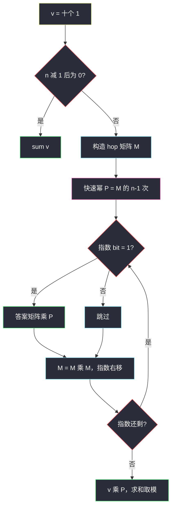
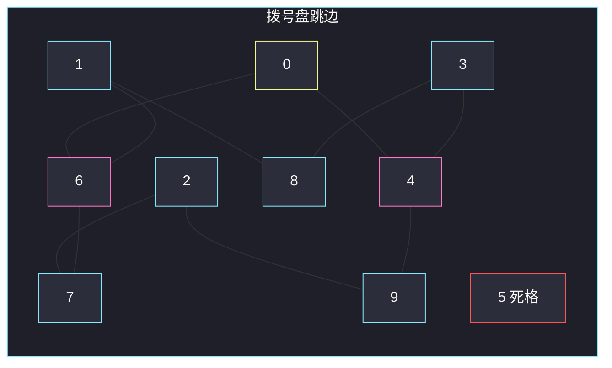

# 935. 骑士拨号器（Knight Dialer）

> 题目来源：[https://leetcode.cn/problems/knight-dialer/](https://leetcode.cn/problems/knight-dialer/)
>
> 灵茶题单小节定位：§11.6 矩阵快速幂优化 DP

## 一、问题描述

象棋骑士走「日」字：横 1 竖 2，或横 2 竖 1。电话拨号盘如下（骑士只能停在数字格，不能停 `*` / `#`）：

```text
1 2 3
4 5 6
7 8 9
  0
```

把骑士放在任意数字格作为第 1 位，再走 n−1 次合法跳跃，得到长度为 n 的号码。求不同号码的个数，对 `10^9+7` 取模。

**数据范围**：

- `1 <= n <= 5000`

**示例 1**：

```text
输入：n = 1
输出：10
解释：长度为 1，十个数字格都可以当号码。
```

**示例 2**：

```text
输入：n = 2
输出：20
解释：合法两位数为
[04,06,16,18,27,29,34,38,40,43,49,60,61,67,72,76,81,83,92,94]
共 20 个。
```

**示例 3**：

```text
输入：n = 3131
输出：136006598
解释：注意取模。
```

**核心思考点**：号码的下一位只取决于当前数字，是 10 个点上的常系数线性递推。先写 `f[i][d]` = 长度 i、以 d 结尾的个数，`O(n)` 过 5000；再把转移收成 10×10 矩阵，`M^{n-1}` 用快速幂压到 `O(log n)`——这就是 §11.6 的模板题。5 是死格：跳不进也跳不出，n ≥ 2 时贡献为 0。

## 二、暴力解法

### 思路

从 10 个起点分别 DFS：还剩 `left` 步、当前在 `d`，枚举 hop 邻居。无记忆化时搜索树大小约为答案本身，n 稍大即爆。

### 代码

```python
HOPS = [
    [4, 6], [6, 8], [7, 9], [4, 8], [0, 3, 9],
    [], [0, 1, 7], [2, 6], [1, 3], [2, 4],
]

def knightDialerBrute(n: int) -> int:
    def dfs(left: int, d: int) -> int:
        if left == 0:
            return 1
        return sum(dfs(left - 1, nxt) for nxt in HOPS[d])
    return sum(dfs(n - 1, d) for d in range(10)) % (10**9 + 7)
```

### 复杂度

- 时间：指数级（每个状态的出度约 2）。
- 空间：`O(n)` 递归栈。

n = 5000 完全不可用。加 `@cache` 就变成下面的 DP，说明「重复子问题」已经呼之欲出。

## 三、优化探索

### 3.1 邻接表 DP：长度 × 末位 ⭐

拨号盘上骑士的跳边是固定的：

| 当前 | 可跳到 |
|---|---|
| 0 | 4, 6 |
| 1 | 6, 8 |
| 2 | 7, 9 |
| 3 | 4, 8 |
| 4 | 0, 3, 9 |
| 5 | （无） |
| 6 | 0, 1, 7 |
| 7 | 2, 6 |
| 8 | 1, 3 |
| 9 | 2, 4 |

```text
f[1][d] = 1                          每个数字当开头
f[i][j] = Σ f[i-1][d]   （d 能跳到 j）
答案 Σ_d f[n][d]  mod 10^9+7
```

滚动掉长度维，只要 10 个数。n = 5000 时 5000×约 20 条边，轻松。

### 3.2 线性递推 ⇒ 矩阵快速幂 ⭐⭐

把 10 维向量 `v_i = (f[i][0], …, f[i][9])` 写成：

```text
v_i = v_{i-1} · M
```

其中 `M[d][j] = 1` 当且仅当从 d 能一步跳到 j（否则 0）。于是：

```text
v_n = v_1 · M^{n-1}
v_1 = (1,1,…,1)
```

`M^{n-1}` 用二进制快速幂：奇数乘进答案、底数自乘、指数右移，矩阵乘法手写 10×10，**不要 numpy**。n 从 5000 降到 `log(5000) ≈ 12` 次平方，再乘上 `10³` 的乘法。本题 n 的上限其实还撑得住 `O(n)`，模板意义在于：同一套代码在 n 到 10¹⁸ 时仍然 `O(log n)`。



跳边示意（5 为孤立点）：



**核心一句**：有限状态线性递推打包成矩阵，长度 n 变成底数的 n−1 次幂。

## 四、代码实现

### 主解：手写 10×10 矩阵快速幂

```python
MOD = 10**9 + 7
HOPS = [
    [4, 6], [6, 8], [7, 9], [4, 8], [0, 3, 9],
    [], [0, 1, 7], [2, 6], [1, 3], [2, 4],
]

def mul(A, B):
    n = 10
    C = [[0] * n for _ in range(n)]
    for i in range(n):
        for k in range(n):
            aik = A[i][k]
            if aik == 0:
                continue
            for j in range(n):
                C[i][j] = (C[i][j] + aik * B[k][j]) % MOD
    return C

def power(A, e):
    n = 10
    R = [[1 if i == j else 0 for j in range(n)] for i in range(n)]
    while e:
        if e & 1:
            R = mul(R, A)
        A = mul(A, A)
        e >>= 1
    return R

class Solution:
    def knightDialer(self, n: int) -> int:
        if n == 1:
            return 10
        M = [[0] * 10 for _ in range(10)]
        for d, nxts in enumerate(HOPS):
            for j in nxts:
                M[d][j] = 1                  # 行 d 跳到列 j
        P = power(M, n - 1)
        ans = 0
        for i in range(10):                  # v1 全 1，Σ_{i,j} P[i][j]
            for j in range(10):
                ans = (ans + P[i][j]) % MOD
        return ans
```

### 对照：邻接表滚动 DP（默写更短，n ≤ 5000 足够）

```python
class Solution:
    def knightDialer(self, n: int) -> int:
        f = [1] * 10
        for _ in range(n - 1):
            g = [0] * 10
            for d in range(10):
                for nxt in HOPS[d]:
                    g[nxt] = (g[nxt] + f[d]) % MOD
            f = g
        return sum(f) % MOD
```

### 细节说明

- **方向不要反**：`M[d][j] = 1` 表示 d → j。若改成列向量左乘，矩阵要转置，两种约定选一种写到底。
- **n = 1 特判**：`M^0 = I`，Σ I 的元素 = 10，不特判也对；写出来更直观。
- **5 的一行一列全 0**：它既不是任何人的后继，也没有后继。
- **乘法里 `% MOD`**：中间积最大 10×(MOD−1)²，Python int 无溢出，其它语言要用 64 位。
- **不要用 numpy**：题单要求手写，面试也是手写 10×10。

## 五、例子演示

**n = 1**：十个格子各 1 种，和 = 10。

**n = 2**：`v2 = v1 · M`，`v2[j]` = 有几条边指向 j。边数一共 20（表格里除 5 外每个点的出度之和），与官方 20 个两位数一致。逐格：

| 结尾 | 谁能一步跳到它 | 个数 |
|---|---|---|
| 0 | 4, 6 | 2 |
| 1 | 6, 8 | 2 |
| 2 | 7, 9 | 2 |
| 3 | 4, 8 | 2 |
| 4 | 0, 3, 9 | 3 |
| 5 | — | 0 |
| 6 | 0, 1, 7 | 3 |
| 7 | 2, 6 | 2 |
| 8 | 1, 3 | 2 |
| 9 | 2, 4 | 2 |

2+2+2+2+3+0+3+2+2+2 = **20**。

**n = 3 逐步**（由 n = 2 再跳一次，取模前后相同）：

| d | 转移来源 | f3[d] |
|---|---|---|
| 0 | f2[4]+f2[6] = 3+3 | 6 |
| 1 | 3+2 | 5 |
| 2 | 2+2 | 4 |
| 3 | 3+2 | 5 |
| 4 | 2+2+2 | 6 |
| 5 | 0 | 0 |
| 6 | 2+2+2 | 6 |
| 7 | 2+3 | 5 |
| 8 | 2+2 | 4 |
| 9 | 2+3 | 5 |

和 = 46。可手数几条：例如 `040, 060, 160, …`。

**n = 3131**：矩阵快速幂与滚动 DP 对拍均为 **136006598**，与官方示例 3 一致。

## 六、复杂度分析

状态数 Σ = 10：

- **滚动 DP**：时间 `O(n · Σ)`（准确说是 `O(n · 边数)`），空间 `O(Σ)`。
- **矩阵快速幂（主解）**：时间 `O(Σ³ · log n)`，空间 `O(Σ²)`。n = 5000 时后者常数更大，n 到 10¹⁸ 时必须用它。

## 七、对比总结

| 维度 | 暴力 DFS | 滚动 DP | 矩阵快速幂 |
|---|---|---|---|
| 时间 | 指数 | `O(n)` | `O(log n)`（含 10³） |
| n=5000 | 不可用 | 首选提交 | 模板练习 |
| n=10¹⁸ | — | 超时 | 正解 |

**易错点**：

1. **漏掉 4 ↔ 0、6 ↔ 0**：0 只与 4、6 相连，不是与 8。
2. **以为 5 能跳到某处**：拨号盘中间的 5，日字全落在盘外。
3. **模忘了**：n = 3131 的答案已经超过 10⁹。
4. **快速幂指数写成 n 而不是 n−1**：多跳一次，n=1、n=2 样例会立刻爆。
5. **矩阵行列约定中途反转**：乘出来每个位置差一个转置，总和不一定还能蒙对。

**套路归纳**：有限个状态、每步同一张转移图 → 先写邻接 DP 验证样例，再打包矩阵。斐波那契、爬楼梯、染色递推都是 2×2 / 3×3 的缩水版。

## 八、举一反三

1. **[509. 斐波那契数](https://leetcode.cn/problems/fibonacci-number/)**：2×2 矩阵幂的最小实例。
2. **[70. 爬楼梯](https://leetcode.cn/problems/climbing-stairs/)**：同一套 `[[1,1],[1,0]]^{n}`。
3. **[1411. 给 N×3 网格图涂色的方案数](https://leetcode.cn/problems/number-of-ways-to-paint-n-3-grid/)**：合法行状态之间的转移矩阵，n 可达 5000，与本题同型。
4. **[1220. 统计元音字母序列的数目](https://leetcode.cn/problems/count-vowels-permutation/)**：5 个字母的邻接递推 + 矩阵幂。
5. **[552. 学生出勤记录 II](https://leetcode.cn/problems/student-attendance-record-ii/)**：把「末尾连续 A/L」压进状态后同样可矩阵化。

**同族互引**：本批 `number-of-dice-rolls-with-target-sum.md` 是另一类计数 DP（背包型，不能直接矩阵化，除非 k 固定且转移对和是平移）。本题的关键是**转移与步数无关、只与当前数字有关**。
