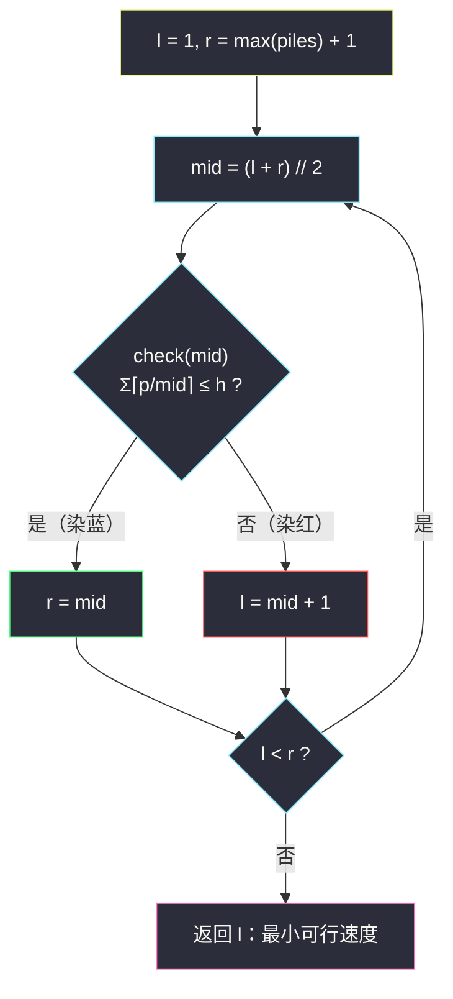

# 爱吃香蕉的珂珂（二分答案 · 求最小）

## 一、问题描述

珂珂喜欢吃香蕉。这里有 `n` 堆香蕉，第 `i` 堆有 `piles[i]` 根。警卫将在 `h` 小时后回来。

珂珂可以决定她吃香蕉的速度 `k`（单位：根/小时）。每个小时，她会**选择一堆香蕉，从中吃掉 `k` 根**；如果这堆香蕉少于 `k` 根，她就会吃掉这堆的所有香蕉，**这一小时内不会再吃其他堆**。

求使得她在警卫回来前**吃掉所有香蕉的最小速度 `k`**。

> 🔗 LeetCode 875：https://leetcode.cn/problems/koko-eating-bananas/
>
> 数据范围：`1 <= piles.length <= 10^4`，`piles.length <= h <= 10^9`，`1 <= piles[i] <= 10^9`。

**示例**

```
输入：piles = [3,6,7,11], h = 8
输出：4

输入：piles = [30,11,23,4,20], h = 5
输出：30

输入：piles = [30,11,23,4,20], h = 6
输出：23
```

**直观理解**

注意题目问的不是「哪个下标」而是「速度是几」——答案的候选是 `[1, max(piles)]` 里的一个整数。这就是灵神所说的**二分答案**：不去二分数组，而是直接**在答案的取值范围上二分**，每猜一个候选值，用 `O(n)` 的 check 去验证。它是 §2.1「求最小」家族的招牌题。

---

## 二、暴力解法

从 `k = 1` 开始逐个速度试：对每个 `k` 累加每堆耗时，第一次满足总耗时 ≤ h 的 `k` 就是答案。

```python
class Solution:
    def minEatingSpeed(self, piles: List[int], h: int) -> int:
        k = 1
        while True:
            hours = sum((p + k - 1) // k for p in piles)   # ⌈p/k⌉ 求和
            if hours <= h:
                return k
            k += 1
```

### 复杂度

- **时间**：`O(n * maxPile)`，最坏 `10^4 * 10^9 = 10^13` 量级，必然超时。
- **空间**：`O(1)`。

### 🔴 瓶颈在哪里

一个一个试速度太笨了：速度可行与否在数轴上是**一刀切**的结构，完全可以用二分把「逐个试」换成「折半试」。

---

## 三、优化探索（核心章节）

> 📚 本题在灵茶题单中属于 **§2.1 求最小**（二分答案）。模板与 §1.1 基础二分（见同批 `search-insert-position.md`）完全一致，只是 `check` 从「比较数组元素」换成了「模拟吃香蕉」。

### 3.1 关键观察：check 关于 k 单调

设 `f(k) = Σ ⌈piles[i]/k⌉`（速度 `k` 时吃完所需的总小时数）：

- `k` 越大 → 每堆耗时 `⌈p/k⌉` 越小（或不变）→ `f(k)` **单调不增**；
- 于是「`f(k) <= h`」在速度轴上呈**左假右真**：慢速吃不完（红），快速能吃完（蓝），中间只有一个分界点。

**要的答案 = 最小的蓝色 k**——标准的「求满足 check 的最小值」。


「单调」是二分答案的**入场券**：凡是「能力/资源越大越容易达成目标」的问题，都可以套这个框架。§2.1 的四道题（本篇、#1283、#2187、#1011）全部满足。

### 3.2 check 怎么写：向上取整

一堆有 `p` 根、速度 `k`，吃完这堆需要 `⌈p / k⌉` 小时（吃不满 k 根的那一小时也算 1 小时）。整数写法：

```
⌈p / k⌉ = (p + k - 1) // k
```

于是：

```python
def check(k: int) -> bool:
    return sum((p + k - 1) // k for p in piles) <= h
```

**上界为什么取 `max(piles)`**：当 `k = max(piles)` 时每堆耗时都是 1，总耗时 = `n`；而题目保证 `h >= piles.length = n`，所以 `check(max(piles))` **一定为真**——上界处必为蓝色，答案必然落在 `[1, max(piles)]` 内，可以放心 `r = max(piles) + 1`。

### 3.3 统一模板（求最小）

```
求满足 check(x) 的最小 x（红蓝染色）：
    l = 下界, r = 上界 + 1          # 候选区间左闭右开 [l, r)
    while l < r:
        mid = (l + r) // 2
        if check(mid): r = mid       # mid 蓝：可行，收缩右界
        else:          l = mid + 1   # mid 红：不可行，收缩左界
    答案 = l                         # l == r，最左蓝
```

循环不变量：`l` 左边全红、`r` 右边（含 `r`）全蓝，未染色区间每轮至少减半。



### 3.4 一句话核心

> **「h 小时内吃完」对速度 k 左假右真 → 在 `[1, max(piles)]` 上跑「求最小」红蓝模板，check = Σ⌈p/k⌉ ≤ h。**

---

## 四、代码实现

### Python（主解）

```python
class Solution:
    def minEatingSpeed(self, piles: List[int], h: int) -> int:
        def check(k: int) -> bool:
            # 速度 k 时吃完所有香蕉的总小时数是否 <= h
            return sum((p + k - 1) // k for p in piles) <= h

        l, r = 1, max(piles) + 1          # 答案 ∈ [1, max(piles)]，check(max) 必真
        while l < r:
            mid = (l + r) // 2
            if check(mid):
                r = mid                   # mid 及更快都能吃完
            else:
                l = mid + 1               # mid 吃不完，更慢更不行
        return l
```

**变量含义**

| 变量 | 含义 |
|------|------|
| `k` / `mid` | 猜测的吃速（根/小时） |
| `(p + k - 1) // k` | 吃完一堆 `p` 根所需小时 `⌈p/k⌉` |
| `l` | 红区右边界：比它慢的速度都吃不完 |
| `r` | 蓝区左边界：它及更快的速度都能吃完 |
| 返回值 `l` | 能在 h 小时内吃完的最小速度 |

**为什么速度不需要超过 `max(piles)`**：再快也只能一堆一小时，`k = max(piles)` 已达到总耗时下界 `n`。

### Java（最优解同款写法）

```java
class Solution {
    public int minEatingSpeed(int[] piles, int h) {
        int l = 1, r = 1;
        for (int p : piles) {
            r = Math.max(r, p);
        }
        r += 1;                                // 答案 ∈ [1, max]，r = max + 1
        while (l < r) {
            int mid = l + (r - l) / 2;         // 防溢出写法
            if (check(piles, mid, h)) {
                r = mid;
            } else {
                l = mid + 1;
            }
        }
        return l;
    }

    // 速度 k 的总耗时是否 <= h
    private boolean check(int[] piles, int k, int h) {
        long hours = 0;                        // piles[i] 可达 1e9，求和必须用 long
        for (int p : piles) {
            hours += (p + k - 1) / k;          // ⌈p/k⌉
        }
        return hours <= h;
    }
}
```

**Java 易错**：`piles[i] <= 10^9`，`n <= 10^4`，耗时求和最大约 `10^13`，直接用 `int` 累加会溢出，必须 `long`。

---

## 五、具体例子演示

以 `piles = [3,6,7,11]`、`h = 8` 端到端走一遍。`max(piles) = 11`，初始 `l = 1`，`r = 12`。

每轮 check 明细：`⌈3/mid⌉ + ⌈6/mid⌉ + ⌈7/mid⌉ + ⌈11/mid⌉`。

| 轮次 | l | r | mid | 四堆耗时 | 总和 | ≤ 8 ? | 染色 | 动作 |
|------|---|---|-----|----------|------|-------|------|------|
| 1 | 1 | 12 | 6 | 1 + 1 + 2 + 2 | 6 | ✓ | 蓝 | `r = 6` |
| 2 | 1 | 6 | 3 | 1 + 2 + 3 + 4 | 10 | ✗ | 红 | `l = 4` |
| 3 | 4 | 6 | 5 | 1 + 2 + 2 + 3 | 8 | ✓ | 蓝 | `r = 5` |
| 4 | 4 | 5 | 4 | 1 + 2 + 2 + 3 | 8 | ✓ | 蓝 | `r = 4` |

`l == r == 4`，循环结束，返回 **4** ✓。

**验证「最小」**：速度 4 时总耗时恰为 8 = h，能吃完；速度 3 时总耗时 10 > 8，吃不完——分界点确实在 4。

**再看示例 3**：`piles = [30,11,23,4,20]`、`h = 6`，答案是 23。

- `check(23)`：⌈30/23⌉ + ⌈11/23⌉ + ⌈23/23⌉ + ⌈4/23⌉ + ⌈20/23⌉ = 2+1+1+1+1 = **6 ≤ 6** ✓（蓝）
- `check(22)`：⌈30/22⌉ + ⌈11/22⌉ + ⌈23/22⌉ + 1 + 1 = 2+1+**2**+1+1 = **7 > 6** ✗（红）

23 是最左蓝 ✓。二分只会花约 `log2(30) ≈ 5` 轮就锁定它，而暴力要从 1 试到 23。

---

## 六、复杂度分析

| 方法 | 时间 | 空间 | 说明 |
|------|------|------|------|
| 暴力递增 | `O(n * m)`，m = max(piles) | `O(1)` | `10^13` 量级超时 |
| 二分答案 | `O(n log m)` | `O(1)` | `log2(10^9) ≈ 30`，约 `3 * 10^5` 次运算 |

---

## 七、对比总结

**§2.1「求最小」四连的 check 对照**（后三道见同批题解）：

| 题 | 二分对象 | check 内容 | 单调方向 |
|----|----------|-----------|----------|
| #875 珂珂（本篇） | 速度 k | Σ⌈p/k⌉ ≤ h | k 越大耗时越小 |
| #1283 最小除数 | 除数 d | Σ⌈x/d⌉ ≤ threshold | 与本篇完全同构 |
| #2187 最少时间 | 时间 t | Σ⌊t/time⌋ ≥ totalTrips | t 越大趟数越多 |
| #1011 送包裹 | 载重 cap | 贪心装载天数 ≤ days | cap 越大天数越少 |

**易错点**

1. **向上取整**必须写对：`(p + k - 1) // k`；写成 `p // k` 会漏掉吃剩尾巴的那一小时，答案偏小。
2. 上界取 `max(piles)` 就够，别写成 `sum(piles)`（能过但多跑无谓轮次）；下界是 1 而不是 0（速度为 0 永远吃不完，`⌈p/0⌉` 直接除零）。
3. Java 求和用 `long`。
4. `check` 里是 `<= h`（条件越小越苛刻），而 #2187 是 `>=`（条件越大越达标）——**check 的方向变了，但「求最小」的模板一行都不用改**，变的只是染色的含义。

**模板（求最小，Python 版）**

```python
def smallest_ok(check, lo, hi):        # 答案 ∈ [lo, hi]，check(hi) 必真
    l, r = lo, hi + 1
    while l < r:
        mid = (l + r) // 2
        if check(mid): r = mid
        else:          l = mid + 1
    return l
```

---

## 八、举一反三

| 题目 | 关系 |
|------|------|
| [1283. 使结果不超过阈值的最小除数](https://leetcode.cn/problems/find-the-smallest-divisor-given-a-threshold/) | **同构姊妹题**：把「吃香蕉」换成「除法取整求和」，见同批 `find-the-smallest-divisor-given-a-threshold.md` |
| [2187. 完成旅途的最少时间](https://leetcode.cn/problems/minimum-time-to-complete-trips/) | check 方向反转成 `>=` 的同族题，见同批 `minimum-time-to-complete-trips.md` |
| [1011. 在 D 天内送达包裹的能力](https://leetcode.cn/problems/capacity-to-ship-packages-within-d-days/) | check 从求和升级成贪心，见同批 `capacity-to-ship-packages-within-d-days.md` |
| [1870. 准时抵达的列车最小时速](https://leetcode.cn/problems/minimum-speed-to-arrive-on-time/) | 同小节：二分时速，check 里对每段路程向上取整求和 |
| [2594. 修车的最少时间](https://leetcode.cn/problems/minimum-time-to-repair-cars/) | 二分总时间 t，check 里出现 `⌈t / rank⌉` 的平方根，取整照样要小心 |
| [410. 分割数组的最大值](https://leetcode.cn/problems/split-array-largest-sum/) | 「最大值最小化」经典 Hard，二分「最大段和」，check 也是贪心 |

**思想迁移**

- 看到问「**最小的 x 使得某个总量不超标**」，先证单调，再套求最小模板。
- check 的开销决定复杂度：`O(n)` 的 check × `O(log m)` 轮 = `O(n log m)`。
- 口诀：**「答案有范围，猜中点验一遍；真往左收，假往右赶；收敛处，最小见。」**
