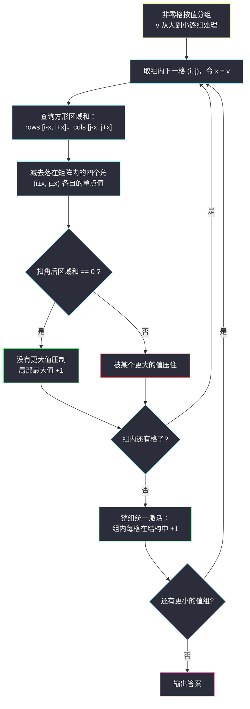

# 矩阵中的局部最大值 II（离线按值分组 + 二维树状数组）

## 一、问题描述

给你一个 `n x m` 的**非负整数矩阵** `matrix`。每个**非零**单元格按如下方式检查附近：

- 令 `x = matrix[row][col]`；
- 考虑所有与 `(row, col)` 的**行距离和列距离都 ≤ x** 的单元格（即切比雪夫距离 ≤ x 的方形区域），忽略矩阵外的部分；
- 再忽略**行列距离都恰好等于 x** 的四个角上的格子；
- 若考虑的单元格中没有一个值**大于 x**，则该单元格是**局部最大值**。

返回局部最大值的数量。

> 🔗 LeetCode 3933：https://leetcode.cn/problems/largest-local-values-in-a-matrix-ii/
>
> 数据范围：`n, m <= 500`，`0 <= matrix[i][j] <= 1000`（值域量级 1e3）。
> 题面较新，下文以自编样例演示，方法签名以官网为准。

**自编演示示例**

```
输入：matrix = [[0,0,0],
               [0,1,0],
               [0,0,0]]
输出：1
解释：唯一非零格 (1,1) 值为 1，检查区域是以它为中心的 3x3 方形去掉四个角
      —— 实际是上下左右四格（(0,1),(2,1),(1,0),(1,2)），值全为 0，
      没有值大于 1，是局部最大值，答案为 1。
```

**直观理解**：每个非零格的「附近」是以自己为中心、边长 `2x+1` 的正方形**挖掉四个顶点**。判定就是一句话——这个「去角方形」里有没有**严格更大**的值。注意四个角被刻意豁免：哪怕角上蹲着一个巨无霸，只要它行、列距离都**恰好**等于 x，就不算压住自己。

---

## 二、暴力解法

按题面直接模拟：对每个非零格，把它的检查区域扫一遍，看有没有值更大的格子：

```python
class Solution:
    def largestLocalValues(self, matrix: List[List[int]]) -> int:
        n, m = len(matrix), len(matrix[0])
        ans = 0
        for i in range(n):
            for j in range(m):
                x = matrix[i][j]
                if x == 0:                       # 零格不参与判定
                    continue
                ok = True
                for r in range(max(0, i - x), min(n - 1, i + x) + 1):
                    for c in range(max(0, j - x), min(m - 1, j + x) + 1):
                        if abs(r - i) == x and abs(c - j) == x:
                            continue             # 四个角被豁免
                        if matrix[r][c] > x:     # 有更大的值压住自己
                            ok = False
                if ok:
                    ans += 1
        return ans
```

### 复杂度

- **时间**：单个格子的检查区域最坏是整个矩阵（x 很大时被矩阵边界裁剪），即 `O(nm)`；共 `nm` 个格子 → 总 `O((nm)²)`，`500 * 500 = 2.5 * 10^5` 个格子，平方后约 `6 * 10^10`，必然超时。
- **空间**：`O(1)`。

### 🔴 瓶颈在哪里

每个格子真正需要的只是一个**布尔答案**：「区域内是否存在值严格更大的格子」。暴力却在为每个格子反复数格子——`nm` 个询问 × 每次 `O(nm)` 的扫描，全是重复劳动。经典的「多询问、查询形状规则」局面，该让预处理出场了。

---

## 三、优化探索（核心章节）

> 📚 本题在灵茶题单中归属 **§8.7 ST 表（Sparse Table）** 一族——「静态数据上把区间查询做到极快」的思想。但本题不是普通 RMQ：查询区域随格子自身的值变化，且判定对象是「值更大的格子」这个**逐步加入**的集合。于是我们把 §8.7 的「预处理换查询」改造成**离线按值分组 + 二维树状数组**，与 ST 表 / 线段树的取舍见 §3.2。

### 3.1 关键观察：按值从大到小处理，「判定时眼里只有更大的格子」

判定格 `(i, j)`（值为 v）时，我们只关心一件事：**去角方形区域内是否存在值 > v 的格子**。

把所有非零格按值**从大到小**分组处理，维护一个「已激活集合」：

- 处理组 v 时，集合里恰好是所有**值 > v** 的格子（更早的组都已激活）；
- 于是「区域内有没有更大的值」变成「**区域内已激活格子的个数是否为 0**」——一个纯计数问题！

同一组内（值都等于 v）**互不影响**：压制条件是「严格大于」，同值的邻居不算数。所以每组**先让所有格子判定、再统一激活**即可，顺序天然正确。



### 3.2 数据结构选型：为什么是二维树状数组

现在的问题是「单点 +1」和「矩形内求和」两种操作交替出现：

| 候选结构 | 单点修改 | 矩形求和 | 适配本题？ |
|----------|----------|----------|------------|
| 二维前缀和 | `O(nm)` 重建 | `O(1)` | 激活次数可达 `nm` 次，重建太贵 |
| ST 表（§8.7 主角） | 不支持 | `O(1)`（静态 RMQ） | **静态不可改**，直接出局 |
| 二维线段树 | `O(log n log m)` | `O(log n log m)` | 可以，但代码量大一圈 |
| **二维树状数组** | `O(log n log m)` | `O(log n log m)`（四次前缀查） | **本题标准解** |

顺带把 §8.7 的 ST 表模板要点放在这里对照（一维 RMQ）：`st[i][j]` 表示从下标 i 起、长 `2^j` 这一段的最值，由**两个长 `2^(j-1)` 的子段合并**而来——

```
st[i][j] = combine(st[i][j-1], st[i + 2^(j-1)][j-1])
预处理 O(n log n)；查询 [l, r] 取 k = ⌊log2(r-l+1)⌋，
combine(st[l][k], st[r - 2^k + 1][k])，O(1)。
```

ST 表的杀手锏是「两个可重叠子段拼出任意区间」，代价是**建好就锁死**。本题是「边插入边查询」的离线流程，插入是刚需 → 树状数组登场。这也是灵神数据结构篇反复强调的选型直觉：**静态区间最值上 ST 表，带修改的区间和上树状数组**。

### 3.3 四个角怎么扣：方形和减四个单点

记激活格 `(i, j)` 的检查区域为 `rows [i-x, i+x] x cols [j-x, j+x]`（先裁剪到矩阵内）。四个角是 `(i-x, j-x)`、`(i-x, j+x)`、`(i+x, j-x)`、`(i+x, j+x)`：

- 若某角在矩阵内，它必然落在裁剪后的方形里（行、列距离都恰为 x ≤ x）；
- 「去角方形和 = 方形区域和 − 四个角的单点值（仅统计在矩阵内的）」。

单点值同样用树状数组的 `rect(同一点, 同一点)` 查询，与区域和共用一套代码。

### 3.4 一句话核心

> **把「有没有更大的值在附近」翻译成「按值降序逐组激活时，去角方形里的激活计数是否为 0」——离线分组 + 二维树状数组，查询、激活各 `O(log n log m)`。**

---

## 四、代码实现

### Python（主解：按值分组 + 二维树状数组）

```python
from collections import defaultdict
from typing import List


class BIT2D:
    """二维树状数组：单点加 + 前缀矩形和，下标从 1 开始。"""

    def __init__(self, n: int, m: int):
        self.n, self.m = n, m
        self.t = [[0] * (m + 1) for _ in range(n + 1)]

    def add(self, x: int, y: int, v: int):
        i = x
        while i <= self.n:
            row = self.t[i]
            j = y
            while j <= self.m:
                row[j] += v
                j += j & (-j)
            i += i & (-i)

    def _query(self, x: int, y: int) -> int:      # [1..x] x [1..y] 的和
        s = 0
        i = x
        while i > 0:
            row = self.t[i]
            j = y
            while j > 0:
                s += row[j]
                j -= j & (-j)
            i -= i & (-i)
        return s

    def rect(self, x1: int, y1: int, x2: int, y2: int) -> int:
        return (self._query(x2, y2) - self._query(x1 - 1, y2)
                - self._query(x2, y1 - 1) + self._query(x1 - 1, y1 - 1))


class Solution:
    def largestLocalValues(self, matrix: List[List[int]]) -> int:
        n, m = len(matrix), len(matrix[0])
        groups = defaultdict(list)                 # 值 -> 该值的所有格子
        for i, row in enumerate(matrix):
            for j, v in enumerate(row):
                if v:
                    groups[v].append((i, j))

        bit = BIT2D(n, m)
        ans = 0
        for v in sorted(groups, reverse=True):     # ① 值从大到小
            for i, j in groups[v]:                 # ② 组内先判定
                x1, x2 = max(0, i - v), min(n - 1, i + v)
                y1, y2 = max(0, j - v), min(m - 1, j + v)
                s = bit.rect(x1 + 1, y1 + 1, x2 + 1, y2 + 1)
                for di in (-v, v):                 # ③ 扣四个角
                    for dj in (-v, v):
                        ci, cj = i + di, j + dj
                        if 0 <= ci < n and 0 <= cj < m:
                            s -= bit.rect(ci + 1, cj + 1, ci + 1, cj + 1)
                if s == 0:                         # 区域内无更大值
                    ans += 1
            for i, j in groups[v]:                 # ④ 整组激活
                bit.add(i + 1, j + 1, 1)
        return ans
```

**变量含义**

| 变量 | 含义 |
|------|------|
| `groups[v]` | 值为 v 的全部非零格坐标 |
| `bit` | 已激活格子（值严格大于当前组）的 0/1 计数矩阵 |
| `x1,x2,y1,y2` | 检查方形裁剪到矩阵内的行、列范围 |
| `s` | 方形激活数 − 四角激活数，为 0 即局部最大值 |

### Java（可选：与主解同构）

主解的 Python 已完整覆盖逻辑；若需 Java，把 `BIT2D` 的两层 `while` 低 bit 循环原样翻译即可（树状数组上 `i += i & (-i)` / `j -= j & (-j)`），分组与扣角流程逐行对应，不再赘述。

---

## 五、具体例子演示

用自编样例 `matrix = [[9,0,0],[0,1,0],[0,0,2]]` 端到端走一遍——它专为本题的两个细节（扣角、组内互不影响）而设计：

**分组**（值从大到小）：`9 -> {(0,0)}`，`2 -> {(2,2)}`，`1 -> {(1,1)}`。

**第一组 v = 9（激活集为空）**

| 格子 | x | 方形区域（裁剪后） | 矩阵内的角 | 方形和 − 角 | 结论 |
|------|---|--------------------|------------|--------------|------|
| (0,0) | 9 | `[0..2] x [0..2]`（越界全部裁掉） | 无（±9 全出界） | `0 - 0 = 0` | ✅ 局部最大值 |

判定完激活 `(0,0)`，激活集 = `{(0,0)}`。

**第二组 v = 2（激活集 {(0,0)}）**

| 格子 | x | 方形区域 | 矩阵内的角 | 方形和 − 角 | 结论 |
|------|---|----------|------------|--------------|------|
| (2,2) | 2 | `[0..2] x [0..2]` | `(0,0)` ✅（其余三个出界） | `1 - 1 = 0` | ✅ 局部最大值 |

**关键一刻**：值 9 的格子在区域里，但它的行、列距离都**恰好等于 2**，正是被豁免的角——减掉它后计数归零，`(2,2)` 依然是局部最大值。判定完激活 `(2,2)`，激活集 = `{(0,0), (2,2)}`。

**第三组 v = 1（激活集 {(0,0), (2,2)}）**

| 格子 | x | 方形区域 | 矩阵内的角 | 方形和 − 角 | 结论 |
|------|---|----------|------------|--------------|------|
| (1,1) | 1 | `[0..2] x [0..2]` | `(0,0)`, `(0,2)`, `(2,0)`, `(2,2)` 全在 | `2 - 1 - 0 - 0 - 1 = 0` | ✅ 局部最大值 |

四个角里蹲着 9 和 2 两个更大的值，但**都是角**——全被豁免，`(1,1)` 计入答案。

**输出：3**。（回到问题描述里的自编示例 `[[0,0,0],[0,1,0],[0,0,0]]`：唯一组 `1 -> {(1,1)}`，判定时激活集为空，直接 ✅，输出 1，与预期一致。）

---

## 六、复杂度分析

| 方法 | 时间 | 空间 |
|------|------|------|
| 暴力逐格扫描 | `O((nm)²) ≈ 6 * 10^10`，超时 | `O(1)` |
| 分组 + 二维树状数组 | `O(nm · log n · log m)` | `O(nm)` |

以 `n = m = 500` 计：每个非零格一次矩形查询（4 次前缀查）+ 至多 4 次单点查 + 一次激活，全部 `O(log n log m) ≈ 9 * 9 = 81` 量级，总操作约 `2.5 * 10^5 * 81 ≈ 2 * 10^7`，轻松通过。值域最多 1000 个组，分组本身 `O(nm + V)`。

---

## 七、对比总结

**「预处理换查询」家族对照**（§8.7 一族）：

| 结构 | 预处理 | 单查 | 修改 | 适用场景 |
|------|--------|------|------|----------|
| 二维前缀和 | `O(nm)` | `O(1)` | `O(nm)` 重建 | 纯静态统计 |
| ST 表 | `O(n log n)` | `O(1)` | ❌ 静态 | 静态区间最值（RMQ） |
| 二维树状数组 | `O(1)` 建表 | `O(log n log m)` | `O(log n log m)` | **单点改 + 区间和**（本题） |
| 二维线段树 | `O(nm)` | `O(log n log m)` | `O(log n log m)` | 区间改 + 区间查，代码重 |

**易错点**

1. **组内必须「先全部判定、再全部激活」**：判定与激活混在一趟循环里，同值格子会互相压制——而题面只认「严格大于」。
2. **四个角是 `(i±x, j±x)` 这 4 个格子**，不是区域边界一整圈；扣角前先判断是否在矩阵内。
3. **值为 0 的格子既不判定也不激活**（题面只检查非零格；且 0 永远不可能大于 x ≥ 1，放进结构也无意义，白白浪费）。
4. **先裁剪区域到矩阵内**，再谈角；裁剪后的方形必然覆盖所有在矩阵内的角。
5. **别硬上 ST 表**：它是静态结构，「逐组激活」这种插入流程不兼容；反过来，如果本题改成「一次给定、多次询问任意矩形最值」，ST 表（二维版）就该登场了。

---

## 八、举一反三

| 题目 | 关系 |
|------|------|
| [307. 区域和检索 - 数组可修改](https://leetcode.cn/problems/range-sum-query-mutable/) | 一维树状数组入门：单点改 + 区间和，本题的基础件 |
| [315. 计算右侧小于当前元素的个数](https://leetcode.cn/problems/count-of-smaller-numbers-after-the-current-element/) | 树状数组 + 离线（按值/下标排序）思想的经典应用 |
| [1314. 矩阵区域和](https://leetcode.cn/problems/matrix-block-sum/) | 同为「以某点为中心的方形区域和」，纯静态版，直接二维前缀和 |
| [2536. 子矩阵元素加 1](https://leetcode.cn/problems/increment-submatrices-by-one/) | 同目录姊妹篇：二维差分（前缀和的逆运算），见 `increment-submatrices-by-one.md` |
| [1738. 找出第 K 大的异或坐标值](https://leetcode.cn/problems/find-kth-largest-xor-coordinate-value.md/) | 同目录姊妹篇：二维前缀和（异或版），见 `find-kth-largest-xor-coordinate-value.md` |
| [2251. 花期内人员的数目](https://leetcode.cn/problems/number-of-flowers-in-full-bloom/) | 同为「离线排序逐个激活 + 计数结构」的套路迁移 |
| [3212. 统计 X 和 Y 频数相等的子矩阵数量](https://leetcode.cn/problems/count-submatrices-with-equal-frequency-of-x-and-y/) | 本批（灵茶一期第 9 批 C 路）姊妹篇：二维前缀和，见 `count-submatrices-with-equal-frequency-of-x-and-y.md` |

**思想迁移**

- 「每个询问只需要一个是/否」时，试着把询问**排序**，让结构里永远只留着「会构成答案的对象」——离线是比在线更便宜的武器。
- 区域形状固定（方形/矩形）时，**区域和 − 减掉不要的部分**（四个角、边、条带）是万能的加减法，比精确描边简单得多。
- 数据结构选型先问两个问题：**要不要改？查最值还是查和？**——静态最值 ST 表、可改区间和树状数组、两者都要线段树。
- 口诀：**「值大先入座，方形数拥挤；四角皆豁免，组内先判后激活。」**
