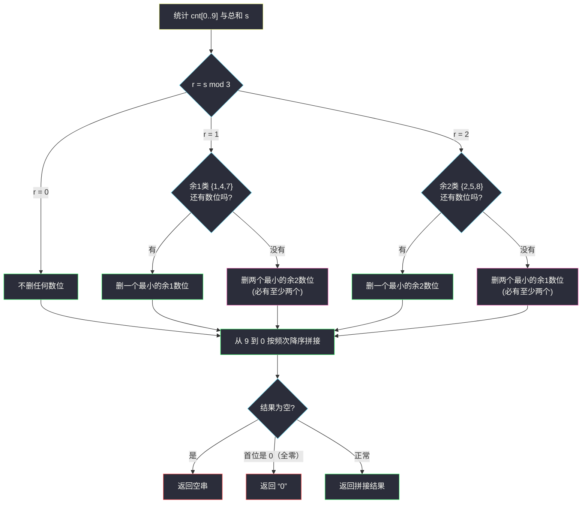
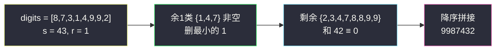

# 形成三的最大倍数（整除性 + 字典序最大 · 模 3 剩余类删最少数字）

## 一、问题描述

给你一个整数数组 `digits`，其中每个元素是一个数字 `0..9`（可重复）。你可以使用 `digits` 中的**部分**元素（每个元素至多使用一次），把它们按任意顺序排成一个整数（不允许前导零，但单独的 `0` 合法）。请返回能拼出的**最大**的能被 `3` 整除的非负整数（以字符串形式）；如果不存在，返回空字符串 `""`。

> 🔗 LeetCode 1363：https://leetcode.cn/problems/largest-multiple-of-three/
>
> 数据范围：`1 <= digits.length <= 10^4`，`0 <= digits[i] <= 9`。

**示例 1**

```
输入：digits = [1,2,3,4,5,4,3,2,1]
输出："54433221"
解释：数位和 25，25 mod 3 = 1，删掉一个 1 后和为 24，是 3 的倍数；
     剩余数位降序拼接得 54433221。
```

**示例 2**

```
输入：digits = [7,7,7,7,7,7,7]
输出："777777"
解释：数位和 49，49 mod 3 = 1，删掉一个 7 后和为 42。
```

**示例 3（全零陷阱）**

```
输入：digits = [0,0,0,1]
输出："0"
解释：删掉 1 后剩下三个 0，拼接结果是 "000"，但必须收敛为 "0"。
```

**示例 4（无解）**

```
输入：digits = [2,2]
输出：""
解释：数位和 4，余 1；没有余 1 的数位可删，只能删两个 2，一个数位都不剩。
```

**直观理解**

「被 3 整除」只看**数位和的余数**，与排列无关——所以整除性负责「删谁」，排列只需「降序」就最大。删除策略是两级字典序：**先保位数（删得越少越好），再保大小（同样删法删最小的）**。按模 3 把数位分成三个剩余类，余数为 1 时优先删一个最小的余 1 数位、退而删两个最小的余 2 数位；余 2 对称。这正是灵茶题单 §3.1 字典序最大在整除约束下的形态：**模 3 剩余类删最少数字且结果最大**。

---

## 二、暴力解法

枚举 `digits` 的每个子集，对每个子集排序拼接，检查能否被 3 整除，取最大：

```python
class Solution:
    def largestMultipleOfThree(self, digits: List[int]) -> str:
        n = len(digits)
        best = ""
        for mask in range(1, 1 << n):
            picked = sorted((digits[i] for i in range(n) if mask >> i & 1), reverse=True)
            if picked and picked[0] == 0 and len(picked) > 1:
                continue                      # 前导零（单独的 0 除外）
            if sum(picked) % 3 == 0:
                s = "".join(map(str, picked))
                if len(s) > len(best) or (len(s) == len(best) and s > best):
                    best = s
        return best if best else ("" if digits[0] != 0 else "")
```

（末行示意：需要另外处理「只挑 0」等边界；此处仅展示思路。）

### 复杂度

- **时间**：`O(2^n × n)`，`n = 10^4` 时宇宙热寂都算不完。
- **空间**：`O(n)`。

### 🔴 瓶颈在哪里

子集枚举完全没必要：整除性只由**数位和 mod 3** 决定，候选解的结构极其规整——保留尽可能多的数位、且尽量保留大数位。真正要决策的只有「删掉哪几个数位使总和归零」，而这个问题只有常数种（余 1 / 余 2）情形。

---

## 三、优化探索（核心章节）

> 📚 本题在灵茶题单中属于 **§3.1 字典序最小/最大**。模板要点：**整除性 + 字典序——模 3 剩余类删最少数字且结果最大**。与 `largest-palindromic-number.md`（§3.2）同属「数位频次 + 构造」lane。

### 3.1 引理一：整除性 = 数位和的整除性

`10 ≡ 1 (mod 3)`，因此任意数 `N = Σ d_i × 10^i ≡ Σ d_i (mod 3)`。**`3 | N ⟺ 3 | 数位和`**，与数位顺序无关。于是「拼一个能被 3 整除的最大数」拆成两个独立子问题：

1. **选哪些数位**：使剩余数位和 ≡ 0 (mod 3)，且结果最大；
2. **怎么排**：降序排列必最大（同长度整数比较即字典序）。

### 3.2 引理二：删除的个数越少越好（位数优先）

设删除方案 A 删 `p` 个、方案 B 删 `q` 个，`p < q`。只要 A 的保留集**不全是 0**，其降序拼接首位 ≥ 1，位数多一位就严格更大——`10^(n-p-1) ≥ 2 × 10^(n-p-2) >` 任何少一位的数。

结论（忽略全零特例，见 §3.6）：

> **余 1 / 余 2 时，能删 1 个就不删 2 个。**

### 3.3 引理三：删除个数相同时，删越小的越好

比较「删 `d1`」与「删 `d2`」（`d1 < d2`，同属一个剩余类）两种方案：保留集分别是 `M − {d1}` 与 `M − {d2}`。注意

```
M − {d1}  =  (M − {d2}) 上把一个 d1 升级成 d2
```

即 A 方案的保留多重集 = B 方案的保留多重集**把一个 `d1` 换成更大的 `d2`**。降序排列后逐位比较：升级只可能让某些位变大、不可能变小，且至少一位严格变大（`d2 > d1`）→ **A 方案（删小的）拼出的数严格更大**。

### 3.4 剩余类的四种情形

设 `r = sum(digits) mod 3`，数位按模 3 分成三类：余 1 类 `{1,4,7}`、余 2 类 `{2,5,8}`、余 0 类 `{3,6,9}`。

| `r` | 首选（删 1 个） | 退路（删 2 个） |
|-----|-----------------|-----------------|
| 0 | 不删 | — |
| 1 | 最小的**余 1** 数位 | 两个最小的**余 2** 数位 |
| 2 | 最小的**余 2** 数位 | 两个最小的**余 1** 数位 |

**退路为什么是「两个异侧类」而不是别的组合？** 删除集合的总和必须 ≡ `r (mod 3)`：

- `r = 1` 时，两元组合中「余 2 + 余 2」和 ≡ 2+2 ≡ 1 ✓；「余 0 + 余 1」和 ≡ 1 ✓ 但它删掉余 1 数位的效果与「只删一个余 1」相同还多删一个——永远不会更优；「余 1 + 余 2」和 ≡ 0 ✗；「余 0 + 余 0」和 ≡ 0 ✗。所以退路只剩「两个余 2」。
- 对称地 `r = 2` 时退路是「两个余 1」。

**退路必然可行**（引理四）：设余 1 类数位有 `n1` 个、余 2 类有 `n2` 个，则 `sum ≡ n1 + 2·n2 (mod 3)`。若 `r = 1` 且 `n1 = 0`，则 `2·n2 ≡ 1 (mod 3)`，即 `n2 ≡ 2 (mod 3)`，故 `n2 ≥ 2`——「删两个余 2」必然凑得出来。`r = 2` 且 `n2 = 0` 时对称地有 `n1 ≥ 2`。**算法永远有解可退，不存在「首选不可行且退路也不可行」的死局。**



### 3.5 实现形态：频次数组直改

不显式排序（`n` 可达 `10^4`，桶计数更省）：`cnt[0..9]` 统计频次，「删最小的余 `r` 数位」= 在 `(r, r+3, r+6)` 中找第一个 `cnt > 0` 者减一；「删两个」同理跨桶取。

### 3.6 两个输出边界

1. **保留集为空**（如示例 4）：返回 `""`。
2. **保留集全为 0**（如示例 3）：降序拼接得到 `"000…0"`，必须收缩为 `"0"`——判断方法极简：拼接结果**首位是 0** 就意味着全是 0（降序），直接返回 `"0"`；首位是 0 且长度为 1 的情况也被覆盖。

### 3.7 一句话核心

> **总和余几就删谁：余 1 删一个最小余 1（不行删两个最小余 2），余 2 对称；剩下降序拼、全零收敛、空串原样。**

---

## 四、代码实现

### Python（主解：桶计数 + 剩余类删除）

```python
class Solution:
    def largestMultipleOfThree(self, digits: List[int]) -> str:
        cnt = [0] * 10
        s = 0
        for d in digits:
            cnt[d] += 1
            s += d
        r = s % 3
        if r == 1:
            if cnt[1] + cnt[4] + cnt[7]:              # 优先删一个最小的余 1 数位
                for d in (1, 4, 7):
                    if cnt[d]:
                        cnt[d] -= 1
                        break
            else:                                      # 退路：删两个最小的余 2 数位
                taken = 0
                for d in (2, 5, 8):
                    while cnt[d] and taken < 2:
                        cnt[d] -= 1
                        taken += 1
        elif r == 2:
            if cnt[2] + cnt[5] + cnt[8]:              # 优先删一个最小的余 2 数位
                for d in (2, 5, 8):
                    if cnt[d]:
                        cnt[d] -= 1
                        break
            else:                                      # 退路：删两个最小的余 1 数位
                taken = 0
                for d in (1, 4, 7):
                    while cnt[d] and taken < 2:
                        cnt[d] -= 1
                        taken += 1
        ans = "".join(str(d) * cnt[d] for d in range(9, -1, -1))
        return "0" if ans[:1] == "0" else ans          # 全零收敛；空串原样返回
```

**变量含义**

| 片段 | 含义 |
|------|------|
| `cnt[d]` | 数位 `d` 的剩余个数（删除后） |
| `r` | 总和模 3 的余数，决定删除策略 |
| `(1, 4, 7)` / `(2, 5, 8)` | 余 1 类 / 余 2 类**从小到大**的遍历序 |
| `ans[:1] == "0"` | 降序串首位为 0 ⟺ 全零 ⟺ 收敛为 `"0"`；`ans` 为空时 `ans[:1]` 是空串，自然走 `""` 分支 |

**正确性来源**（对应 §3 的四条引理）：删除个数最少（引理二）→ 同个数删最小（引理三）→ 退路可行性（引理四）→ 拼接降序最大（引理一推论）。

**细节**：

1. `while cnt[d] and taken < 2` 跨桶取数：如余 2 类只剩一个 `2` 时，第二个要继续从 `5` 里取。
2. 最后的返回表达式同时处理三种输出：正常串 / `"0"` / `""`。
3. 删除只发生在两个剩余类上，**余 0 类 {3,6,9} 永远不动**——删它们对余数没有帮助，白丢位数。

### Java（最优解环节同款）

```java
class Solution {
    public String largestMultipleOfThree(int[] digits) {
        int[] cnt = new int[10];
        int s = 0;
        for (int d : digits) { cnt[d]++; s += d; }
        int r = s % 3;
        if (r == 1) remove(cnt, new int[]{1, 4, 7}, new int[]{2, 5, 8});
        else if (r == 2) remove(cnt, new int[]{2, 5, 8}, new int[]{1, 4, 7});
        StringBuilder sb = new StringBuilder();
        for (int d = 9; d >= 0; d--)
            for (int i = 0; i < cnt[d]; i++) sb.append((char) ('0' + d));
        if (sb.length() > 0 && sb.charAt(0) == '0') return "0";   // 全零
        return sb.toString();
    }

    private void remove(int[] cnt, int[] one, int[] two) {
        for (int d : one) {                       // 首选：删一个最小的同余数位
            if (cnt[d] > 0) { cnt[d]--; return; }
        }
        int taken = 0;                            // 退路：删两个最小的异侧类数位
        for (int d : two) {
            while (cnt[d] > 0 && taken < 2) { cnt[d]--; taken++; }
        }
    }
}
```

`remove` 把两种余数情形统一成「首选类 + 退路类」的对称参数，`r = 1` 与 `r = 2` 只是交换了两个参数。

---

## 五、具体例子演示

### 例 1：digits = [8,7,3,1,4,9,9,2]（自拟，端到端走首选分支）

| 步 | 决策 | 当前状态 |
|----|------|----------|
| 1 | 统计频次与总和 | `cnt = {1:1, 2:1, 3:1, 4:1, 7:1, 8:2, 9:2}`，`s = 43` |
| 2 | 求余数 | `r = 43 mod 3 = 1`，需要删掉和 ≡ 1 的数位集合 |
| 3 | 首选检查：余 1 类 `{1,4,7}` 有数位 | 走「删一个最小的余 1」 |
| 4 | 删除的数字：`1`（比 4、7 都小） | `cnt = {2:1, 3:1, 4:1, 7:1, 8:2, 9:2}`，剩余和 `42 ≡ 0 ✓` |
| 5 | 从 9 到 0 降序拼接 | `9,9,8,8,7,4,3,2` → `"9987432"` |
| 6 | 验证 | 数位和 `42 = 3 × 14 ✓`；首位非 0，输出 `"9987432"` |

对照说明「删最小」的价值：同样删一个余 1 数位，删 `1` 剩 `{2,3,4,7,8,8,9,9}` 拼成 `9987432`；删 `4` 剩 `{1,2,3,7,8,8,9,9}` 拼成 `9987321`。两者位数相同，逐位比较第 5 位 `4 > 3`——把删 `1` 省下的 `4` 留在了高位，正是引理三「删小的更优」的体现。

### 例 2：digits = [3,2,2]（自拟，退路分支）

| 步 | 决策 | 当前状态 |
|----|------|----------|
| 1 | 统计 | `cnt = {2:2, 3:1}`，`s = 7` |
| 2 | 求余数 | `r = 1` |
| 3 | 首选检查：余 1 类 `{1,4,7}` 全空 | 走退路「删两个最小的余 2」 |
| 4 | 删除的数字：`2、2` | `cnt = {3:1}`，剩余和 `3 ≡ 0 ✓` |
| 5 | 拼接输出 | `"3"` |

退路可行性印证引理四：`n1 = 0` 时 `2·n2 ≡ 1 (mod 3)` 强制 `n2 ≥ 2`，两个 `2` 一定删得出来。

### 例 3：digits = [0,0,0,1]（示例 3，全零收敛）

`s = 1, r = 1` → 删 `1` → 剩 `{0:3}` → 拼接 `"000"` → 首位是 `0` → 收敛输出 `"0"` ✓。

### 例 4：digits = [2,2]（示例 4，无解）

`s = 4, r = 1` → 余 1 类空 → 删两个 `2` → 桶全空 → 拼接结果 `""` → 输出 `""` ✓。

### 例 5：digits = [8,6]（自拟，`r = 2` 分支）

`s = 14, r = 2` → 余 2 类 `{2,5,8}` 中有 `8` → 删 `8`（虽然 8 比 6 大，但它是唯一能让余数归零的单删选择）→ 剩 `[6]` → `"6"` ✓。



---

## 六、复杂度分析

| 方法 | 时间 | 空间 | 说明 |
|------|------|------|------|
| 子集枚举 | `O(2^n × n)` | `O(n)` | 不可行 |
| 桶计数 + 剩余类删除 | `O(n + 10)` | `O(10)` | 一次计数 + 常数次桶操作 + 一次拼接 |

- **时间**：`O(n)`（拼接输出本身就是 `O(n)`）。
- **空间**：`O(1)` 额外空间（10 个桶 + 输出串）。

---

## 七、对比总结

**「数位频次 + 构造」家族**

| 题 | 约束 | 构造动作 |
|----|------|----------|
| **#1363 本篇** | 被 3 整除 | 模 3 剩余类删最少、降序拼接 |
| #2384 最大回文数字（同目录 `largest-palindromic-number.md`，§3.2） | 回文 + 无前导零 | 频次成对填两侧、奇频放中心 |
| #1323 6 和 9 组成的最大数字（同目录 `maximum-69-number.md`，§3.1） | 至多改一个数位 | 高位优先的字典序贪心 |
| #2375 根据模式串构造最小数字（同目录 `construct-smallest-number-from-di-string.md`，§3.1） | 模式串 + 字典序最小 | 连续 D 段整体决策 |
| #3723 数位平方和的最大值（本批 `maximize-sum-of-squares-of-digits.md`） | 数位和固定 | 调整法集中到 9 与 0 |

**易错点**

1. **忘判全零**：`"000"` 必须收敛成 `"0"`；判断技巧是降序串首位为 0 即全零。
2. **忘判空集**：删完一个不剩时返回 `""`，不是 `"0"`。
3. **退路删两个时跨桶**：`(2, 5, 8)` 顺次取，桶空要继续找下一个桶，不能只盯一个。
4. **别动余 0 类**：删 `3/6/9` 对余数毫无帮助，纯属浪费位数。
5. **别用排序数组逐个删**：`n = 10^4` 时桶计数更省事也更不易错。

**模板（模 3 剩余类删除，Python 版）**

```python
cnt, s = [0] * 10, sum(digits)
for d in digits: cnt[d] += 1
r = s % 3
if r:
    one, two = ((1, 4, 7), (2, 5, 8)) if r == 1 else ((2, 5, 8), (1, 4, 7))
    if any(cnt[d] for d in one):          # 首选：删一个最小同余
        for d in one:
            if cnt[d]: cnt[d] -= 1; break
    else:                                 # 退路：删两个最小异侧
        taken = 0
        for d in two:
            while cnt[d] and taken < 2:
                cnt[d] -= 1; taken += 1
ans = "".join(str(d) * cnt[d] for d in range(9, -1, -1))
return "0" if ans[:1] == "0" else ans
```

---

## 八、举一反三

| 题目 | 关系 |
|------|------|
| [2384. 最大回文数字](https://leetcode.cn/problems/largest-palindromic-number/) | 同目录姊妹篇（`largest-palindromic-number.md`）：同为数位频次构造，约束从「被 3 整除」换成「回文」 |
| [179. 最大数](https://leetcode.cn/problems/largest-number/) | 数位拼接排序的经典：自定义比较器让拼接结果最大 |
| [670. 最大交换](https://leetcode.cn/problems/maximum-swap/) | 数位级字典序贪心的最小形态（一次交换） |
| [738. 单调递增的数字](https://leetcode.cn/problems/monotone-increasing-digits/) | 构造 + 从某位起全填 9 的贪心 |
| [3723. 数位平方和的最大值](https://leetcode.cn/problems/maximize-sum-of-squares-of-digits/) | 本批姊妹篇（`maximize-sum-of-squares-of-digits.md`）：数位和固定下的极值构造 |
| [2952. 需要添加的硬币的最小数量](https://leetcode.cn/problems/minimum-number-of-coins-to-be-added/) | 本批姊妹篇（`minimum-number-of-coins-to-be-added.md`）：归纳法构造收官 |

**思想迁移**

- 「被 k 整除」类构造题的第一步永远是**把整除性翻译成数位和的余数**（`k = 3 / 9` 直接看数位和，`k = 11` 看交错和），第二步才谈字典序。
- 多级字典序的通用骨架：**先比位数（删除/保留的个数），再逐位比大小（删小的留大的）**——两级目标一致时贪心安全，冲突时以高位目标为先。
- 桶计数是数位题的天然数据结构：频次即多重集，删除即减桶，拼接即按桶倒序展开。
- 口诀：**「和余几删几，同余挑最小；不够删俩换异侧，降序一拼全零收。」**
