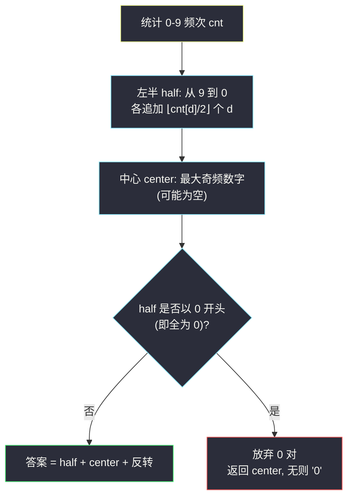

# 最大回文数字（回文串贪心 · 频次配对构造）

## 一、问题描述

给你一个仅由数字组成的字符串 `num`。你可以从 `num` 中取出**部分**数字（每种数字的使用次数不超过它在 `num` 中出现的次数），用它们组成一个**回文数**，且**不能包含前导零**。请返回能组成的**最大**回文数（以字符串形式）；若无法组成有效的回文数，返回空字符串（本题约束下单个数字也是回文，因此总有解，但防御性分支仍需保留）。

> 🔗 LeetCode 2384：https://leetcode.cn/problems/largest-palindromic-number/
>
> 数据范围：`1 <= num.length <= 10^5`，`num` 仅由 `'0'` 到 `'9'` 组成。

**示例 1**

```
输入：num = "444947137"
输出："7449447"
解释：用 7,4,4,9,4,4,7 组成 7449447，是能得到的最大回文数。
```

**示例 2（易错样例）**

```
输入：num = "00011"
输出："10001"
解释：两侧各放一个 1，中间放 0：10001。
```

**直观理解**

回文的对称性决定了**右半完全由左半镜像而来**，真正要决策的只有「左半每个数字放几个」和「中心放谁」。这是灵茶题单 §3.2 回文串贪心的标准形态：**统计数字频次，从大到小成对填两侧，余下奇数次的最大数字放中心**——同时要盯紧前导零这个经典陷阱。

---

## 二、暴力解法

把 `num` 的每个数字视作可取物品，枚举「每种数字取几个再排出回文」的所有方案：搜索每种数字 `d` 的使用个数 `0..cnt[d]`，要求除中心外全部成对，再对合法多重集按最大排列拼串比较。

```python
from itertools import product

class Solution:
    def largestPalindromic(self, num: str) -> str:
        cnt = [0] * 10
        for c in num:
            cnt[ord(c) - 48] += 1

        best = ''
        for uses in product(*[range(c + 1) for c in cnt]):
            odd = [d for d in range(10) if uses[d] % 2]
            if len(odd) > 1:                       # 回文最多一个奇频数字
                continue
            center = str(odd[0]) if odd else ''
            half = ''.join(str(d) * (uses[d] // 2) for d in range(9, -1, -1))
            cand = half + center + half[::-1]
            if len(cand) > 1 and cand[0] == '0':   # 前导零
                cand = ''
            if cand and (len(cand), cand) > (len(best), best):
                best = cand
        return best or '0'
```

### 复杂度

- **时间**：`O(∏(cnt[d] + 1) * 10)`，即组合数级别的枚举，频次一多立刻爆炸。
- **空间**：`O(1)`（忽略答案本身）。

### 🔴 瓶颈在哪里

暴力把「合法性」当过滤器用，却没利用两个关键结构：**回文由左半唯一决定**（不必枚举排列），以及**「成对取满」一定不劣**（长度优先）。抓住这两点，枚举空间直接坍缩成一次从 9 到 0 的十格扫描。

---

## 三、优化探索（核心章节）

> 📚 本题在灵茶题单中属于 **§3.2 回文串贪心**，与 #2375（见 `construct-smallest-number-from-di-string.md`）同属「构造 + 贪心」lane：给出构造 → 证明合法 → 证明最优。

### 3.1 结构观察：回文 = 左半 + 中心 + 左半镜像

设答案长为 `2q + b`（`b ∈ {0, 1}`）。整个串由「左半」（`q` 个数字的降序不重要，重要的是**多重集**与排列）与「中心」（至多 1 个数字）决定，右半自动镜像。于是只需回答三个问题：

1. 左半的多重集取什么？
2. 左半内部怎么排？
3. 中心放谁？

### 3.2 长度优先：成对数字必须取满

比较两个无前导零的正整数：**位数多者必大**。因此第一步是最大化长度，即最大化成对数 `q`。

设数字 `d` 出现 `cnt[d]` 次，它最多贡献 `⌊cnt[d] / 2⌋` 对，故 `q <= q_max = Σ⌊cnt[d] / 2⌋`。而取满 `q = q_max` 要求每种数字都取满 `⌊cnt[d] / 2⌋` 对——**取法唯一确定**。同时，只要存在奇频数字就能再放一个中心（`b = 1`），中心候选也是唯一确定的集合（奇频数字）。

> 注意前导零可能逼我们**放弃部分 0 对**（见 3.5），那是唯一需要「少取」的例外。

### 3.3 左半排序与中心选择：从大到小

长度固定后比较靠字典序（同长数字串比大小即字典序）：

- **左半**：把成对数字按 `9 → 0` 降序排——多重集的**最大排列**就是降序排列（交换论证：任何相邻逆序交换都会让串变大）。
- **中心**：在奇频数字中取**最大**者 `d*`，填入后中心位最大，且不影响两侧。

于是候选答案为：`half + center + reverse(half)`，其中 `half` 是降序左半、`center` 是最大奇频数字（可能为空）。

### 3.4 前导零：唯一的坑

`half` 按 9 到 0 生成，`0` 的对必然堆在**末尾**，所以 `half` 只有两种形态：

- 以 `1..9` 中某数字开头 → 无前导零，直接拼；
- **全是 `0`**（即只有 `0` 能成对）→ 拼出来形如 `0..0 d 0..0`，前导零非法。

后一种情况只能**放弃所有 0 对**，答案退化为：

- 有奇频数字 → 答案就是 `center`（单个非零数字是合法回文，且单个 `0` 也合法）；
- 无奇频数字（`num` 全 0，如 `"0000"`）→ 答案是 `"0"`（用掉一个 0，单字符无前导零问题）。



### 3.5 完整证明（构造合法 + 最优）

**合法性**：数字 `d` 共用 `2⌊cnt[d]/2⌋` 对（左右镜像各一）加中心的 `1`（若 `d` 奇频且被选），总数 `<= cnt[d]`；结构左右镜像自然是回文；前导零已在 3.4 分情况排除。∎

**最优性**：

1. 若最优解与构造解位数不同，由 3.2 知成对数取满 `q_max`、能放中心就放，构造解位数已到上界（前导零情形除外，但那种情形下**任何**以 `0` 对开头的解都非法，构造的退化解是该情形下的最长合法解）。
2. 同位数下比较字典序：位数 `2q + b` 固定 ⇒ 左半多重集固定为「每数字 `⌊cnt[d]/2⌋` 对」（唯一达到 `q_max` 的方案）⇒ 左半最优排列唯一（降序）⇒ 中心取奇频最大者最优。∎

### 3.6 一句话核心

> **从 9 到 0，每个数字成对取满堆两侧，最大奇频数字垫中心；左半全 0 就丢掉 0 对、只留中心，全 0 串返回 `"0"`。**

---

## 四、代码实现

### Python（主解：频次统计 + 成对填两侧）

```python
from collections import Counter

class Solution:
    def largestPalindromic(self, num: str) -> str:
        cnt = Counter(num)
        half = ''.join(d * (cnt[d] // 2) for d in map(str, range(9, -1, -1)))
        center = next((d for d in map(str, range(9, -1, -1)) if cnt[d] % 2), '')
        half = half.lstrip('0')                    # 全 0 的左半 → 弃掉所有 0 对
        if not half:
            return center or '0'                   # 单中心; 全 0 串兜底 '0'
        return half + center + half[::-1]
```

**逐行拆解**

| 片段 | 作用 |
|------|------|
| `d * (cnt[d] // 2)` | 数字 `d` 的成对个数，两侧各放一份 |
| `range(9, -1, -1)` | 从 9 到 0 降序：大数字优先占据高位 |
| `next(..., '')` | 第一个奇频数字 = 最大的奇频中心 |
| `lstrip('0')` | 左半以 0 开头当且仅当全是 0，一次剥净 |
| `center or '0'` | 无中心（全 0 偶数个）时返回 `"0"` |

### Java（最优解同款）

```java
class Solution {
    public String largestPalindromic(String num) {
        int[] cnt = new int[10];
        for (char c : num.toCharArray()) cnt[c - '0']++;

        StringBuilder sb = new StringBuilder();
        for (int d = 9; d >= 0; d--) {
            sb.append(String.valueOf(d).repeat(cnt[d] / 2));
        }
        String half = sb.toString();
        String center = "";
        for (int d = 9; d >= 0; d--) {
            if (cnt[d] % 2 == 1) { center = String.valueOf(d); break; }
        }
        while (half.startsWith("0")) half = half.substring(1);  // 左半全 0 时清空
        if (half.isEmpty()) return center.isEmpty() ? "0" : center;
        return half + center + new StringBuilder(half).reverse();
    }
}
```

---

## 五、具体例子演示

### 例 1：num = "444947137"（示例 1）

频次：`cnt[4]=4, cnt[9]=1, cnt[7]=2, cnt[1]=1, cnt[3]=1`（其余 0）。构造逐步表（「当前处理哪个数字、剩余可配对数、左半累积」）：

| 步 | 当前数字 d | cnt[d] | 成对 ⌊cnt/2⌋ | 追加到左半 | 左半累积 | 剩余未配对计数 |
|----|-----------|--------|--------------|------------|----------|----------------|
| 1 | 9 | 1 | 0 | （空） | `""` | 9 余 1（可作中心） |
| 2 | 8 | 0 | 0 | （空） | `""` | — |
| 3 | 7 | 2 | 1 | `7` | `"7"` | 7 余 0 |
| 4 | 6 | 0 | 0 | （空） | `"7"` | — |
| 5 | 5 | 0 | 0 | （空） | `"7"` | — |
| 6 | 4 | 4 | 2 | `44` | `"744"` | 4 余 0 |
| 7 | 3 | 1 | 0 | （空） | `"744"` | 3 余 1 |
| 8 | 2 | 0 | 0 | （空） | `"744"` | — |
| 9 | 1 | 1 | 0 | （空） | `"744"` | 1 余 1 |
| 10 | 0 | 0 | 0 | （空） | `"744"` | — |

- **中心**：奇频数字为 `9, 3, 1`，取最大 `9`；
- **前导零检查**：`half = "744"` 以 `7` 开头，通过；
- **拼接**：`"744" + "9" + "447"` = `"7449447"` ✓。

核对用量：`7` 用 2、`4` 用 4、`9` 用 1，均不超过出现次数 ✓。

### 例 2：num = "00011"（易错样例）

频次：`cnt[0]=3, cnt[1]=2`。

| 步 | 当前数字 d | cnt[d] | 成对 ⌊cnt/2⌋ | 追加到左半 | 左半累积 | 剩余未配对计数 |
|----|-----------|--------|--------------|------------|----------|----------------|
| 1-8 | 9..2 | 0 | 0 | （空） | `""` | — |
| 9 | 1 | 2 | 1 | `1` | `"1"` | 1 余 0 |
| 10 | 0 | 3 | 1 | `0` | `"10"` | 0 余 1（可作中心） |

- **中心**：奇频只有 `0`，取 `0`；
- `half = "10"` 以 `1` 开头，无前导零；
- **拼接**：`"10" + "0" + "01"` = `"10001"` ✓（两侧 1、中间三个 0，全部用满）。

### 例 3：num = "0000"（全零边界）

| 步 | d | cnt[d] | 成对 | 左半累积 |
|----|---|--------|------|----------|
| 1-9 | 9..1 | 0 | 0 | `""` |
| 10 | 0 | 4 | 2 | `"00"` |

- **中心**：无奇频（`4 % 2 == 0`）→ 空；
- `half = "00"` 全 0 → `lstrip('0')` 清空 → 走退化分支；
- 无中心 → 返回兜底 `"0"` ✓（`"00"`、`"0000"` 都有前导零，单个 `"0"` 是唯一合法回文）。

### 例 4：num = "00009"（另一个前导零坑）

`cnt[0]=4, cnt[9]=1`：`half = "00"` → 清空；中心取奇频的 `9` → 返回 `"9"`。若不处理前导零，会错误地拼出 `00900`——这正是本题通过率的主要杀手。

---

## 六、复杂度分析

| 方法 | 时间 | 空间 | 说明 |
|------|------|------|------|
| 枚举使用方案 | 组合数级 | `O(1)` | 频次一大即爆炸 |
| **频次贪心构造（本篇）** | `O(n + 10)` | `O(1)` 额外（答案串本身 `O(n)`） | 一趟计数 + 十格扫描拼接 |

---

## 七、对比总结

**与 #409「最长回文串」对照：同一套频次配对，一个数长度、一个真构造**

| 维度 | #409 最长回文串 | #2384 本篇 |
|------|------------------|-------------|
| 输入 | 字符（区分大小写） | 数字 `0-9` |
| 目标 | 最长回文**长度** | 最大回文**数字串** |
| 核心计数 | `Σ⌊cnt/2⌋` 对 + 是否有奇频 | 同款计数，但要落地成串 |
| 特有坑 | 无 | **前导零**、中心取最大奇频 |

**易错点**

1. **前导零**：`0` 的对只能堆在左半末尾；左半全 0 时必须整体弃掉，答案退化为单字符（例 3、例 4）。
2. **中心选错**：中心是「**出现奇数次的最大数字**」，不是出现次数最多的数字，也不是必须把最大数字留作中心（若 `9` 出现偶数次，它应该全部铺在两侧高位）。
3. **全 0 兜底**：`num` 全 0 时答案是 `"0"` 而非空串。
4. 拼接方向：`half + center + reverse(half)`，别把 reverse 放错边。

**构造 + 贪心的证明模板（本 lane 通用）**：先证**合法**（用量不超频次、结构满足回文/无前导零），再证**最优**（位数上界 + 同长字典序比较 + 排列唯一性）。#2375 的「段首下界 + 归纳」与本题的「长度优先 + 降序排列」是同一模板的两种落地。

---

## 八、举一反三

| 题目 | 关系 |
|------|------|
| [409. 最长回文串](https://leetcode.cn/problems/longest-palindrome/) | 同款 `Σ⌊cnt/2⌋` 配对，只求数长度不用真构造 |
| [2697. 字典序最小回文串](https://leetcode.cn/problems/lexicographically-smallest-palindrome/) | 回文贪心的「最小」方向：两侧向中心双指针替换 |
| [2131. 连接两字母单词得到的最长回文串](https://leetcode.cn/problems/longest-palindrome-by-concatenating-two-letter-words/) | 频次配对升级到「正反词对」，中心条件更微妙 |
| [2375. 根据模式串构造最小数字](https://leetcode.cn/problems/construct-smallest-number-from-di-string/) | 同批「构造 + 贪心」姊妹篇，见 `construct-smallest-number-from-di-string.md` |
| [1323. 6 和 9 组成的最大数字](https://leetcode.cn/problems/maximum-69-number/) | 同 lane 的字典序贪心热身，见 `maximum-69-number.md` |

**思想迁移**

- 「从 `num` 的数字里构造 XX」类问题，第一步永远是 **`Counter`**：频次表把 `10^5` 的串压缩成 10 个格子。
- 回文类构造的固定三问：**两侧放什么（成对取满）、中心放谁（最大奇频）、前导零怎么躲（0 只能垫中间）**。
- 口诀：**「九到零，对对抠，降序铺满左右手；奇频最大坐中军，左半全零退单口。」**
