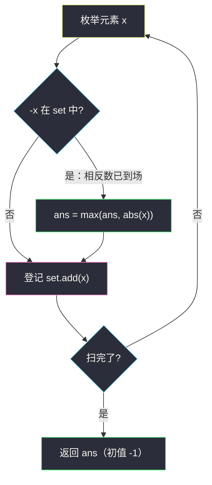
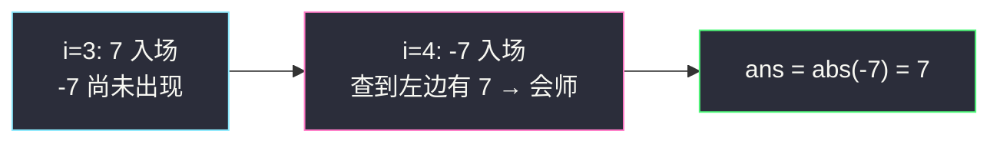

# 与对应负数同时存在的最大正整数（哈希集合 · 枚举右，维护左）

## 一、问题描述

给你一个**不含重复元素**的整数数组 `nums`，找出最大的整数 `k`，使得 `-k` 也在数组中。返回 `k`；若不存在这样的整数，返回 `-1`。

> 🔗 LeetCode 2441：https://leetcode.cn/problems/largest-positive-integer-that-exists-with-its-negative/
>
> 数据范围：`1 <= nums.length <= 1000`，`-1000 <= nums[i] <= 1000`，`nums` 中不存在重复元素。

**示例 1**

```
输入：nums = [-1,2,-3,3]
输出：3
解释：3 是唯一有效的 k，因为 3 和 -3 同时存在于数组中。
```

**示例 2**

```
输入：nums = [-1,10,6,7,-7,1]
输出：7
解释：数组中同时存在 7 和 -7，返回 7。
```

**示例 3**

```
输入：nums = [-10,8,6,7,-2,-3]
输出：-1
解释：没有任何正数与其相反数同时存在。
```

**直观理解**

这是一道「配对存在性」题：条件是**互为相反数的两个值同时出现**，目标取其中最大的正数。它属于灵神题单 **§0.1 枚举右，维护左** 家族——与 [#1512 好数对的数目](https://leetcode.cn/problems/number-of-good-pairs/)（同批 `number-of-good-pairs.md`）同一个骨架，只是把「查询出现次数」换成「查询相反数是否存在」，把「累加配对数」换成「取绝对值最大」。

---

## 二、暴力解法

让 `k` 从大到小枚举（`1000` 到 `1`），每个 `k` 都在数组里线性查找 `k` 与 `-k`：

```python
class Solution:
    def findMaxK(self, nums: List[int]) -> int:
        for k in range(1000, 0, -1):        # 从大到小枚举正数
            if k in nums and -k in nums:    # 每次都是线性扫描
                return k
        return -1
```

### 复杂度

- **时间**：`O(n * V)`，`V = 1000` 为值域上界；最坏约 `10^6` 次比较，本题能过但很浪费。
- **空间**：`O(1)`。

### 🔴 瓶颈在哪里

`in nums` 是线性查找，同一个数组被反复扫了上千遍。数组无序、又只想问「某个值在不在」——这正是**哈希集合** O(1) 存在性查询的用武之地。

---

## 三、优化探索（核心章节）

> 📚 本题在灵茶题单中属于 **§0.1 枚举右，维护左**（常用数据结构 A · 哈希表）。模板三步：枚举右端点 → 用当前元素查询哈希表中「左边」的信息 → 登记当前元素。本题查询的是「相反数是否出现过」，登记的是「当前值」。

### 3.1 观察特征

| 特征 | 说明 |
|------|------|
| 只问「`-k` 在不在」，不需要次数 | 哈希**集合**即可，不必计数 |
| `nums` 互不相同 | 无重复登记、无自配对顾虑 |
| 要求最大的 `k` | 命中时用 `abs(x)` 与答案取 max |

### 3.2 值域版：建好集合，从大到小枚举正数

先把所有数倒进集合，再让 `k` 从 `1000` 往 `1` 枚举，第一个同时满足 `k` 与 `-k` 都在集合里的就是答案：

```python
class Solution:
    def findMaxK(self, nums: List[int]) -> int:
        s = set(nums)
        for k in range(1000, 0, -1):       # 值域小，直接枚举值
            if k in s and -k in s:
                return k
        return -1
```

时间 `O(n + V)`，两次 O(1) 查询替代两次线性扫描。缺点是**依赖值域小**：值域若到 `10^9`，这招就废了。

### 3.3 单趟「枚举右，维护左」（通用版）

换个方向：不枚举值，枚举**元素**。从左往右扫，当前元素 `x` 到场时，查它的相反数 `-x` 是否已在集合中——在，说明这对相反数「会师」了，候选答案是 `abs(x)`；查完把 `x` 登记进集合。无论正负谁先到，**后到的一方总能查到先到的一方**：



单趟 `O(n)`，**与值域无关**。正确性两句话：

- **不漏**：任何一对相反数 `k`、`-k` 必然一前一后出现，后到者查询时先到者已在集合里；`abs` 保证无论正负后到，贡献的都是正数 `k`。
- **不错**：查询发生在登记之前，`x` 查到的一定是**别的下标**的元素。特别地，`x = 0` 时 `-0 == 0`，但数组无重复、且先查后存，`0` 不可能和自己配对（若把顺序颠倒成先存后查，唯一的 `0` 就会自配，把答案错误地抬成 `0`）。

### 3.4 一句话核心

> **单趟扫描，对每个元素先查相反数是否在左、再登记自己；命中就取绝对值更新最大值——`O(n)` 时间，与值域无关。**

---

## 四、代码实现

### Python（主解：枚举右，维护左）

```python
class Solution:
    def findMaxK(self, nums: List[int]) -> int:
        ans = -1
        seen = set()                    # 左边出现过的值
        for x in nums:                  # 枚举右端点（当前元素 x）
            if -x in seen:              # 先查：相反数已在左边
                ans = max(ans, abs(x))  # 会师：更新最大正数
            seen.add(x)                 # 后存：登记自己
        return ans
```

**变量含义**

| 变量 | 含义 |
|------|------|
| `x` | 当前枚举的元素（视为「右」） |
| `seen` | 下标更小的元素值集合 |
| `ans` | 已会师的相反数对中的最大绝对值，初值 `-1` |

**循环不变式**：处理 `x` 之前，`seen` 恰为 `nums` 中 `x` 左边全部元素的集合；因此 `-x in seen` 等价于「存在下标更小的相反数」。

`if` 判断与 `seen.add(x)` 的先后顺序不可颠倒——顺序是这个模板（以及 #1512 那类计数题）正确性的公共前提。

---

## 五、具体例子演示

以 `nums = [-1,10,6,7,-7,1]` 单趟走完，逐行观察集合内容与命中情况：

| i | x | 查询 -x | 命中? | ans | seen（登记后） |
|---|---|---------|-------|-----|----------------|
| 0 | -1 | 查 `1` | 否 | -1 | `{-1}` |
| 1 | 10 | 查 `-10` | 否 | -1 | `{-1, 10}` |
| 2 | 6 | 查 `-6` | 否 | -1 | `{-1, 10, 6}` |
| 3 | 7 | 查 `-7` | 否 | -1 | `{-1, 10, 6, 7}` |
| 4 | -7 | 查 `7` | **是** | `max(-1, 7) = 7` | `{-1, 10, 6, 7, -7}` |
| 5 | 1 | 查 `-1` | **是** | `max(7, 1) = 7` | 全部 6 个元素 |

答案 `7` ✓。注意两处细节：`i=4` 是**负数后到**，靠 `abs(x)` 照样贡献正数 `7`；`i=5` 虽命中（`1` 与 `-1` 会师），但 `1 < 7` 不影响答案。

**示例 3 验证**：`nums = [-10,8,6,7,-2,-3]`，六次查询 `-x` 依次查 `10, -8, -6, -7, 2, 3`，全部落空 → 返回 `-1` ✓。

**值域版对照**：示例 2 的集合里，`k` 从 1000 往下第一个「`k` 与 `-k` 都在」的值是 `7`，与单趟版一致 ✓。



---

## 六、复杂度分析

| 方法 | 时间 | 空间 | 说明 |
|------|------|------|------|
| 暴力枚举值 | `O(n * V)` | `O(1)` | 每个候选 `k` 线性扫数组 |
| 集合 + 从大到小枚举值 | `O(n + V)` | `O(n)` | 依赖值域 `V` 小 |
| 枚举右维护左（主解） | `O(n)` | `O(n)` | 单趟扫描，与值域无关 |

---

## 七、对比总结

**同模板换个查询方式**——骨架都是「枚举右端点 + 哈希维护左边」，变的是查询内容与汇聚动作：

| 题 | 哈希结构 | 查询 | 汇聚 |
|----|----------|------|------|
| #1512 好数对 | 计数表 `cnt` | `cnt[v]` 次数 | 累加 |
| #2441 本篇 | 集合 `seen` | `-x` 存在性 | `max(abs(x))` |
| #1 两数之和 | 值→下标表 | `target - x` 存在性 | 记录下标直接返回 |

**易错点**

1. **先查后存**：颠倒顺序后 `x = 0` 会自配（`-0 == 0`），把 `-1` 错误地变成 `0`。
2. 命中时取 `abs(x)` 而不是 `x`——负数后到是常态（如示例 2 的 `-7`）。
3. 答案初值 `-1`，别用 `0`（`k` 必须是正数，且可能无解）。
4. 「无重复」是题设保证；若题目允许重复，需把集合升级为计数表，但本题逻辑不受影响（存在性对重复不敏感）。

**模板（枚举右维护左 · 存在性配对版，Python）**

```python
ans = -1
seen = set()
for x in nums:              # 枚举右端点
    if partner(x) in seen:  # 查询左边的搭档（本题 partner(x) = -x）
        ans = max(ans, abs(x))
    seen.add(x)             # 登记当前
```

---

## 八、举一反三

| 题目 | 关系 |
|------|------|
| [1512. 好数对的数目](https://leetcode.cn/problems/number-of-good-pairs/) | 同批姊妹篇 `number-of-good-pairs.md`，查询从「存在性」变「计数」 |
| [1. 两数之和](https://leetcode.cn/problems/two-sum/) | 存在性查询的鼻祖：查 `target - x`，搭档关系从「相反数」变「和为 target」 |
| [2006. 差的绝对值为 K 的数对数目](https://leetcode.cn/problems/count-number-of-pairs-with-absolute-difference-k/) | 同时查 `x-k` 与 `x+k` 两个搭档，注意 `k = 0` 别重复 |
| [532. 数组中的 k-diff 数对](https://leetcode.cn/problems/k-diff-pairs-in-an-array/) | 存在性 + 去重计数的组合 |
| [349. 两个数组的交集](https://leetcode.cn/problems/intersection-of-two-arrays/) | 哈希集合存在性查询的基础练习 |
| [3371. 识别数组中的最大异常值](https://leetcode.cn/problems/identify-the-largest-outlier-in-an-array/) | 同批 `identify-the-largest-outlier-in-an-array.md`，存在性升级为「计数 ≥ 2」的同值判定 |

**思想迁移**

- 题面出现「找另一半 / 找搭档」（相反数、和为定值、差为定值），就考虑**哈希存左边、查询搭档是否存在**。
- 值域小可以「枚举值 + 建集合」；追求通用就「枚举元素 + 单趟先查后存」，后者是 `O(n)` 且不限值域。
- 口诀：**「单趟扫，查相反；先查后存不自配，绝对值大者胜。」**
