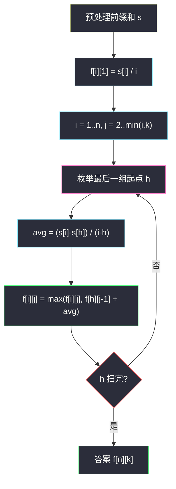

# 813. 最大平均值和的分组（Largest Sum of Averages）

> 题目来源：[https://leetcode.cn/problems/largest-sum-of-averages/](https://leetcode.cn/problems/largest-sum-of-averages/)
>
> 灵茶题单小节定位：§5.3 约束划分个数

## 一、问题描述

给定数组 `nums` 和一个整数 `k`。把 `nums` 分成**最多** `k` 个非空**连续**子数组。分数定义为各子数组平均值之和。必须用上每一个数；答案不必是整数，误差在 `1e-6` 内视为正确。

返回能得到的最大分数。

**数据范围**：

- `1 <= nums.length <= 100`
- `1 <= nums[i] <= 10^4`
- `1 <= k <= nums.length`

**示例 1**：

```text
输入：nums = [9,1,2,3,9], k = 3
输出：20.00000
解释：最优分组是 [9], [1,2,3], [9]，分数 9 + 6/3 + 9 = 20。
分组 [9,1], [2], [3,9] 得到 5 + 2 + 6 = 13，更差。
```

**示例 2**：

```text
输入：nums = [1,2,3,4,5,6,7], k = 4
输出：20.50000
解释：例如 [1,2,3,4] / [5] / [6] / [7] → 2.5 + 5 + 6 + 7 = 20.5。
```

**核心思考点**：连续划分 + 段数上限，是 §5.3「约束划分个数」。`f[i][j]` = 前 `i` 个数分成 `j` 组的最大平均值和，枚举最后一组起点，前缀和 `O(1)` 算区间平均。题面写「最多 k 组」，但正数数组上**多切一组分数不降**，最优一定**恰好 k 组**。

## 二、暴力解法

### 思路

`m` 从 1 到 `k`，在 `n-1` 个空隙里选 `m-1` 个切点，对每种切法把各段平均值加起来取 max。独立于 DP，适合小 `n` 对拍。

### 代码

```python
from itertools import combinations

def largestSumOfAveragesBrute(nums: list[int], k: int) -> float:
    n = len(nums)
    best = float("-inf")
    for m in range(1, min(k, n) + 1):
        for cuts in combinations(range(1, n), m - 1):
            pts = (0,) + cuts + (n,)
            sc = 0.0
            for a, b in zip(pts, pts[1:]):
                sc += sum(nums[a:b]) / (b - a)
            best = max(best, sc)
    return best
```

### 复杂度

- 时间：切点组合数 `Σ C(n-1, m-1)`，`n = 100` 不可行；`n ≤ 8` 可对拍。
- 空间：`O(n)`。

## 三、优化探索

### 3.1 「最多 k」为何等于「恰好 k」⭐⭐

把一段连续正数拆成两段非空 A、B（长度 `n,m`，和 `SA, SB`，均 > 0）：

```text
avg(A) + avg(B) - avg(A∪B)
= SA/n + SB/m - (SA+SB)/(n+m)
```

通分后分子是 `m²·SA + n²·SB > 0`，所以**两段平均值之和严格大于原段平均值**。因此多切一刀分数严格变大。`nums[i] ≥ 1` 保证成立。段数越多越好，上限 `k` 一定用满（元素不够时最多 `n` 段，约束里 `k ≤ n`）。

### 3.2 状态：前 i 个元素、恰好 j 组 ⭐

`f[i][j]` = `nums[0..i-1]` 分成恰好 `j` 个连续组的最大平均值和。

最后一组是 `nums[h..i-1]`（`h` 为起点下标对应的前缀长度），前面 `h` 个元素必须已经分成 `j-1` 组：

```text
f[i][j] = max_{j-1 ≤ h < i}  f[h][j-1] + (s[i] - s[h]) / (i - h)
```

`j = 1` 时只有一组：`f[i][1] = s[i] / i`。`h` 下界 `j-1`：前面要能拆出 `j-1` 组，至少 `j-1` 个元素。前缀和 `s[i] = nums[0] + … + nums[i-1]`。



### 3.3 遍历顺序与滚动

`f[i][j]` 依赖更小的 `i` 与 `j-1`，对 `i` 升序、对 `j` 升序即可。`n ≤ 100`，`O(n² k)` 约 `10⁶`。

若只留一维容量（这里是前缀长度），需要按 `j` 从大到小滚，避免 `f[h]` 已被同一层 `j` 覆盖。主解二维更清晰，不必强行滚。

记忆化搜索是同一转移的自顶向下写法：`dfs(i, left)` = 从下标 `i` 起、最多 `left` 组。`left=1` 时只能整段平均；否则枚举第一段结束位置。与递推完全等价。

## 四、代码实现

### 主解：前缀和 + 二维划分 DP

```python
class Solution:
    def largestSumOfAverages(self, nums: list[int], k: int) -> float:
        n = len(nums)
        s = [0] * (n + 1)
        for i, x in enumerate(nums):
            s[i + 1] = s[i] + x
        f = [[0.0] * (k + 1) for _ in range(n + 1)]
        for i in range(1, n + 1):
            f[i][1] = s[i] / i
            for j in range(2, min(i, k) + 1):
                for h in range(j - 1, i):
                    f[i][j] = max(
                        f[i][j],
                        f[h][j - 1] + (s[i] - s[h]) / (i - h),
                    )
        return f[n][k]
```

### 细节说明

- **`f` 初值 0**：`j ≥ 2` 时 `h` 从 `j-1 ≥ 1` 起，不会读到无意义的 `f[0][j]`。每次 `max` 的第一项是 0，但至少有一种合法切法，其平均值和 > 0，不会被 0 污染。
- **整数除法**：Python 3 的 `/` 已是浮点；Java 必须 `1.0 * (s[i]-s[h]) / (i-h)`。
- **不要按「最多 j 组」再套一层 `max(f[i][j-1], …)`**：已经证明恰好 `j` 更优，`f[n][k]` 就是答案。
- **不能打乱顺序**：分组必须相邻，不是子序列。

## 五、例子演示

**示例 1 端到端：`nums = [9,1,2,3,9]`, `k = 3`**

前缀和 `s = [0, 9, 10, 12, 15, 24]`。按前缀长度 `i`、组数 `j` 填表。

**`j = 1`（整段一组）**：

| i | 1 | 2 | 3 | 4 | 5 |
|---|---|---|---|---|---|
| f[i][1] | 9 | 5 | 4 | 3.75 | 4.8 |

**`j = 2`，逐 i 枚举最后一组**：

- `i=2, h=1`：`9 + (10-9)/1 = 10`
- `i=3, h=1`：`9 + 3/2 = 10.5`；`h=2`：`5 + 2/1 = 7` → **10.5**
- `i=4, h=1`：`9 + 6/3 = 11`；`h=2`：`5 + 5/2 = 7.5`；`h=3`：`4 + 3 = 7` → **11**
- `i=5, h=1`：`9 + 15/4 = 12.75`；`h=2`：`5 + 14/3 ≈ 9.67`；`h=3`：`4 + 12/2 = 10`；`h=4`：`3.75 + 9 = 12.75` → **12.75**

**`j = 3`**：

- `i=3, h=2`：`f[2][2] + 2/1 = 10 + 2 = 12`
- `i=4, h=2`：`10 + 5/2 = 12.5`；`h=3`：`10.5 + 3 = 13.5` → **13.5**
- `i=5, h=2`：`10 + 14/3 ≈ 14.67`；`h=3`：`10.5 + 6 = 16.5`；`h=4`：`11 + 9 = 20` → **20**

`f[5][3] = 20`，对应 `h=4`：前 4 个分成 2 组（`[9] | [1,2,3]`，分数 11）再加最后的 `[9]`。与官方解释一致 ✅。

**示例 2 逐步：`nums = [1,2,3,4,5,6,7]`, `k = 4`**

前缀和 `s = [0,1,3,6,10,15,21,28]`。最优一定 4 组（§3.1）。大数单独成组能抬高平均值之和，DP 会把切点挤到右边：

- 最后一组取 `[7]`（`h=6`）：需要 `f[6][3]`；
- `f[6][3]` 的最优再把 `[6]` 单独切出（`h=5`）；
- `f[5][2]` 再切 `[5]`，前面 `[1,2,3,4]` 一组。

`2.5 + 5 + 6 + 7 = 20.5` ✅。若强行 3 组，少切一刀分数严格更小，这就是「最多 4」等于「恰好 4」的数值版。

**边界**：`k = 1` 退化为整段平均；`k = n` 每个元素单独一组，答案等于数组元素之和。`nums = [1,100], k = 2` → `1+100=101`，远大于整段平均 50.5。

## 六、复杂度分析

设 `n = len(nums)`：

- **时间复杂度：`O(n² k)`**——三重循环 `i, j, h`。`n = 100` 可过。
- **空间复杂度：`O(n k)`**——二维 `f`；可滚成 `O(n)`（`j` 逆序更新）。

## 七、对比总结

| 维度 | 枚举切点 | 主解 DP |
|---|---|---|
| 时间 | 指数 | `O(n² k)` |
| 「最多 / 恰好」 | 两种都枚举 | 恰好 k（已证更优） |
| 区间和 | 每次 `O(段长)` | 前缀和 `O(1)` |

**套路归纳**：§5.3 在 §5.2 的「枚举最后一段」上加一维段数。先问清目标随段数单调否——本题平均值**之和**对正数单调增，所以「最多」变「恰好」；若目标是段和的最大值（[410. 分割数组的最大值](https://leetcode.cn/problems/split-array-largest-sum/)），单调性反过来，常用二分上限。

## 八、举一反三

1. **[410. 分割数组的最大值](https://leetcode.cn/problems/split-array-largest-sum/)**：同样「分成 k 段」，目标改成最小化段和最大值——二分 + 贪心切，或 `O(n² k)` DP。
2. **[1335. 工作计划的最低难度](https://leetcode.cn/problems/minimum-difficulty-of-a-job-schedule/)**：`d` 天划分，代价是段内最大值之和。
3. **[1278. 分割回文串 III](https://leetcode.cn/problems/palindrome-partitioning-iii/)**：恰好 `k` 段，段代价是改成回文的修改次数。
4. **[813 的「可行性」亲戚：2369](https://leetcode.cn/problems/check-if-there-is-a-valid-partition-for-the-array/)**：同目录 `check-if-there-is-a-valid-partition-for-the-array.md`，无段数维、只问能否。
5. **[2707. 字符串中的额外字符](https://leetcode.cn/problems/extra-characters-in-a-string/)**：同批 `extra-characters-in-a-string.md`，§5.2 无段数限制的最优划分。

**同族互引**：§5.2 只管切得最优，§5.3 再加「切几刀」。本篇把「最多 k」收成「恰好 k」的证明，是这一小节最值得带走的一句话。
