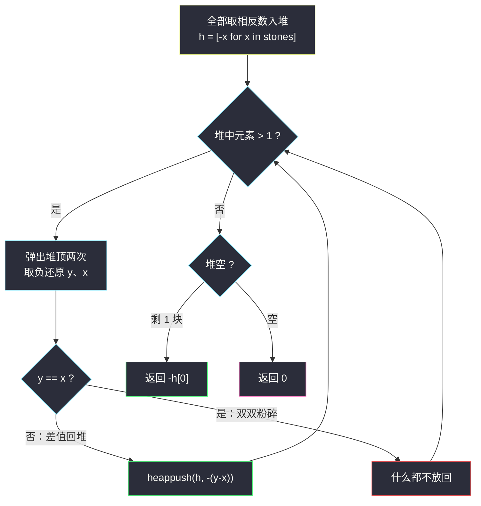

# 最后一块石头的重量（堆基础 · 大根堆逐对消除）

## 一、问题描述

一堆石头，每块重量均为正整数。每一回合**从中选出两块最重的石头**并将它们一起粉碎：

- 若两块重量相等，两块都被完全粉碎；
- 若不相等，较轻的那块被完全粉碎，较重那块的新重量为两块之差 `y - x`。

最后**最多只会剩下一块石头**，返回这块石头的重量；如果没有石头剩下，返回 `0`。

> 🔗 LeetCode 1046：https://leetcode.cn/problems/last-stone-weight/
>
> 数据范围：`1 <= stones.length <= 30`，`1 <= stones[i] <= 1000`。

**示例 1**

```
输入：stones = [2,7,4,1,8,1]
输出：1
```

**示例 2**

```
输入：stones = [1]
输出：1
```

**直观理解**

整个游戏就是「**取最重两块 → 相撞 → 差值放回 → 再取最重两块**」的循环。每一轮的核心操作都作用于「当前最大值」，这正是优先队列（堆）的定义式场景——灵茶题单 §5.1 堆基础的第一道热身题。

---

## 二、暴力解法

每一轮都对整个数组重新排序，取出末尾两个最大值相撞，把差值放回，直到只剩一块（或零块）。

```python
class Solution:
    def lastStoneWeight(self, stones: List[int]) -> int:
        s = stones[:]
        while len(s) > 1:
            s.sort()                     # 每轮重排序，最重的两块沉到末尾
            y = s.pop()                  # 最重
            x = s.pop()                  # 次重
            if y != x:
                s.append(y - x)          # 相等则双双粉碎，什么都不放回
        return s[0] if s else 0
```

### 复杂度

- **时间**：`O(n² log n)`——每轮一次排序，最多约 `n` 轮。
- **空间**：`O(n)`（拷贝数组；原地做则是 `O(1)`）。

### 🔴 瓶颈在哪里

`n <= 30` 时轻松通过，但排序每次都重排了**大量与最值无关的元素**。我们反复只关心「最大的两个」，其余元素相对顺序毫无价值——这正是堆的用武之地：`n` 个元素里反复取/放最值，堆把单次代价从 `O(n log n)` 降到 `O(log n)`。

---

## 三、优化探索（核心章节）

> 📚 本题在灵茶题单中属于 **§5.1 堆的基础用法**（数据结构③ A 路）。识别信号非常典型：**「每一轮取当前最值 → 加工 → 放回集合」**，集合内容动态变化、只按大小进出——这就是堆模拟。

### 3.1 Python heapq 是小根堆

`heapq` 只提供**小根堆**：`heappop` 取出的是最小值。本题要「最重的两块」，怎么办？——**全部存相反数**：

- 存入 `-stones[i]`，则「最大的石头」对应「最小的负数」；
- 弹出两次堆顶，取负还原成 `y`（重）、`x`（次重）；
- 差值 `y - x` 放回时也要存 `-(y - x)`。

这套「取负数模拟大根堆」是 Python 堆题的标配手势，比手写比较键更直接。

### 3.2 循环什么时候停

只要堆里还有 **2 块以上**石头，就得继续相撞：

```python
while len(h) > 1:
    ...
```

退出时堆里要么剩 1 块（返回其重量），要么为空（两块相等同归于尽，返回 `0`）。

### 3.3 两个易错分支

1. **两块相等**：差为 `0`，按题意双双粉碎——**不要**把 `0` 压回堆，否则可能死循环或返回错值。
2. **空堆返回 0**：`[-h[0] if h else 0]` 的三元判断不能丢。



### 3.4 一句话核心

> 「每轮取最大两个、加工后放回」= 大根堆循环；Python 里就是**小根堆存负数**。

---

## 四、代码实现

### Python（主解：大根堆存负数）

```python
import heapq

class Solution:
    def lastStoneWeight(self, stones: List[int]) -> int:
        h = [-x for x in stones]         # 取相反数：小根堆当大根堆用
        heapq.heapify(h)                 # O(n) 建堆
        while len(h) > 1:
            y = -heapq.heappop(h)        # 最重
            x = -heapq.heappop(h)        # 次重
            if y != x:
                heapq.heappush(h, x - y) # 差值 y-x 的相反数入堆
        return -h[0] if h else 0         # 空堆返回 0
```

**变量含义**

| 变量 | 含义 |
|------|------|
| `h` | 存「重量相反数」的小根堆，堆顶 = 最重石头 |
| `y` / `x` | 本轮弹出并还原的最重 / 次重重量，`y >= x` |
| `x - y` | `-(y - x)`，即差值取负回堆 |

**循环不变式**：每一轮开始时，`h` 恰好保存「当前仍在场的所有石头」的相反数。

### Java（最优解同款：reverseOrder 优先队列）

```java
class Solution {
    public int lastStoneWeight(int[] stones) {
        PriorityQueue<Integer> pq = new PriorityQueue<>(Comparator.reverseOrder());
        for (int x : stones) pq.offer(x);
        while (pq.size() > 1) {
            int y = pq.poll(), x = pq.poll();     // 从大到小弹出
            if (y != x) pq.offer(y - x);
        }
        return pq.isEmpty() ? 0 : pq.poll();
    }
}
```

Java 的 `PriorityQueue` 可直接传 `Comparator.reverseOrder()` 得到大根堆，无需取负数这一层绕路。

---

## 五、例子演示

### stones = [2,7,4,1,8,1]（示例 1）

建堆后堆中（按重量从大到小）为 `{8,7,4,2,1,1}`。逐轮跟踪（表中「堆」列展示还原成正值的逻辑内容，代码里实际存的是相反数）：

| 轮 | 弹出 y（最重） | 弹出 x（次重） | y − x | 是否回堆 | 操作后堆中元素（降序） |
|----|----------------|----------------|-------|----------|------------------------|
| 1 | 8 | 7 | 1 | ✓ | {4, 2, 1, 1, 1} |
| 2 | 4 | 2 | 2 | ✓ | {2, 1, 1, 1} |
| 3 | 2 | 1 | 1 | ✓ | {1, 1, 1} |
| 4 | 1 | 1 | 0 | ✗（相等全碎） | {1} |

堆中只剩 1 块，**返回 `1`** ✓

逐步解读第 1 轮的堆操作（「堆」列展示存负值后的逻辑内容，集合无序）：

| 步骤 | 堆中元素（实际存负值） | 说明 |
|------|--------------------------|------|
| 初始 `heapify` | {-8, -7, -4, -2, -1, -1} | 堆顶 -8 即最重的 8 |
| 弹出堆顶 | {-7, -4, -2, -1, -1} | 取负得 `y = 8` |
| 再弹堆顶 | {-4, -2, -1, -1} | 取负得 `x = 7` |
| 差值入堆 | {-4, -2, -1, -1, -1} | 压入 `-(8-7) = -1` |

### stones = [1]（示例 2）

堆中只有 1 块，`while len(h) > 1` 直接不进入，返回 `-h[0] = 1` ✓

```mermaid
flowchart LR
    A["堆 {8,7,4,2,1,1}"] --> B["8 vs 7 → 剩 {4,2,1,1,1}"]
    B --> C["4 vs 2 → 剩 {2,1,1,1}"]
    C --> D["2 vs 1 → 剩 {1,1,1}"]
    D --> E["1 vs 1 → 全碎 {1}"]
    E --> F["答案 1"]

    style A fill:#2b2d3a,stroke:#f1fa8c,color:#f8f8f2
    style B fill:#2b2d3a,stroke:#8be9fd,color:#f8f8f2
    style C fill:#2b2d3a,stroke:#8be9fd,color:#f8f8f2
    style D fill:#2b2d3a,stroke:#8be9fd,color:#f8f8f2
    style E fill:#2b2d3a,stroke:#ff5555,color:#f8f8f2
    style F fill:#2b2d3a,stroke:#50fa7b,color:#f8f8f2
```



---

## 六、复杂度分析

| 方法 | 时间 | 空间 | 说明 |
|------|------|------|------|
| 暴力排序 | `O(n² log n)` | `O(n)` | 每轮全量重排 |
| 大根堆 | `O(n log n)` | `O(n)` | `heapify` 是 `O(n)`；每轮 2 弹 1 压共 `O(n)` 轮，单次 `O(log n)` |

堆解法空间来自堆本身（也可在原数组上原地建堆做到 `O(1)` 额外空间，`heapify` 一行即可切换）。

---

## 七、对比总结

**「K 次取最值操作」家族识别法**

题目反复出现「每轮找当前最值 → 改它 → 放回」，就无脑上堆：

| 题 | 取什么 | 加工方式 | 堆形态 |
|----|--------|----------|--------|
| **#1046 本篇** | 最大的两块 | 差值回堆 | 大根堆（存负数） |
| #3264 K 次乘运算 | 最小的（最前的一个） | 乘 multiplier 回填 | (值, 下标) 小根堆 |
| #2233 K 次增加 | 最小的 | +1 回填 | 小根堆 |
| #2558 取礼物 | 最大的一堆 | 开方回填 | 大根堆 |

**易错点**

1. **取负数要贯穿始终**：入堆取负、出堆还原、差值回堆再取负，三处漏一处就全错。
2. **相等时全碎**：`y == x` 不放回任何东西，否则答案会被 `0` 污染。
3. **空堆返回 0**：例如 `[2, 2]` 一轮后堆空，答案 `0`。

**模板（Python 大根堆模拟）**

```python
h = [-x for x in nums]
heapq.heapify(h)
while len(h) > 1:
    y, x = -heapq.heappop(h), -heapq.heappop(h)
    if y != x:
        heapq.heappush(h, x - y)
return -h[0] if h else 0
```

---

## 八、举一反三

| 题目 | 关系 |
|------|------|
| [3264. K 次乘运算后的最终数组 I](https://leetcode.cn/problems/final-array-state-after-k-multiplication-operations-i/) | 小根堆版姊妹：每轮取**最小**（值同取最前，`(值, 下标)` 入堆），见同批 `final-array-state-after-k-multiplication-operations-i.md` |
| [2233. K 次增加后的最大乘积](https://leetcode.cn/problems/maximum-product-after-k-increments/) | 每轮给最小 +1，贪心可由交换论证证明，见同批 `maximum-product-after-k-increments.md` |
| [2558. 从数量最多的堆取走礼物](https://leetcode.cn/problems/take-k-gifts-from-the-richest-pile/) | 与本题镜像：每轮取最大开方放回，大根堆存负数同款模板 |
| [3296. 使山高度为零的最少秒数](https://leetcode.cn/problems/minimum-number-of-seconds-to-make-mountain-height-zero/) | 「每轮给最小 +1」的工期版（也可二分答案），见同目录 `minimum-number-of-seconds-to-make-mountain-height-zero.md` |
| [3170. 删除星号以后字典序最小的字符串](https://leetcode.cn/problems/lexicographically-minimum-string-after-removing-stars/) | 每轮消除「左边最小的字符」，贪心 + 分桶栈，见同目录 `lexicographically-minimum-string-after-removing-stars.md` |

**思想迁移**

- 看到「**重复取最值并更新集合**」，第一反应就是堆；最大用存负数，最小直接用。
- 循环终止条件与「相等 / 空」两个分支先想清楚再动笔。
- 口诀：**「小根堆默认小，要大先取负；每轮弹俩碰一碰，相等全碎别放回。」**
