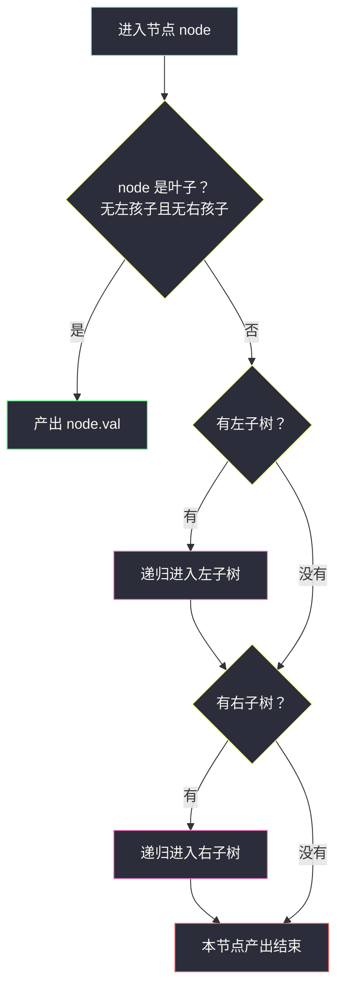
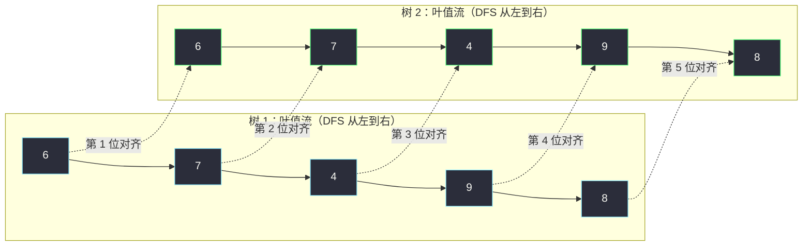

# 872. 叶子相似的树（Leaf-Similar Trees）

> 题目来源：[https://leetcode.cn/problems/leaf-similar-trees/](https://leetcode.cn/problems/leaf-similar-trees/)
>
> 灵茶题单小节：§2.1 遍历二叉树（难度分 1288）

## 一、问题描述

考虑一棵二叉树上**所有的叶子**，把这些叶子的值**按从左到右的顺序**排列，就得到这棵树的**叶值序列**。

如果两棵二叉树的叶值序列相同，就称它们是**叶相似**的。

给定两棵二叉树的根节点 `root1` 和 `root2`，如果它们叶相似就返回 `true`，否则返回 `false`。

**数据范围**：

- 每棵树的节点数在 `[1, 200]` 范围内
- 节点值在 `[0, 200]` 范围内

**示例 1**：

```text
输入：root1 = [3,5,1,6,2,9,8,null,null,7,4], root2 = [3,5,1,6,7,4,2,null,null,null,null,null,null,9,8]
输出：true
解释：

  树 1                     树 2
      3                       3
    /   \                   /   \
   5     1                 5     1
  / \   / \               / \   / \
 6   2 9   8             6   7 4   2
    / \                           / \
   7   4                         9   8

叶值序列（从左到右）：[6,7,4,9,8] 与 [6,7,4,9,8] —— 相同，叶相似。
```

**示例 2**：

```text
输入：root1 = [1,2,3], root2 = [1,3,2]
输出：false
解释：叶值序列 [2,3] 与 [3,2] 不同。
```

**核心思考点**：题目把比较的对象限定在**叶子**上，且顺序是**从左到右**——这恰好就是深度优先搜索（先递归左子树、再递归右子树）访问叶子的天然顺序。所以问题转化为：**怎么按这个顺序「流式」产出叶值，再让两棵树的叶值逐个对齐比较**。

## 二、暴力解法

### 思路

最直接的翻译：

1. 分别完整遍历两棵树，把叶值按从左到右的顺序收进两个**列表**；
2. 比较两个列表是否相等（长度相同且每位相同）。

### 代码

```python
class Solution:
    def leafSimilar(self, root1: Optional[TreeNode], root2: Optional[TreeNode]) -> bool:
        def collect(root, seq):
            """先序遍历：遇到叶子（无左右孩子）就把值收进 seq"""
            if root.left is None and root.right is None:
                seq.append(root.val)        # 叶子：记录
                return
            if root.left:                   # 先左
                collect(root.left, seq)
            if root.right:                  # 后右
                collect(root.right, seq)

        a, b = [], []                       # 两棵树各自的叶值序列
        collect(root1, a)
        collect(root2, b)
        return a == b                       # 列表整体比较
```

### 复杂度

- 时间 `O(n1 + n2)`：每棵树各访问一遍。
- 空间 `O(n1 + n2)`：两个叶值列表 + 递归栈。

## 三、优化探索

### 暴力版差在哪

功能上暴力版完全正确，但它有 **两个浪费**：

1. **必须扫完两棵树**：哪怕第一片叶子就不相同（如 `root1 = [1,2]`、`root2 = [9,2]`，叶序列 `[2]` 与 `[2,2]` 第 2 位就分叉），它也要把两棵树全部走完、列表全部建完才比较。
2. **中间列表**：叶值先攒进列表再整体比较，占了一份额外空间。

「从左到右产出叶值」的本质是一个**数据流**——两棵树的流**逐位对齐**比较，一旦某位不同即可宣判 `false`。Python 的**生成器**（`yield`）正是为「按需产出、边产边消费」设计的：

- 把「遍历树产出叶值」写成生成器 `leaves(root)`；
- 用 `zip_longest` 把两个生成器**并行拉齐**（`zip` 会在较短一方耗尽时停止，会漏掉「一方多出叶子」的情况，必须用 `zip_longest`）；
- 填充值用哨兵对象，与任何真实叶值（`[0,200]` 内的整数）都不同。



这个「先判断当前节点是不是叶子、不是才递归左右」的骨架，就是**带短路语义的先序遍历**：产出顺序 = 左子树的所有叶子 + 右子树的所有叶子，与题目要求的从左到右完全一致。

## 四、代码实现

```python
from itertools import zip_longest

class Solution:
    def leafSimilar(self, root1: Optional[TreeNode], root2: Optional[TreeNode]) -> bool:
        SENTINEL = object()                  # 哨兵：与任何叶值都不同的对象

        def leaves(root):
            """生成器：按从左到右顺序产出 root 的所有叶值"""
            if root.left is None and root.right is None:
                yield root.val               # 叶子：产出一个值
                return
            if root.left:
                yield from leaves(root.left) # 左子树的叶子先全部产出
            if root.right:
                yield from leaves(root.right)

        # 两棵树的叶值流逐位对齐；任何一方耗尽就以哨兵补位
        for a, b in zip_longest(leaves(root1), leaves(root2), fillvalue=SENTINEL):
            if a != b:                       # 位不同：包括「一方是哨兵（叶子数不同）」
                return False
        return True
```

### 细节说明

- **`yield from` 的语义**：`yield from leaves(root.left)` 会把左子树生成器产出的每个值**原样转发**，效果等价于 `for v in leaves(root.left): yield v`，但少一层样板代码。这保证了「左子树所有叶子严格先于右子树叶子」的顺序。
- **为什么用 `zip_longest` 而不是 `zip`**：`zip` 在较短的一方耗尽时立刻停止，`[2]` 与 `[2,2]` 会被误判为相似。`zip_longest` 会用 `fillvalue` 补齐到较长一方，补出的哨兵与另一方的真实叶值必然不等，从而正确返回 `false`。
- **哨兵为什么用 `object()` 而不是 `-1` 之类**：叶值可以是 `[0,200]` 的任何整数，任何「魔法数字」都可能撞上真实叶值；`object()` 是独一无二的临时对象，地址级别的唯一性，`!=` 任何整数恒真。
- **空树不存在**：数据范围保证节点数 ≥ 1，所以 `root1`、`root2` 至少有一个叶子（单节点树自己就是叶子），生成器至少各产出一个值。
- **提前退出**：第一位叶值不同时，两个生成器都停在中途，未访问的子树全部跳过——这是对拍验证「最坏也能提前终止」的来源。

## 五、例子演示

用**示例 1** 走一遍两个叶值流的逐位对齐过程（`L1` 是树 1 的生成器，`L2` 是树 2 的）：

| 轮次 | L1 产出（来自） | L2 产出（来自） | 是否相等 | 结论 |
|---|---|---|---|---|
| 1 | `6`（树1 节点 6，最左叶） | `6`（树2 节点 6） | ✅ 相等 | 继续 |
| 2 | `7`（节点 2 的左孩子 7） | `7`（节点 5 的右孩子 7） | ✅ 相等 | 继续 |
| 3 | `4`（节点 2 的右孩子 4） | `4`（节点 1 的左孩子 4） | ✅ 相等 | 继续 |
| 4 | `9`（节点 1 的左孩子 9） | `9`（节点 2 的左孩子 9） | ✅ 相等 | 继续 |
| 5 | `8`（节点 1 的右孩子 8） | `8`（节点 2 的右孩子 8） | ✅ 相等 | 继续 |
| 结束 | 流耗尽 | 流耗尽 | 双方同时结束 | **返回 true** |

再看**示例 2** 的提前退出（`[1,2,3]` 对 `[1,3,2]`）：

| 轮次 | L1 产出 | L2 产出 | 是否相等 | 结论 |
|---|---|---|---|---|
| 1 | `2`（左孩子 2） | `3`（左孩子 3） | ❌ 不等 | **立即返回 false**，两棵树的其余部分不再访问 |



注意两棵树的**内部结构完全不同**（节点 2 的位置、9/8 的挂法都不一样），但叶值流完全一致——题目只关心叶子，不关心枝干。

## 六、复杂度分析

- **时间复杂度：`O(n1 + n2)`**（最坏情况，两树叶序列完全相同要全比完）。若最早在第 `k` 位叶值分叉，实际只访问产出前 `k` 位所经过的路径，**平均情形显著快于暴力版**。
- **空间复杂度：`O(h1 + h2)`**（`h` 为树高）：生成器递归栈深度 = 当前 DFS 路径长度，不再保留整条叶值列表。最坏（斜树）`O(n)`，平衡树 `O(log n)`。

## 七、对比总结

| 方案 | 遍历次数 | 中间结构 | 提前退出 | 空间 |
|---|---|---|---|---|
| 暴力：两列表收集后 `==` | 两树各一遍 | 两个叶值列表 | ❌ 必须全收集 | `O(n1+n2)` |
| 生成器 + `zip_longest` | 按需推进 | 无（流式） | ✅ 首个不同位即停 | `O(h1+h2)` |

| 易错点 | 说明 |
|---|---|
| 用 `zip` 而非 `zip_longest` | `[2]` 与 `[2,2]` 被 `zip` 截断成 `[2]` 与 `[2]`，误判相似 |
| 叶子判定漏条件 | 「无左孩子且无右孩子」才是叶子；只有左孩子为空不是叶子 |
| `yield from` 顺序 | 必须先左后右；交换后产出顺序就不是「从左到右」 |
| 哨兵用魔法数字 | `-1`、`None` 都可能与业务值或约定冲突，`object()` 唯一 |

**一句话**：把「叶值序列」看作一条流，比较两条流就回到了最朴素的对齐问题——生成器让「按需产出」零成本落地。

## 八、举一反三

- **#100 相同的树**（https://leetcode.cn/problems/same-tree/）：不比叶子比**整树**——同样双树并行 DFS，逐节点对齐比较。本题的 `zip_longest` 对齐思想换成「两节点同步递归」。
- **#572 另一棵树的子树**（https://leetcode.cn/problems/subtree-of-another-tree/）：子树整树匹配的进阶版，仍以 `#100` 为积木。
- **#965 单值二叉树**（站内姊妹篇 `univalued-binary-tree.md`）：把「逐位比较两棵树的叶子流」换成「单树内所有节点与标准值比较」，同样是 DFS 框架的变体。
- **#993 二叉树的堂兄弟节点**（站内 `cousins-in-binary-tree.md`）：DFS 换 BFS 后如何携带父节点、深度信息，本批同族文章。
- **网格图上的 DFS 框架迁移**（站内 `detect-cycles-in-2d-grid.md`、`making-a-large-island.md`）：「先访问自身、再递归相邻单元」的骨架与树的先序遍历同构，可用于体会 DFS 的通用形态。

> **框架总结**：「收集后比较」能过的题，「流式对齐」往往更优雅——凡比较对象是一段**按序产出**的序列（叶值、路径、逐层统计），都可以考虑生成器 + `zip_longest`。
