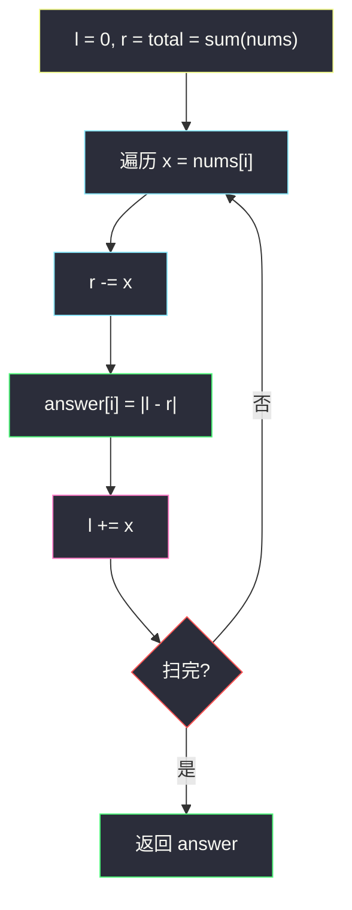

# 2574. 左右元素和的差值（Left and Right Sum Differences）

> 题目来源：[https://leetcode.cn/problems/left-and-right-sum-differences/](https://leetcode.cn/problems/left-and-right-sum-differences/)
>
> 灵茶题单小节定位：§0.5 前缀和

## 一、问题描述

给你一个下标从 0 开始、长度为 `n` 的整数数组 `nums`。

定义两个数组 `leftSum` 和 `rightSum`，其中：

- `leftSum[i]` 是数组 `nums` 中下标 `i` **左侧**元素之和；如果不存在对应的元素，`leftSum[i] = 0`。
- `rightSum[i]` 是数组 `nums` 中下标 `i` **右侧**元素之和；如果不存在对应的元素，`rightSum[i] = 0`。

返回长度为 `n` 的数组 `answer`，其中 `answer[i] = |leftSum[i] - rightSum[i]|`。

**数据范围**：

- `1 <= nums.length <= 1000`
- `1 <= nums[i] <= 10⁵`

**示例 1**：

```text
输入：nums = [10,4,8,3]
输出：[15,1,11,22]
解释：leftSum  = [0,10,14,22]，rightSum = [15,11,3,0]，
     answer = [|0-15|, |10-11|, |14-3|, |22-0|] = [15,1,11,22]。
```

**示例 2**：

```text
输入：nums = [1]
输出：[0]
解释：leftSum = [0]，rightSum = [0]，answer = [0]。
```

**核心思考点**：与「找中间位置」(#1991) 是同一副骨架——`l` 从 0 累加、`r` 从总和递减，两个滚动变量随扫描同步滑动。区别只在**输出**：#1991 命中相等就提前返回，本题对每个下标都要输出 `|l − r|`，是「全量收集」形态。还能玩一步消元：`answer[i] = |2·l + nums[i] − total|`，连 `r` 都可以省。

## 二、暴力解法

### 思路

对每个下标 `i`，分别切片求左侧和与右侧和，差的绝对值入答案。定义直译，零优化。

### 代码

```python
def leftRightDifferenceBrute(nums: list[int]) -> list[int]:
    return [abs(sum(nums[:i]) - sum(nums[i + 1:])) for i in range(len(nums))]
```

### 复杂度

- 时间：`O(n²)`——每个下标两趟切片求和。`n = 1000` 时约 10⁶ 次加法，可过但浪费。
- 空间：`O(1)`（不计返回值）。

## 三、优化探索

### 3.1 滚动变量：右侧和 = 总和的倒扣 ⭐

`rightSum[i] = total − nums[i] − leftSum[i]`，所以不必真的从右往再扫一遍——一趟从左到右即可，`r` 从 `total` 出发，每轮先扣掉当前元素（它不属于任何一侧），此刻 `(l, r)` 恰是下标 `i` 的左右和；输出后把元素加进 `l`，滑向下一个下标。

「先扣、再取、后加」三步的顺序是正确性核心，与 #1991 完全一致，只是把「比较相等」换成「收集绝对差」。

### 3.2 消元：单变量公式 ⭐

代入 `r = total − x − l`：

```text
answer[i] = |l − r| = |2·l + x − total|
```

其中 `l` 是下标 `i` 的左侧和、`x = nums[i]`。单变量版本少一次更新，更适合讲清「前缀和 = 滚动累加」的本质。

### 3.3 前缀和数组的通用写法（视野拓展）

如果题目改成**多次查询**任意下标的左右和，滚动变量就不够了——应预处理前缀和数组 `pre[i] = nums[0..i-1] 之和`，则 `leftSum[i] = pre[i]`、`rightSum[i] = pre[n] − pre[i+1]`，每次查询 `O(1)`。本题单次全量输出，滚动变量最优。



## 四、代码实现

### 主解：双滚动变量

```python
class Solution:
    def leftRightDifference(self, nums: List[int]) -> List[int]:
        l, r = 0, sum(nums)
        ans = []
        for x in nums:
            r -= x                      # x 不属于右侧
            ans.append(abs(l - r))      # 此刻 (l, r) 即 i 的左右和
            l += x                      # x 归入左侧
        return ans
```

### 进阶：单变量消元版

```python
class Solution:
    def leftRightDifference(self, nums: List[int]) -> List[int]:
        total = sum(nums)
        l = 0
        ans = []
        for x in nums:
            ans.append(abs(2 * l + x - total))
            l += x
        return ans
```

### 细节说明

- **顺序「扣 → 取 → 加」**：判定/收集时刻当前元素必须两侧都不算；写反一步，示例 1 的 `answer[0]` 就会错成 `|0 − 25|`。
- **首尾边界自动成立**：i=0 时 `l = 0`（左侧空）、i = n−1 时 `r = 0`（右侧空），无需特判——`[1]` 输出 `[0]` 由公式自然得出。
- **元素全正**（`1 ≤ nums[i] ≤ 10⁵`）：本题不会出现负数，但主解对负数同样成立（#1991 那边有负数例证）。
- **`n = 1000`、值 10⁵**：`total ≤ 10⁸`，Python 无溢出；Java `int` 也安全。

## 五、例子演示

**示例 1 端到端：nums = [10,4,8,3]，total = 25**

| 轮次 | i | x | r 扣减后 | l（取值时刻） | answer[i] = \|l − r\| | l 更新后 |
|---|---|---|---|---|---|---|
| 1 | 0 | 10 | 15 | 0 | \|0 − 15\| = **15** | 10 |
| 2 | 1 | 4 | 11 | 10 | \|10 − 11\| = **1** | 14 |
| 3 | 2 | 8 | 3 | 14 | \|14 − 3\| = **11** | 22 |
| 4 | 3 | 3 | 0 | 22 | \|22 − 0\| = **22** | 25 |

返回 `[15, 1, 11, 22]` ✅。核对定义：`leftSum = [0,10,14,22]`、`rightSum = [15,11,3,0]`，与表格两列逐位吻合——滚动量与定义式完全等价。

**单变量公式抽查（i = 2）**：`|2×14 + 8 − 25| = |11| = 11` ✅ 与双变量版一致。

**示例 2：nums = [1]，total = 1**：唯一一轮 `r = 0`、`l = 0`，`answer = [0]` ✅。

## 六、复杂度分析

- **时间复杂度：`O(n)`**——一趟求和 + 一趟扫描。
- **空间复杂度：`O(1)`**——不计返回数组，仅常数个标量。

## 七、对比总结

| 维度 | 暴力（切片重算） | 主解（双滚动） | 进阶（单变量） |
|---|---|---|---|
| 时间 | `O(n²)` | `O(n)` | `O(n)` |
| 空间 | `O(1)` | `O(1)` | `O(1)` |
| 变量数 | 0 | 2 | 1 |
| 可读性 | 直白 | 对称直观 | 公式化 |
| 多查询扩展 | 差 | 不适合 | 需前缀和数组 |

**套路归纳**：本题与 #1991 构成「滚动双侧和」骨架的一对 twins——同一状态 `(l, r)`，一个做**判定**（找相等、提前返回），一个做**投影**（逐位输出差的绝对值）。识别特征：凡是「左右和 / 前后缀」成对出现的题，先写 `r = total − x − l` 的恒等式，再决定维护单变量还是双变量。多查询场景升级为前缀和数组 `pre`，`O(1)` 查任意区间。

## 八、举一反三

1. **[1991. 找到数组的中间位置](https://leetcode.cn/problems/find-the-middle-index-in-array/)**：本批姊妹篇 `find-the-middle-index-in-array.md`，同骨架的「判定」形态。
2. **[724. 寻找数组的中心下标](https://leetcode.cn/problems/find-pivot-index/)**：同题族原版，左右和相等的判定。
3. **[303. 区域和检索 - 数组不可变](https://leetcode.cn/problems/range-sum-query-immutable/)**：前缀和数组模板，本题「多次查询」的进化方向。
4. **[3427. 分割字符串的方案数](https://leetcode.cn/problems/split-string-into-max-deletable-substrings/)**：前后缀分解的字符串版，同一对「左/右」视角。
5. **[238. 除自身以外数组的乘积](https://leetcode.cn/problems/product-of-array-except-self/)**：把「和」换成「积」的左右分解——前缀积 × 后缀积，骨架同构、运算不同。

**同族互引**：灵茶题单 §0.5 前缀和开场双题之一；进阶的「前缀积」思路与 base 工程 `product-of-array-except-self.md` 同源，可对照阅读。
