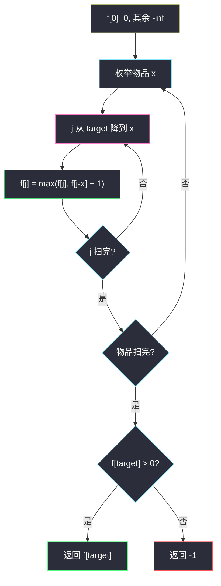

# 2915. 和为目标值的最长子序列的长度（Length of the Longest Subsequence That Sums to Target）

> 题目来源：[https://leetcode.cn/problems/length-of-the-longest-subsequence-that-sums-to-target/](https://leetcode.cn/problems/length-of-the-longest-subsequence-that-sums-to-target/)
>
> 灵茶题单小节定位：§3.1 0-1 背包

## 一、问题描述

给你下标从 0 开始的整数数组 `nums` 和一个整数 `target`。返回元素和恰好为 `target` 的子序列中，**长度的最大值**。不存在则返回 `-1`。

子序列：删除若干（也可不删）元素后，剩余元素保持原相对顺序。本题只关心和与长度，顺序不影响转移。

**数据范围**：

- `1 <= nums.length <= 1000`
- `1 <= nums[i] <= 1000`
- `1 <= target <= 1000`

**示例 1**：

```text
输入：nums = [1,2,3,4,5], target = 9
输出：3
解释：和为 9 的子序列有 [4,5]、[1,3,5]、[2,3,4]，最长长度 3。
```

**示例 2**：

```text
输入：nums = [4,1,3,2,1,5], target = 7
输出：4
解释：最长的是 [1,3,2,1]（还有 [4,3]、[4,1,2] 等更短的）。
```

**示例 3**：

```text
输入：nums = [1,1,5,4,5], target = 3
输出：-1
解释：无法凑出和 3。
```

**核心思考点**：每个数**至多选一次**，容量是 `target`，价值是「长度 +1」，求恰好装满的最大价值 → 标准 **0-1 背包**。`f[j]` = 和为 `j` 的最长长度；不可达用 `-inf`，避免用 0 把「凑不出」和「空序列」搞混。逆序更新容量，防止同一物品用两次。

## 二、暴力解法

### 思路

枚举全部非空子集（用 bitmask），和恰好为 `target` 的取最大元素个数。与背包代码完全独立。

### 代码

```python
def lengthOfLongestSubsequenceBrute(nums: list[int], target: int) -> int:
    n = len(nums)
    ans = -1
    for mask in range(1, 1 << n):
        s = cnt = 0
        ok = True
        for i in range(n):
            if mask >> i & 1:
                s += nums[i]
                cnt += 1
                if s > target:
                    ok = False
                    break
        if ok and s == target:
            ans = max(ans, cnt)
    return ans
```

### 复杂度

- 时间：`O(2ⁿ · n)`。`n = 1000` 不可行；`n ≤ 12` 可对拍。
- 空间：`O(1)`。

## 三、优化探索

### 3.1 为什么是 0-1 而不是完全背包 ⭐

每个下标的元素只能用一次。若内层 `j` **从小到大**更新，`f[j-x]` 可能已经包含当前 `x`，同一个数被反复加——那是完全背包（硬币无限）。必须 **`j` 从 `target` 降到 `x`**，保证 `f[j-x]` 仍是「还没放当前物品」的旧值。

反例：`nums = [2]`, `target = 4`。完全背包会得出长度 2（`2+2`），但数组里只有一个 2，正确答案是 `-1`。

### 3.2 状态与初值 ⭐⭐

二维：`g[i][j]` = 前 `i` 个数里，和恰好 `j` 的最长长度。

```text
g[0][0] = 0，其余 g[0][j] = -inf
g[i][j] = g[i-1][j]                          不选 nums[i-1]
g[i][j] = max(g[i][j], g[i-1][j-x] + 1)     选 x（j ≥ x）
```

答案：`g[n][target] > 0` 则取其值，否则 `-1`。空序列和为 0、长度 0，`target ≥ 1` 不会误把空序列当答案。

一维滚动：`f[j] = max(f[j], f[j-x] + 1)`，逆序 `j`。



### 3.3 `-inf` 而不是 0

若 `f` 初值全 0，则 `f[x] = max(0, f[0]+1) = 1` 仍对，但 `f[j]` 对凑不出的 `j` 也是 0，最后无法区分「长度 0 的非法」与「根本没更新」。用 `-inf`：只有从 `f[0]` 一路加出来的格子才是非负长度。

## 四、代码实现

### 主解：一维 0-1 背包（最大化长度）

```python
class Solution:
    def lengthOfLongestSubsequence(self, nums: list[int], target: int) -> int:
        NEG = -10**9
        f = [0] + [NEG] * target
        for x in nums:
            for j in range(target, x - 1, -1):
                f[j] = max(f[j], f[j - x] + 1)
        return -1 if f[target] <= 0 else f[target]
```

### 对照：二维（不滚动，便于画表）

```python
class Solution:
    def lengthOfLongestSubsequence(self, nums: list[int], target: int) -> int:
        n = len(nums)
        NEG = -10**9
        g = [[NEG] * (target + 1) for _ in range(n + 1)]
        g[0][0] = 0
        for i, x in enumerate(nums, 1):
            for j in range(target + 1):
                g[i][j] = g[i - 1][j]
                if j >= x:
                    g[i][j] = max(g[i][j], g[i - 1][j - x] + 1)
        return -1 if g[n][target] <= 0 else g[n][target]
```

二维里 `g[i][j]` 只读上一行，内层 `j` 正序逆序都行；压成一维后**必须逆序**，否则串味成完全背包。

### 细节说明

- **`x > target`**：内层 `range(target, x-1, -1)` 为空，该物品自动跳过，正确。
- **`f[target] <= 0`**：`-inf+…` 仍 ≤ 0；合法长度至少 1（`target ≥ 1`）。
- **相同数值多个**：`[1,1,1]` 是三个物品，逆序更新下每个 1 仍只加一次，可以三个都选。
- **不要提前 `break`**：后面更小的数可能拼出更长序列（示例 2 的四个 1 位数比一个 4 更长）。
- **子序列 vs 子数组**：不要求连续，所以没有「区间」维，纯背包。

## 五、例子演示

**示例 1 端到端：`nums = [1,2,3,4,5]`, `target = 9`**

只列出被更新到的格子（未写出的仍是 `-inf`）。逐物品、逆序容量。

**物品 1**：`f[1] = 1`

**物品 2**：`j=3`：`f[1]+1=2`；`j=2`：`f[0]+1=1`  
`f = [0, 1, 1, 2, …]`

**物品 3**：

| j | 来源 | 新 f[j] |
|---|---|---|
| 6 | f[3]+1=3 | 3 |
| 5 | f[2]+1=2 | 2 |
| 4 | f[1]+1=2 | 2 |
| 3 | max(2, f[0]+1=1) | 2 |

**物品 4**：

| j | 来源 | 新 f[j] |
|---|---|---|
| 9 | f[5]+1=3 | **3** |
| 8 | f[4]+1=3 | 3 |
| 7 | f[3]+1=3 | 3 |
| 6 | max(3, f[2]+1=2) | 3 |
| 4 | max(2, f[0]+1=1) | 2 |

**物品 5**：`j=9`：`max(3, f[4]+1=3)=3`。其余不更长。

`f[9] = 3`，对应 `[2,3,4]` 或 `[1,3,5]` ✅。

**示例 2 要点**：多个 1 让同一容量被更长序列占据。处理完 `[4,1,3,2,1]` 后 `f[7]` 已被长度 4 的 `[1,3,2,1]` 写成 4，再放 5 也不会更长。

**示例 3**：`target=3`，数不是 1 就是 ≥4，`f[3]` 一直 `-inf`，返回 **-1** ✅。

**边界**：`nums=[1], target=1` → 1；全大于 `target` → -1；`[2,2,2], target=4` → 2（两个 2，不是三个）。

## 六、复杂度分析

设 `n = len(nums)`，`T = target`：

- **时间复杂度：`O(n T)`**——每件物品扫一遍容量。`n, T ≤ 1000` 可过。
- **空间复杂度：`O(T)`**——一维 `f`。二维写法 `O(n T)`。

## 七、对比总结

| 维度 | 子集枚举 | 0-1 背包（主解） | 完全背包（错） |
|---|---|---|---|
| 时间 | `O(2ⁿ n)` | `O(n T)` | `O(n T)` 但语义错 |
| 每件次数 | 0/1 | 0/1（逆序 j） | 无限（正序 j） |
| 优化目标 | 最长 | `f[j]` 存长度 | 会重复用同一元素 |

**套路归纳**：§3.1 0-1 背包把「选或不选每个物品」压成容量维。本题体积是数值、价值是 1，最大化价值且**必须恰好装满**。看见「子序列和为 T、每个最多一次」，先写 `f[0]=0` 其余 `-inf`，再逆序 `max(f[j], f[j-x]+价值)`。

## 八、举一反三

1. **[416. 分割等和子集](https://leetcode.cn/problems/partition-equal-subset-sum/)**：0-1 可行性，`f[j]` 改布尔。
2. **[494. 目标和](https://leetcode.cn/problems/target-sum/)**：加减号转成子集和计数。
3. **[1049. 最后一块石头的重量 II](https://leetcode.cn/problems/last-stone-weight-ii/)**：把石头分成两堆，0-1 背包逼近总和一半。
4. **[322. 零钱兑换](https://leetcode.cn/problems/coin-change/)**：对照完全背包（硬币无限、正序 j）。
5. **[1155. 掷骰子等于目标和的方法数](https://leetcode.cn/problems/number-of-dice-rolls-with-target-sum/)**：同目录 `number-of-dice-rolls-with-target-sum.md`，分组背包计数。

**同族互引**：本篇最大化「选了几个」；同批 `maximum-multiplication-score.md` 是另一根轴——`a` 必须全用、`b` 可选，本质是加权 LCS / 选或不选，不要误做成「对 b 取最大再相乘」的背包。
