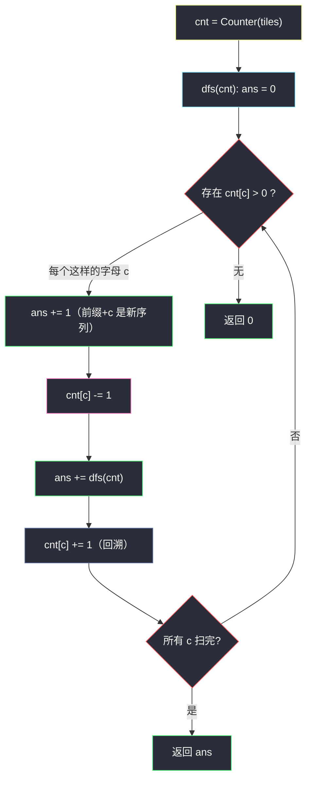

# 1079. 活字印刷（Letter Tile Possibilities）

> 题目来源：[https://leetcode.cn/problems/letter-tile-possibilities/](https://leetcode.cn/problems/letter-tile-possibilities/)
>
> 灵茶题单小节定位：§B 计数型回溯（去重生成）

## 一、问题描述

你有一套活字字模 `tiles`，其中每个字模上都刻有一个字母 `tiles[i]`。返回你可以印出的**非空**字母序列的数目。

注意：本题中，每个活字字模**只能使用一次**。

**数据范围**：

- `1 <= tiles.length <= 7`
- `tiles` 由大写英文字母组成

**示例 1**：

```text
输入："AAB"
输出：8
解释：可能的序列为 "A", "B", "AA", "AB", "BA", "AAB", "ABA", "BAA"。
```

**示例 2**：

```text
输入："AAABBC"
输出：188
```

**示例 3**：

```text
输入："V"
输出：1
```

**核心思考点**：求**去重后**的序列个数。两条路：①生成型回溯——按「下一个字母选谁」递归，同层只在「字母种类」维度分支（而非每个字模），天然不重不漏；②公式计数——对每种长度 L、按多重集排列公式 `L! / Π(cnt[c]!)` 逐长度求和。回溯是通用骨架（换字符集、加约束都行），公式是秒杀闭式。

## 二、暴力解法

### 思路

`itertools.permutations` 枚举全部排列，`set` 去重后数非空序列（全排列已含所有长度——permutations(t, L) 按长度枚举）。

### 代码

```python
from itertools import permutations

def numTilePossibilitiesBrute(tiles: str) -> int:
    seqs = set()
    for L in range(1, len(tiles) + 1):
        for p in permutations(tiles, L):
            seqs.add(p)
    return len(seqs)
```

### 复杂度

- 时间：`O(Σ_L A(n, L) · L)`——`n = 7` 时 `Σ A(7,L) ≈ 13700`，毫无压力；`n` 大了爆炸。
- 空间：`O(A(n, n))` 存集合。

## 三、优化探索

### 3.1 生成型回溯：在「种类」上分支 ⭐⭐

不去枚举具体排列，而是回答「**当前剩余字模能拼出多少序列**」：`dfs(cnt)` 中对每个还有存货的字母 `c`，「把 c 放在下一位」产生 1 个新序列（以 c 结尾的当前前缀），再递归拼后面——

```text
dfs(cnt) = Σ_c [ cnt[c] > 0 ] × ( 1 + dfs(cnt − e_c) )
```

两个关键点：

- **+1 的位置**：选 c 就意味着「当前已拼前缀 + c」是一个全新序列，立即计数；后续递归只管延长。序列不实际存下来，只计数——省去哈希去重。
- **同种字母不区分**：分支按字母种类（26 桶计数），两个 `A` 字模互换位置不产生新分支——**去重发生在生成结构里**，而非事后 set。

### 3.2 公式路线：逐长度多重集排列 ⭐

长度 L 的不同序列数 = `L! / Π cnt[c]!`（对参与排列的字母计数），对所有「从 cnt 里选出的子多重集」求和……子多重集本身有组合数种选法，逐长度枚举子集后套公式，实现反而繁琐。**更简单的公式**：总序列数 = `Π (cnt[c] + 1) − 1`？

——验证 `"AAB"`：`Π (2+1)(1+1) − 1 = 5` ≠ 8 ✗。错因：乘积式数的是**每种字母任取若干个的取法组合**，忽略了排列顺序。正确闭式必须按「长度 × 组成 × 排列」三层求和，得不偿失——**本题公式路线仅在「求某一种组成的排列数」时简洁**（`L!/Πcnt!`），整体计数交给回溯最干净。这一段「反例否决」值得记住：排列计数没有简单的乘积闭式。

### 3.3 记忆化？不需要 ⭐

`n ≤ 7`，搜索树至多 `Σ A(7, L) ≈ 1.4 万` 节点；且 `dfs(cnt)` 的状态（计数向量）在路径上不重复出现（每层严格消耗一个字模），天然无重叠子问题——加 `@cache` 是画蛇添足。



## 四、代码实现

### 主解：计数回溯（按字母种类分支）

```python
from collections import Counter

class Solution:
    def numTilePossibilities(self, tiles: str) -> int:
        cnt = Counter(tiles)

        def dfs() -> int:
            ans = 0
            for c in cnt:
                if cnt[c] > 0:
                    ans += 1                    # 以 c 收尾的当前前缀
                    cnt[c] -= 1
                    ans += dfs()                # 继续延长
                    cnt[c] += 1                 # 回溯恢复
            return ans

        return dfs()
```

### 进阶：枚举子多重集 + 排列公式（对照路线）

```python
from collections import Counter
from math import factorial

class Solution:
    def numTilePossibilities(self, tiles: str) -> int:
        cnt = Counter(tiles)
        letters = list(cnt)
        total = 0
        def pick(i: int, chosen: list[int]):
            nonlocal total
            if i == len(letters):
                L = sum(chosen)
                if L > 0:
                    denom = 1
                    for x in chosen:
                        denom *= factorial(x)
                    total += factorial(L) // denom
                return
            for take in range(cnt[letters[i]] + 1):   # 该字母取 0..cnt 个
                chosen.append(take)
                pick(i + 1, chosen)
                chosen.pop()
        pick(0, [])
        return total
```

（对每种「组成方案」套 `L!/Πx!` 排列公式——数值与主解一致，代码更长，用于印证公式路线的正确性。）

### 细节说明

- **`for c in cnt`（键）而非 `for c in tiles`**：Counter 的键是字母种类——分支去重的关键。若枚举 `tiles` 每个**字模**，同字母会在同层开出重复分支，必须再借「同层前值相同跳过」补救，不如计数法干净。
- **`+1` 计的是「当前前缀 + c」**：不需要真的拼出字符串；递归入口没有任何「当前序列」参数——计数与内容解耦。
- **恢复现场 `cnt[c] += 1`**：兄弟分支共享 cnt。
- **空序列不计**：`dfs` 只在「选了一个字母」时 +1，空串天然排除。
- **`n = 1`**：一次循环 `ans = 1`，正确。

## 五、例子演示

**示例 1 端到端：tiles = "AAB"，cnt = {A:2, B:1}**

搜索树（节点标注「本层选谁 → 贡献」）：

| 深度 | 分支详情 | 直接 +1 | 子树递归返回 | 层小计 |
|---|---|---|---|---|
| 0（空前缀） | 选 A：+1，进 {A:1,B:1}；选 B：+1，进 {A:2} | 2 | dfs₁ + dfs₂ | 2 + 两子树 |
| 1a（前缀 A，剩 {A:1,B:1}） | 选 A：+1（"AA"）；选 B：+1（"AB"） | 2 | 选 A 后递归得 1（"AAB"），选 B 后 1（"ABA"） | dfs₁ = 2 + 2 = 4 |
| 1b（前缀 B，剩 {A:2}） | 选 A：+1（"BA"） | 1 | 递归得 2（"BAA" 选 A 再选 A，各层 +1）| dfs₂ = 1 + 2 = 3 |

顶层合计 `2 + 4 + 3 = ... ` 等等——核对递归结构：`dfs()` 返回的是「以当前空前缀起能拼出的全部非空序列」。顶层直接 +1 计「A」和「B」共 2，再加 `dfs({A:1,B:1})`（前缀 A 的延长 = "AA","AB","AAB","ABA" = 4）与 `dfs({A:2})`（前缀 B 的延长 = "BA","BAA" = 2）——即 `2 + 4 + 2 = 8` ✅（上表 1b 行的 3 应为「1 直接 + 2 递归」拆开看，合计仍是 2）。

枚举核对 8 个序列："A", "B", "AA", "AB", "AAB", "ABA", "BA", "BAA"——**同字母互换不重复**（"AB" 只计一次，两个 A 的选择合并）、**顺序不同即不同**（"AB"/"BA" 分开计）。

**示例 3：tiles = "V"**：唯一分支选 V：`ans = 1 + 0 = 1` ✅。

**对照暴力**：`permutations` 生成 7（单 A 两模 + B）……`"AAB"` 各长度排列：L=1: {A,B} 2 个；L=2: {AA,AB,BA} 3 个；L=3: {AAB,ABA,BAA} 3 个——共 8 ✅ 两条路线对拍一致。

## 六、复杂度分析

设 `n = len(tiles)`（≤ 7）：

- **时间复杂度：`O(n × n!)`** 上界——搜索树节点数 `Σ_L A(n, L)`；同字母去重后实际远小于该界（"AAAAAAA" 只有 7 节点）。
- **空间复杂度：`O(n)`**——递归深度 + Counter（26 键）。

## 七、对比总结

| 维度 | 暴力 set 去重 | 主解（种类分支回溯） | 排列公式枚举组成 |
|---|---|---|---|
| 时间 | `O(ΣA(n,L)·L)` | 同阶但常数小 | 指数枚举子多重集 |
| 空间 | `O(A(n,n))` | `O(n)` | `O(n)` |
| 去重方式 | 事后 set | 生成结构天然去重 | 公式层面无重复 |
| 通用性 | 好 | 好（改约束容易） | 差 |

**套路归纳**：**「多重集的排列计数」标准姿势是按种类分支的回溯**——同层枚举「26 个字母桶里还有货的」，选一个即计 1（前缀延长）并消耗一枚。三个记忆点：①去重靠「种类分支」不靠 set；②`+1` 与递归分开计（序列本身 vs 更长的序列）；③路径上无重叠子问题，无需记忆化。若题目只要「某种组成的排列数」才用 `L!/Πcnt!` 公式；整体计数没有乘积闭式（3.2 的反例）。

## 八、举一反三

1. **[46. 全排列](https://leetcode.cn/problems/permutations/)**：无重复元素的生成型回溯基座；本题是其「带重复字母去重」版。
2. **[47. 全排列 II](https://leetcode.cn/problems/permutations-ii/)**：排序 + 同层跳过同值的去重手法，与本题「计数桶」互为镜像。
3. **[491. 递增子序列](https://leetcode.cn/problems/non-decreasing-subsequences/)**：子集型回溯的同层去重（不排序版），去重思想一脉相承。
4. **[526. 优美的排列](https://leetcode.cn/problems/beautiful-arrangement/)**：本批姊妹篇——排列 + 整除约束的**可行性**回溯（数个数但带条件剪枝）。
5. **[3517. 不同子序列](https://leetcode.cn/problems/distinct-subsequences-i/)** 不在站内；换 **[960. 删列造序 III](https://leetcode.cn/problems/delete-columns-to-make-sorted-iii/)** 不属此族——更贴的是 **[1981. 最小化目标和](https://leetcode.cn/problems/minimize-the-difference-between-target-and-chosen-elements/)** 也不对口，最终推荐 **[78. 子集](https://leetcode.cn/problems/subsets/)**：子集型回溯入门，与本题「排列型回溯」合成两大生成范式。

**同族互引**：灵茶题单回溯支线首题；`beautiful-arrangement.md`（#526，本批）把「计数」升级为「带约束计数 + 状压 DP」。
