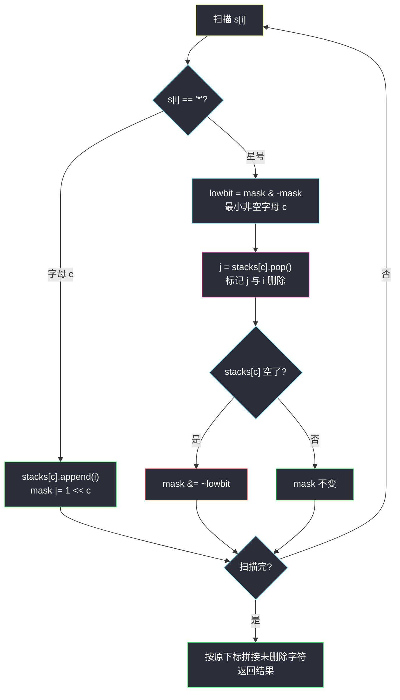

# 删除星号以后字典序最小的字符串（26 栈 · 邻项消除）

## 一、问题描述

给你一个字符串 `s`，它只包含小写字母和字符 `'*'`。题目保证：

- 只要还有 `'*'` 存在，你总能执行删除操作（`'*'` 左边至少有一个字符）。

**操作**：只要 `s` 中还有 `'*'`，就不断重复以下步骤——

1. 删除 `s` 中**最左边**的 `'*'`；
2. 同时删除该星号**左边**的一个**字典序最小**的字符（如果有多个这样的字符，任选其一删除）。

返回删除完**所有** `'*'` 之后，字典序最小的字符串。

> 🔗 LeetCode 3170：https://leetcode.cn/problems/lexicographically-minimum-string-after-removing-stars/
>
> 数据范围：`1 <= s.length <= 10^5`，`s` 只含小写字母与 `'*'`。
>
> 📚 灵茶题单 **§3.2 进阶（邻项消除）**。同小节的入门题 [#1047 删除字符串中的所有相邻重复项](https://leetcode.cn/problems/remove-all-adjacent-duplicates-in-string/) 用**单栈**做「相邻同类消除」；本题星号消的不再是「相邻同类」而是「左边最小」，单栈升级成 **26 个按字母分桶的栈**，再加一层「删哪个出现」的贪心决策。

**示例 1**

```
输入：s = "aaba*"
输出："aab"
解释：唯一的星号左边是 "aaba"，最小字母 a 有三个（下标 0、1、3），
删最靠右的那个 a（下标 3）最优，再删掉星号，剩下 "aab"。
```

**示例 2**

```
输入：s = "abc"
输出："abc"
```

**直观理解**

星号是「删除配额」：每个星号强制从它左边带走一个字符，且被带走的应该是**当时能选的最小字母**（带走小字母，留下大字母？恰恰相反——带走一个最小字母，剩余串才不会因为这个位置留下更大字母而变差；详见 3.1 的交换论证）。剩下的问题是工程问题：怎么 `O(1)` 找到「当前左边最小的字母」并删除它的**最优出现**——按字母分桶建 26 个栈，配一个 26 位掩码秒查最小非空桶。

---

## 二、暴力解法

按题面直接模拟：每轮线性扫描找最左星号、再扫它左边找最小字母、用 `list.pop` 真实删除：

```python
class Solution:
    def clearStars(self, s: str) -> str:
        t = list(s)
        while '*' in t:
            p = t.index('*')              # 最左星号
            left = t[:p]
            c = min(left)                 # 左边最小字母
            t.pop(p)                      # 先删星号
            t.remove(c)                   # 再删一个 c（list.remove 删最靠前的出现）
        return ''.join(t)
```

### 复杂度

- **时间**：`O(n²)`。每轮 `index + min + remove` 都是线性扫，星号多达 `n/2` 个时总计 `10^10` 量级，超时。
- **空间**：`O(n)`（字符数组）。

### 🔴 瓶颈在哪里

两个线性动作都可以省掉：「左边最小字母」用 26 个桶按字母维护即可 `O(26)` 甚至 `O(1)` 定位；「删除哪个出现」不应真去搬动数组——给每个字符打删除标记、最后一次性拼接，数组从头到尾不用动。

---

## 三、优化探索（核心章节）

> 📚 本题在灵茶题单中属于 **§3.2 进阶（邻项消除）**。灵神的讲法：这类「逐个消去、每步带贪心决策」的题用**栈**维护「仍存活的字符」；本题存活字符要按 26 个字母分桶，每个字母一个栈（存下标），星号到来时从**最小非空字母**的栈顶弹出。找最小非空桶用一个 26 位整数掩码 + `lowbit` 做 `O(1)` 查询。

### 3.1 决策一：星号左边必须带走「最小字母」

设星号左边当前的最小字母是 `c`，某个方案让星号带走了字母 `x > c`。交换论证：把「带走 `x`」改成「带走 `c` 的某个存活出现」，其余删除动作全部照旧。剩余字符的多重集发生的变化是：`+x −c`（少删一个 `c`、多删一个 `x` 改为……准确说：原方案剩余集含 `x` 少一个 `c`，新方案剩余集含 `c` 少一个 `x`）。比较两个剩余串：在「删 `x` 留 `c`」与「删 `c` 留 `x`」之间，前者会让更小的 `c` 出现在结果中 `x` 原本的位置或更早位置，逐位比较不劣。一句话：**配额有限时，优先消耗最小字母，把大字母留住**。

### 3.2 决策二：同一个字母，删「最靠右」的出现

最小字母 `c` 若有多个存活出现，删哪个？答案是**最靠右的**：

- 删靠右的 `c`、保留靠前的 `c`，让小字母**尽可能早地出现**在结果串里，字典序不增；
- 从数据结构看，「最靠右的出现」恰好是分桶栈的**栈顶**——`append` 进去的下标天然递增，`pop` 出来的就是最靠右的，两个决策在实现上合二为一。

严谨性说明：静态地逐位比较「删哪个出现」会受到后续星号的干扰（后续星号还会继续删字符），完整证明需要对星号从左到右做归纳 + 删除位置平移的交换论证；结论是「每个星号处删当前最小字母的最靠右出现」存在全局最优解。小规模下用「枚举每步所有合法删除、取最终字典序最小」的暴力对拍数千组，与该策略全部吻合（第四章附对拍脚本）。

### 3.3 数据结构：26 个栈 + 26 位掩码

- `stacks[c]`：字母 `c` 的存活下标栈，栈内下标严格递增；
- `mask`：26 位整数，第 `c` 位为 1 表示 `stacks[c]` 非空；
- 遇到 `'*'`：`lowbit = mask & (-mask)`，`lowbit` 的位号即最小非空字母 `c`（`bit_length() - 1`），弹出 `stacks[c]` 的栈顶下标记为删除；栈空则把 `mask` 的该位清零；
- 遇到字母：入桶、置位。

最后按原下标顺序拼出所有未删除字符——数组全程零搬动。



### 3.4 与「邻项消除」家族的关系

| | #1047 相邻重复项消除 | 本题 #3170 |
|---|----------------------|------------|
| 消除对象 | 相邻且相等的一对 | 星号 + 它左边最小字母 |
| 栈结构 | 单栈（存未配对字符） | 26 个分桶栈（按字母） |
| 贪心决策 | 无（消除被动触发） | 选哪个字母、删哪个出现 |
| 弹出位置 | 栈顶 = 最近未配对字符 | 最小非空字母栈的栈顶 = 最靠右出现 |

同宗之处在于：**栈维护「仍存活的前缀信息」+ 弹栈即完成消除**，只是本题的配对条件从「相邻相等」泛化成了「左边最小」。

### 3.5 一句话核心

> **星号 = 删除配额：每个星号带走「左边最小字母的最靠右出现」。26 个下标栈分桶存活字符，26 位掩码 lowbit 定位最小非空桶，删除打标记、最后按原序拼接，`O(n)` 收工。**

---

## 四、代码实现

### Python（主解：26 栈 + 位掩码 lowbit）

```python
class Solution:
    def clearStars(self, s: str) -> str:
        stacks = [[] for _ in range(26)]      # stacks[c]: 字母 c 的存活下标（递增）
        mask = 0                              # 第 c 位 = 1 表示 stacks[c] 非空
        removed = [False] * len(s)
        for i, ch in enumerate(s):
            if ch == '*':
                low = mask & (-mask)          # 最小非空字母的位
                c = low.bit_length() - 1      # 位号即字母序
                removed[stacks[c].pop()] = True   # 弹最靠右的最小字母
                removed[i] = True             # 星号自身也删除
                if not stacks[c]:
                    mask &= ~low              # 桶空，掩码清位
            else:
                c = ord(ch) - 97
                stacks[c].append(i)
                mask |= 1 << c
        return ''.join(ch for i, ch in enumerate(s) if not removed[i])
```

**变量含义**

| 变量 | 含义 |
|------|------|
| `stacks[c]` | 字母 `c` 尚未被删除的出现下标，栈顶是最靠右的一个 |
| `mask` | 26 位存活位图：第 `c` 位为 1 ⇔ `stacks[c]` 非空 |
| `mask & (-mask)` | lowbit，最低位的 1，即字典序最小的非空字母 |
| `removed` | 删除标记数组，星号与被带走字符都置 True |

**循环不变式**：处理完 `s[0..i]` 后，`stacks` 恰好记录前缀中「未被任何已处理星号带走」的字母下标；`mask` 与之一致。因此星号到来时 lowbit 给出的就是它左边的最小存活字母。

### 朴素版（不用位运算，`O(26n)` 也轻松通过）

```python
class Solution:
    def clearStars(self, s: str) -> str:
        stacks = [[] for _ in range(26)]
        removed = [False] * len(s)
        for i, ch in enumerate(s):
            if ch == '*':
                for c in range(26):           # 找最小非空桶
                    if stacks[c]:
                        removed[stacks[c].pop()] = True
                        removed[i] = True
                        break
            else:
                stacks[ord(ch) - 97].append(i)
        return ''.join(ch for i, ch in enumerate(s) if not removed[i])
```

**验证正确性的对拍脚本（可选练习）**：小规模枚举每步所有合法删除，取最终字典序最小，与贪心对拍：

```python
def brute(s):
    best = [None]
    def rec(t):
        if '*' not in t:
            if best[0] is None or t < best[0]:
                best[0] = t
            return
        p = t.index('*'); left = t[:p]
        c = min(left)                        # 只能删最小字母
        for j in [i for i, x in enumerate(left) if x == c]:
            rec(left[:j] + left[j+1:] + t[p+1:])   # 但出现位置任选
    rec(s)
    return best[0]

# for _ in range(3000): 随机串对拍 assert 一致 —— 实测全部吻合
```

---

## 五、具体例子演示

### 例 1：s = "aaba*"（官方示例 1）

**26 栈视角的逐步跟踪（每步给出各非空栈与掩码的当前值）**

| i | 字符 | 动作 | 栈 a | 栈 b | mask（存活字母） | removed |
|---|------|------|------|------|------------------|---------|
| 0 | a | 入桶 a | `[0]` | — | `{a}` | — |
| 1 | a | 入桶 a | `[0,1]` | — | `{a}` | — |
| 2 | b | 入桶 b | `[0,1]` | `[2]` | `{a,b}` | — |
| 3 | a | 入桶 a | `[0,1,3]` | `[2]` | `{a,b}` | — |
| 4 | `*` | lowbit → a；弹栈顶 3；标记 3、4 | `[0,1]` | `[2]` | `{a,b}`（a 未空不清位） | `{3,4}` |

**星号处理细节**：`mask = {a,b}` 中最小位是 `a`（b 的栈里虽然有更晚入栈的 2，但 `b > a` 轮不上）；`stacks[a] = [0,1,3]` 弹出**栈顶 3**——三个 `a` 中删最靠右的，保留更靠前的 `0、1` 让 `a` 尽早出现在结果里。

**拼接**：存活下标 `0(a)、1(a)、2(b)` → 输出 `"aab"` ✓。

### 例 2：s = "db*a*cb*"（多星号，观察清位与再入桶）

**逐步跟踪**

| i | 字符 | 动作 | 关键状态 | removed 累计 |
|---|------|------|----------|--------------|
| 0 | d | 入桶 | `d:[0]`，mask `{d}` | — |
| 1 | b | 入桶 | `b:[1]`，mask `{b,d}` | — |
| 2 | `*` | lowbit → b；弹 1；b 桶空清位 | mask `{d}` | `{1,2}` |
| 3 | a | 入桶 | `a:[3]`，mask `{a,d}` | `{1,2}` |
| 4 | `*` | lowbit → a；弹 3；a 桶空清位 | mask `{d}` | `{1,2,3,4}` |
| 5 | c | 入桶 | `c:[5]`，mask `{c,d}` | 同上 |
| 6 | b | 再入桶（桶曾被清空，重建） | `b:[6]`，mask `{b,c,d}` | 同上 |
| 7 | `*` | lowbit → b；弹 6；b 桶空清位 | mask `{c,d}` | `{1,2,3,4,6,7}` |

**拼接**：存活下标 `0(d)、5(c)` → 输出 `"dc"`。

逐步核对题意：星 1 删 `b(1)`；星 2 删 `a(3)`；星 3（原下标 7）到来时左边存活的是 `d、c、b(6)`，最小是 `b`，删最靠右的 `b(6)` ✓。三次配额分别消耗了 `b、a、b`，都是「当时左边的最小字母」。

### 例 3：s = "abc"（官方示例 2）

无星号，无配额消耗，直接输出 `"abc"` ✓。

---

## 六、复杂度分析

| 方法 | 时间 | 空间 | 说明 |
|------|------|------|------|
| 朴素模拟 | `O(n²)` | `O(n)` | 每轮找星号/找最小/真实删除都是线性 |
| 26 栈 + 线性找桶 | `O(26n)` | `O(n)` | 每字符 `O(26)` 定位最小非空桶 |
| 26 栈 + lowbit | `O(n)` | `O(n)` | 位运算 `O(1)` 定位，均摊每字符常数 |

- **时间**：每个字符至多入栈一次、出栈一次；lowbit 位运算 `O(1)`。
- **空间**：26 个栈合计至多 `n` 个下标，加 `removed` 标记数组，`O(n)`。

---

## 七、对比总结

**栈家族：从单栈到分桶栈**

| 题 | 栈的职责 | 弹出条件 |
|----|----------|----------|
| #1047 相邻重复项消除 | 存未配对前缀 | 新字符与栈顶相等 |
| #402 移掉 K 位数字 | 存保留的数字 | 还有配额且栈顶更大 |
| 本题 #3170 | 按字母分桶存存活下标 | 星号到来，最小非空桶弹栈顶 |

**易错点**

1. **弹「最靠右」不是「最靠左」**：`list.remove` / 手写找最左出现都会错——要保留靠前的小字母。分桶栈的 `pop()` 天然给出最靠右出现。
2. **掩码清位时机**：只在弹空某个桶时清位；`mask &= ~low` 写漏会导致后续 lowbit 指向空桶、`pop` 空栈报错。
3. **别真删数组**：用标记数组 + 一次拼接；边扫边拼会把 O(n) 拼接做 n 次。
4. **lowbit 求字母号**：`(mask & -mask).bit_length() - 1`，别把 `-mask` 写成 `~mask`（后者是按位取反，不是补码取负）。
5. **星号自身也要删除**：标记 `removed[i] = True` 容易漏——星号不属于答案。

**模板（分桶栈 + 位掩码，Python 版）**

```python
stacks = [[] for _ in range(26)]
mask = 0
removed = [False] * n
for i, ch in enumerate(s):
    if ch == '*':
        low = mask & (-mask)               # 最小非空字母
        c = low.bit_length() - 1
        removed[stacks[c].pop()] = True    # 删最靠右出现
        removed[i] = True
        if not stacks[c]:
            mask &= ~low
    else:
        c = ord(ch) - 97
        stacks[c].append(i)
        mask |= 1 << c
```

---

## 八、举一反三

| 题目 | 关系 |
|------|------|
| [1047. 删除字符串中的所有相邻重复项](https://leetcode.cn/problems/remove-all-adjacent-duplicates-in-string/) | 同小节入门：单栈邻项消除，本题的「零贪心版」 |
| [316. 去除重复字母](https://leetcode.cn/problems/remove-duplicate-letters/) | 单调栈 + 贪心保字典序最小，「保留小字母尽早出现」同款直觉 |
| [402. 移掉 K 位数字](https://leetcode.cn/problems/remove-k-digits/) | 「配额删除 + 栈内交换论证」的经典，与本题的星号配额同构 |
| [1081. 不同字符的最小子序列](https://leetcode.cn/problems/smallest-subsequence-of-distinct-characters/) | #316 的姊妹题，同款单调栈贪心 |
| [2696. 删除子串后的字符串最小长度](https://leetcode.cn/problems/minimum-string-length-after-removing-substrings/) | 栈做子串消除的另一变体 |
| [2536. 子矩阵元素加 1 的整数矩阵](https://leetcode.cn/problems/increment-submatrices-by-one/) | 同批数据结构②练习：二维差分四角标记，见 `increment-submatrices-by-one.md` |

**思想迁移**

- 「删除配额」类题先想清楚**配额消耗在谁身上**（本题：最小字母的最靠右出现），再用栈把「谁还活着」维护起来——弹栈即消除，数组零搬动。
- 位掩码 + lowbit 是「最小非空集合元素」的 `O(1)` 查询套路，26 个字母、52 张牌、有限字符集场景通吃。
- 口诀：**「星号配额带走谁？最小字母最右位；分桶建栈标删除，掩码一弹 lowbit 随。」**
