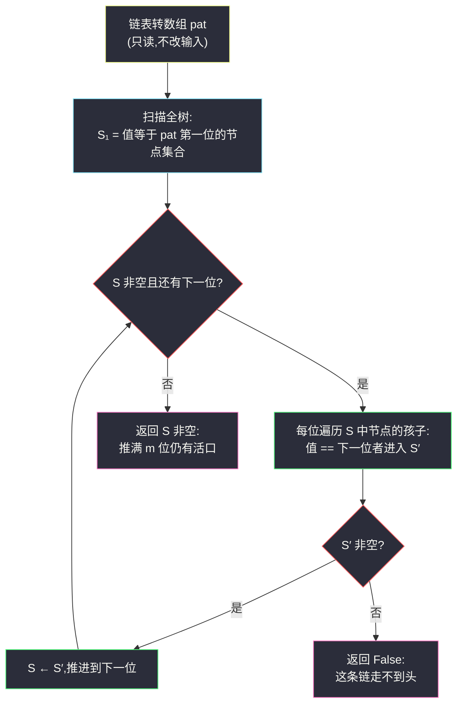
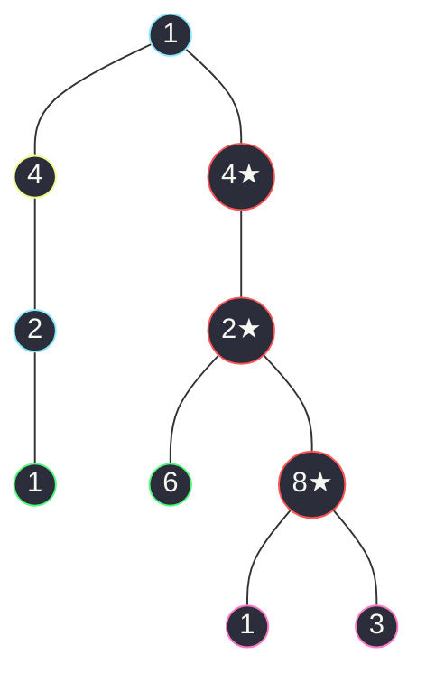

# 1367. 二叉树中的链表(Linked List in Binary Tree)

> 🔗 LeetCode 1367:https://leetcode.cn/problems/linked-list-in-binary-tree/
>
> 📚 灵茶题单小节:§「二叉树与递归·树中匹配链表」练习(树上的子序列判定)

## 一、问题描述

给你一棵以 `root` 为根的二叉树和一个以 `head` 为第一个节点的链表。

如果在二叉树中,存在一条**一直向下**的路径,且路径上每个点的数值恰好一一对应以 `head` 为首的链表中每个节点的值,那么返回 `True`,否则返回 `False`。

「一直向下的路径」指:从树中某个节点开始,每个后续节点都是前一个节点的**孩子节点**(左孩子或右孩子均可),连续向下。

**示例 1**

```text
输入:head = [4,2,8], root = [1,4,4,null,2,2,null,1,null,6,8,null,null,null,null,1,3]
输出:true
解释:树中存在路径 4 → 2 → 8,与链表 [4,2,8] 一一对应。
```

**示例 2**

```text
输入:head = [1,4,2,6], root = [1,4,4,null,2,2,null,1,null,6,8,null,null,null,null,1,3]
输出:true
解释:路径 1 → 4 → 2 → 6(从根出发:根 1、右子 4、右子的左子 2、再左子 6)与链表一一对应。
```

**示例 3**

```text
输入:head = [1,4,2,6,8], root = [1,4,4,null,2,2,null,1,null,6,8,null,null,null,null,1,3]
输出:false
解释:树中虽散布着 1、4、2、6、8 各个值,但拼不成一条自上而下的一一对应路径。
```

> 数据范围:树中节点数目 `[1, 2500]`;链表中节点数目 `[1, 100]`;树与链表每个节点的值 `1 <= val <= 100`。

**直观理解**

链表是一条「值序列」,树中有大量「向下的值序列」(每条根到叶路径的每条前缀都算)。问题即:**链表这条序列,是否是树中某条向下路径的某一段?** 两个序列的「对齐方式」有两个自由度——从哪个树节点起步、沿哪条孩子链走——这正是搜索空间。

## 二、暴力解法

最直白的枚举:**把每个树节点轮流当起点**,从它开始与链表逐位匹配,匹配时值不等即失败,链表走完即成功。这就是 doocs 题解的「方法一:双递归」。

```python
def isSubPath_bruteforce(head: ListNode, root: TreeNode) -> bool:
    def match(u: TreeNode, p: ListNode) -> bool:
        """从树节点 u 出发,能否与链表当前位置 p 起的剩余部分逐位对上。"""
        if p is None:                      # 链表匹配完毕
            return True
        if u is None:                      # 树到底了链表还剩
            return False
        if u.val != p.val:                 # 值不对应
            return False
        # 沿链表推进一位,树往左或往右任选
        return match(u.left, p.next) or match(u.right, p.next)

    def all_starts(u: TreeNode) -> bool:
        if u is None:
            return False
        return match(u, head) or all_starts(u.left) or all_starts(u.right)

    return all_starts(root)
```

### 复杂度

- 时间:`O(n × m)` 最坏(树 `n = 2500`、链 `m = 100`,约 25 万次匹配调用)——本题数据范围下**能过**,但每个起点都要独立试一遍,`match` 的中间结论没有复用。
- 空间:`O(h)` 递归栈(树高 `h`,链形树为 2500,Python 默认递归上限 1000,链形树直接爆栈)。

它是对拍的黄金基准:语义与题面逐字对应,不掺任何优化。

## 三、优化探索

### 观察 1:同一「树节点 + 链表位置」状态被反复计算

构造一棵值全为 1 的链形树、链表也全 1:每个树节点作为起点都要向下匹配到底,而**匹配过程走的是同一批节点**——状态「在树节点 `u`、已匹配到链表第 `i` 位」会被不同起点的匹配流**重复到达、重复展开**。这提示两条出路:把 `(u, i)` 记进备忘录(记忆化搜索),或者干脆换一个视角消灭重复。

### 观察 2:反过来问——「第 i 位能落在哪些树节点上?」

把问题倒过来:不问「每个起点能否匹配」,而问**「链表前 i 位匹配完后,匹配点可能停在哪些树节点上?」** 设这个集合为 `S_i`,它有干净的递推:

- `S_1` = 全树中值等于链表第 1 位的所有节点(任何节点都可作起点);
- `S_{i+1}` = `S_i` 中每个节点的左右孩子里,值等于链表第 `i+1` 位的那批。

链表每一位只与**前一位**发生关系——匹配是严格逐位的,`S_i` 就是携带全部历史的「活着的匹配点」。若推进到某一步 `S_i` 为空,提前失败;若推满 `m` 位 `S_m` 非空,成功。

### 观察 3:这正是一次「按链表逐位的层序扩散」

把 `S_i → S_{i+1}` 想成扩散一步:每位链表值是「通行证」,孩子与它对上号才能过关。这个推进方向与「感染二叉树」([amount-of-time-for-binary-tree-to-be-infected.md](./amount-of-time-for-binary-tree-to-be-infected.md))的 BFS 逐层扩散同构——那里按**时间步**扩层,这里按**链表位**扩集合,都用「集合快照 + 整批推进」的骨架,天然迭代、无递归爆栈。



### 更快的 KMP?(点到为止)

树上还能做 **KMP 匹配**:把链表当模式串,DFS 树时维护失配指针,匹配状态沿父链滚动,理论 `O(n + m)`。但本题 `n × m ≤ 25 万`,集合推进的常数远小于 KMP 的指针维护与回溯还原,且代码量翻倍——**先看数据范围再选武器**,这里 `O(n × m)` 是正确而充分的复杂度档位。

## 四、代码实现

```python
class Solution:
    def isSubPath(self, head: ListNode, root: TreeNode) -> bool:
        # ① 链表转数组(只读遍历,不修改输入链表)
        pat = []
        while head:
            pat.append(head.val)
            head = head.next
        m = len(pat)

        # ② 定起点:S₁ = 值对上链表第 1 位的全部树节点
        #    用显式栈扫全树——任何节点都可作起点,与递归序无关
        cur = []
        stack = [root]
        while stack:
            u = stack.pop()
            if u.val == pat[0]:
                cur.append(u)
            if u.left:
                stack.append(u.left)
            if u.right:
                stack.append(u.right)

        # ③ 逐位推进:第 i+1 位只看 S_i 成员的孩子
        for i in range(1, m):
            nxt = []
            for u in cur:
                for c in (u.left, u.right):
                    if c and c.val == pat[i]:
                        nxt.append(c)
            if not nxt:                 # 集合空了,后面全免谈
                return False
            cur = nxt

        return bool(cur)                # 推满 m 位仍有活口即成功


# ------- 验证辅助:数组 ⇄ 树/链表 -------
def build_tree(vals: list) -> TreeNode:
    if not vals:
        return None
    root = TreeNode(vals[0])
    q = deque([root])
    i = 1
    while q and i < len(vals):
        n = q.popleft()
        for side in ("left", "right"):
            if i < len(vals):
                v = vals[i]
                i += 1
                if v is not None:
                    child = TreeNode(v)
                    setattr(n, side, child)
                    q.append(child)
    return root

def build_list(vals: list) -> ListNode:
    dummy = cur = ListNode()
    for v in vals:
        cur.next = ListNode(v)
        cur = cur.next
    return dummy.next
```

**细节说明**

- **`m ≥ 1` 由数据范围兜底**:链表非空,`pat[0]` 必然存在;若题目允许空链表,`m == 0` 应直接返回 `True`(空序列是任何路径的子段)——边界意识写进注释更稳。
- **`nxt` 为空即提前 `False`**:集合只会越推越窄(每个成员只生出新孩子),空集永远翻不了身,早停是纯赚。
- **主解只读输入**:扫树与推进都不改指针,`head`/`root` 可以安全复用;暴力基准同样只读,对拍时仍各喂独立构建的输入,守住「共享结构被意外改坏」的老坑。
- **显式栈扫树**:链形树深度 2500,任何递归写法(包括起点枚举)都要先抬递归上限;迭代版从根上免疫,与题解库里 `10^5` 级树题的防爆栈家法一致。
- **为什么按位推进而不用记忆化**:记忆化递归仍是递归(或要自管求值栈),且 `(u, i)` 状态表在 Python 里是字典常数;集合推进一层一个列表,访问模式对缓存与 GC 都友好。

## 五、例子演示

用**示例 1** 端到端走一遍:`head = [4,2,8]`,树为:



红色描边节点 `4★ → 2★ → 8★` 就是答案路径(在右子树上:`右 4 → 左 2 → 右 8`)。集合推进全程:

| 链表位 pat[i] | 进入本位前的集合 S | 值对上的新集合 S′ | 备注 |
|---|---|---|---|
| 4(第 1 位) | 全树 10 个节点 | `{左 4, 右 4}` | 两个值为 4 的节点都作起点 |
| 2(第 2 位) | `{左 4, 右 4}` | `{左 4 的右子 2, 右 4 的左子 2}` | 左 4 只有右子 2,右 4 只有左子 2 |
| 8(第 3 位) | `{2, 2}` | `{右 2 的右子 8}` | 左 2 的孩子 1 不对上;右 2 的孩子 6、8,仅 8 对上 |

推满 3 位,`S₃ = {8}` 非空 → 返回 `true`,与官方一致 ✅。注意 `8` 自己还带着孩子 1、3——匹配在链表走完时立刻成功,孩子是否继续对上无所谓。

对照**示例 2** `head = [1,4,2,6]`:`S₁ = {根 1}`(值 1 只有根)→ `S₂ = {左 4, 右 4}` → `S₃ = {两个 2}` → `S₄ = {右 2 的左子 6}` 非空,返回 `true` ✅——路径恰好从根出发,与示例 1 的「半路起步」互为对照:起点不必非根。

对照**示例 3** `head = [1,4,2,6,8]`:逐位推进到第 4 位 `6` 时,活口只剩「右 2 的左子 6」,而 `6` 是叶子(无孩子),第 5 位 `8` 无从接起——`S₅` 为空,返回 `false` ✅。树上明明有值 8(它挂在与 6 同层的位置),散件都在、拼不成链,正是这道题爱埋的陷阱。

### 常见错误清单

- **允许「跳位」匹配**:把题意错当「链表是树路径的**子序列**」——必须**逐位连续**对上,中间不能断、不能跳。
- **起点只试根节点**:向下路径可以从**任何**节点开始(示例 1 的起点 4 就在第二层),漏枚举非根起点直接错。
- **匹配中途允许拐弯**:每位匹配只能走向**孩子**,不能走父指针回头——这就是为什么建无向图反而是错误方向。
- **链表比任何树路径都长却忘了空集短路**:推进中集合已空仍继续循环,浪费但不致错;把「空即 False」写进循环内更清晰。
- **递归暴力忘抬栈上限**:链形树 2500 深度,默认 1000 上限直接 `RecursionError`。

### 边界用例速查

| 用例 | 输入要点 | 期望 | 考点 |
|---|---|---|---|
| 链表单节点 | `head=[7]`,树含 7 | true | `S₁` 即终点 |
| 链表长于树深 | 链 100 位、树深 3 | false | 逐位推进必断 |
| 值全同 | 树与链全 1 | 树深 ≥ 链长即 true | 集合最宽、最吃剪枝 |
| 链形树 | 树退化成 2500 链 | — | 爆栈防线 |
| 拼图陷阱 | 各值散布但不成链(示例 3) | false | 逐位连续语义 |

## 六、复杂度分析

- 时间:`O(n × m)`。第 1 位扫全树 `O(n)`;之后每位,所有集合成员的孩子总数不超过 `2n`,均摊每位 `O(n)`,共 `m` 位。
- 空间:`O(n)`。任一时刻只持有相邻两层集合,每个集合 ≤ `n` 个节点;显式栈 `O(h)`。

### 正确性问答

**问:`S_i` 凭什么完整代表「前 i 位匹配完毕的全部可能位置」?** 归纳:第 1 位能匹配的位置恰是值对上的节点(`S₁` 定义);若某位置 `u` 使前 `i` 位匹配成功,则前 `i-1` 位在 `u` 的**某个**孩子方向上成功,即 `u ∈ S_{i-1}` 的成员的孩子——与 `S_i` 的构造完全一致。归纳闭环,不重不漏。

**问:同一树节点会进同一个 `S_i` 两次吗?** 不会。每个节点的父唯一,它进入 `S_i` 的通道只有「父在 `S_{i-1}` 中」这一条(`S₁` 除外,由全树扫描去重)。

**问:最坏情况真的会到 `n × m` 吗?** 值域 [1,100] 且树全同值时,前若干层集合最宽接近满树,`m` 步都满负荷——是的,这个上界紧。25 万次比较在 Python 里毫秒级。

## 七、对比总结

| 解法 | 时间 | 空间 | 思路 | 备注 |
|---|---|---|---|---|
| 双递归起点枚举(暴力) | `O(n × m)` | `O(h)` | 每个节点轮流当起点,逐位 DFS | 语义基准;链形树爆栈 |
| 记忆化 `(u, i)` | `O(n × m)` | `O(n × m)` | 备忘录消重复状态 | 状态字典常数不小 |
| **集合逐位推进(本文)** | `O(n × m)` | `O(n)` | 「第 i 位落在哪些节点」整批推进 | 主解;迭代天然防爆栈 |
| 树上 KMP | `O(n + m)` | `O(m)` | 模式串失配指针沿父链滚动 | 本数据范围下杀鸡用牛刀 |

一句话:**把「每起点试一遍」翻转成「每一位整批推进」,重复计算自然消失,爆栈风险同时归零**。

## 八、举一反三

- [572. 另一棵树的子树](https://leetcode.cn/problems/subtree-of-another-tree/):把「匹配链表」升级成「匹配整棵树」,双递归骨架同款,匹配函数从逐位变逐树——双递归家法的直系亲属。
- [1448. 统计二叉树中好节点的数目](https://leetcode.cn/problems/count-good-nodes-in-a-binary-tree/):同为「沿向下路径携带信息」的判定题,一个携带路径最大值、一个携带匹配进度。
- [112. 路径总和](https://leetcode.cn/problems/path-sum/):「向下路径携带信息」的最简入门——从匹配一个数到匹配一串数，正是本题的推广线。
- 本站延伸阅读:[感染二叉树需要的总时间](./amount-of-time-for-binary-tree-to-be-infected.md)——同款「集合/队列整批推进」骨架,时间维 vs 链表位维;链表侧的家法见 [分隔链表](./partition-list.md) 与 [两两交换链表中的节点](./swap-nodes-in-pairs.md)——本题把链表读成数组再匹配的姿势,正是那两篇「先序列化再操作」的延续。
