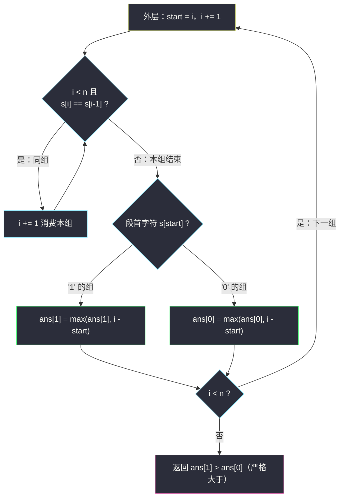
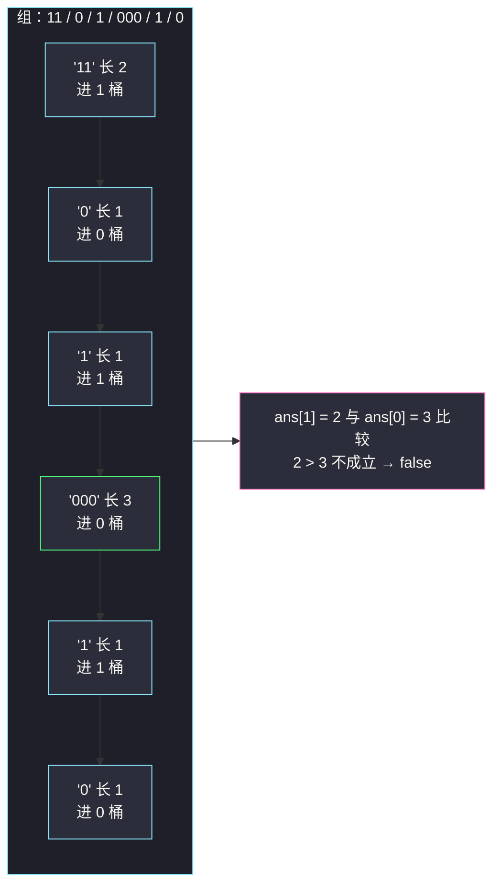

# 哪种连续子字符串更长（分组循环：0 组与 1 组分别统计）

## 一、问题描述

给定一个二进制字符串 `s`（只含字符 `0` 和 `1`）。如果**最长的连续 `1` 子字符串**的长度**严格大于**最长的**连续 `0` 子字符串**的长度，返回 `true`；否则返回 `false`。

> 🔗 LeetCode 1869 哪种连续子字符串更长：https://leetcode.cn/problems/longer-contiguous-segments-of-ones-than-zeros/
> 难度：Easy · 出自灵神题单「**六、分组循环**」小节

**示例 1**

```
输入：s = "1101"
输出：true
解释：最长连续 1 段是 "11"（长度 2），最长连续 0 段是 "0"（长度 1），2 > 1。
```

**示例 2**

```
输入：s = "111000"
输出：false
解释：最长 1 段 "111" 与最长 0 段 "000" 长度相等，不满足严格大于。
```

**示例 3**

```
输入：s = "110100010"
输出：false
解释：最长 1 段是 "11"（长度 2），最长 0 段是 "000"（长度 3），2 < 3。
```

**直观理解**

和 [#1446 连续字符](https://leetcode.cn/problems/consecutive-characters/)（本批题解：`consecutive-characters.md`）唯一的区别：不再只求「最长的一组」，而是**同时统计两类组**——`0` 的组维护一个最长值，`1` 的组维护另一个最长值，最后比大小。

---

## 二、暴力解法

### 思路

枚举每个起点 `i`，向右延伸出一段同字符的连续段，按段首字符分别更新两个最长值。

```python
class Solution:
    def checkZeroOnes(self, s: str) -> bool:
        n = len(s)
        best = {'0': 0, '1': 0}
        for i in range(n):
            j = i
            while j < n and s[j] == s[i]:
                j += 1
            best[s[i]] = max(best[s[i]], j - i)   # [i, j) 是以 i 开头的连续段
        return best['1'] > best['0']
```

### 复杂度

- **时间**：`O(n²)`。最坏全同字符时每个起点都扫到结尾。
- **空间**：`O(1)`。

### 🔴 瓶颈在哪里

与 #1446 完全相同的毛病：同一段被它内部的每个起点各扫一遍。一次遍历按组消费就能省掉所有重复劳动。

---

## 三、优化探索（核心章节）

### 3.1 特征观察

| 特征 | 说明 |
|------|------|
| 串由 `0` 组与 `1` 组交替拼成 | 组 = 连续同字符段，天然分界 |
| 两类组要**分别**统计 | 用段首字符 `s[start]` 直接当「答案桶」的下标 |
| 组与组独立 | 每组只贡献自己那一类的最长值，无跨组状态 |

### 3.2 推导：组首字符即桶下标

> **题单出处**：本题出自灵神题单「**六、分组循环**」小节，对齐 lyl 分组循环模板：
> **外层循环确定每组起点，内层 `while` 消费同组连续段；组内收集答案，组间重置。**

与 #1446 相比只多一个技巧——开一个长度为 2 的数组 `ans[0]` / `ans[1]` 分别存两类组的最长值：

1. 外层：`start = i`，`i += 1`；
2. 内层：`while i < n and s[i] == s[i-1]: i += 1` 吃完整组；
3. 组结束：`idx = int(s[start])`（段首字符转成桶下标），`ans[idx] = max(ans[idx], i - start)`；
4. 扫描结束后比较 `ans[1] > ans[0]`（**严格大于**）。

这里体现了模板里「组间重置」的另一种实现方式：状态不放在局部变量里逐步清零，而是**按组类别放进不同桶**——每轮外层用 `s[start]` 自动选中正确的桶，天然隔离。



### 3.3 一句话核心

> **一趟分组循环同时维护两个桶：`0` 的最长组与 `1` 的最长组，最后比较严格大于。**

---

## 四、代码实现

### Python（主解：分组循环 + 答案桶）

```python
class Solution:
    def checkZeroOnes(self, s: str) -> bool:
        n = len(s)
        ans = [0, 0]                     # ans[0]：最长 0 段；ans[1]：最长 1 段
        i = 0
        while i < n:
            start = i                    # 本组起点
            i += 1
            while i < n and s[i] == s[i - 1]:
                i += 1                   # 消费同组剩余字符
            idx = int(s[start])          # 段首字符即桶下标
            ans[idx] = max(ans[idx], i - start)   # 组内收集答案
        return ans[1] > ans[0]           # 严格大于
```

**变量含义**

| 变量 | 含义 |
|------|------|
| `i` | 全局扫描指针（只增不减） |
| `start` | 当前组起点 |
| `i - start` | 当前组长度 |
| `ans[0]` / `ans[1]` | 两类组各自的最长值（按 `s[start]` 分桶） |

### Python（等价简化版：一遍计数）

同样给一个「当前连续长度」的对照实现，便于理解两者等价：

```python
class Solution:
    def checkZeroOnes(self, s: str) -> bool:
        best0 = best1 = cur = 0
        prev = ''
        for ch in s:
            cur = cur + 1 if ch == prev else 1
            if ch == '1':
                best1 = max(best1, cur)
            else:
                best0 = max(best0, cur)
            prev = ch
        return best1 > best0
```

> 本题 Easy、一遍扫描已最优，没有进阶优化环节，Java 版从略（同家族 Medium 题解中有 Java）。

---

## 五、具体例子演示

### 端到端跟踪：s = "110100010"

下标对照：`0:1 1:1 2:0 3:1 4:0 5:0 6:0 7:1 8:0`

| 组号 | 组内容 | start | 组尾下标（i-1） | 组长 i-start | 桶下标 int(s[start]) | 更新后的桶 |
|------|--------|-------|-----------------|--------------|----------------------|------------|
| 1 | `11` | 0 | 1 | 2 | 1 | `ans[1] = 2` |
| 2 | `0` | 2 | 2 | 1 | 0 | `ans[0] = 1` |
| 3 | `1` | 3 | 3 | 1 | 1 | `ans[1] = 2` |
| 4 | `000` | 4 | 6 | 3 | 0 | `ans[0] = 3` |
| 5 | `1` | 7 | 7 | 1 | 1 | `ans[1] = 2` |
| 6 | `0` | 8 | 8 | 1 | 0 | `ans[0] = 3` |

**最终比较**：`ans[1] = 2`，`ans[0] = 3`，`2 > 3` 不成立 → 返回 **false** ✓

### 再演示 s = "1101"

| 组号 | 组内容 | start | 组长 | 桶更新 |
|------|--------|-------|------|--------|
| 1 | `11` | 0 | 2 | `ans[1] = 2` |
| 2 | `0` | 2 | 1 | `ans[0] = 1` |
| 3 | `1` | 3 | 1 | `ans[1] = 2` |

`2 > 1` 成立 → 返回 **true** ✓



---

## 六、复杂度分析

| 方法 | 时间 | 空间 | 说明 |
|------|------|------|------|
| 暴力枚举起点 | `O(n²)` | `O(1)` | 同一段被反复扫 |
| 分组循环 + 答案桶 | `O(n)` | `O(1)` | 桶大小恒为 2，`i` 只前进 |
| 一遍计数 | `O(n)` | `O(1)` | 与分组循环等价 |

---

## 七、对比总结与易错点

**易错点**

1. 比较必须是**严格大于**：`111000` 这种打平的情况返回 `false`。
2. 两个桶都要初始化为 0：`s` 可能全 `0` 或全 `1`，另一类组根本不存在。
3. 桶下标用 `int(s[start])`（段首字符）而不是 `s[i]`——组结束时 `i` 已越过组尾，指向下一组首字符，用它就张冠李戴了。
4. 别把两类组混在一个最长值里：答案依赖**类别**，这正是本篇相对 #1446 的新意。

**模板（分组循环 · 按类别分桶）**

```python
i = 0
while i < n:
    start = i
    i += 1
    while i < n and 同组条件:            # s[i] == s[i-1]
        i += 1
    idx = 类别(start)                    # 本题：int(s[start])
    ans[idx] = max(ans[idx], i - start)  # 组内收集，按类别入桶
```

---

## 八、举一反三

| 题目 | 关系 |
|------|------|
| [#485 最大连续 1 的个数](https://leetcode.cn/problems/max-consecutive-ones/) | 只留 `1` 桶的极简版 |
| [#1446 连续字符](https://leetcode.cn/problems/consecutive-characters/) | 单桶版分组循环（本批题解：`consecutive-characters.md`） |
| [#1004 最大连续 1 的个数 III](https://leetcode.cn/problems/max-consecutive-ones-iii/) | 分组的近亲：允许 k 个 0 翻转，演化为不定长滑动窗口 |
| [#1493 删掉一个元素以后全为 1 的最长子数组](https://leetcode.cn/problems/longest-subarray-of-1s-after-deleting-one-element/) | 同上，含一个 0 的窗口 |
| [#1578 使绳子变成彩色的最短时间](https://leetcode.cn/problems/minimum-time-to-make-rope-colorful/) | 多类别分组（26 个桶的极限版：组内收集代价）（本批题解：`minimum-time-to-make-rope-colorful.md`） |

**思想迁移**：分类别统计连续段时，用「段首元素」直接做桶下标（`int(s[start])`、`ord(c) - ord('a')` 等），可以让组间切换零成本。
