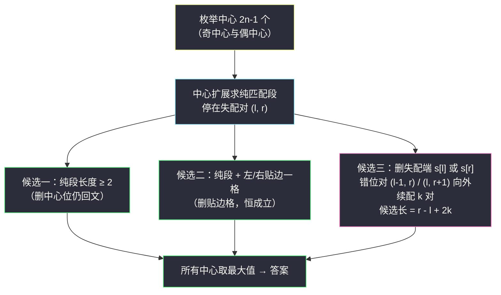

# 3844. 最长准回文子串（Longest Almost-Palindromic Substring）

> 题目来源：[https://leetcode.cn/problems/longest-almost-palindromic-substring/](https://leetcode.cn/problems/longest-almost-palindromic-substring/)
>
> 灵茶题单小节：§字符串 / 回文（Manacher 与中心扩展系）

## 一、问题描述

给你一个由小写英文字母组成的字符串 `s`。

如果一个子串在删除 **恰好一个** 字符后会变成回文串，则称之为 **准回文串**。

返回 `s` 中最长准回文子串的长度。

**数据范围**：

- `2 <= s.length <= 2500`
- `s` 仅由小写英文字母组成

**示例 1**：

```text
输入：s = "abca"
输出：4
解释：整个串 "abca" 删除 'c' 后得到 "aba"，是回文串。
```

**示例 2**：

```text
输入：s = "abba"
输出：4
解释："abba" 本身是回文；删除任意一个 'b' 后得到 "aba"，仍是回文串。
```

**示例 3**：

```text
输入：s = "zzabba"
输出：5
解释：子串 "zabba" 删除左端的 'z' 后得到 "abba"，长度为 5。
```

**核心思考点**：删除恰好一个字符后，回文的「中心」会 **偏移半格**——被删字符在左半时新回文中心右偏、在右半时左偏。直接套「中心扩展遇失配即停」会漏解（本文五节有真实反例），必须系统分类「删除位置」与「回文结构」的关系。

## 二、暴力解法

### 思路

枚举所有 `O(n²)` 个子串 `s[a..b]`；对每个子串枚举删除位置 `d`，判断拼接串 `s[a..d-1] + s[d+1..b]` 是否回文。判定可用双指针 `O(n)` 完成。

### 代码

```python
def longestAlmostPalindromeBrute(s: str) -> int:
    n = len(s)
    best = 0
    for a in range(n):                     # 子串左端
        for b in range(a, n):              # 子串右端
            for d in range(a, b + 1):      # 删除位置（恰好一个）
                p = s[a:d] + s[d + 1:b + 1]
                if p == p[::-1]:           # 判回文
                    best = max(best, b - a + 1)
                    break                  # 该子串已确认，换下一个
    return best
```

### 复杂度

- 时间：`O(n³ · k)` 级别（`k` 为平均回文判定长度），`n = 2500` 时约 `10¹⁰` 量级，超时。本文中它是对拍的基准。
- 空间：`O(n)`（切片临时串）。

## 三、优化探索

### 3.1 从「删谁」倒推结构

设最优子串 `T = s[a..b]`，删除位置 `d`，`P = T` 去掉 `s[d]` 后回文。把 `P` 的首尾配对展开：从两端向内逐对比较，**比较指针一旦碰到 `d` 就跳过它**。于是 `P` 的配对被洞 `d` 分成两段：

1. **跨洞外壳**：洞两侧的外层字符两两相等；
2. **单侧内核**：某一侧剩余的字符自身构成回文（其中心相对外壳偏了半格）。

反过来讲：以任意回文中心做中心扩展得到纯匹配段后，删除位置只有三类可挂靠的结构——这正是主解的三类候选。

### 3.2 一个必须先验证的论断

「长度 ≥ 2 的回文子串删掉中心处一个字符仍是回文，所以它本身就是准回文」——奇回文删正中、偶回文删两个正中之一，剩余两半仍对称。这个论断 **已用穷举验证**（字母表 `ab`、长度 2 到 12 的全部字符串逐一核对），可以放心使用。

顺带确认边界：长度 1 的子串删除后是空串，不把它计入候选；由于 `s` 长度 ≥ 2，答案至少为 2（任意两个字符删掉一个剩单字符，必是回文）。

### 3.3 三类候选（主解核心）

对每个回文中心（`2n-1` 个，含奇偶），中心扩展求出纯匹配段，设扩展停在失配对 `(l, r)`（即 `s[l] != s[r]`，且 `[l+1, r-1]` 关于中心对称）：

- **候选一（纯回文）**：`[l+1, r-1]` 长度 ≥ 2 时直接计入（论断 3.2）；
- **候选二（贴边一格）**：纯段左端再往左一格 `s[l]` 作为删除位——`T = [l, r-1]`，删 `s[l]` 后剩纯段，长度 = 纯段长 + 1。右侧同理 `T = [l+1, r]`。只要 `l >= 0` 或 `r < n` 即可，**无需任何额外匹配**；
- **候选三（跨洞续配）**：删除位取失配端 `s[l]`，则洞左侧字符 `s[l-1]` 与失配右端 `s[r]` 配对（对和偏移半格的中心）；从错位对 `(l-1, r)` 继续向外匹配，每匹配一对就把候选长度加 2。匹配停止于中途失配或越界均可（停在失配对内侧即可构成合法 `T`）。删 `s[r]` 的分支对称：从 `(l, r+1)` 续配。

### 3.4 为什么「失配即停」的传统中心扩展会漏解

反例 `s = "baaababbbaabbbbbb"`：传统中心扩展（失配即停 + 贴边）最多找到 9，而正解 11（子串 `babbbaabbbb` 删第 2 个字符得回文 `bbbbaabbbb`）。它的结构是「1 对跨洞外壳 + 一个长内核回文」——外壳跨越了传统扩展的失配对。候选三的续配正是补上这一块。

```mermaid
flowchart LR
    subgraph T["T = s[l .. r+k]（删 s[r]，候选三）"]
        O1["外壳错位对<br>(l, r+1) (l-1, r+2) ..."] --- HOLE["洞 d = r<br>（删除位）"] --- K1["内核纯段<br>[l+1 .. r-1] 关于中心对称"]
        O1 --- O2["外壳续配 k 对"]
    end
    style T fill:#1e1f29,stroke:#6272a4
    style O1 fill:#2b2d3a,stroke:#8be9fd,color:#f8f8f2
    style O2 fill:#2b2d3a,stroke:#8be9fd,color:#f8f8f2
    style HOLE fill:#2b2d3a,stroke:#ff5555,color:#f8f8f2
    style K1 fill:#2b2d3a,stroke:#50fa7b,color:#f8f8f2
```





## 四、代码实现

### 主解：中心扩展 + 三类候选

```python
def longestAlmostPalindrome(s: str) -> int:
    n = len(s)
    if n < 2:
        return 0

    def extend(l: int, r: int) -> int:
        """从中心 (l, r) 向外扩展，返回该中心贡献的最长准回文长度"""
        while l >= 0 and r < n and s[l] == s[r]:   # 纯匹配
            l -= 1
            r += 1
        pure = r - l - 1                            # 纯回文段 [l+1, r-1] 的长度
        best = pure if pure >= 2 else 0             # 候选一
        if pure >= 1:                               # 候选二：贴边一格
            if l >= 0:                              # 左边还有字符可删
                best = max(best, pure + 1)
            if r < n:                               # 右边还有字符可删
                best = max(best, pure + 1)
        if l >= 0 and r < n and s[l] != s[r]:       # 真失配：候选三
            k = 0
            ll, rr = l, r + 1                       # 删 s[r]：错位对起于 (l, r+1)
            while ll >= 0 and rr < n and s[ll] == s[rr]:
                ll -= 1; rr += 1; k += 1
            if k > 0:                               # 续配 k 对即可，停在哪都行
                best = max(best, r - l + 2 * k)
            k = 0
            ll, rr = l - 1, r                       # 删 s[l]：错位对起于 (l-1, r)
            while ll >= 0 and rr < n and s[ll] == s[rr]:
                ll -= 1; rr += 1; k += 1
            if k > 0:
                best = max(best, r - l + 2 * k)
        return best

    ans = 0
    for c in range(n):                              # 奇中心 (c, c)
        ans = max(ans, extend(c, c))
    for c in range(n - 1):                          # 偶中心 (c, c+1)
        ans = max(ans, extend(c, c + 1))
    return ans
```

### 细节说明

- **续配候选长 `r - l + 2k` 的由来**：删 `s[r]` 时外壳续配 `k` 对后 `T = [l-k+1, r+k]`，长度 `r+k - (l-k+1) + 1 = r - l + 2k`；删 `s[l]` 时 `T = [l-k, r+k-1]`，长度同为 `r - l + 2k`。
- **续配 `k = 0` 无候选**：错位对首步就不匹配说明该删除位撑不起比贴边更长的子串，跳过。
- **续配中途失配不必失败**：已匹配的 `k` 对外壳本身构成合法 `T`，只是不能再向外扩——本文开头提到的 `baaababbbaabbbbbb` 反例正是靠这条规则才被覆盖。
- **无需 Manacher**：中心扩展本身是 `O(n²)` 总量，续配均摊在内，`n = 2500` 完全够快。若追求理论极限可用 Manacher 的半径数组 `O(1)` 判「任意区间是否回文」，再配合哈希定位最长贴边扩展，但实现复杂度远超收益。

## 五、例子演示

用示例 1 `s = "abca"` 端到端走一遍（下标 0..3）。

| 中心 | 初始对 | 纯扩展过程 | 停止位置 | 纯段 | 候选二 | 候选三 | 本中心最优 |
|---|---|---|---|---|---|---|---|
| (0,0) | 单字符 | (−1,1) 越界 | l=−1 | 1 | 左无格；右 s[1]='b' 可删 → 2 | 无失配（越界停） | 2 |
| (1,1) | 单字符 | (0,2)：'a' vs 'c' 失配 | (0,2) | 1 | s[0] 或 s[2] 可删 → 2 | 删 s[2]：(0,3) 'a'=='a' ✓ k=1 → (−1,4) 越界停，候选 `2-0+2×1 = 4` | **4** |
| (2,2) | 单字符 | (1,3)：'b' vs 'a' 失配 | (1,3) | 1 | → 2 | 删 s[1]：(0,3) 'a'=='a' ✓ k=1 → 候选 `3-1+2 = 4` | **4** |
| (3,3) | 单字符 | (2,4) 越界 | r=4 | 1 | 左 s[2] 可删 → 2 | 无 | 2 |
| (0,1) | 'a' vs 'b' | 首步失配 | (0,1) | 0 | 纯段 0 无贴边 | 删 s[1]：(−1,2) 越界 k=0 ✗；删 s[0]：(0,2) 'a' vs 'c' ✗ k=0 | 0 |
| (1,2) | 'b' vs 'c' | 首步失配 | (1,2) | 0 | 无 | k 均 0 | 0 |
| (2,3) | 'c' vs 'a' | 首步失配 | (2,3) | 0 | 无 | k 均 0 | 0 |

中心 (1,1) 的候选三详细过程：纯扩展匹配 (1,1) 单字符后在 (0,2) 失配（'a' ≠ 'c'）。删掉失配右端 `s[2]='c'`，洞左侧下一对是错位对 `(0, 3)`：`s[0]='a'` 与 `s[3]='a'` 相等，续配 `k=1`；再向外 `(−1, 4)` 越界停止。`T = [0, 3]` = 整个 `"abca"`，删 'c' 得 `"aba"` ✓，长度 `r - l + 2k = 2 - 0 + 2 = 4`。

**最终答案 `4`** ✅。

再看候选三「中途失配仍保留」的必要性——`s = "abcbxa"`，中心 (2,2)：纯扩展匹配 (1,3)（'b'=='b'），失配对 (0,4)（'a' vs 'x'）。删 `s[4]='x'`，续配错位对 (0,5)：'a'=='a' ✓ k=1，再向外 (−1,6) 越界 → 候选 `4-0+2 = 6`。`T = [0,5]` 删 'x' 得 `"abcba"` ✓。传统「失配即停」在这里只能拿到 3。

## 六、复杂度分析

设 `n = len(s)`：

- **时间复杂度：`O(n²)`**
  - `2n-1` 个中心，每个中心的纯扩展 + 两支续配共 `O(n)`（三段指针移动总次数与该中心到边界的距离同阶）。
  - `n = 2500` 时约 `2 × 6.25 × 10⁶` 次字符比较，轻松通过。
- **空间复杂度：`O(1)`**
  - 仅指针与常数变量，不含 Manacher 数组等辅助结构。

## 七、对比总结

| 维度 | 暴力 | 主解（中心扩展 + 三类候选） |
|---|---|---|
| 时间 | `O(n³)` 级 | `O(n²)` |
| 空间 | `O(n)` | `O(1)` |
| 思维 | 枚举子串 + 删位 | 按「删除位相对回文结构的位置」分类 |
| 易错点 | 无 | 漏续配分支、续配中途失配误判失败、长 1 纯段误入候选 |

**套路归纳**：一切「改动至多 k 处的回文」问题的骨架是 **把改动位置与对称中心的关系分类清楚**——本文的三类候选（纯回文内部删、贴边删、跨失配对续配删）正是 `k = 1` 的完整分类。遇上「至少」「至多 k 次」的变体时，按同样的结构把分类推广即可（续配分支会变成嵌套状态机）。

## 八、举一反三

1. **[647. 回文子串](https://leetcode.cn/problems/palindromic-substrings/)**：中心扩展的基础模板题，先吃透纯回文的枚举方式。
2. **[5. 最长回文子串](https://leetcode.cn/problems/longest-palindromic-substring/)**：本文候选一对应的经典问题，Manacher 可做到 `O(n)`。
3. **[1216. 验证回文串 III](https://leetcode.cn/problems/valid-palindrome-iii/)**（会员题）：「至多删 k 个」的一般化判定，区间 DP 解法。
4. **[1312. 让字符串成为回文串的最少插入次数](https://leetcode.cn/problems/minimum-insertion-steps-to-make-a-string-palindrome/)**：从「删」换到「插」，对称方向相反、DP 思想同源。
5. **[1960. 两个回文子字符串的最大长度差](https://leetcode.cn/problems/maximum-product-of-the-length-of-two-palindromic-substrings/)**（会员题）：Manacher 半径数组的进阶应用，感受 `O(n)` 回文工具的威力。
6. **[680. 验证回文串 II](https://leetcode.cn/problems/valid-palindrome-ii/)**：`k = 1` 的判定版（允许删一个字符的整串判定），本文候选三的双指针续配正是它的单中心版本。

**同族互引**：本篇与 `can-make-palindrome-from-substring.md`（前缀和判区间回文）、`largest-palindromic-number.md`（贪心构造回文）同属回文系：先吃透中心扩展的分类讨论，再去前两篇看「判定工具」与「构造策略」的另外两个面向。
