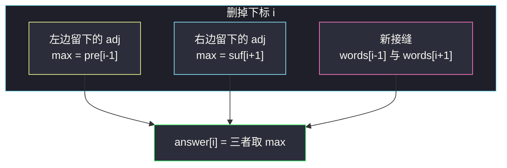

# 3598. 相邻字符串之间的最长公共前缀（Longest Common Prefix Between Adjacent Strings After Removals）

> 题目来源：[https://leetcode.cn/problems/longest-common-prefix-between-adjacent-strings-after-removals/](https://leetcode.cn/problems/longest-common-prefix-between-adjacent-strings-after-removals/)
>
> 灵茶题单小节定位：专题 · 前后缀分解

## 一、问题描述

给你字符串数组 `words`。对每个下标 `i`：

- 删掉 `words[i]`；
- 在剩下的数组里，看所有**相邻对**的最长公共前缀（LCP）长度，取最大值，记为 `answer[i]`。

若不存在相邻对，或所有相邻对都没有公共前缀，则 `answer[i] = 0`。返回 `answer`。

**数据范围**：

- `1 <= words.length <= 10^5`
- `1 <= words[i].length <= 10^4`
- `words[i]` 只含小写字母，长度总和 ≤ `10^5`

**示例 1**：

```text
输入：words = ["jump","run","run","jump","run"]
输出：[3,0,0,3,3]
解释：
- 删 0 → ["run","run","jump","run"]，相邻 LCP 最大是 "run" 长度 3
- 删 1 或 2 → 没有相邻对有公共前缀，为 0
- 删 3 → ["jump","run","run","run"]，最大 3
- 删 4 → ["jump","run","run","jump"]，最大 3
```

**示例 2**：

```text
输入：words = ["dog","racer","car"]
输出：[0,0,0]
解释：删任意一个下标，剩下的相邻对都没有公共前缀（或只剩一个字符串）。
```

**核心思考点**：删 `i` 之后，绝大部分相邻对根本没变。变的只有：丢掉 `(i-1,i)` 和 `(i,i+1)`，若两端都在，新接上 `(i-1,i+1)`。用前缀 max / 后缀 max 预计算「左边留下的相邻 LCP 的最大值」和「右边留下的」，再补上新接缝，每个 `i` 就能 `O(1)` 出答案。

## 二、暴力解法

### 思路

对每个 `i` 真的拼出 `words[:i] + words[i+1:]`，再扫一遍相邻 LCP。与主解的前后缀数组完全独立。

### 代码

```python
def longestCommonPrefixBrute(words: list[str]) -> list[int]:
    def lcp(a: str, b: str) -> int:
        k = 0
        for x, y in zip(a, b):
            if x != y:
                break
            k += 1
        return k

    n = len(words)
    ans = []
    for i in range(n):
        rest = words[:i] + words[i + 1:]
        best = 0
        for a, b in zip(rest, rest[1:]):
            best = max(best, lcp(a, b))
        ans.append(best)
    return ans
```

### 复杂度

- 时间：`O(n · L)` 每次删除都重扫，合计 `O(n² · 均长)`，`n = 10^5` 不可用。
- 空间：`O(n)`。

## 三、优化探索

### 3.1 删除只改一条接缝 ⭐

原数组相邻对是 `(0,1), (1,2), …, (n-2,n-1)`。删掉下标 `i` 后：

- 完全落在 `i` 左边的对：`(0,1) … (i-2,i-1)`，一条都不少；
- 完全落在 `i` 右边的对：`(i+1,i+2) … (n-2,n-1)`；
- 原来的 `(i-1,i)`、`(i,i+1)` 消失；
- 若 `i-1`、`i+1` 都还在，多出一对 `words[i-1]` 与 `words[i+1]`。

`n = 1` 时没有相邻对，答案 `[0]`。`n = 2` 时删谁都只剩一个字符串，答案一定 `[0,0]`——这里最容易写出 `words[-1]`。

### 3.2 前缀 max 与后缀 max ⭐⭐

令 `adj[t] = LCP(words[t], words[t+1])`，`t = 0..n-2`。

```text
pre[i] = max(adj[0], adj[1], …, adj[i-1])   pre[0] = 0
suf[i] = max(adj[i], adj[i+1], …, adj[n-2])  suf[n-1] = suf[n] = 0
```

删 `i` 后：

```text
answer[i] = max(
    pre[i-1],          # 即 max(adj[0..i-2])，i=0 时跳过
    suf[i+1],          # 即 max(adj[i+1..n-2])
    LCP(words[i-1], words[i+1])   # 仅当 0 < i < n-1
)
```

预处理 `O(n)` 次相邻 LCP（总长线性），每个 `i` 再算一次新接缝。不要对每个 `i` 去维护有序集合——前后缀已经给出最大值。

### 3.3 新接缝的下标千万别写成链式比较 ⭐

`if 0 < i + 1 < n` 在 `i = 0` 时为真，接着访问 `words[i-1]` 就是 `words[-1]`，会把最后一个词和 `words[1]` 配成一对。`n = 2` 时官方答案是 `[0,0]`，这样写会得到「自己和自己的 LCP」。必须写成 `i > 0 and i + 1 < n`。



## 四、代码实现

### 主解：相邻 LCP + 前后缀最大值

```python
class Solution:
    def longestCommonPrefix(self, words: list[str]) -> list[int]:
        def lcp(a: str, b: str) -> int:
            k = 0
            for x, y in zip(a, b):
                if x != y:
                    break
                k += 1
            return k

        n = len(words)
        if n == 1:
            return [0]
        adj = [lcp(words[i], words[i + 1]) for i in range(n - 1)]
        pre = [0] * n
        for i in range(1, n):
            pre[i] = max(pre[i - 1], adj[i - 1])
        suf = [0] * (n + 1)
        for i in range(n - 2, -1, -1):
            suf[i] = max(suf[i + 1], adj[i])
        ans = [0] * n
        for i in range(n):
            best = 0
            if i >= 1:
                best = max(best, pre[i - 1])
            if i + 1 < n:
                best = max(best, suf[i + 1])
            if i > 0 and i + 1 < n:
                best = max(best, lcp(words[i - 1], words[i + 1]))
            ans[i] = best
        return ans
```

### 细节说明

- **`n = 1`**：没有相邻对，直接 `[0]`。
- **`n = 2`**：`pre[0] = 0`，`suf[1] = suf[2] = 0`，新接缝条件不成立，答案 `[0,0]`。
- **LCP 为 0 也要进 `adj`**：前缀 max 里的 0 不会把答案抬上去，等价于「没有公共前缀」。
- **总长 ≤ `10^5`**：所有 `lcp` 加起来是线性的，不要对每对再做哈希/Z-function。
- **`pre` / `suf` 下标**：`pre[i]` 表示「`adj` 的前 `i` 个」的 max，所以删 `i` 后左边留下的是 `adj[0..i-2]` = `pre[i-1]`。`suf[i]` 表示「从 `adj[i]` 一直到末尾」，删 `i` 后右边留下的是 `adj[i+1..]` = `suf[i+1]`。把 `suf` 多开一位 `suf[n]=0`，删最后一个时右边自然是 0。
- **对拍**：`n ≤ 12`、词长 ≤ 6，对每个 `i` 真删除再扫相邻 LCP，400 组。必含 `n=1`、`n=2`、三串相同。`n=2` 是抓住 `words[-1]` 的最小用例。

## 五、例子演示

**示例 1：`["jump","run","run","jump","run"]`**

`adj = [LCP(jump,run), LCP(run,run), LCP(run,jump), LCP(jump,run)] = [0, 3, 0, 0]`

| 数组 | 值 |
|---|---|
| `pre` | `[0, 0, 3, 3, 3]` |
| `suf` | `[3, 3, 0, 0, 0]`（`suf[5] = 0`） |

| 删 i | 左边 pre[i-1] | 右边 suf[i+1] | 新接缝 | answer |
|---|---|---|---|---|
| 0 | — | suf[1]=3 | 无 | **3** |
| 1 | 0 | suf[2]=0 | LCP(jump,run)=0 | **0** |
| 2 | 0 | suf[3]=0 | LCP(run,jump)=0 | **0** |
| 3 | 3 | suf[4]=0 | LCP(run,run)=3 | **3** |
| 4 | 3 | — | 无 | **3** |

与官方 `[3,0,0,3,3]` 一致。

**边界：`["aa","aa"]`**

`adj = [2]`。删 0 或删 1 都只剩一词，新接缝条件 `i > 0 and i + 1 < n` 都不成立。若误写 `0 < i + 1 < n`，删 0 时会算 `LCP(words[-1], words[1]) = 2`，输出 `[2,0]`，与题意「无相邻对则为 0」冲突。官方示例 1 删下标 0 时答案碰巧也是 3，这个 bug 会被「run 与 run」的真实后缀 max 遮住，只有 `n = 2` 才暴露。

**三个相同串：`["aa","aa","aa"]`**

`adj = [2, 2]`。删两端只剩一对，答案 2；删中间时新接缝 `LCP(words[0], words[2]) = 2`，答案也是 2。得到 `[2,2,2]`，不是 `[2,0,2]`——中间那条「新接缝」不能漏。

**示例 2：`["dog","racer","car"]`**：`adj = [0, 0]`，新接缝 `LCP(dog,car)=0`，三个答案都是 0。

## 六、复杂度分析

设 `n = len(words)`，`L` 为所有字符串长度之和：

- **时间复杂度：`O(n + L)`**——预处理 `n-1` 对相邻 LCP，每个 `i` 额外一对新接缝，每对字符比较总次数被总长卡住。
- **空间复杂度：`O(n)`**——`adj / pre / suf / ans`。

## 七、对比总结

| 维度 | 每次删除重扫 | 有序集合维护相邻 LCP | 前后缀 max |
|---|---|---|---|
| 时间 | `O(n L)` 量级过大 | `O(L + n log n)` | `O(n + L)` |
| 要维护的量 | 全部相邻对 | 当前所有相邻 LCP 的 multiset | 只要最大值 |
| 实现 | 直译 | 加删各 O(log n) | 两个数组 |

**套路归纳**：**前后缀分解**专门收拾「删掉第 `i` 个元素后，左右两段各自的答案 + 跨过 `i` 的新组合」。本题左右段要的是 max，所以前缀 max / 后缀 max；若问的是和，就换成前缀和。先画清「哪些对还在、多了哪一对」，再决定预处理什么。

## 八、举一反三

1. **[238. 除自身以外数组的乘积](https://leetcode.cn/problems/product-of-array-except-self/)**：删 `i` 后左右信息合并，前后缀乘积的经典骨架。
2. **[2574. 左右元素和的差值](https://leetcode.cn/problems/left-and-right-sum-differences/)**：同目录 `left-and-right-sum-differences.md`，左右段用滚动变量。
3. **[1991. 找到数组的中间位置](https://leetcode.cn/problems/find-the-middle-index-in-array/)**：同目录 `find-the-middle-index-in-array.md`，同一副左右分解。
4. **[14. 最长公共前缀](https://leetcode.cn/problems/longest-common-prefix/)**：LCP 本身的纵向扫描。
5. **[3043. 最长公共前缀的长度](https://leetcode.cn/problems/find-the-length-of-the-longest-common-prefix/)**：两数组之间的前缀匹配，可对照本题「只看相邻对」。

**同族互引**：前后缀分解这一批里，和/差/乘积都是数值版；本题把「相邻对上的标量」换成 LCP 长度，骨架不变。新接缝那一项是删除题相对「除自身」多出来的唯一几何差。
