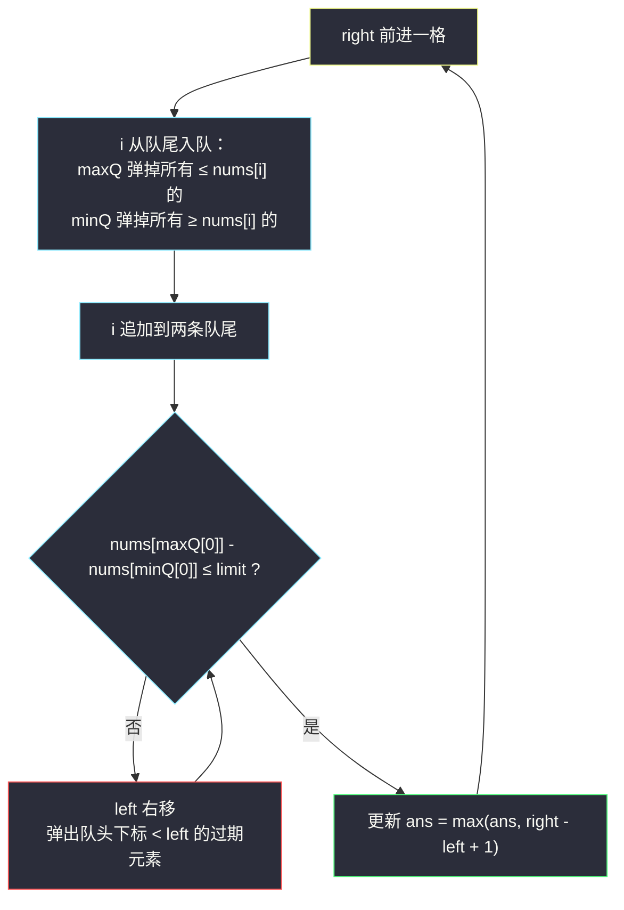

# 绝对差不超过限制的最长连续子数组（单调双端队列 + 滑动窗口）

## 一、问题描述

给你一个整数数组 `nums` 和一个整数 `limit`，请你返回**最长连续子数组**的长度，该子数组中的任意两个元素之间的绝对差值小于或等于 `limit`。

> 🔗 LeetCode 1438：https://leetcode.cn/problems/longest-continuous-subarray-with-absolute-diff-less-than-or-equal-to-limit/
>
> 数据范围：`1 <= len(nums) <= 10^5`，`1 <= nums[i] <= 10^9`，`0 <= limit <= 10^9`。

**示例 1**

```
nums = [8,2,4,7], limit = 4
输出：2

长度 2 的子数组 [8,2] 差 6 超限；[2,4]、[4,7] 差均 ≤ 4，最长 2
```

**示例 2**

```
nums = [10,1,2,4,7,2], limit = 5
输出：4

子数组 [2,4,7,2]：max - min = 7 - 2 = 5 ≤ 5
```

**示例 3**

```
nums = [4,2,2,2,4,4,2,4], limit = 0
输出：3

绝对差 ≤ 0 意味着所有元素相等，最长是三个 2
```

**直观理解**

「任意两元素绝对差 ≤ limit」等价于「子数组的 `max - min <= limit`」——条件只取决于窗口的最值。于是问题变成：维护一个滑动的窗口，随时回答「窗口内最大值减最小值是多少」。这正是灵茶题单 §4.4 单调队列的主场：**双端队列存下标，队头即窗口最值，进出窗口均摊 O(1)**。

---

## 二、暴力解法

### 暴力 1：枚举子数组，每个重新求 max/min

```python
class Solution:
    def longestSubarray(self, nums: list[int], limit: int) -> int:
        n, ans = len(nums), 1
        for i in range(n):
            for j in range(i + 1, n):
                w = nums[i:j+1]
                if max(w) - min(w) <= limit:
                    ans = max(ans, j - i + 1)
                else:
                    break                      # 更长的必然继续超
        return ans
```

`O(n^2)` 个子数组、每个 `O(n)` 求最值，`O(n^3)`；即便用下面的增量维护也是 `O(n^2)`。

### 暴力 2：固定左端点，向右扩张时增量维护 max/min

```python
for i in range(n):
    mx = mn = nums[i]
    for j in range(i + 1, n):
        mx, mn = max(mx, nums[j]), min(mn, nums[j])
        if mx - mn > limit:
            break
        ans = max(ans, j - i + 1)
```

增量更新 `O(1)`，总时间 `O(n^2)`，`n = 10^5` 时约 `10^10` 步，超时。

### 🔴 瓶颈在哪里

右端点扩张时 max/min 好维护（只会变大/变小）；**卡在左端点右移时没法撤销**——`nums[left]` 恰好是窗口最大值时，右移后新的最大值是多少？普通变量回答不了。需要一个能「按位置淘汰」的最值结构。

---

## 三、优化探索（核心章节）

> 📚 本题在灵茶题单中属于 **§4.4 单调队列**。与同目录 [滑动子数组美丽值](sliding-subarray-beauty.md) 同小节：那题是定长窗口的单调队列，本题把「定长」推广为「可行性驱动的变长窗口」。灵神模板要点：**双端队列存下标；新元素从队尾进入前，先弹掉所有不可能再成为最值的元素；队头永远是当前窗口的最值；元素出窗口时按下标从队头淘汰；每个下标至多进出各一次，均摊 `O(1)`**。

### 3.1 第一步：证明可以双指针

固定左端点 `left`，右端点越远，`max - min` 只会不减（窗口变大只会让最大值更大、最小值更小）。也就是说：

> 以 `left` 开头的合法子数组是一段**前缀**；设最长到 `right(left)`，则 `right(left)` 随 `left` 单调不减。

于是标准的滑窗双指针成立：`right` 全程只前进，`left` 只在违规时收缩，两者各自移动至多 `n` 次，总移动量 `O(n)`。**剩下的全部难点在于：`left` 右移后，如何在 `O(1)` 内知道新的窗口 max / min。**

### 3.2 第二步：两个单调双端队列

用**两条队列分别盯住最大值和最小值**，都存**下标**（存下标才能顺便完成「出窗淘汰」）：

- **maxQ（单调递减）**：从队头到队尾，`nums[下标]` 严格递减。队头 = 窗口最大值的下标。
- **minQ（单调递增）**：从队头到队尾，`nums[下标]` 递增。队头 = 窗口最小值的下标。

**入队（`right` 扩张到 `i`）**：

- `maxQ`：弹尾，只要 `nums[maxQ[-1]] <= nums[i]`——这些元素比 `nums[i]` 小（或相等）又比它老，**只要 `i` 还在窗口里，它们就永远当不了最大值**；
- `minQ` 对称：弹尾，只要 `nums[minQ[-1]] >= nums[i]`；
- 然后把 `i` 追加到两条队尾。

**出队（`left` 收缩）**：队头下标 `< left` 的元素已出窗，弹出。

**查询**：`nums[maxQ[0]] - nums[minQ[0]]` 即窗口 `max - min`，`O(1)`。



### 3.3 为什么队头就是答案（正确性）

以 `maxQ` 为例（`minQ` 完全对称）：某元素 `x` 被从队尾弹掉，是因为来了一个**更晚且值不小于它**的元素 `y`。此后任何同时包含 `x` 的窗口必然也包含 `y`（`y` 更晚、出窗更晚），最大值轮不到 `x`——弹掉无损。没被弹掉的元素从队头到队尾值递减且**下标递增**，所以：

- 队头是窗口内「既没被更强者覆盖、又没过期」的最大值；
- 队头一旦出窗（下标 `< left`），次大者立刻顶上，正是新窗口的最大值。

这就把「左端点移动时无法撤销」的暴力瓶颈解决了——**被淘汰的信息根本不需要保留**。

### 3.4 一句话核心

> **滑窗解决「窗口该多长」，双单调队列解决「窗口最值是多少」；两条队列各存下标，进出均摊 `O(1)`，整体 `O(n)`。**

---

## 四、代码实现

### Python（主解）

```python
from typing import List
from collections import deque

class Solution:
    def longestSubarray(self, nums: List[int], limit: int) -> int:
        max_q = deque()   # 存下标，对应值从队头到队尾递减 → 队头是窗口最大
        min_q = deque()   # 存下标，对应值从队头到队尾递增 → 队头是窗口最小
        left = 0
        ans = 0
        for right, x in enumerate(nums):
            while max_q and nums[max_q[-1]] <= x:   # 比我老又不超过我的，永远当不了 max
                max_q.pop()
            while min_q and nums[min_q[-1]] >= x:   # 比我老又不低于我的，永远当不了 min
                min_q.pop()
            max_q.append(right)
            min_q.append(right)

            while nums[max_q[0]] - nums[min_q[0]] > limit:  # 违规 → 收缩左端
                if max_q[0] == left:                 # 谁过期谁出队
                    max_q.popleft()
                if min_q[0] == left:
                    min_q.popleft()
                left += 1

            ans = max(ans, right - left + 1)
        return ans
```

**变量含义**

| 变量 | 含义 |
|------|------|
| `max_q` / `min_q` | 单调递减 / 递增的下标双端队列，队头即窗口 max / min |
| `left` | 窗口左端（当前合法窗口为 `nums[left..right]`） |
| `nums[max_q[0]] - nums[min_q[0]]` | 当前窗口的 `max - min`，`O(1)` 查询 |

出窗写法用的是「收缩时逐个检查队头是否等于 `left`」；等价写法是收缩完成后统一 `while max_q[0] < left: popleft()`，两者均可，前者把淘汰绑在收缩循环里更不易漏。

### Java（最优解同款写法）

```java
class Solution {
    public int longestSubarray(int[] nums, int limit) {
        Deque<Integer> maxQ = new ArrayDeque<>(), minQ = new ArrayDeque<>();
        int left = 0, ans = 0;
        for (int right = 0; right < nums.length; right++) {
            int x = nums[right];
            while (!maxQ.isEmpty() && nums[maxQ.peekLast()] <= x) maxQ.pollLast();
            while (!minQ.isEmpty() && nums[minQ.peekLast()] >= x) minQ.pollLast();
            maxQ.addLast(right);
            minQ.addLast(right);

            while (nums[maxQ.peekFirst()] - nums[minQ.peekFirst()] > limit) {
                if (maxQ.peekFirst() == left) maxQ.pollFirst();
                if (minQ.peekFirst() == left) minQ.pollFirst();
                left++;
            }
            ans = Math.max(ans, right - left + 1);
        }
        return ans;
    }
}
```

---

## 五、具体例子演示

### 示例 2：`nums = [10,1,2,4,7,2]`，`limit = 5`（期望 4）

队列里存下标，括号内是对应值。逐步跟踪每个 `right`：

| 轮次 | right (值) | 入队动作 | maxQ（递减） | minQ（递增） | max−min | left 调整 | 窗口 | ans |
|------|-----------|----------|--------------|--------------|---------|-----------|------|-----|
| 1 | 0 (10) | 两队直接追加 | [0(10)] | [0(10)] | 0 ≤ 5 | 不动 | [10] | 1 |
| 2 | 1 (1) | maxQ 追加；minQ 弹 0(10) | [0(10), 1(1)] | [1(1)] | 10−1=9 > 5 | maxQ 弹过期队头 0(10)；left→1 | [1] | 1 |
| 3 | 2 (2) | maxQ 弹 1(1)；minQ 追加 | [2(2)] | [1(1), 2(2)] | 2−1=1 ≤ 5 | 不动 | [1,2] | 2 |
| 4 | 3 (4) | maxQ 清空后追加；minQ 追加 | [3(4)] | [1(1), 2(2), 3(4)] | 4−1=3 ≤ 5 | 不动 | [1,2,4] | 3 |
| 5 | 4 (7) | maxQ 弹 3(4) 后追加；minQ 追加 | [4(7)] | [1(1), 2(2), 3(4), 4(7)] | 7−1=6 > 5 | minQ 弹过期队头 1(1)；left→2 | [2,4,7] | 3 |
| 6 | 5 (2) | maxQ 追加；minQ 连弹 4(7)、3(4)、2(2) 后追加 | [4(7), 5(2)] | [5(2)] | 7−2=5 ≤ 5 | 不动 | [2,4,7,2] | **4** |

第 5、6 两轮值得咀嚼。第 5 轮：新来的 `7` 成为窗口最大，把 `min=1`（下标 1）衬托得差距达 6 超限——而罪魁正是**队头那个最老的 `1`**，把它淘汰出窗后 `min` 升到 2，`7−2=5` 踩线合法。第 6 轮：新来的 `2` 让 minQ 连弹三个「更老且值不低于 2」的下标（4 号的 7、3 号的 4、2 号的 2），自己坐上队头；而 maxQ 里 4 号的 `7` 因为 `7 > 2` 弹不动，稳坐队头——于是窗口 `[2,5]` 的 `max−min = 7−2 = 5` 恰好合法，长度 4 正是答案子数组 `[2,4,7,2]`。注意第 5 轮收缩时 minQ 弹的队头 1 与第 6 轮弹尾弹掉的 2 号是两回事：**前者是出窗淘汰（队头、看下标），后者是新人淘汰（队尾、看值）**。

### 示例 3 快速复核：`nums = [4,2,2,2,4,4,2,4]`，`limit = 0`

窗口要求所有元素相等。走到 `2,2,2`（下标 1..3）时 max=min=2 合法长 3；下标 4 的 `4` 进来后 `4−2=2 > 0`，left 一路收缩到只剩 `4`。最终答案 3 ✓——`limit = 0` 是「窗口内全相等」的特例，单调队列照样一次通过。

---

## 六、复杂度分析

| 解法 | 时间 | 空间 |
|------|------|------|
| 暴力 1 重新求最值 | `O(n^3)` | `O(n)` |
| 暴力 2 增量维护 | `O(n^2)` | `O(1)` |
| 双单调队列滑窗（本篇） | `O(n)` | `O(n)` |

每个下标**至多入队一次、出队一次**（队尾弹出与队头淘汰合计也不超过一次出队），所以两条队列的总操作数是 `O(n)`，配合 `right`、`left` 各自的单调前进，整体严格线性。空间为两条队列，最坏（如严格递减数组只对 maxQ 递增对 minQ 退化等）`O(n)`。

---

## 七、对比总结

**同是「窗口最值」的三种工具**：

| 工具 | 单次查询 | 出窗撤销 | 本题适配度 |
|------|----------|----------|------------|
| 普通变量 / 前缀和 | `O(1)` | ❌ 无法撤销 | 暴力 2 的瓶颈 |
| 平衡树 / `SortedList` | `O(log n)` | `O(log n)` | 可过但常数大、代码重 |
| 单调双端队列 | `O(1)` 均摊 | `O(1)` 均摊 | ✅ 本篇解法 |

**与定长滑窗的区别**：[滑动子数组美丽值](sliding-subarray-beauty.md) 的窗口长度固定，`left = right - k + 1` 白送；本题窗口长度由 `max - min ≤ limit` 动态决定，多了一层「违规收缩」的循环——但单调队列的用法（存下标、弹尾、过期淘汰队头）一个字都没变。

**易错点清单**

1. **队列里存值还是存下标**：存下标才能判断「队头是否已出窗」；存值的话左端点收缩时无从淘汰。
2. **弹尾的等号**：`maxQ` 弹尾条件写 `<= x`（相等也弹）可保证队列严格递减、省空间；写 `<` 不影响正确性（相等时留旧元素，查询结果一样），但队列可能变长。
3. **收缩与淘汰的配合**：先判 `max - min > limit` 再收缩，收缩循环里同步淘汰两队过期的队头；漏掉淘汰会让「窗口最大值」虚高、窗口被错误地过度收缩。
4. **更新 ans 的位置**：收缩完成后窗口必合法，此时再 `max(ans, right - left + 1)`；放在收缩前会记下非法长度。
5. **两队列别共用一个**：max 用递减、min 用递增，弹尾方向相反，抄串一行就全错。

---

## 八、举一反三

| 题目 | 关系 |
|------|------|
| [239. 滑动窗口最大值](https://leetcode.cn/problems/sliding-window-maximum/) | 单调队列原始模板（定长窗口取 max），本题是它的「双队列 + 变长」版 |
| [2653. 滑动子数组美丽值](https://leetcode.cn/problems/sliding-subarray-beauty/) | 同目录同小节姊妹篇：定长窗口 + 单调队列求第 x 小，见 `sliding-subarray-beauty.md` |
| [862. 和至少为 K 的最短子数组](https://leetcode.cn/problems/shortest-subarray-with-sum-at-least-k/) | 单调队列维护前缀和的另一个方向：队头过期 + 队尾单调，求最短窗口 |
| [1425. 带限制的子序列和](https://leetcode.cn/problems/constrained-subsequence-sum/) | 单调队列优化 DP：窗口限制在「下标距离」上，队列管的是转移最优值 |
| [2444. 统计定界子数组](https://leetcode.cn/problems/count-subarrays-with-fixed-bounds/) | 同目录姊妹篇：同样盯 `max - min`（等于界），滑窗计数而非求长度，见 `count-subarrays-where-max-element-appears-at-least-k-times.md` 一类滑窗思路 |

**思想迁移**

- 「窗口内任意两元素差 ≤ limit」⟺「max − min ≤ limit」——把**两两条件**压缩成**两个聚合量之差**，是滑窗可行性判断的常见第一步（同理：至多 k 种字符、和不超过 S 等）。
- 聚合量要支持「右端插入、左端删除、O(1) 查询」时，先看它有没有**单调淘汰结构**（最值有单调队列、和有前缀差、种数有计数）；都没有才上平衡树。
- 口诀：**「双端存下标，弹尾保单调；队头即最值，过期往前删；max 减 min 过限，left 收缩莫心软。」**
