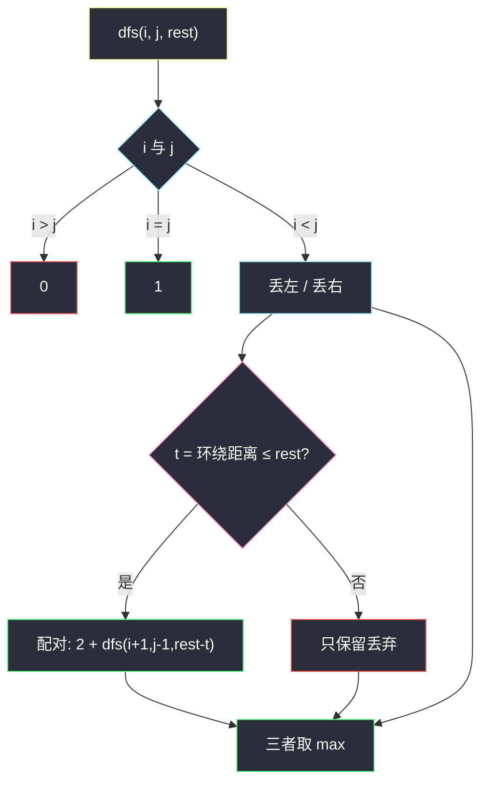

# 3472. 至多 K 次操作后的最长回文子序列（Longest Palindromic Subsequence After at Most K Operations）

> 题目来源：[https://leetcode.cn/problems/longest-palindromic-subsequence-after-at-most-k-operations/](https://leetcode.cn/problems/longest-palindromic-subsequence-after-at-most-k-operations/)
>
> 灵茶题单小节定位：§8.1 最长回文子序列

## 一、问题描述

给你字符串 `s` 和整数 `k`。一次操作可以把任意位置的字符改成字母表上**相邻**的那个（字母表循环：`'a'` 的上一个是 `'z'`，`'z'` 的下一个是 `'a'`）。

返回至多 `k` 次操作后，`s` 的**最长回文子序列**长度。

子序列：删除若干字符（可不删）后剩余字符相对顺序不变。回文：正读反读相同。

**数据范围**：

- `1 <= s.length <= 200`
- `1 <= k <= 200`
- `s` 只含小写字母

**示例 1**：

```text
输入：s = "abced", k = 2
输出：3
解释：s[1] 的 'b' 改成 'c'（1 次），s[4] 的 'd' 改成 'c'（1 次），得到 "accec"，子序列 "ccc" 长度 3。
```

**示例 2**：

```text
输入：s = "aaazzz", k = 4
输出：6
解释：三对 (a,z) 的环绕距离都是 1，总花费 3 ≤ 4，整串可以变成回文。
```

**核心思考点**：经典 LPS 区间 DP 多一维「剩余操作次数」。两端要配成一对时，不必指定改成哪个字母——在循环字母表上走到彼此的**最短弧长**就是总花费（两人相向走，花费相加等于弧长）。`t = min(|a-b|, 26-|a-b|)`，`t ≤ rest` 才能配对，贡献 `2 + dfs(i+1, j-1, rest-t)`。

## 二、暴力解法

### 思路

枚举 `s` 的每个非空子序列，把两端成对配上，每对付环绕距离，中间字符免费。总花费 ≤ `k` 则更新长度。与主解的记忆化区间 DP 独立（主解在原串下标上做，暴力在子序列上结算）。

### 代码

```python
def longestPalindromicSubsequenceBrute(s: str, k: int) -> int:
    n = len(s)
    ans = 0

    def circ(a: int, b: int) -> int:
        d = abs(a - b)
        return min(d, 26 - d)

    for mask in range(1, 1 << n):
        chars = [ord(s[i]) - 97 for i in range(n) if mask >> i & 1]
        cost = 0
        i, j = 0, len(chars) - 1
        while i < j:
            cost += circ(chars[i], chars[j])
            i += 1
            j -= 1
        if cost <= k:
            ans = max(ans, len(chars))
    return ans
```

### 复杂度

- 时间：`O(2^n · n)`。`n = 200` 不可用；对拍缩到 `n ≤ 9`。
- 空间：`O(n)`。

## 三、优化探索

### 3.1 没有操作时就是 LPS ⭐

`k = 0` 时只能两端字符已经相同才配对，否则丢左或丢右——即 [516. 最长回文子序列](https://leetcode.cn/problems/longest-palindromic-subsequence/)。区间 DP：

```text
dfs(i, j) = max( dfs(i+1, j), dfs(i, j-1),
                 2 + dfs(i+1, j-1)  若 s[i]==s[j] )
```

本题允许花操作让两端变成相同字母，把「相等」改成「花费 ≤ 剩余次数」。

### 3.2 环绕距离是最短弧，不是 ASCII 差 ⭐⭐

字母表是圆：`'a'` 与 `'z'` 相邻，距离 1，不是 25。

```text
t = min(|a - b|, 26 - |a - b|)
```

两端改成同一个字母 `c` 时，总操作次数 = 各自走到 `c` 的距离之和。在圆上选 `c` 落在较短那条弧上（含端点），总和恰好等于这段弧长。所以**不用枚举 c**，直接付 `t`。

`'a'` 与 `'n'`：`|0-13|=13`，`26-13=13`，`t=13`。超过 `k` 就不能配这一对。

### 3.3 状态三维：左右端点 + 剩余次数 ⭐⭐

`dfs(i, j, rest)` = 子串 `s[i..j]`、最多 `rest` 次操作，能得到的最长回文子序列长度。

```text
i > j → 0
i = j → 1          单字符永远是回文，不用操作
否则:
    丢左 / 丢右: max(dfs(i+1,j,rest), dfs(i,j-1,rest))
    配对: 若 t ≤ rest:  2 + dfs(i+1, j-1, rest - t)
```

不必单独写「两端已经相等」分支：`t = 0` 时自然走配对。记忆化状态数 `n² · (k+1)`，`200³` 量级可过。



## 四、代码实现

### 主解：区间 DP 记忆化

```python
from functools import cache

class Solution:
    def longestPalindromicSubsequence(self, s: str, k: int) -> int:
        n = len(s)
        a = [ord(c) - 97 for c in s]

        @cache
        def dfs(i: int, j: int, rest: int) -> int:
            if i > j:
                return 0
            if i == j:
                return 1
            res = max(dfs(i + 1, j, rest), dfs(i, j - 1, rest))
            d = abs(a[i] - a[j])
            t = min(d, 26 - d)
            if t <= rest:
                res = max(res, 2 + dfs(i + 1, j - 1, rest - t))
            return res

        return dfs(0, n - 1, k)
```

### 对照：三维递推（按区间长度）

```python
class Solution:
    def longestPalindromicSubsequence(self, s: str, k: int) -> int:
        n = len(s)
        a = [ord(c) - 97 for c in s]
        f = [[[0] * (k + 1) for _ in range(n)] for _ in range(n)]
        for i in range(n):
            for rest in range(k + 1):
                f[i][i][rest] = 1
        for length in range(2, n + 1):
            for i in range(n - length + 1):
                j = i + length - 1
                d = abs(a[i] - a[j])
                t = min(d, 26 - d)
                for rest in range(k + 1):
                    f[i][j][rest] = max(f[i + 1][j][rest], f[i][j - 1][rest])
                    if t <= rest:
                        inner = f[i + 1][j - 1][rest - t] if i + 1 <= j - 1 else 0
                        f[i][j][rest] = max(f[i][j][rest], 2 + inner)
        return f[0][n - 1][k]
```

### 细节说明

- **环绕**：漏写 `26 - d` 会把 `a`/`z` 当成 25，示例 2 会算成花费 75，错成更短的答案。
- **`i + 1 > j - 1`**：长度为 2 时配对后中间为空，贡献 2，`inner = 0`。
- **操作花在原串字符上**：每个下标最多进一次子序列，所以子序列里各对的花费直接相加，不会重复花。
- **不必把字符真的改掉**：DP 只付距离；具体改成哪个中间字母不影响长度。

## 五、例子演示

**示例 1：`s = "abced"`，`k = 2`**

下标 `0..4`：`a b c e d`。

考虑配对 `s[1]=b` 与 `s[4]=d`：`|1-3|=2`，`t=2 ≤ 2`。中间只剩 `s[2]=c`，长度 `2+1=3`。这就是官方的 `"ccc"`。

配对 `s[0]=a` 与 `s[4]=d`：`|0-3|=3 > 2`，这条配不上；丢弃两端再搜，得不到更长。

| 区间 | rest | 关键决策 | 值 |
|---|---|---|---|
| `[1,1]` | 任意 | 单字符 | 1 |
| `[1,4]` | 2 | 配对 b、d 花费 2 | 3 |
| `[0,4]` | 2 | 丢 `a` 或配对失败 | **3** |

**示例 2：`s = "aaazzz"`，`k = 4`**

三对 `(a,z)`：`t = min(25, 1) = 1`，合计 3 ≤ 4，整串长度 6。若把环绕写成 `|a-z|=25`，三对要 75，会错误地丢掉若干对。

**长度为 2 的小例子**：`s = "az"`，`k = 1` → 配对花费 1，答案 2；`k = 0` 只能取单字符，答案 1。

**对拍**：`n ≤ 9`、字母表缩成 `abcxyz` 以覆盖环绕，枚举全部 `2^n` 子序列并把两端两两付环绕距离，与区间 DP 对照 400 组。这能抓住「漏写 `26-d`」——`a`/`z` 在暴力里花费 1，错误距离 25 时两边对不上。

## 六、复杂度分析

设 `n = len(s)`：

- **时间复杂度：`O(n² · k)`**——每个 `(i, j, rest)` 常数转移。
- **空间复杂度：`O(n² · k)`**——记忆化 / 三维数组。

## 七、对比总结

| 维度 | 枚举子序列 | 区间 DP + 花费一维 |
|---|---|---|
| 时间 | `O(2^n · n)` | `O(n² k)` |
| 配对花费 | 子序列上成对结算 | 原串两端即时付 `t` |
| 与 516 的关系 | k=0 的特例 | 多一维 `rest` |

**套路归纳**：§8.1 最长回文子序列 = 区间 DP 的「两端配或不配」。能配的条件从「相等」推广成「把两端改成相同的代价 ≤ 预算」，代价在循环字母表上是最短弧。预算进状态，不要把 `k` 折进字符值里枚举。

## 八、举一反三

1. **[516. 最长回文子序列](https://leetcode.cn/problems/longest-palindromic-subsequence/)**：本题 `k = 0` 的原版。
2. **[5. 最长回文子串](https://leetcode.cn/problems/longest-palindromic-substring/)**：连续子串，中心扩展，不是子序列。
3. **[1312. 让字符串成为回文串的最少插入次数](https://leetcode.cn/problems/minimum-insertion-steps-to-make-a-string-palindrome/)**：`n - LPS`，同一套区间 DP。
4. **[1216. 验证回文串 III](https://leetcode.cn/problems/valid-palindrome-iii/)**：最多删 `k` 个是否能成回文，本质还是 LPS。
5. **[730. 统计不同回文子序列](https://leetcode.cn/problems/count-different-palindromic-subsequences/)**：区间 DP 计数版，转移更绕，骨架仍是两端。

**同族互引**：§8.1 把「两端相等」写成花费 0 的配对；本题把花费改成环绕距离，状态多一维 `rest`。和同目录其它回文题（子串 / 伪回文路径）不是同一套转移，不要拿中心扩展套子序列。
