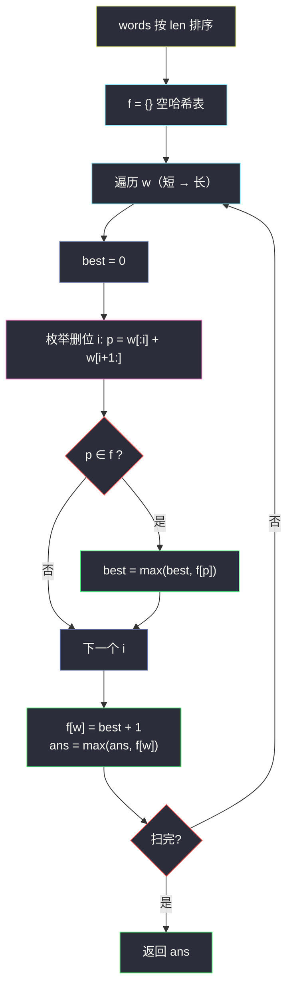

# 1048. 最长字符串链（Longest String Chain）

> 题目来源：[https://leetcode.cn/problems/longest-string-chain/](https://leetcode.cn/problems/longest-string-chain/)
>
> 灵茶题单小节定位：§A 线性 DP（DAG 最长路 · 哈希转移）

## 一、问题描述

给出一个单词数组 `words`，其中每个单词都由小写英文字母组成。

如果我们可以**不改变其他字符的顺序**，在 `wordA` 的任何地方添加**恰好一个**字母使其变成 `wordB`，那么我们认为 `wordA` 是 `wordB` 的**前身**。

- 例如，`"abc"` 是 `"abac"` 的前身，而 `"cba"` 不是 `"bcad"` 的前身。

词链是单词 `[word_1, word_2, ..., word_k]` 组成的序列，`k >= 1`，其中 `word_1` 是 `word_2` 的前身，`word_2` 是 `word_3` 的前身，依此类推。一个单词通常是 `k == 1` 的单词链。

从给定单词列表 `words` 中选择单词组成词链，返回词链的**最长可能长度**。

**数据范围**：

- `1 <= words.length <= 1000`
- `1 <= words[i].length <= 16`
- `words[i]` 仅由小写英文字母组成

**示例 1**：

```text
输入：words = ["a","b","ba","bca","bda","bdca"]
输出：4
解释：最长单词链之一为 ["a","ba","bda","bdca"]。
```

**示例 2**：

```text
输入：words = ["xbc","pcxbcf","xb","cxbc","pcxbc"]
输出：5
解释：所有的单词都可以放入单词链 ["xb","xbc","cxbc","pcxbc","pcxbcf"]。
```

**示例 3**：

```text
输入：words = ["abcd","dbqca"]
输出：1
解释："abcd" 与 "dbqca" 互非前身，最长链 ["abcd"] 长度 1。
```

**核心思考点**：「前身」关系构成一张 **DAG**（长度严格 +1，无环），求最长链 = DAG 最长路。按长度排序保证拓扑序，`f[w]` = 以 `w` 结尾的最长链；转移不枚举所有前驱词，而是**枚举 `w` 删一个字符得到的所有变体**，查哈希表——`O(L²)` 种变体（L ≤ 16），总复杂度 `O(n·L²)`，远优于两两判前身的 `O(n²·L)`。

## 二、暴力解法

### 思路

按长度排序后，对每对 `(j, i)`（`len[j] + 1 == len[i]`）判断 `words[j]` 是否为 `words[i]` 的前身（双指针检查「恰差一字符」），`f[i] = max(f[j] + 1)`。

### 代码

```python
def longestStrChainBrute(words: list[str]) -> int:
    words.sort(key=len)
    n = len(words)

    def is_pred(a: str, b: str) -> bool:     # a 是 b 的前身
        if len(b) - len(a) != 1:
            return False
        i = j = 0
        skipped = False
        while i < len(a) and j < len(b):
            if a[i] == b[j]:
                i += 1; j += 1
            elif not skipped:
                skipped = True; j += 1
            else:
                return False
        return True                            # 末尾多一个字符也合法

    f = [1] * n
    for i in range(n):
        for j in range(i):
            if is_pred(words[j], words[i]):
                f[i] = max(f[i], f[j] + 1)
    return max(f)
```

### 复杂度

- 时间：`O(n²·L)`——`n = 1000` 时 1.6×10⁷ 次字符比较，能过但不够优雅。
- 空间：`O(n)`。

## 三、优化探索

### 3.1 前身关系是 DAG，排序即拓扑序 ⭐

「添加一个字母」使长度严格增 1，任何链上长度单调递增——**按长度排序后**，边只能从短词指向长词，序即拓扑序。`f[w]` 只需看「比它短 1 的前驱们」。这就是最经典的**DAG 最长路**（记忆化/递推两写皆可），与「划分 DP」的区别在于：转移图由数据（前身关系）隐式给出，而不是由下标区间规则给出。

### 3.2 转移方向反转：枚举变体查哈希 ⭐⭐

判断「谁是我的前驱」不必扫全部词——我的前驱必然是「我删掉一个字符后的字符串」。长度 L 的词有 L 个「删一位变体」（如 `"bdca"` → `"dca","bca","bda","bdc"`），逐一查哈希表 `f`：

```text
f[w] = max( f.get(变体, 0) ) + 1     变体 = w[:i] + w[i+1:]
```

两种视角的复杂度对比（设均长 L）：

- 枚举前驱对（暴力）：`O(n²·L)`；
- 枚举变体（主解）：`O(n·L²)`——`n = 1000, L = 16` 时约 25.6 万次字符串操作，快 60 倍。

「**生成候选查表**取代**逐对验证**」是哈希优化 DP 转移的通用套路（同思路见：删除得到回文串的邻居生成、开锁转盘的四邻居）。

### 3.3 长度排序的必要性 ⭐

哈希表必须「先装短词、再算长词」——排序按长度（`key=len`）保证处理 `w` 时其全部前驱已在表中。相同长度的词之间无前身边，顺序无所谓。



## 四、代码实现

### 主解：排序 + 变体枚举 + 哈希

```python
class Solution:
    def longestStrChain(self, words: List[str]) -> int:
        words.sort(key=len)                 # 拓扑序：短词先入表
        f = {}                              # f[w]: 以 w 结尾的最长链
        ans = 1
        for w in words:
            best = 0
            for i in range(len(w)):         # 枚举删一位的变体
                p = w[:i] + w[i + 1:]
                if p in f:
                    best = max(best, f[p])
            f[w] = best + 1
            ans = max(ans, f[w])
        return ans
```

### 对照：记忆化搜索版（自顶向下 DAG 最长路）

```python
from functools import cache

class Solution:
    def longestStrChain(self, words: List[str]) -> int:
        ws = set(words)
        @cache
        def dfs(w: str) -> int:             # 以 w 为终点的最长链
            res = 1
            for i in range(len(w)):
                p = w[:i] + w[i + 1:]
                if p in ws:
                    res = max(res, dfs(p) + 1)
            return res
        return max(dfs(w) for w in words)
```

（不排序、纯靠 `set` + 记忆化——每词只在首次被查时展开，总复杂度同阶 `O(n·L²)`；递归深度 ≤ 16 很安全。）

### 细节说明

- **变体可能重复**（如 `"aab"` 删任一 `a` 都得 `"ab"`），`max` 幂等、无害；也可用 `set` 去重微加速。
- **`f[w] = best + 1` 的 `+1`**：`best = 0`（无前驱）时链长 1——单词自己是 `k == 1` 的链，题面明说。
- **重复单词**：`words` 若含重复（题面未禁止？实际测试用例无重复，但代码稳健）——后处理的同词覆盖 `f[w]`，值不变。
- **为什么不能按字典序排序**：前身关系只依赖长度差 1，字典序不提供拓扑性质。
- **记忆化版的入参限制**：`dfs` 以**字符串**为状态（而非下标）天然免重；若用下标则需先建「前驱边表」。

## 五、例子演示

**示例 1 端到端：words = ["a","b","ba","bca","bda","bdca"]**

按长度排序后处理顺序：`a, b, ba, bca, bda, bdca`。

| w | 变体（删一位） | 命中 f | f[w] | ans |
|---|---|---|---|---|
| `a` | `""` | 无 | **1** | 1 |
| `b` | `""` | 无 | **1** | 1 |
| `ba` | `a`, `b` | f[a]=1, f[b]=1 | **2** | 2 |
| `bca` | `ca`, `ba`, `bc` | f[ba]=2 | **3** | 3 |
| `bda` | `da`, `ba`, `bd` | f[ba]=2 | **3** | 3 |
| `bdca` | `dca`, `bca`, `bda`, `bdc` | f[bca]=3, f[bda]=3 | **4** | **4** ✓ |

返回 **4** ✅——`bdca` 的两个变体 `bca`、`bda` 都是长度 3 链的结尾，接上后得 4，对应官方的 `["a","ba","bda","bdca"]`（或走 `bca` 分支）。

**示例 2：words = ["xbc","pcxbcf","xb","cxbc","pcxbc"]**，排序后 `xb, xbc, cxbc, pcxbc, pcxbcf`：

| w | 变体 | 命中 | f[w] |
|---|---|---|---|
| `xb` | `b`, `x` | 无 | 1 |
| `xbc` | `bc`, `xc`, `xb` | f[xb]=1 | 2 |
| `cxbc` | `xbc`(删首位), `cbc`…| f[xbc]=2 | 3 |
| `pcxbc` | `cxbc`(删 p) 等 | f[cxbc]=3 | 4 |
| `pcxbcf` | `pcxbc`(删 f) 等 | f[pcxbc]=4 | **5** |

返回 **5** ✅——五个词全串成一条链。

**示例 3：words = ["abcd","dbqca"]**：长度差 1 但 `"abcd"` 删任何一位得 `"bcd"/"acd"/"abd"/"abc"`，均 ≠ 任何词的前驱位置；反向 `"dbqca"` 的变体不含 `"abcd"`。两词的 f 均为 1，返回 **1** ✅（前身要求保序添加，`"cba"` 类乱序不算——这正是题面强调「不改变其他字符的顺序」的原因）。

## 六、复杂度分析

设 `n = len(words)`，`L = 16` 为最大词长：

- **时间复杂度：`O(n log n + n·L²)`**——排序 `O(n log n)`；每词 `L` 个变体、每个变体拼接与哈希 `O(L)`。
- **空间复杂度：`O(n·L)`**——哈希表存全部词及其链长。

## 七、对比总结

| 维度 | 暴力（两两判前身） | 主解（变体查哈希） | 记忆化搜索 |
|---|---|---|---|
| 时间 | `O(n²·L)` | `O(n·L²)` | `O(n·L²)` |
| 转移来源 | 枚举所有 j | 枚举删位生成 | 同主解（惰性） |
| 顺序要求 | 需按长度排序 | 同左 | 无需排序 |
| 通用性 | 任意二元关系 | 需「前驱可枚举」 | 需「前驱可枚举」 |

**套路归纳**：**「隐式 DAG 最长路」**三步——①识别「长度/大小严格递增的关系边」（天然无环）；②建立拓扑序（排序或按需展开）；③转移用**候选生成 + 哈希查询**代替逐对验证，把 `O(n²)` 的比较降为 `O(n)` 次查表。「枚举我的邻居」优于「枚举所有人问是不是我邻居」——这一招同时出现在开锁问题（BFS 邻居生成）、单词接龙、基因突变等一大族题里，值得形成条件反射。

## 八、举一反三

1. **[139. 单词拆分](https://leetcode.cn/problems/word-break/)**：词表 + 哈希查询的划分 DP，与本题共享「字典查表」基建。
2. **[127. 单词接龙](https://leetcode.cn/problems/word-ladder/)**：变一位生成邻居 + BFS 最短路——「枚举变体查哈希」在图搜索中的孪生应用。
3. **[368. 最大整除子集](https://leetcode.cn/problems/largest-divisible-subset/)**：整除关系构成的 DAG 最长路（排序后 DP），与本题同型不同关系。
4. **[300. 最长递增子序列](https://leetcode.cn/problems/longest-increasing-subsequence/)**：数值版隐式 DAG（下标 + 大小双约束），DP + 二分优化。
5. **[2369. 检查数组是否存在有效划分](https://leetcode.cn/problems/check-if-there-is-a-valid-partition-for-the-array/)**：本批姊妹篇——规则显式给转移的划分 DP，与本题「关系隐式给边」对照着读，线性 DP 两大流派就齐了。

**同族互引**：灵茶题单线性 DP 的 DAG 支线收官；同批 `check-if-there-is-a-valid-partition-for-the-array.md`（显式规则转移）与 `sorting-three-groups.md`（值域状态转移）分别代表另两种转移形态，三篇合看即可覆盖「转移从哪来」的全部典型答案。
