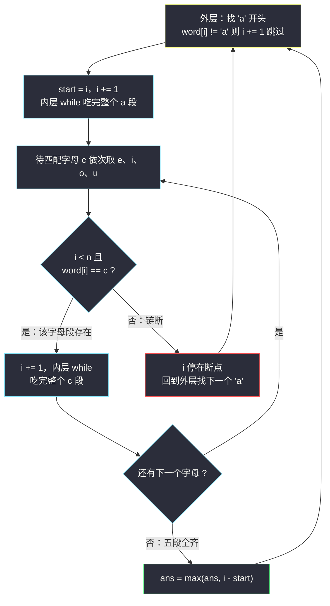
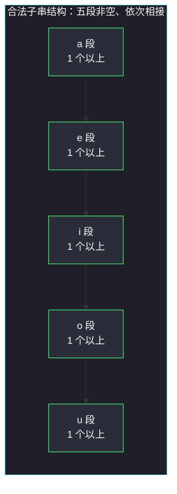
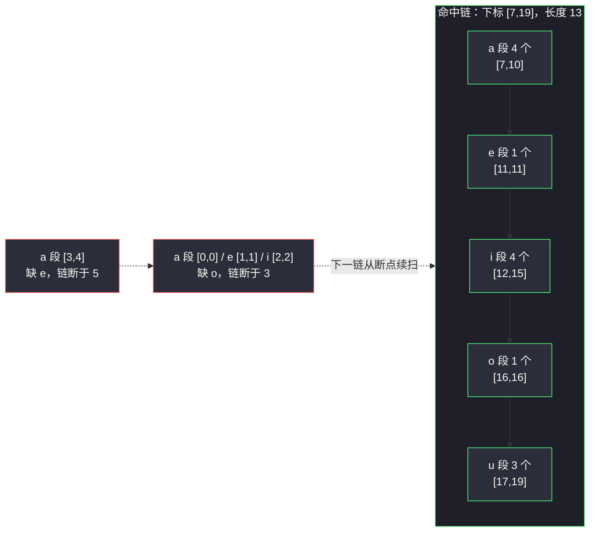

# 所有元音按顺序排布的最长子字符串（分组循环：同字母段串成 aeiou 链）

## 一、问题描述

给定一个只包含元音 `a`、`e`、`i`、`o`、`u` 的字符串 `word`。

一个子串如果「**所有元音按顺序排布**」，需同时满足：

1. **包含全部 5 种元音**（每种至少出现一次）；
2. 所有 `a` 都在所有 `e` 之前，所有 `e` 都在所有 `i` 之前，……，所有 `o` 都在所有 `u` 之前。

也就是说，合法子串的形状**恰好是** `a...a e...e i...i o...o u...u`（五段都非空、顺序固定）。返回最长的合法子串长度；不存在则返回 `0`。

> 🔗 LeetCode 1839 所有元音按顺序排布的最长子字符串：https://leetcode.cn/problems/longest-substring-of-all-vowels-in-order/
> 难度：Medium · 出自灵神题单「**六、分组循环**」小节

**示例 1**

```
输入：word = "aeiaaioaaaaeiiiiouuuooaauuaeiu"
输出：13
解释：最长合法子串是 "aaaaeiiiiouuu"（下标 [7,19]），长度 13。
```

**示例 2**

```
输入：word = "aeeeiiiioooauuaeiou"
输出：5
解释：前半段 "aeeeiiiiooo" 缺 u；最长合法子串是结尾的 "aeiou"，长度 5。
```

**示例 3**

```
输入：word = "a"
输出：0
解释：只有一种元音，不满足「包含全部 5 种」。
```

**直观理解**

合法子串的结构被限死成 **5 个「连续同字母段」的链**：第一段全是 `a`，第二段全是 `e`……第五段全是 `u`。而「连续同字母段」正是分组循环切出来的「组」。于是问题变为：在组的序列里，找一条 `a→e→i→o→u` 首尾相接、相邻组恰好依次升一级的链，让链覆盖的原始下标最长。

---

## 二、暴力解法

### 思路

枚举每个起点（合法子串必须以 `a` 开头），向右延伸：维护当前已集齐的元音种数 `cnt` 和当前长度。后一个字符要么与前一字符相同（同段延续），要么恰好是前一字符在 `aeiou` 中的下一个（升段），否则起点作废。

```python
class Solution:
    def longestBeautifulSubstring(self, word: str) -> int:
        pos = {c: k for k, c in enumerate("aeiou")}   # 元音 -> 序号
        n, ans = len(word), 0
        for i in range(n):
            if word[i] != 'a':
                continue                               # 合法子串必须以 a 开头
            cnt, length = 1, 1                         # 已集齐 a，长度 1
            for j in range(i + 1, n):
                if word[j] == word[j - 1]:
                    length += 1                        # 同字母段延续
                elif pos[word[j]] == pos[word[j - 1]] + 1:
                    length += 1                        # 恰好升到下一个元音
                    cnt += 1
                else:
                    break                              # 断链，起点 i 作废
                if cnt == 5:
                    ans = max(ans, length)
        return ans
```

### 复杂度

- **时间**：`O(n²)`。每个起点最多向右扫到底。`word` 长度可达 `5 × 10^5`，必超时。
- **空间**：`O(1)`（`pos` 字典大小恒为 5）。

### 🔴 瓶颈在哪里

起点的移动毫无记忆：从 `i` 换到 `i+1`，之前判断过的「哪些位置属于哪一段、链在哪里断掉」全部作废重来。事实上链一旦断掉，断点之前的所有起点**都不可能再成功**，可以直接跳过——这正是分组循环的用武之地。

---

## 三、优化探索（核心章节）

### 3.1 结构观察

| 观察 | 说明 |
|------|------|
| 合法子串 = `a+ e+ i+ o+ u+` | 五个「连续同字母段」依次相接，每段非空 |
| 「组」仍然是连续同字母段 | 分组循环切出来的组不变，变的是**组间衔接条件** |
| 链必须以 `a` 组开头、以 `u` 组结尾 | 中间依次 `e → i → o`，缺一不可 |
| 链断在哪儿，下一个候选起点就在哪儿 | `i` 跳到断点继续找 `a`，不回头 |

### 3.2 推导：分组循环 + 逐段对齐

> **题单出处**：本题出自灵神题单「**六、分组循环**」小节，对齐 lyl 分组循环模板：
> **外层循环确定每组起点，内层 `while` 消费同组连续段；组内收集答案，组间重置。**
> 本题是模板的进阶用法：不是每个组独立收集答案，而是把「**连续五组恰好是 a、e、i、o、u**」的链整体收集。

流程（`i` 全程只前进）：

1. 外层先找 `a`：`word[i] != 'a'` 就 `i += 1` 跳过（别的字母开不了头）；
2. 记 `start = i`，`i += 1`，内层 `while word[i] == word[i-1]` 吃完整个 `a` 段；
3. 依次尝试 `e`、`i`、`o`、`u` 四段：每段先确认首字母匹配（`word[i] == c`），再 `i += 1` 并用内层 `while` 吃完这一段；
4. 任一段首字母不匹配 → 链断，`i` 停在断点（外层从断点继续找下一个 `a`，天然跳过了所有无效起点）；
5. 四段全部吃齐 → 五段链 `[start, i-1]` 合法，`ans = max(ans, i - start)`。



**为什么是 `O(n)`**：`i` 在外层、匹配、内层消费中都只前进不后退；每个下标至多被消费一次。断链时直接从断点续扫，暴力里那些重复起点的劳动被整段剪掉。

### 3.3 合法链长什么样



### 3.4 一句话核心

> **把 `word` 按「连续同字母」切组，从每个 `a` 组出发依次吞掉 `e、i、o、u` 四组；五段全齐则链长即答案，链断则 `i` 停在断点继续找 `a`，全程不回头。**

---

## 四、代码实现

### Python（主解：分组循环 + 逐段对齐）

```python
class Solution:
    def longestBeautifulSubstring(self, word: str) -> int:
        n = len(word)
        ans = 0
        i = 0
        while i < n:
            if word[i] != 'a':              # 合法子串必须以 a 开头
                i += 1
                continue
            start = i
            i += 1                          # 吃掉 a 段的第一个字符
            while i < n and word[i] == word[i - 1]:
                i += 1                      # 吃完 a 段剩余字符
            for c in "eiou":                # 依次对齐 e、i、o、u 四段
                if i < n and word[i] == c:
                    i += 1                  # 吃掉 c 段的第一个字符
                    while i < n and word[i] == word[i - 1]:
                        i += 1              # 吃完 c 段剩余字符
                else:
                    break                   # 缺字母，本链作废
            else:                           # for 没被 break：五段全齐
                ans = max(ans, i - start)
        return ans
```

**要点**

| 元素 | 含义 |
|------|------|
| `while word[i] == word[i-1]` | 消费「同字母组」的通用条件（与 #1446 一致） |
| `for c in "eiou"` + `else` | Python 的 `for-else`：循环完整跑完（没 `break`）才进 `else`，恰好表达「四段全对齐」 |
| `i` 停在断点 | 断链后外层从断点继续找 `a`，保证每个下标只被扫一次 |

### Python（进阶：一遍扫描，维护已见元音种数）

不显式分组也可以：`length` 记当前链长，`cnt` 记链内已出现到第几种元音。字符与前一字符相同则延续；恰好升一级则 `cnt += 1`；否则链断、从当前字符重开。`cnt == 5` 时收集答案：

```python
class Solution:
    def longestBeautifulSubstring(self, word: str) -> int:
        pos = {c: k for k, c in enumerate("aeiou")}
        ans = length = cnt = 0
        prev = word[0]
        for j, ch in enumerate(word):
            if j == 0:
                length, cnt = 1, 1
            elif ch == prev:
                length += 1                      # 同字母段延续
            elif pos[prev] + 1 == pos[ch]:
                length += 1
                cnt += 1                         # 恰好升到下一个元音
            else:
                length, cnt = 1, 1               # 链断，从 ch 重开
            prev = ch
            if cnt == 5:
                ans = max(ans, length)
        return ans
```

### Java（最优解补充：分组循环版）

```java
class Solution {
    public int longestBeautifulSubstring(String word) {
        char[] w = word.toCharArray();
        int n = w.length, ans = 0, i = 0;
        while (i < n) {
            if (w[i] != 'a') {                   // 合法子串必须以 a 开头
                i++;
                continue;
            }
            int start = i;
            i++;
            while (i < n && w[i] == w[i - 1]) i++;   // 吃完 a 段
            boolean ok = true;
            for (char c : "eiou".toCharArray()) {    // 依次对齐 e、i、o、u
                if (i < n && w[i] == c) {
                    i++;
                    while (i < n && w[i] == w[i - 1]) i++;
                } else {
                    ok = false;
                    break;
                }
            }
            if (ok) ans = Math.max(ans, i - start);  // 五段全齐
        }
        return ans;
    }
}
```

---

## 五、具体例子演示

### 端到端跟踪：word = "aeiaaioaaaaeiiiiouuuooaauuaeiu"

下标对照：`0:a 1:e 2:i 3:a 4:a 5:i 6:o 7:a 8:a 9:a 10:a 11:e 12:i 13:i 14:i 15:i 16:o 17:u 18:u 19:u 20:o 21:o 22:a 23:a 24:u 25:u 26:a 27:e 28:i 29:u`

外层每次从 `a` 出发尝试拼链，逐步记录（「跳过」行表示外层 `i += 1` 略过非 `a` 字符）：

| 轮次 | 出发下标 i | 动作 | 段对齐情况 | 轮结束时 i | 成功? | ans |
|------|-----------|------|------------|-----------|-------|-----|
| 1 | 0（`a`） | a 段 [0,0]，e 段 [1,1]，i 段 [2,2] | 轮到 `o` 时 `word[3]='a'` 不匹配 → 断链 | 3 | 否 | 0 |
| 2 | 3（`a`） | a 段 [3,4] | 轮到 `e` 时 `word[5]='i'` 不匹配 → 断链 | 5 | 否 | 0 |
| 3 | 5（`i`） | 跳过（非 `a`） | — | 6 | — | 0 |
| 4 | 6（`o`） | 跳过（非 `a`） | — | 7 | — | 0 |
| 5 | 7（`a`） | a 段 [7,10]，e 段 [11,11]，i 段 [12,15]，o 段 [16,16]，u 段 [17,19] | **五段全齐**，链 [7,19]，长度 20-7=13 | 20 | 是 | **13** |
| 6 | 20（`o`）→21（`o`） | 跳过到 22 | — | 22 | — | 13 |
| 7 | 22（`a`） | a 段 [22,23] | 轮到 `e` 时 `word[24]='u'` 不匹配 → 断链 | 24 | 否 | 13 |
| 8 | 24（`u`）→25（`u`） | 跳过到 26 | — | 26 | — | 13 |
| 9 | 26（`a`） | a 段 [26,26]，e 段 [27,27]，i 段 [28,28] | 轮到 `o` 时 `word[29]='u'` 不匹配 → 断链 | 29 | 否 | 13 |
| 10 | 29（`u`） | 跳过，扫描结束 | — | 30 | — | 13 |

最终返回 **13** ✓（对应官方示例 1：`"aaaaeiiiiouuu"`）

命中链的结构可视化（第 5 轮）：



### 再快速过一遍 word = "aeeeiiiioooauuaeiou"（示例 2）

- 起点下标 0：a 段 [0,0]，e 段 [1,3]，i 段 [4,7]，o 段 [8,10]，轮到 `u` 时 `word[11]='a'` → 断链，i=11。注意此时链长已有 11，但**缺 u，不能计入答案**；
- i=11（`a`）：a 段 [11,11]，轮到 `e` 时 `word[12]='u'` → 断链，i=12；
- i=12、13（`u`）跳过；i=14（`a`）：a 段 [14,14]，e [15,15]，i [16,16]，o [17,17]，u [18,18] → **五段全齐**，链长 5 → `ans = 5`；
- i=19 扫描结束，返回 **5** ✓。

这个例子正说明「长度再长，五段不齐也不算」——`cnt == 5` 是收集答案的硬门槛。

---

## 六、复杂度分析

| 方法 | 时间 | 空间 | 说明 |
|------|------|------|------|
| 暴力枚举起点 | `O(n²)` | `O(1)` | 每个起点都重新向右扫 |
| 分组循环 + 逐段对齐 | `O(n)` | `O(1)` | `i` 只前进不后退，断链直接续扫 |
| 一遍计数版 | `O(n)` | `O(1)` | 与分组循环等价 |

---

## 七、对比总结与易错点

**易错点**

1. **必须以 `a` 开头**：从 `e`/`i`/`o`/`u` 开始的子串永不合法，外层要先把非 `a` 跳掉。
2. **五段必须全齐**：`aeeeiiiiooo` 长 11 但缺 `u`，答案是 0 不是 11。收集答案一定要放在「四段全部对齐」之后（`for-else` / `ok` 标志位）。
3. **断链后 `i` 不回退**：`i` 停在断点，外层从断点继续找 `a`，这样每个下标只被扫一次，保证 `O(n)`；如果断链后把 `i` 拉回 `start + 1`，就退化回 `O(n²)`。
4. **段首字符要先 `i += 1` 再进内层 `while`**：判断条件是与 `word[i-1]` 相邻比较，不先前进一格，`e` 段的第一个字符永远比不上。
5. 一遍计数版里链断时新链从**当前字符**重开（`length = cnt = 1`），当前字符不是 `a` 也没关系——`cnt` 到不了 5，自然不会误收集。

**模板（分组循环 · 相邻组按序对齐）**

```python
i = 0
while i < n:
    if word[i] != 'a':          # 链必须的起点字母
        i += 1
        continue
    start = i
    i += 1
    while i < n and word[i] == word[i-1]:
        i += 1                  # 吃完首段
    for c in "eiou":            # 依次对齐后续各段
        if i < n and word[i] == c:
            i += 1
            while i < n and word[i] == word[i-1]:
                i += 1
        else:
            break
    else:
        ans = max(ans, i - start)
```

---

## 八、举一反三

| 题目 | 关系 |
|------|------|
| [#3255 长度为 K 的子数组的能量值 II](https://leetcode.cn/problems/find-the-power-of-k-size-subarrays-ii/) | 组从「同字母」推广为「连续 +1 递增段」（本批题解：`find-the-power-of-k-size-subarrays-ii.md`） |
| [#1446 连续字符](https://leetcode.cn/problems/consecutive-characters/) | 分组循环入门（本批题解：`consecutive-characters.md`） |
| [#2414 最长的字母序连续子字符串](https://leetcode.cn/problems/length-of-the-longest-alphabetical-continuous-substring/) | 「组 = 连续 +1 递增段」的字母版，#3255 的姊妹题 |
| [#3105 最长的严格递增或严格递减子数组](https://leetcode.cn/problems/longest-strictly-increasing-or-strictly-decreasing-subarray/) | 按单调方向分组的练习 |
| [#978 最长湍流子数组](https://leetcode.cn/problems/longest-turbulent-subarray/) | 分组思想的另一变体：比较符号交替的段 |

**思想迁移**：分组循环的「组」不一定是「相同」，可以是任何**局部可判定的相邻关系**（相同、+1 递增、恰好升一级）。切完组之后，再在组的序列上找满足衔接条件的最长链——「切组」和「组间接力」是可以分开训练的两个动作。
