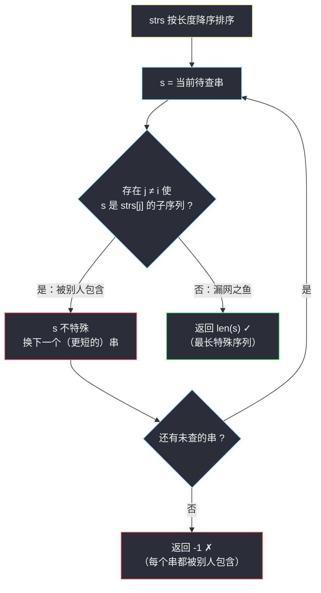
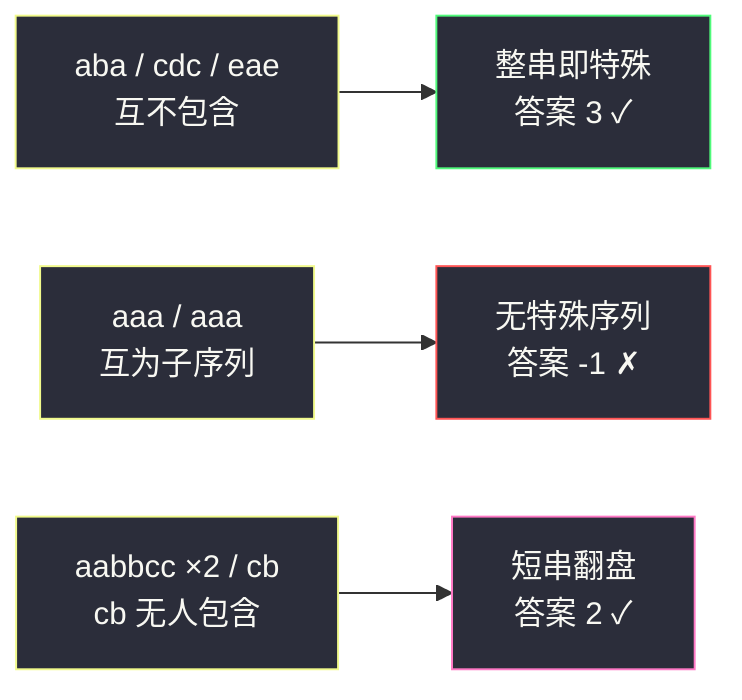

# 最长特殊序列 II（子序列判定 · 整串枚举与排序剪枝）

## 一、问题描述

从一个字符串中删除若干字符（可以不删）、保持剩余字符相对顺序，得到的新串称为原串的**子序列**。例如 `"ace"` 是 `"abcde"` 的子序列，`"aec"` 不是。

「**特殊序列**」定义如下：如果一个序列 `x` 是字符串 `str` 的子序列，且 `x` **不是** `strs` 中**其他任何字符串**的子序列（`strs` 中可能存在重复字符串，此时它们互为「其他字符串」），则称 `x` 是属于 `str` 的特殊序列。

给定字符串数组 `strs`，返回其中**最长特殊序列**的长度；不存在特殊序列则返回 `-1`。

> 🔗 LeetCode 522：https://leetcode.cn/problems/longest-uncommon-subsequence-ii/
>
> 数据范围：`1 <= strs.length <= 50`，`1 <= strs[i].length <= 10`，只含小写字母。

**示例 1**

```
输入：strs = ["aba", "cdc", "eae"]
输出：3
解释：三个串互不为彼此的子序列，整串 "aba"（"cdc"、"eae" 同理）就是特殊序列，最长长度 3。
```

**示例 2**

```
输入：strs = ["aaa", "aaa"]
输出：-1
解释：两个相同的串互为子序列，"aaa" 的任何子序列也都是另一个 "aaa" 的子序列，
      不存在特殊序列。
```

**补充示例（重复串 + 短串翻盘）**

```
输入：strs = ["aabbcc", "aabbcc", "cb"]
输出：2
解释：两个 "aabbcc" 互为子序列，谁都不特殊；"cb" 不是任何 "aabbcc" 的子序列
      （b 全在 c 前面），所以 "cb" 是特殊序列，长度 2。
```

**直观理解**

「特殊」= **只被一个字符串包含**。一个候选序列被越少的串包含越「特殊」，而它越长越有价值——两个方向拉扯，正是本题要平衡的点。

## 二、暴力解法（枚举所有子序列）

### 直观思路

特殊序列一定藏在某个串的子序列里，那就把**每个串的所有子序列**都列出来，逐个检查「是否只被一个原串包含」，取最长的合格者。

```python
from itertools import combinations

class Solution:
    def findLUSlength(self, strs: List[str]) -> int:
        def all_subs(s: str) -> set:
            """s 的所有子序列（含空串与整串）"""
            res = set()
            for k in range(len(s) + 1):
                for idx in combinations(range(len(s)), k):
                    res.add(''.join(s[i] for i in idx))
            return res

        subs = [all_subs(s) for s in strs]        # 每个串的子序列集合
        ans = -1
        for i, bag in enumerate(subs):
            for sub in bag:
                # sub 不能是其他任何串的子序列
                if all(sub not in subs[j] for j in range(len(strs)) if j != i):
                    ans = max(ans, len(sub))
        return ans
```

### 复杂度

- **时间**：长为 `L` 的串有 `2^L` 个子序列，构建集合 `O(2^L · L)`；两两集合做包含检查是 `O(n² · 4^L · L)` 级别——指数级，`L` 稍大即不可行（本题 `L ≤ 10` 勉强能跑，但毫无必要）。
- **空间**：`O(n · 2^L)` 存子序列集合。

### 🔴 瓶颈在哪里

我们在枚举**所有子序列**，但绝大多数候选既短又注定被更长的候选覆盖。答案的结构其实非常整齐：**值得检查的候选只有 n 个整串**——下一章用一条引理证明这一点。

## 三、优化探索（核心章节）

> 📚 本题在灵茶题单中属于 **§4.2（子序列匹配）**：核心工具是 O(L) 的双指针子序列判定，套一层「整串枚举」的外壳。

### 3.1 关键引理：最优候选一定是某个整串

**引理**：若 `strs[i]` 的某个子序列 `sub` 是特殊序列，那么 `strs[i]` 整串也是特殊序列，且 `len(strs[i]) >= len(sub)`。

**证明**（反证）：设 `sub` 特殊但 `strs[i]` 是某个其他串 `strs[j]`（`j ≠ i`）的子序列。子序列关系有传递性：`sub ⊆ strs[i] ⊆ strs[j]`，于是 `sub` 也是 `strs[j]` 的子序列，与 `sub` 特殊矛盾。所以 `strs[i]` 不是任何其他串的子序列，即整串本身特殊；长度优势显然。

**推论**：

```
答案 = max{ len(strs[i]) ：strs[i] 不是其他任何 strs[j] (j ≠ i) 的子序列 }
      若集合为空，答案 = -1
```

指数级的子序列枚举，直接塌缩成「只查 n 个整串」。

### 3.2 工具：O(L) 双指针判定「s 是否为 t 的子序列」

`i` 扫 `s`、`j` 扫 `t`：`t[j] == s[i]` 时 `i` 前进，`j` 无条件前进；结束时 `i` 走完 `s` 即为子序列。

贪心正确性：每个 `s[i]` 匹配 `t` 中**最早**可用位置不会更差——把匹配位置右移只会让后续字符可选范围更小。这也是灵神 §4.2 的标准写法。

注意两个自然推论：`s == t` 时判定为真（相同串互为子序列，重复串自动被排除）；空串是任何串的子序列（本题 `len ≥ 1` 用不到，但别忘）。

### 3.3 排序剪枝：找到即返回

把 `strs` 按**长度降序**排序后从长到短检查：第一个通过「不是其他串子序列」检查的串，长度就是全局最大——**直接返回，无需扫完**。

两个细节：

1. 同长度的串之间仍需互查：同长串若互为子序列则必相等（相等的串被 3.2 的判定天然排除），检查逻辑自动覆盖；
2. 检查方向必须对每个 `i` 遍历所有 `j ≠ i`——「s 是 t 的子序列」**不对称**（`"ab" ⊆ "abc"` 但 `"abc" ⊄ "ab"`），单向查会漏。



### 3.4 一句话核心

> **特殊子序列若有，整串必特殊且不短于它——于是只查 n 个整串：长度降序排队，双指针判「是否被别人包含」，第一个漏网之鱼就是答案。**

## 四、代码实现

### Python（主解：排序降序 + 双指针判定）

```python
class Solution:
    def findLUSlength(self, strs: List[str]) -> int:
        def is_subseq(s: str, t: str) -> bool:
            """s 是否为 t 的子序列（双指针贪心）"""
            i = 0
            for ch in t:
                if i < len(s) and s[i] == ch:
                    i += 1                     # s[i] 匹配成功，找下一个
            return i == len(s)                 # s 全部匹配完即为子序列

        strs.sort(key=len, reverse=True)       # 长的优先，找到即返回
        for i, s in enumerate(strs):
            if all(not is_subseq(s, t)
                   for j, t in enumerate(strs) if j != i):
                return len(s)                  # 最长的漏网之鱼
        return -1
```

**变量含义**

| 变量 | 含义 |
|------|------|
| `s` | 当前待检验的整串候选 |
| `i` / `ch` / `j` | 双指针：`i` 指向 `s` 中待匹配字符，`ch` 为 `t` 的当前字符 |

**循环不变式**：`is_subseq` 结束任意时刻，`s[0..i-1]` 是 `t` 已消费前缀的子序列，且是**最长**的这样一个前缀（贪心最早匹配保证）。

排序是稳定剪枝而非正确性依赖：即使不排序、检查全部 n 个串取 `max(len)`，答案相同，只是慢一点点。

### Java（最优解同款写法）

```java
class Solution {
    public int findLUSlength(String[] strs) {
        Arrays.sort(strs, (a, b) -> b.length() - a.length());   // 长的优先
        for (int i = 0; i < strs.length; i++) {
            boolean ok = true;
            for (int j = 0; j < strs.length && ok; j++) {
                if (j != i && isSubseq(strs[i], strs[j])) {
                    ok = false;              // 被别人包含，不特殊
                }
            }
            if (ok) return strs[i].length(); // 找到即最长
        }
        return -1;
    }

    private boolean isSubseq(String s, String t) {
        int i = 0;
        for (int j = 0; j < t.length() && i < s.length(); j++) {
            if (s.charAt(i) == t.charAt(j)) i++;
        }
        return i == s.length();
    }
}
```

## 五、具体例子演示

**主例 `strs = ["aba", "cdc", "eae"]`**，长度相同排序后顺序不变。

检查 `i = 0`，候选 `"aba"`：

先对 `"cdc"` 判定（显然无 `a`，三个字符全部跳过，`i` 停在 0）→ 不是子序列；再对 `"eae"` 判定，双指针逐步跟踪：

| 轮次 j | t[j] | i（s 侧） | s[i] | 动作 |
|--------|------|-----------|------|------|
| 0 | e | 0 | a | 不匹配，j++ |
| 1 | a | 0 | a | **匹配**，i → 1 |
| 2 | e | 1 | b | 不匹配，j++ |
| 结束 | — | 1 ≠ 3 | — | **不是** `"eae"` 的子序列 ✓ |

没有任何 `j` 包含 `"aba"` → `"aba"` 特殊，**返回 `3`** ✓（`"cdc"`、`"eae"` 同理都特殊，长度同为 3，排序剪枝下无需再查）。

**示例 2 `strs = ["aaa", "aaa"]`**

检查 `i = 0`，候选 `"aaa"` 对 `j = 1` 的 `"aaa"`：

| 轮次 j | t[j] | i | s[i] | 动作 |
|--------|------|---|------|------|
| 0 | a | 0 | a | **匹配**，i → 1 |
| 1 | a | 1 | a | **匹配**，i → 2 |
| 2 | a | 2 | a | **匹配**，i → 3 |
| 结束 | — | 3 = 3 | — | **是**子序列 → `"aaa"` 不特殊 |

`i = 1` 对称同样不特殊 → 全部候选被否 → **返回 `-1`** ✓。相同串互为子序列，被 3.2 的判定自动排除，无需特判。

**补充示例 `strs = ["aabbcc", "aabbcc", "cb"]`**，降序排序后仍为 `["aabbcc", "aabbcc", "cb"]`。

- `i = 0`：`"aabbcc"` 对 `j = 1` 的相同串——六个字符逐一匹配，是子序列 → 不特殊；
- `i = 1`：对称，不特殊；
- `i = 2`：候选 `"cb"` 对第一个 `"aabbcc"`，双指针逐步跟踪：

| 轮次 j | t[j] | i | s[i] | 动作 |
|--------|------|---|------|------|
| 0 | a | 0 | c | 不匹配，j++ |
| 1 | a | 0 | c | 不匹配，j++ |
| 2 | b | 0 | c | 不匹配，j++ |
| 3 | b | 0 | c | 不匹配，j++ |
| 4 | c | 0 | c | **匹配**，i → 1 |
| 5 | c | 1 | b | 不匹配，j++ |
| 结束 | — | 1 ≠ 2 | — | **不是**子序列 ✓ |

对第二个 `"aabbcc"` 同样不是 → `"cb"` 特殊 → **返回 `2`** ✓。



## 六、复杂度分析

| 方法 | 时间 | 空间 | 说明 |
|------|------|------|------|
| 枚举所有子序列 | `O(n² · 4^L · L)` 指数级 | `O(n · 2^L)` | 候选爆炸，大多注定更短 |
| 整串枚举 + 双指针（主解） | `O(n² · L)` | `O(1)`（不计排序的栈空间） | 本题 `n = 50`、`L = 10`，至多约 2.5 万次字符比较 |

排序本身 `O(n log n)`，相对 `n² · L` 可忽略；排序剪枝让平均情况远好于上界——最长串一旦漏网立刻返回。

## 七、对比总结

**易错点**

1. **候选集只剩整串**：想不通 3.1 的引理就容易去枚举子序列；记住「整串被包含 ⇒ 其一切子序列都被包含」，特殊性与长度两头都由整串占优。
2. **子序列 ≠ 子串**：子串要求连续，子序列只要求保序；`"cb"` 不是 `"aabbcc"` 的子序列，但若是子串判定结论也不同——别混用两套判定。
3. **包含关系不对称**：必须对每个 `i` 查所有 `j ≠ i`，只查 `j > i` 会漏掉「短串包含长串」方向（同长不等串互相都不包含，长短不同时长包含短）。
4. **重复串**：相同字符串互为子序列，双指针判定天然覆盖，排序后它们相邻也更早被否；无需额外去重逻辑。
5. **空串边界**：空串是任何串的子序列；本题 `len ≥ 1` 不触发，但自己实现 `is_subseq` 时心里要有数。

**模板（双指针子序列判定，Python 版）**

```python
def is_subseq(s: str, t: str) -> bool:
    """s 是否为 t 的子序列：贪心匹配 t 中最早可用字符"""
    i = 0
    for ch in t:
        if i < len(s) and s[i] == ch:
            i += 1
    return i == len(s)
```

## 八、举一反三

| 题目 | 关系 |
|------|------|
| [521. 最长特殊序列 Ⅰ](https://leetcode.cn/problems/longest-uncommon-subsequence-i/) | 双串版脑筋急转弯：两串不同时答案就是较长者，用来对照理解「特殊」定义 |
| [392. 判断子序列](https://leetcode.cn/problems/is-subsequence/) | 本篇 `is_subseq` 的原型，灵神 §4.2 入门题 |
| [792. 匹配子序列的单词数](https://leetcode.cn/problems/number-of-matching-subsequences/) | 批量子序列判定，进阶用「等待队列桶」优化到 O(总字符数) |
| [524. 通过删除字母匹配到字典里最长单词](https://leetcode.cn/problems/longest-word-in-dictionary-through-deleting/) | 子序列判定 + 在合格者中取最长（再加字典序），本题的近亲 |
| [1143. 最长公共子序列](https://leetcode.cn/problems/longest-common-subsequence/) | 镜像问题：求两串「最公共」的子序列，与本题「最不公共」互为反面 |

**思想迁移**

- **候选收缩**：当最优解的结构可以证明「取到极值时形态固定」（本题：最长特殊序列必是整串），就把指数级候选集收缩到线性个——先证引理再写代码，是压复杂度的第一利器。
- **判定与枚举分层**：外层枚举候选（谁可能是答案），内层 O(L) 判定（它配不配），`O(n² · L)` 的骨架可以套到一大类「包含/支配」问题上。
- 口诀：**「特殊序列整串看，降序排队查包含；双指针贪心判子列，谁都没罩谁最长。」**
