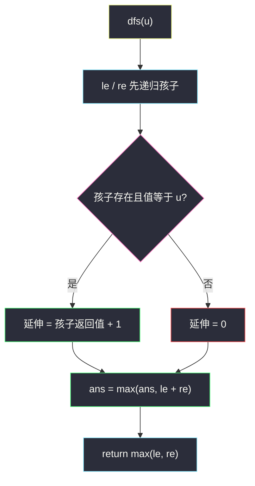
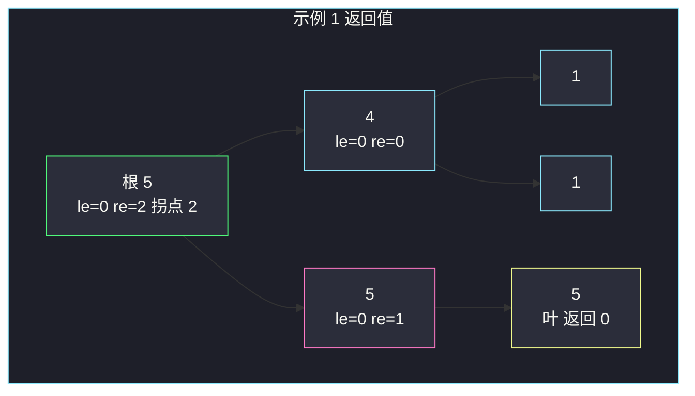

# 687. 最长同值路径（Longest Univalue Path）

> 题目来源：[https://leetcode.cn/problems/longest-univalue-path/](https://leetcode.cn/problems/longest-univalue-path/)
>
> 灵茶题单小节定位：§12.1 树的直径

## 一、问题描述

给定一棵二叉树的 `root`，返回最长路径的长度，这条路径上**每个节点的值都相同**。路径可以经过根，也可以不经过根。

两个节点之间的路径长度由它们之间的**边数**表示（不是节点数）。

**数据范围**：

- 节点数范围 `[0, 10^4]`（允许空树）
- `-1000 <= Node.val <= 1000`
- 树的深度不超过 `1000`

**示例 1**：

```text
输入：root = [5,4,5,1,1,5]
输出：2
```

层序对应的树：

```text
      5
     / \
    4   5
   / \   \
  1   1   5
```

最长同值路径是右侧那条 `5 — 5 — 5`，**两条边**，长度为 2。

**示例 2**：

```text
输入：root = [1,4,5,4,4,5]
输出：2
```

```text
      1
     / \
    4   5
   / \   \
  4   4   5
```

最长同值路径是左侧以值为 `4` 的节点为「拐点」的 `4 — 4 — 4`，同样是 **2 条边**。

**核心思考点**：同值路径可以在任意节点「拐弯」（左臂 + 右臂），也可以只往一边延伸。这和 [#543 二叉树的直径](https://leetcode.cn/problems/diameter-of-binary-tree/) 同一套骨架——**DFS 返回「向下能走多远」，全局维护「在当前点拐弯有多长」**。区别只是：直径不问值，本题还要求子节点值等于自己才允许接上。

## 二、暴力解法

树上任意两点之间有唯一路径。枚举每一对节点 `(u, v)`，沿父指针拼出 `u` 到 `v` 的路径，检查是否全部同值，用边数 `len(path) - 1` 更新答案。

```python
def longestUnivaluePathBrute(root):
    if root is None:
        return 0
    nodes, parent = [], {}

    def collect(u, p):
        if u is None:
            return
        nodes.append(u)
        parent[id(u)] = p
        collect(u.left, u)
        collect(u.right, u)

    collect(root, None)

    def path(u, v):
        au, av = [], []
        x = u
        while x is not None:
            au.append(x)
            x = parent[id(x)]
        x = v
        while x is not None:
            av.append(x)
            x = parent[id(x)]
        i = 0
        au.reverse(); av.reverse()
        while i < len(au) and i < len(av) and au[i] is av[i]:
            i += 1
        return au[i - 1:][::-1][:-1] + [au[i - 1]] + av[i:]

    best = 0
    for i, u in enumerate(nodes):
        for v in nodes[i:]:
            pth = path(u, v)
            if all(x.val == u.val for x in pth):
                best = max(best, len(pth) - 1)
    return best
```

### 复杂度

- 时间：`O(n² · h)`——`n` 对、每对沿深度拼路径；`n = 10^4` 超时。
- 空间：`O(n)`。

瓶颈：绝大多数点对根本不同值，却被完整走了一遍。真正有用的信息只是「从某个点沿同值往下能延伸几条边」。

## 三、优化探索

### 3.1 直径骨架：返回值 vs 全局答案 ⭐

对每个节点 `u`，关心两件不同的事：

1. **交给父亲的**：从 `u` 出发、一直同值往**下**走，最多能延伸几条边（只能选左或右一边，因为父亲只能接一条链）。
2. **在 `u` 结算的**：左同值延伸 + 右同值延伸。这是一条以 `u` 为拐点、不交给父亲的完整路径。

全局答案取所有拐点处的最大值。空树 / 单节点没有边，答案为 0。

### 3.2 子节点值必须相等才接边 ⭐⭐

设 `dfs(u)` 返回「从 `u` 向下的最长同值边数」：

```text
le = dfs(u.left)  + 1   仅当 u.left  存在且 u.left.val  == u.val，否则 0
re = dfs(u.right) + 1   仅当 u.right 存在且 u.right.val == u.val，否则 0
ans = max(ans, le + re)
return max(le, re)
```

即使左孩子存在，只要值不同，`le = 0`——这条边直接断开。这是和普通直径唯一的差别。



### 3.3 边数不是节点数

路径 `5 — 5 — 5` 有 3 个节点、**2 条边**。`le + re` 恰好是边数：左臂边数加右臂边数。不要在返回值里再 `+1` 成节点数。

### 3.4 一张图看示例 1 的返回值

右侧链把「向下边数」一级级加起来；根的左孩子值不同，左臂是 0，但左子树内部的最长同值路径（本题里是 0）已经在递归时写进 `ans`。



## 四、代码实现

### 主解：树形 DP（直径模板）

```python
class Solution:
    def longestUnivaluePath(self, root: Optional[TreeNode]) -> int:
        ans = 0

        def dfs(u: Optional[TreeNode]) -> int:
            nonlocal ans
            if u is None:
                return 0
            ld, rd = dfs(u.left), dfs(u.right)
            le = ld + 1 if u.left and u.left.val == u.val else 0
            re = rd + 1 if u.right and u.right.val == u.val else 0
            ans = max(ans, le + re)     # 在 u 拐弯
            return max(le, re)          # 只把更长的一臂交给父亲

        dfs(root)
        return ans
```

Java 同样一个 `int[]` 包一层全局答案，或用实例字段。注意返回类型是边数，不要在 `return` 里再 `+1`。

```java
class Solution {
    int ans;
    public int longestUnivaluePath(TreeNode root) {
        ans = 0;
        dfs(root);
        return ans;
    }
    int dfs(TreeNode u) {
        if (u == null) return 0;
        int ld = dfs(u.left), rd = dfs(u.right);
        int le = (u.left != null && u.left.val == u.val) ? ld + 1 : 0;
        int re = (u.right != null && u.right.val == u.val) ? rd + 1 : 0;
        ans = Math.max(ans, le + re);
        return Math.max(le, re);
    }
}
```

### 细节说明

- **先递归、再判断**：即使值不同也要 `dfs` 孩子——最长路径可能整段都在某棵子树里，与当前 `u` 无关。
- **`le + re` 只在 `u` 处结算**：父亲若值不同接不上；父亲若值相同，它会用「单臂 `max(le, re)`」再拼自己的另一侧。
- **空树**：`dfs(None)` 立刻返回，`ans` 保持 0。
- **深度 ≤ 1000**：递归安全；若深度无保证再改成显式栈。
- **不要 `return le + re`**：那是拐点长度，只能写进 `ans`。交给父亲的必须是单臂，否则父亲再拼另一侧会把「已经拐过弯的路径」又接长一截，路径在树上不是简单路径了。
- **`ld + 1` 的 `+1` 是边**：`ld` 已经是「从左孩子再往下」的边数，加上「u 到左孩子」这一条边。把它理解成节点数就会比官方答案多 1。
- **值不同也要递归**：最长同值路径可能整段藏在某一侧，跟当前节点毫无关系。先 `dfs` 再门禁。

## 五、例子演示

**示例 1：`[5,4,5,1,1,5]`**

自底向上（括号内是 `dfs` 返回的向下边数）：

| 节点 | 值 | 左延伸 le | 右延伸 re | 拐点 le+re | 返回 max(le,re) |
|---|---|---|---|---|---|
| 叶 1（左） | 1 | 0 | 0 | 0 | 0 |
| 叶 1（右） | 1 | 0 | 0 | 0 | 0 |
| 叶 5 | 5 | 0 | 0 | 0 | 0 |
| 节点 4 | 4 | 0（孩子是 1） | 0 | 0 | 0 |
| 右子 5 | 5 | — | 1（孩子 5 同值） | 1 | **1** |
| 根 5 | 5 | 0（左孩子 4≠5） | **2**（右子返回 1，+1） | 2 | 2 |

全局 `ans = 2` ✅，对应右侧 `5 — 5 — 5`。

单看根：左臂被 `4 ≠ 5` 掐断，右臂 `1 + 1 = 2`（右子返回 1，再加根到右子这一条边）。拐点 `0+2=2`。若把「3 个节点」当成答案，就和官方 2 对不上——这是本题最常见的口误。

**示例 2：`[1,4,5,4,4,5]`**

值为 `4` 的内部节点：左右孩子都是 `4`，`le = 1`，`re = 1`，拐点 `2`。根是 `1`，接不上。右侧 `5 — 5` 只有 1 条边。答案 **2** ✅。

## 六、复杂度分析

- **时间复杂度：`O(n)`**——每个节点进出一次。
- **空间复杂度：`O(h)`**——递归栈，最坏链状 `O(n)`，本题深度上限 1000。

## 七、对比总结

| 维度 | 枚举点对 | 主解（树 DP） |
|---|---|---|
| 时间 | `O(n² · h)` | `O(n)` |
| 路径形态 | 显式拼出 u..v | 隐式：向下单臂 + 拐点双臂 |
| 与直径的差别 | 多了同值检查 | 接边前加「值相等」门禁 |

**易错点**

- 返回节点数而不是边数。
- 值不同时跳过 `dfs(child)`，漏掉子树内部的最长路径。
- 把 `le + re` 当作返回值交给父亲（路径在父节点处「分叉后再往上」不合法）。
- 忽略空树 / 单节点，漏了 `ans` 初值 0。

**套路归纳**：**「返回值给父亲、副作用写全局」**是树直径族的固定分工。返回值必须是**可拼接的一条链**（本题是同值向下边数）；在当前节点才能把左右两条链拼成「经过我」的完整路径。口诀：**能往上交的只交一臂，能在本地结算的左右都算。**

## 八、举一反三

1. **[543. 二叉树的直径](https://leetcode.cn/problems/diameter-of-binary-tree/)**：去掉同值约束的同一骨架，返回高度、全局维护 `leftH + rightH`。
2. **[124. 二叉树中的最大路径和](https://leetcode.cn/problems/binary-tree-maximum-path-sum/)**：链上带点权，负贡献用 `max(0, ·)` 截断，拐点改成左贡献 + 右贡献 + 自身。
3. **[1372. 二叉树中的最长交错路径](https://leetcode.cn/problems/longest-zigzag-path-in-a-binary-tree/)**：同目录 `longest-zigzag-path-in-a-binary-tree.md`——返回值从「同值长度」换成「方向状态」。
4. **[437. 路径总和 III](https://leetcode.cn/problems/path-sum-iii/)**：任意向下路径满足条件和；返回值同样是「从当前点往下能延伸什么」，全局另外统计完整路径。
5. **[965. 单值二叉树](https://leetcode.cn/problems/univalued-binary-tree/)**：判定整棵树是否单值，同目录 `univalued-binary-tree.md`，是本题的「全树特判」弱化版。
