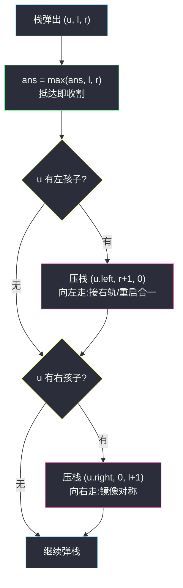
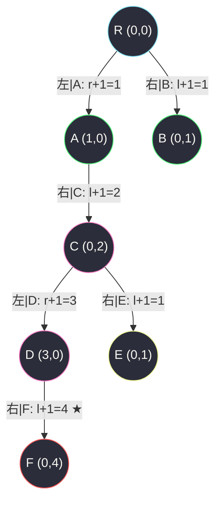

# 1372. 二叉树中的最长交错路径(Longest ZigZag Path in a Binary Tree)

> 🔗 LeetCode 1372:https://leetcode.cn/problems/longest-zigzag-path-in-a-binary-tree/
>
> 📚 灵茶题单小节:§ 二叉树与 DFS:路径上的方向状态(难度分 1521)
>
> 同族文章:[#865 具有所有最深节点的最小子树](smallest-subtree-with-all-the-deepest-nodes.md)(DFS 深度族的"元组合并"代表作——那篇合并高度,本文合并"方向长度",都是把路径信息一路向上携带)、[#687 最长同值路径](https://leetcode.cn/problems/longest-univalue-path/)(同款"返回值 + 全局 max"骨架)。

## 一、问题描述

给你一棵以 `root` 为根的二叉树,二叉树中的**交错路径**定义如下:

- 选择二叉树中**任意**节点和一个方向(左或者右);
- 如果前进方向为右,那么移动到当前节点的右子节点,否则移动到它的左子节点;
- 然后改变前进方向:左变右或者右变左;
- 重复上两步,直到无法继续移动。

交错路径的**长度**定义为:**访问过的节点数目 − 1**(单个节点的路径长度为 0)。

请你返回给定树中**最长交错路径**的长度。

**示例 1**

```text
输入:root = [1,null,1,1,1,null,null,1,1,null,1,null,null,null,1,null,1]
输出:3
解释:最长交错路径为 右 → 左 → 右,经过 4 个节点,长度 3。
```

**示例 2**

```text
输入:root = [1,1,1,null,1,null,null,1,1,null,1]
输出:4
解释:最长交错路径为 左 → 右 → 左 → 右,经过 5 个节点,长度 4。
```

**示例 3**

```text
输入:root = [1]
输出:0
解释:单节点路径长度为 0。
```

> 数据范围:每棵树最多有 `50000` 个节点;每个节点的值在 `[1, 100]` 之间。

**直观理解**:交错路径是一条**自顶向下、每步换向**的走法。它可以从任何节点出发、以任何方向起步——"任意起点"天然提示我们:与其枚举起点(平方级),不如让每个节点把"以我为终点的两种方向的最长交错"上报给父节点,一遍 DFS 收割全局最大。这题是"路径状态随遍历携带"的最纯样板。

## 二、暴力解法

照定义直译:枚举每个节点作为**起点**,再枚举**初始方向**,沿树一路交替走到底,数边数;所有组合取最大。

```python
class Solution:
    def longestZigZag(self, root: Optional[TreeNode]) -> int:
        nodes = []                              # 先把所有节点收进列表
        stack = [root]
        while stack:
            n = stack.pop()
            if n is None:
                continue
            nodes.append(n)
            stack.append(n.left)
            stack.append(n.right)

        def walk(node, direction):              # 从 node 沿 direction 起步交替走
            length = 0
            while True:
                nxt = node.left if direction == 'L' else node.right
                if nxt is None:                 # 走不动了,停
                    break
                length += 1
                direction = 'R' if direction == 'L' else 'L'
                node = nxt
            return length

        ans = 0
        for node in nodes:
            ans = max(ans, walk(node, 'L'), walk(node, 'R'))
        return ans
```

### 复杂度

- 时间:`O(n × h)`——`n` 个起点 × 每次沿一条竖直方向链走到底,最坏(满树)每条链 `O(h)`,链形树退化到 `O(n²)`;`n = 5 × 10⁴` 时最坏约 2.5 × 10⁹ 步,必然超时。
- 空间:`O(n)`(节点列表 + 显式栈)。

浪费肉眼可见:同一段路径被它的**每个前缀节点**重复走过——从根出发的"右左右左右"与从中途节点出发的"左右右"前缀大量重叠。每条路径只需被"它的终点"报告一次,中间节点的重复劳动全部是白做。

## 三、优化探索

### 观察 1:换个问法——从"枚举起点"到"上报终点"

路径长度 = 终点视角的"我是怎么走过来的"。于是定义状态:

```text
L(u) = 最后一步【向左】抵达 u 的最长交错路径长度(边数)
R(u) = 最后一步【向右】抵达 u 的最长交错路径长度
```

答案 = 所有节点上 `max(L(u), R(u))` 的最大值。每个节点只对自己"作为终点"的状态负责,重复计算消失。

### 观察 2:转移方程——断链自动重启

设当前节点 `u` 携带 `(l, r) = (L(u), R(u))`,看它往孩子怎么传:

- 向左走到 `u.left`:这一步方向是"左"。若之前一步是"右"(长 `r`),接上变 `r + 1`;若之前一步也是"左",同方向不能接,断链重启——新路径恰为这一条边,长度 1。
- 妙处在于:**把断链重启值并入 `r = 0` 的语义**,`r + 1` 恰好同时覆盖"续上"与"重启"两种情形——`r(u.left) = 0`(刚走的是左步,不存在"向右抵达 u.left"的状态,置 0 备用),下一步若从 `u.left` 向左走,拿到的又是 `r + 1 = 1`,重启自动成立。

于是整个转移只有两行:

```text
访问 u.left 时携带 (r + 1, 0)
访问 u.right 时携带 (0, l + 1)
```

没有条件分支、没有 max 参与转移——**把"重启"编码进 0 哨兵**,是本题代码极短的根源。

### 观察 3:五万节点的栈深警报

递归版三行核心,但 `n ≤ 5 × 10⁴` 的链形树递归深度 5 万,Python 默认限制 1000 直接 `RecursionError`。主解改用**显式栈迭代**:状态 `(节点, l, r)` 直接进栈,弹出时收割答案、压入两个孩子的新状态——转移逻辑与递归版逐字对应,栈深无忧。

### 观察 4:递归版对照(为什么迭代版更值得背)

先看教科书式的递归版,便于与主解逐字对照:

```python
class Solution:
    def longestZigZag(self, root: Optional[TreeNode]) -> int:
        ans = 0
        def dfs(u, l, r):                     # l/r: 向左/右抵达 u 的最长交错
            nonlocal ans
            if u is None:
                return
            ans = max(ans, l, r)
            dfs(u.left, r + 1, 0)
            dfs(u.right, 0, l + 1)
        dfs(root, 0, 0)
        return ans
```

六行核心,优雅得不像话——但在 `n ≤ 5 × 10⁴` 的链形树上,递归深度五万,Python 默认 `sys.getrecursionlimit() = 1000` 直接抛 `RecursionError`。虽然 LC 环境调大限制能过,但显式栈版本把状态 `(节点, l, r)` 原样进栈,转移逻辑一字不改,栈深彻底无忧——**同一套状态设计,两个执行引擎**,理解了递归版,迭代版只是机械翻译。这也是树上 DFS 的通用心法:先把状态定义想清楚,执行方式(递归/显式栈/层序)是后置选择。



## 四、代码实现

```python
class Solution:
    def longestZigZag(self, root: Optional[TreeNode]) -> int:
        if root is None:
            return 0
        ans = 0
        # 栈元素:(节点, 向左抵达它的最长交错长 l, 向右抵达它的最长交错长 r)
        stack = [(root, 0, 0)]                   # 根既非"左到"也非"右到",双 0 起步
        while stack:
            node, l, r = stack.pop()
            ans = max(ans, l, r)                 # 抵达即收割:每个节点作为终点的两种状态
            if node.left:
                stack.append((node.left, r + 1, 0))   # 向左走:接上"右轨"或断链重启,合一
            if node.right:
                stack.append((node.right, 0, l + 1))  # 向右走:镜像
        return ans
```

### 细节说明

- **根节点双 0 起步**:根没有"抵达方向",`(0, 0)` 让它既不虚增也不漏算;`max(ans, 0, 0)` 保证单节点树返回 0(示例 3)。
- **`(r + 1, 0)` 的第二分量恒 0**:刚向左走进 `u.left`,此刻不存在"向右抵达"的状态,置 0 只为占位;它真正的用途在**下一步**——若从 `u.left` 继续向左走,新 `l = 0 + 1 = 1`,正是断链重启的长度。0 哨兵身兼两职,理解了这一点,整个算法就没有魔法了。
- **答案收割时机**:在"抵达"节点时收割,而非"离开"时——两条收割时机等价,但抵达式免去后序回看,栈序更自由。
- **栈序无关紧要**:先序、后序、层序都行,因为每个状态自携带全部依赖信息,无遍历顺序要求——这是"状态自包含"的迭代 DFS 与"依赖孩子返回值"的后序 DP 的本质区别。
- **空孩子判空不能省**:`node.left` 为 `None` 时直接入栈会在下轮 `node.left` 解引用处崩溃;两行 `if` 是边界条件。

## 五、例子演示

**示例 2** `root = [1,1,1,null,1,null,null,1,1,null,1]` 全流程。树形:`R → {左 A, 右 B}`;`A → {右 C}`;`C → {左 D, 右 E}`;`D → {右 F}`。



栈演化(压栈顺序:先左后右,弹出先右后左):

| 弹出 | 状态 (l, r) | ans | 压入 |
|---|---|---|---|
| R | (0, 0) | 0 | (A, 1, 0), (B, 0, 1) |
| B | (0, 1) | 1 | 无孩子 |
| A | (1, 0) | 1 | (C, 0, 2) |
| C | (0, 2) | 2 | (D, 3, 0), (E, 0, 1) |
| E | (0, 1) | 2 | 无孩子 |
| D | (3, 0) | 3 | (F, 0, 4) |
| F | (0, 4) | **4** | 栈空,返回 4 ✅ |

最优路径 `R → A(左) → C(右) → D(左) → F(右)`:左右左右,4 条边 5 个节点,长度 4,与示例 2 输出一致。注意 `(B, 0, 1)` 这类"半程状态"也参与了收割(ans 提到 1),任何中途最长前缀都不会漏。

**示例 1** 快速核对:树形 `R → {右 A}`;`A → {左 B, 右 C}`;`B → {右 E}`(叶);`C → {左 D, 右 E'}`;`D → {右 F}`;`F → {右 G}`;`G → {右 H}`。最优 `R → A(右) → C(左) → D(右)` = 3;`F → G → H` 全右同向只能走 1 步(同向即断链,重启为 1),再次印证 0 哨兵的语义。输出 3 ✅。

**手工构造对抗用例** `root = [1,1,null,null,2,null,3]`(左嵌右链):`R → 左 A`;`A → 右 B`;`B → 右 C`。路径 `R → A(左) → B(右)` = 2;`B → C(右)` 同向断链为 1;从 `A` 出发向右 `A → B` = 1。枚举全部起点后答案为 2——**最长交错路径的终点 B 不是叶**,印证"只在叶处收割"会漏解;而主解在 B 抵达时收割 `(l=2, r=0)`,准确拿到 2。

再想象一条**深链压力用例**:50000 个节点全部挂单侧子节点(方向随机),递归版在默认限制下直接 `RecursionError`;显式栈版链形时栈中同时最多约 1 个状态(每弹一个压一个),安然无恙——这就是主解坚持迭代的全部理由。

**边界用例速查**:

| 用例 | 输入 | 期望 | 考点 |
|---|---|---|--- |
| 单节点 | `[1]` | 0 | 长度定义节点数 − 1 |
| 单左链(深 4) | `[1,1,null,1,null,1,null,1]` | 1 | 同向即断链,只能走一步 |
| 完美交替链 | `[1,1,null,null,1,null,1]` | 3 | 左左右交替一路到底 |
| 满树 | `[1,1,1,1,1]` | 2 | 任意根出发左右左右 |
| 深链 5 万节点 | 随机方向单子链 | 若干 | 迭代版栈安全,递归版爆栈 |

提醒:交错路径**不要求从根出发、也不要求止于叶**——起点终点都在中途是最常见的漏解形态(见上文对抗用例),收割时机必须是"每个节点抵达时"而非"叶抵达时"。

### 常见错误清单

- **长度当节点数**:题目定义"访问节点数 − 1",单节点为 0;若把步数当节点数会全部 +1。
- **断链时写 `l = 1` 忘了"续上"分支**:转移里漏 `r + 1` 或漏重启,任一遗漏都会在交替链上少算;正确姿势是让 `r + 1` 与 0 哨兵天然合一,根本不写 if。
- **递归版不防栈深**:`n = 5 × 10⁴` 链形树递归直接爆栈;LC Python 环境对 `sys.setrecursionlimit` 友好,但显式栈版不需要任何环境假设,更稳。
- **只收割叶节点**:最长交错路径的终点未必是叶(可能中途被迫断向);在每个节点抵达时收割才能不漏。
- **空树未判**:`root = None` 时题目不出现(节点数 ≥ 1),但稳健代码仍应处理,返回 0。

## 六、复杂度分析

- **时间:`O(n)`**——每个节点恰好入栈、出栈各一次,栈内每次操作常数时间。
- **空间:`O(n)`**——最坏(满二叉树最深层)栈中同时容纳约半数节点的状态;每个栈元素含两个整数,常数因子小。

## 七、对比总结

| 解法 | 时间 | 空间 | 栈安全 | 备注 |
|---|---|---|---|---|
| 枚举起点 × 交替走到底(暴力) | `O(n × h)` | `O(n)` | ✅ | 语义直译,超时 |
| 递归 DFS 携带 (l, r) | `O(n)` | `O(h)` | ❌ 深链爆栈 | 三行核心,题解常见写法 |
| **显式栈迭代携带 (l, r)(本文)** | `O(n)` | `O(n)` | ✅ | 无环境假设,与递归逐字对应 |

| 易错点 | 说明 |
|---|---|
| 断链重启 | 靠 `r = 0` 哨兵 + `r + 1` 合一,写显式 if 反而易错 |
| 收割时机 | 抵达即收割,终点非叶的路径不能漏 |
| 深度限制 | 五万节点链形树,Python 递归版必炸 |

**一句话**:把"路径属性"编进抵达状态 `(l, r)`,让每条路径只被终点报告一次——**树上"任意起点"的路径题,先想想能不能改成"终点上报"**。

## 八、举一反三

- [#865 具有所有最深节点的最小子树](smallest-subtree-with-all-the-deepest-nodes.md)(站内):后序向上合并元组 `(深度, 节点)`——与本文的 `(l, r)` 同为"路径状态随遍历携带"家族,一篇合并深度、一篇合并方向长度。
- [#687 最长同值路径](https://leetcode.cn/problems/longest-univalue-path/):后序返回"从叶到当前的最长同值链",在节点处更新全局答案——同款"返回值 + 全局 max"骨架,可作下一练。
- [#124 二叉树中的最大路径和](https://leetcode.cn/problems/binary-tree-maximum-path-sum/):路径可以拐弯,状态从"单方向"升级为"左右拼接",是本文状态设计的高阶版。
- [#298 二叉树中的最长连续序列](https://leetcode.cn/problems/binary-tree-longest-consecutive-sequence/):把"方向交替"换成"值 +1 递增",状态转移同构,替换谓词即可。
- [#543 二叉树的直径](https://leetcode.cn/problems/diameter-of-binary-tree/):最经典的"后序带状态 + 全局收割",建议与本文对照体会"状态里放什么"的取舍。

> **框架总结**:交错、同值、递增、连续——路径约束词决定**状态的谓词部分**,而"终点上报 + 父节点收割"的骨架不变。遇到"任意起点"字样,条件反射地把枚举起点改写成携带状态的单遍 DFS。
