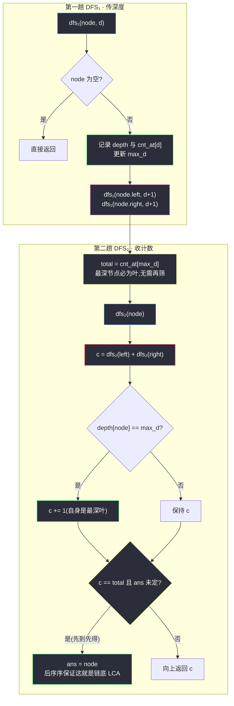
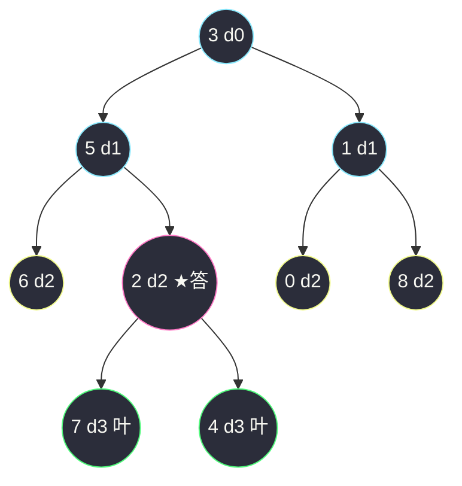

# 1123. 最深叶节点的最近公共祖先(Lowest Common Ancestor of Deepest Leaves)

> 🔗 LeetCode 1123:https://leetcode.cn/problems/lowest-common-ancestor-of-deepest-leaves/
>
> 📚 灵茶题单小节:§2.8 最近公共祖先(难度分 1607)
>
> 姊妹篇:[#865 具有所有最深节点的最小子树](smallest-subtree-with-all-the-deepest-nodes.md)(官方盖章同题,那篇侧重**后序元组一次遍历**收口,本文侧重**两次 DFS 各司其职**——先定位最深叶集合,再用计数合并求 LCA,两篇合看覆盖 LCA 问题的两种经典建模)。

## 一、问题描述

给定一个有根节点 `root` 的二叉树,返回它的**最深叶节点**的**最近公共祖先**。

回忆定义:

- **叶节点**是二叉树中没有子节点的节点;
- 树的根节点深度为 `0`,若某节点的深度为 `d`,它的子节点深度为 `d + 1`;
- 若 `A` 是一组节点 `S` 的**最近公共祖先**,则 `S` 中每个节点都在以 `A` 为根的子树中,且 `A` 的深度达到此条件下**可能的最大值**。

**示例 1**

```text
输入:root = [3,5,1,6,2,0,8,null,null,7,4]
输出:[2,7,4]
解释:返回值为 2 的节点。最深的叶节点是 7 和 4(深度 3);
节点 6、0、8 也是叶节点,但深度只有 2。
```

**示例 2**

```text
输入:root = [1]
输出:[1]
解释:根节点是树中最深的节点,它是它本身的最近公共祖先。
```

**示例 3**

```text
输入:root = [0,1,3,null,2]
输出:[2]
解释:最深的叶节点只有 2,它的最近公共祖先就是它自己。
```

> 数据范围:树中节点数 `[1, 1000]`,`0 <= Node.val <= 1000`,每个节点值互不相同。
> 官方注明本题与 [#865](smallest-subtree-with-all-the-deepest-nodes.md) 重复。

**直观理解**:"最深叶节点的 LCA"="包含全部最深叶节点的最小子树的根"。这个问题天然由两个子问题拼接而成——**谁是最深叶**(需要深度信息,自顶向下流动)与**它们的公共祖先**(需要自底向上汇合)。本文路线:两次 DFS,第一次只管"算深度、数最深叶",第二次只管"数着最深叶往上收口"——每趟遍历只扛一件事,思路最直白。

## 二、暴力解法

最无脑的做法:枚举每个候选节点 `x`,完整扫描 `x` 的子树,数一数里面装了几个最深叶节点——装满全部的就叫**覆盖者**;答案取覆盖者中**深度最大**的那个。

```python
class Solution:
    def lcaDeepestLeaves(self, root: Optional[TreeNode]) -> Optional[TreeNode]:
        nodes = []                                # (节点, 深度) 全集

        def collect(node, d):
            if node is None:
                return
            nodes.append((node, d))
            collect(node.left, d + 1)
            collect(node.right, d + 1)

        collect(root, 0)
        max_d = max(d for _, d in nodes)
        deepest_ids = {id(n) for n, d in nodes if d == max_d}

        def covered(x):                           # x 的子树是否包含全部最深叶
            seen = 0

            def dfs(n):
                nonlocal seen
                if n is None:
                    return
                if id(n) in deepest_ids:
                    seen += 1
                dfs(n.left)
                dfs(n.right)

            dfs(x)
            return seen == len(deepest_ids)

        cands = [(n, d) for n, d in nodes if covered(n)]
        best_d = max(d for _, d in cands)         # 覆盖者中取最深的
        for n, d in cands:
            if d == best_d:
                return n
```

### 复杂度

- 时间:`O(n²)`——`n` 个候选 × 每次子树扫描 `O(n)`。`n ≤ 1000` 时约 10⁶ 次访问,能过,但没有任何剪枝智慧。
- 空间:`O(n)`(节点列表 + 递归栈)。

逻辑正确,却把同一个子树翻来覆去扫了无数遍:覆盖者其实构成**一条从根往下的链**(下面会证),暴力对链外节点做的覆盖检查全是无用功——这正是"信息没有复用"的典型浪费。

## 三、优化探索

### 观察 1:两个子问题,两次 DFS 各扛一件

把问题劈成两半:

1. **DFS₁(自顶向下传深度)**:给每个节点算出深度 `d`,顺手统计每个深度的节点数,得到全局最大深度 `max_d` 与最深节点总数 `total`;
2. **DFS₂(自底向上收计数)**:后序遍历,递归函数返回"该子树里最深叶节点的个数",节点自身若深度等于 `max_d` 则计数加一。

两趟之间只交接两个数(`max_d`、`total`)和一个深度表,接口极简。

### 观察 2:覆盖者是一条链,后序序保证"最先命中即 LCA"

**为什么覆盖者成链**:若 `x` 的子树包含全部最深叶,则 `x` 的任何祖先的子树也必然包含(子树只会更大)——覆盖性向上单调。于是覆盖者 = 从根连续下探到某个节点的一条竖直链,链的最低端点就是答案。

**为什么后序序先到链底**:后序访问顺序是"左子树 → 右子树 → 根",任意节点一定**先于它的父节点**完成访问。LCA 在链的最深处,它在整条链中**最先**完成"计数达到 `total`"的判定;它的祖先们虽然也会命中 `cnt == total`,但发生得更晚。所以实现上用"先到先得"——第一次计数满员处即 LCA,天然免去"再取最深"的第二轮比较。



### 观察 3:"最深叶"不必专门筛叶

`total = cnt_at[max_d]` 直接把**所有**最大深度节点当作"最深叶"——为什么不用检查它们是叶?因为最大深度的节点必然是叶:若某最大深度节点还有孩子,孩子的深度更大,与"最大"矛盾(姊妹篇 #865 的四章有同款论证)。两次 DFS 的分工因此更干净:DFS₁ 连"是否为叶"都不用判断。

### 同族对照

姊妹篇 [#865](smallest-subtree-with-all-the-deepest-nodes.md) 用"(深度, 候选)"元组把两件事压进**一趟**遍历;本文拆成两趟,代码各自更短、语义各自更直。两条路线殊途同归,详见七、的四方对比。

## 四、代码实现

```python
class Solution:
    def lcaDeepestLeaves(self, root: Optional[TreeNode]) -> Optional[TreeNode]:
        # ---- 第一趟:自顶向下算深度,统计每个深度的节点数 ----
        depth = {}                       # id(node) -> 深度
        cnt_at = {}                      # 深度 -> 该深度节点数
        max_d = -1

        def dfs1(node, d):
            nonlocal max_d
            if node is None:
                return
            depth[id(node)] = d
            cnt_at[d] = cnt_at.get(d, 0) + 1
            if d > max_d:
                max_d = d
            dfs1(node.left, d + 1)
            dfs1(node.right, d + 1)

        dfs1(root, 0)
        total = cnt_at[max_d]            # 最大深度节点数(它们必然全是叶)

        # ---- 第二趟:自底向上数最深叶,先到先得收口 ----
        ans = None

        def dfs2(node):
            nonlocal ans
            if node is None:
                return 0
            c = dfs2(node.left) + dfs2(node.right)   # 子树贡献
            if depth[id(node)] == max_d:             # 自身是最深叶
                c += 1
            if c == total and ans is None:           # 后序序:链底最先满员
                ans = node
            return c

        dfs2(root)
        return ans
```

### 细节说明

- **`id(node)` 做键**:题目保证节点值互不相同,用值做键也行;用 `id` 更通用(值可重复的变体题不会翻车),代价是字典里存的是对象地址——对拍时注意主解若修改树结构,`depth` 表照旧有效(节点对象没换)。
- **`ans is None` 的先到先得**:不能去掉。覆盖链上每个祖先最终都会 `c == total`,若每次命中都覆盖 `ans`,最后会写成根。后序序里链底先命中,一次定格。
- **`total` 不可能是 0**:`n ≥ 1`,根自身至少让 `cnt_at[0] ≥ 1`,`max_d ≥ 0`。
- **递归深度**:`n ≤ 1000`,链形树深 1000,Python 默认递归限制 1000 会擦线——实际函数帧叠加未爆是因为 LC 环境;严谨起见本地可 `sys.setrecursionlimit(10 ** 6)`,或像 [#1339](https://leetcode.cn/problems/maximum-product-of-splitted-binary-tree/) 大树题那样改迭代(本文规模不必)。
- **两趟能并成一趟吗**:能,就是 #865 的元组版;并趟省一次遍历,拆趟省一次"深度与候选绑定"的心智负担。工程上两种都值得会,面试先写对再写巧。

## 五、例子演示

**示例 1** `root = [3,5,1,6,2,0,8,null,null,7,4]` 端到端走两趟。



第一趟结束:`cnt_at = {0:1, 1:2, 2:4, 3:2}`,`max_d = 3`,`total = 2`(节点 7、4)。第二趟后序访问与计数演化:

| 步骤 | 节点(深度) | 左贡献 | 右贡献 | 自身+1? | c | 判定 |
|---|---|---|---|---|---|---|
| 1 | 6(2) | 0 | 0 | 否 | 0 | — |
| 2 | 7(3) | 0 | 0 | **是** | 1 | — |
| 3 | 4(3) | 0 | 0 | **是** | 1 | — |
| 4 | 2(2) | 1 | 1 | 否 | **2** | `2 == total`,**ans = 2** ✅ |
| 5 | 5(1) | 0 | 2 | 否 | 2 | 已满员但 `ans` 已定,跳过 |
| 6 | 0(2) | 0 | 0 | 否 | 0 | — |
| 7 | 8(2) | 0 | 0 | 否 | 0 | — |
| 8 | 1(1) | 0 | 0 | 否 | 0 | — |
| 9 | 3(0) | 2 | 0 | 否 | 2 | 链顶,跳过 |

返回节点 `2`,即输出 `[2,7,4]` ✅。**步骤 4 与步骤 5 的先后**正是"后序先到链底"的现场:5 是覆盖链 `2 → 5 → 3` 的中间节点,它满员时 `ans` 已被更深处的 2 定格。

再对照**示例 3** `root = [0,1,3,null,2]`:

| 节点 | 深度 | cnt_at 变化 |
|---|---|---|
| 0 | 0 | `cnt_at[0]=1` |
| 1 | 1 | `cnt_at[1]=1` |
| 3 | 1 | `cnt_at[1]=2` |
| 2 | 2 | `cnt_at[2]=1` → `max_d=2, total=1` |

DFS₂:节点 2 自身命中 `c=1=total`,`ans = 2`;此后 1 处 `c=1`、0 处 `c=1` 都晚于它,不覆盖。输出 `[2]` ✅——单一最深叶时答案就是它自己,它的祖先虽然"子树也包含全部(唯一)最深叶",但深度不够。

**边界用例速查**:

| 用例 | 输入 | 期望 | 考点 |
|---|---|---|---|
| 单节点 | `[1]` | 1 | `max_d=0, total=1`,根自身即最深叶 |
| 左单链 | `[1,2,null,3]` | 3 | 最深唯一,一路沿用 |
| 双侧同深 | `[1,2,3]` | 1 | 根收口,`c=1+1=2` |
| 深度差一 | `[1,2,3,null,4]` | 4 | 右侧只有 d1,左叶 4 独占最深 |

### 常见错误清单

- **`ans` 每次命中都覆盖**:把 `if c == total and ans is None` 写成 `if c == total: ans = node`,答案恒为根——后序序里根最后访问,覆盖掉一切。
- **DFS₂ 忘记给"自身是最深叶"加一**:计数永远从 0 起,`c == total` 在叶处永不成立,只有根可能凑满(此时全树只有一条最深链),示例 1 直接错。
- **用层序数组下标推父子关系**:含 `null` 的序列(如示例 3)下标跳跃,凭 `2i+1/2i+2` 推结构是高频翻车点(姊妹篇 #865 的五章有同样警示)。
- **`max_d` 初始化为 0**:深度从 0 起,若初值取 0 且忘了空树约定,单节点树会漏统计;本文用 `-1` 起步,任何首节点都能刷新。

## 六、复杂度分析

- **时间:`O(n)`**——两趟 DFS,每趟每个节点恰好访问一次,单次做 `O(1)` 的字典读写与比较;`n ≤ 1000` 毫无压力。对比暴力的 `O(n²)` 省掉了对"链外节点"的重复覆盖检查。
- **空间:`O(n)`**——`depth`/`cnt_at` 两个字典 `O(n)`,递归栈 `O(h)`(树高,最坏链形 `O(n)`)。比元组版(#865)多了字典,换来的是每趟逻辑更薄。

## 七、对比总结

| 解法 | 时间 | 空间 | 遍历次数 | 心智负担 |
|---|---|---|---|---|
| 枚举候选 + 覆盖检查(暴力) | `O(n²)` | `O(n)` | 最多 `O(n)` 趟 | 最低,照定义直译 |
| **两次 DFS:深度表 + 计数收口(本文)** | `O(n)` | `O(n)` | 2 趟 | 每趟一件事,接口只有两个数 |
| 后序元组一次遍历(姊妹篇 #865) | `O(n)` | `O(h)` | 1 趟 | 深度与候选绑在返回值里同行 |
| 计数元组变体(#865 七章) | `O(n)` | `O(h)` | 1 趟 | `(深度, 最深数, 候选)` 三列元组 |

| 易错点 | 说明 |
|---|---|
| 覆盖者成链没有利用 | 明知道答案在一条链上,就该"自底向上第一次满员"收口,而不是全收集再取最深 |
| 深度口径混用 | 本文"根深度 0";若换成"边数"口径(叶为 0),两趟的 `max_d` 与 `total` 都要同步换算,混用必错 |
| 忽略"最深必为叶" | 专门写"筛出最深且是叶"的第三次遍历,纯属多余(且容易在 `is None` 判断上画蛇添足) |

**一句话**:LCA 类问题的通用骨架是**后序返回"覆盖信息",第一次满员处收口**——本文返回的是计数,#236 返回的是布尔,#1644 返回的也是计数(但允许节点不存在),同一个模具浇出全家。

## 八、举一反三

- [#865 具有所有最深节点的最小子树](smallest-subtree-with-all-the-deepest-nodes.md)(站内姊妹篇):官方同题,一趟元组版实现,含"为什么 `dl == dr` 才收口"的归纳证明——两篇合看,体会"拆两趟"与"并一趟"的取舍。
- [#236 二叉树的最近公共祖先](https://leetcode.cn/problems/lowest-common-ancestor-of-a-binary-tree/):LCA 裸题。后序返回"子树包含 p/q 的个数",与本文 `dfs₂` 结构逐行对应,只是"满员条件"从 `total` 换成 `2`。
- [#1644 二叉树的最近公共祖先 II](https://leetcode.cn/problems/lowest-common-ancestor-of-a-binary-tree-ii/):`p`、`q` 可能不存在,收口前要检查计数是否恰好各为 1——"计数不足时收口成 `None`"的边界练习。
- [#1740 找到二叉树中的距离](https://leetcode.cn/problems/find-distance-in-a-binary-tree/):先 LCA 再算两侧深度差,把本文的"深度表"与"收口"两件武器拼在一起用。
- 站内延伸阅读:[删点成林](delete-nodes-and-return-forest.md)(后序改结构)、[二叉树中的伪回文路径](pseudo-palindromic-paths-in-a-binary-tree.md)(自顶向下累积状态)——加上本文,凑齐"树上信息三个流向"的完整拼图。

> **框架总结**:树上"最近公共祖先"类问题,先问自己**收口条件用什么信息表达**(计数/布尔/深度对),再让后序递归的返回值恰好携带这个信息——第一次满足条件的位置,就是答案。
