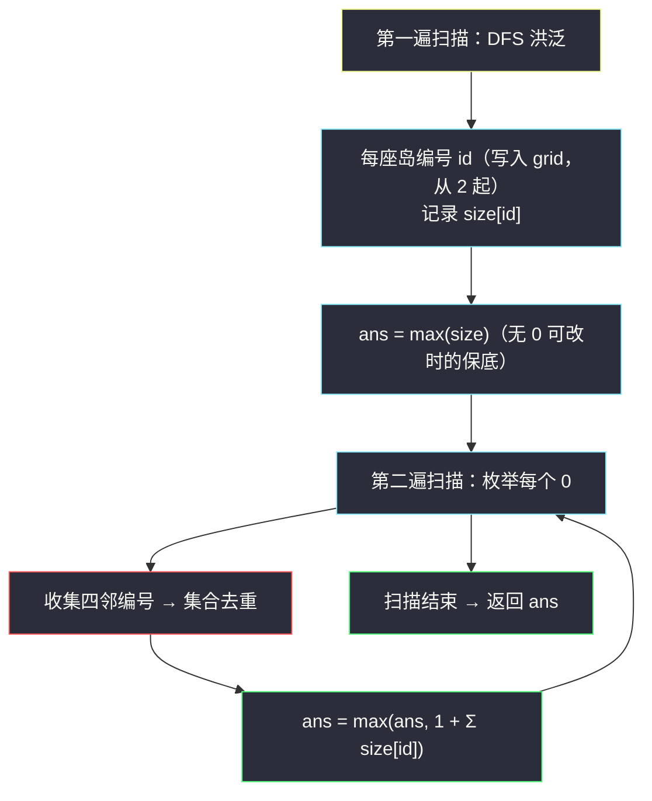

# 827. 最大人工岛（Making A Large Island）

> 题目来源：[https://leetcode.cn/problems/making-a-large-island/](https://leetcode.cn/problems/making-a-large-island/)
>
> 灵茶题单小节定位：§一、网格图 DFS（Hard：分量编号 + 定点合并统计）

## 一、问题描述

给你一个 `n × n` 的二进制矩阵 `grid`，**最多** 可以将一个 `0` 变成 `1`（也可以一个都不变）。

返回执行此操作后，`grid` 中最大的岛屿（四连通的 `1` 组成的区域）面积是多少。

**数据范围**：

- `1 <= n <= 500`
- `grid[i][j]` 为 `0` 或 `1`

**示例 1**：

```text
输入：grid = [[1,0],[0,1]]
输出：3
解释：把任意一个 0 变成 1，两座 1×1 岛相连，面积为 3。
```

**示例 2**：

```text
输入：grid = [[1,1],[1,0]]
输出：4
解释：把右下角 0 变 1，整块 2×2 都是陆地。
```

**示例 3**：

```text
输入：grid = [[1,1],[1,1]]
输出：4
解释：没有 0 可以改变，返回原有最大岛面积 4。
```

**核心思考点**：直接枚举「哪个 0 变 1」再每次全图数岛是平方级的。关键转化：把 0 变 1 后的新岛面积 = `1 + 四邻岛面积之和（去重）`。于是先给每座岛编号并算好面积，再对每个 0 查四邻——**两遍扫描** 解决战斗。

## 二、暴力解法

### 思路

枚举每个 `0` 格子（也可以枚举后不改，因为「最多改一个」包含不改的情况）：

1. 把这个 `0` 临时改成 `1`；
2. 全图扫描 + DFS 数出最大岛面积；
3. 改回 `0`，记录最大值；
4. 最后与「不改任何格子」时的最大岛面积比较。

### 代码

```python
def largestIslandBrute(grid: list[list[int]]) -> int:
    n = len(grid)

    def max_area(g) -> int:
        best = 0
        seen = [[False] * n for _ in range(n)]
        for i in range(n):
            for j in range(n):
                if g[i][j] == 1 and not seen[i][j]:
                    area = 0
                    stack = [(i, j)]
                    seen[i][j] = True
                    while stack:
                        x, y = stack.pop()
                        area += 1
                        for dx, dy in ((1, 0), (-1, 0), (0, 1), (0, -1)):
                            nx, ny = x + dx, y + dy
                            if 0 <= nx < n and 0 <= ny < n \
                                    and g[nx][ny] == 1 and not seen[nx][ny]:
                                seen[nx][ny] = True
                                stack.append((nx, ny))
                    best = max(best, area)
        return best

    ans = max_area(grid)                     # 一个都不改
    for i in range(n):
        for j in range(n):
            if grid[i][j] == 0:
                grid[i][j] = 1               # 临时改
                ans = max(ans, max_area(grid))
                grid[i][j] = 0               # 改回
    return ans
```

### 复杂度

设 `N = n²`：

- 时间：最多 `N` 个 0，每个做一次 `O(N)` 全图统计 → `O(N²)`。`n = 500` 时 `N = 2.5 × 10⁵`，`N² ≈ 6 × 10¹⁰`，超时。
- 空间：`O(N)`。

## 三、优化探索

### 3.1 浪费在哪

每次「数岛」都把 **全部岛屿** 重新算一遍，但改一个 0 只影响它 **四邻** 的岛。信息重复利用率极低。

### 3.2 预处理：编号 + 面积表

第一遍扫描（DFS 洪泛）：

- 给每座岛分配编号 `id`（从 2 开始，直接写进 `grid`，与 0/1 区分开，也顺便充当访问标记）；
- 用 `size[id]` 记录每座岛的面积。

第二遍扫描（枚举 0）：

- 对每个 `0` 格子，收集四邻中出现的 **互不相同** 的编号 `id`；
- 候选面积 = `1 + Σ size[id]`（去重是关键：同一座岛的多个格子只算一次）；
- 与「全 1 无 0 可改」情形（直接返回 `size` 最大值）合并取答案。

### 3.3 为什么去重不可省

反例：

```text
1 1
1 0        ← 这个 0 的上邻、左邻同属 1 号岛！
```

不去重会算出 `1 + 3 + 3 = 7`，正确答案是 `1 + 3 = 4`。用 **集合** 收集四邻编号即可天然去重。

### 3.4 正确性细节：全 1 特判

如果网格全是 1（没有任何 0 可改），第二遍扫描不执行任何候选，答案应取「原始最大岛面积」——实现上让初始答案为 `max(size)`（无岛时为 0），第二遍只在其上取 max，两种情形自然统一。



## 四、代码实现

### 主解：编号 + 面积表 + 枚举 0 合并

```python
def largestIsland(grid: list[list[int]]) -> int:
    n = len(grid)
    size = {0: 0}                       # 编号 → 面积；0 号代表「不是岛」

    # ---- 第一遍：DFS 给岛编号（id 从 2 开始，直接写进 grid）----
    next_id = 2
    for i in range(n):
        for j in range(n):
            if grid[i][j] == 1:
                area = 0
                grid[i][j] = next_id    # 入栈前标记
                stack = [(i, j)]
                while stack:
                    x, y = stack.pop()
                    area += 1
                    for dx, dy in ((1, 0), (-1, 0), (0, 1), (0, -1)):
                        nx, ny = x + dx, y + dy
                        if 0 <= nx < n and 0 <= ny < n and grid[nx][ny] == 1:
                            grid[nx][ny] = next_id    # 编号即访问标记
                            stack.append((nx, ny))
                size[next_id] = area
                next_id += 1

    # 无 0 可改时的保底答案：原始最大岛面积（全 0 网格为 0）
    ans = max(size.values())

    # ---- 第二遍：枚举每个 0，四邻编号去重合并 ----
    for i in range(n):
        for j in range(n):
            if grid[i][j] == 0:
                ids = set()             # 集合去重：同岛只算一次
                for dx, dy in ((1, 0), (-1, 0), (0, 1), (0, -1)):
                    nx, ny = i + dx, j + dy
                    if 0 <= nx < n and 0 <= ny < n:
                        ids.add(grid[nx][ny])      # 0 会映射到 size[0]=0
                ans = max(ans, 1 + sum(size[t] for t in ids))
    return ans
```

### 细节说明

- **编号从 2 开始**：0（水）与 1（未处理的陆地）都有既定语义，编号 2、3、4… 写入 `grid` 后「一格三用」：访问标记、岛身份、查询索引。第二遍里四邻直接读 `grid[nx][ny]` 拿编号，`size[0] = 0` 让水域编号安全映射到面积 0。
- **`size` 用字典**：编号数量未知（最多 `(n²+1)/2` 座岛），字典免去「编号可能不连续」的数组越界顾虑；追求常数优化也可用数组。
- **`ids` 集合不可换成列表**：去重是正确性的命门（见 3.3 反例）。即便四邻最多 4 个格子，同编号重复出现非常常见（0 紧贴大岛边缘时）。
- **枚举的是「0 变 1」**，天然覆盖「一个都不改」（保底 `ans = max(size)`），无需单独分支。

## 五、例子演示

构造一个 5×5 例子端到端走一遍：

```text
初始网格            第一遍编号后           size 表
1 1 0 0 0          2 2 0 0 0             2 → 4
0 1 0 1 1          0 2 0 3 3             3 → 5
0 0 0 0 1          0 0 0 0 3
1 1 1 0 1          4 4 4 0 3             4 → 3
0 0 0 0 0          0 0 0 0 0
```

保底答案 `ans = max(4, 5, 3) = 5`（3 号岛不动就是最大）。

**第二遍扫描**：枚举全部 `0`，下表只列出「四邻非空」的关键候选：

| 0 的位置 | 四邻编号（去重后） | 候选面积 `1 + Σsize` | 说明 |
|---|---|---|---|
| (0,2) | {2}（左邻 (0,1)=2；上/右越界；下邻 (1,2)=0） | `1+4 = 5` | 贴 2 号岛 |
| (1,3) | {2, 3}（上邻 (0,3)=0？否——上邻是 (0,3)=0 不算；左邻 (1,2)=0；**重算**：上 (0,3)=0、下 (2,3)=0、左 (1,2)=0、右 (1,4)=3） | `1+5 = 6` | 只贴 3 号岛 |
| (2,0) | {4}（下邻 (3,0)=4） | `1+3 = 4` | 贴 4 号岛 |
| (2,2) | {3, 4}（上 (1,2)=0、下 (3,2)=4、左 (2,1)=0、右 (2,3)=0？右邻是 (2,3)=0——只有下邻 4 有效？再看：上邻 (1,2) 是 0，但 (1,3)=3 不与 (2,2) 相邻） | `1+3 = 4` | 只贴 4 号 |
| **(3,3)** | **{3, 4}**（上 (2,3)=0、左 (3,2)=4、右 (3,4)=3、下 (4,3)=0） | **`1+3+5 = 9`** | **两岛桥接点！** |
| (4,4) | {3}（上 (3,4)=3） | `1+5 = 6` | 贴 3 号岛 |

逐格核对 `(3,3)`：上邻 `(2,3)=0`（水面、`size[0]=0`）、左邻 `(3,2)=4`（4 号岛）、右邻 `(3,4)=3`（3 号岛）、下邻 `(4,3)=0`。去重集合 `{4, 3}`，候选 `1 + 3 + 5 = 9`——把 `(3,3)` 变 1 后，4 号岛与 3 号岛经此格连通，新岛面积 9。

**最终答案 `9`** ✅（保底 5 与所有候选的最大值）。

```mermaid
flowchart LR
    subgraph M["最优方案：桥接 (3,3)"]
        I2["2 号岛 面积4"] --- W1["0"]
        W1["(1,2) 等"]
        I3["3 号岛 面积5"] --- B["(3,3) 变1<br>桥接点"]
        B --- I4["4 号岛 面积3"]
    end
    style M fill:#1e1f29,stroke:#6272a4
    style I2 fill:#2b2d3a,stroke:#8be9fd,color:#f8f8f2
    style W1 fill:#2b2d3a,stroke:#6272a4,color:#f8f8f2
    style I3 fill:#2b2d3a,stroke:#8be9fd,color:#f8f8f2
    style I4 fill:#2b2d3a,stroke:#8be9fd,color:#f8f8f2
    style B fill:#2b2d3a,stroke:#50fa7b,color:#f8f8f2
```



## 六、复杂度分析

设 `N = n²`：

- **时间复杂度：`O(N)`**
  - 第一遍：每格进出栈一次，`O(N)`；
  - 第二遍：每格检查 4 邻 + 集合求和（常数 4），`O(N)`；
  - 对比暴力 `O(N²)`：把「重复数岛」变成「查表合并」。
- **空间复杂度：`O(N)`**
  - `size` 表与显式栈最坏各 `O(N)`；编号直接复用 `grid`，无额外标记矩阵。

## 七、对比总结

| 维度 | 暴力（枚举 0 + 全图数岛） | 主解（编号 + 查表合并） |
|---|---|---|
| 时间 | `O(N²)` | `O(N)` |
| 空间 | `O(N)` | `O(N)` |
| 信息利用 | 每次从头数 | 面积算一次，处处查表 |
| 易错点 | 忘记「一个都不改」情形 | 四邻同岛去重、全 1 特判、编号与 0/1 冲突 |

**套路归纳**：「先给连通分量编号、再定点查询合并」是网格 Hard 题的高频骨架——本题查「四邻岛面积和」，进阶可查「四邻岛周长和」「桥接后是否连通全部岛」等。并查集也能做（把「变 1」理解为合并操作），但两遍扫描版免维护父数组，常数更小。

## 八、举一反三

1. **[695. 岛屿的最大面积](https://leetcode.cn/problems/max-area-of-island/)**：第一遍扫描单独成题的基础版（分量面积计算）。
2. **[1905. 统计子岛屿](https://leetcode.cn/problems/count-sub-islands/)**：分量间的包含关系判定，同样「编号/标记 + 二次扫描」（见本站 `count-sub-islands.md`）。
3. **[1568. 使陆地分离的最少天数](https://leetcode.cn/problems/minimum-number-of-days-to-disconnect-island/)**：分量 + 割点思想的 Hard 进阶。
4. **[934. 最短的桥](https://leetcode.cn/problems/shortest-bridge/)**：两岛之间找最短水路（DFS 圈岛 + BFS 扩散），与本题互为「分量的静态查询 / 动态桥接」两面（见本站 `shortest-bridge.md`）。
5. **[305. 岛屿数量 II](https://leetcode.cn/problems/number-of-islands-ii/)**（会员题）：动态加陆地的分量维护，并查集主场——体会「何时必须换并查集」。

**同族互引**：本篇与 `number-of-closed-islands.md`（分量判定）、`count-sub-islands.md`（分量包含）、`maximum-number-of-fish-in-a-grid.md`（分量求和）同属「分量统计系」：前面的篇章统计「一个分量自身的性质」，本篇升级为「多个分量的定点合并」——正是 Hard 的门槛所在。
