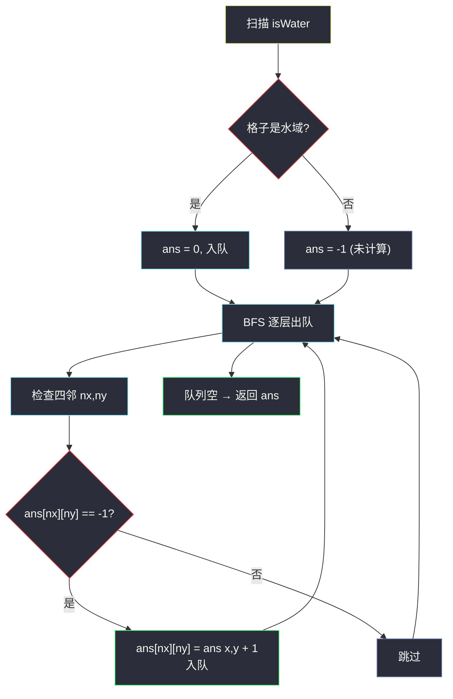

# 1765. 地图中的最高点（Map of Highest Peak）

> 题目来源：[https://leetcode.cn/problems/map-of-highest-peak/](https://leetcode.cn/problems/map-of-highest-peak/)
>
> 灵茶题单小节定位：§二、网格图 BFS（多源 BFS 直接求距离场）

## 一、问题描述

给你一个大小为 `m × n` 的整数矩阵 `isWater`，它代表一个由陆地和水域组成的地图：

- `isWater[i][j] == 0` 表示格子 `(i, j)` 是 **陆地**；
- `isWater[i][j] == 1` 表示格子 `(i, j)]` 是 **水域**。

你需要按照如下规则给每个格子安排一个高度：

1. 每个格子的高度必须是非负整数；
2. 如果是水域，高度必须是 `0`；
3. 任意 **相邻**（上下左右）两个格子的高度差 **至多为 1**。

请返回一个满足条件且 **使地图中最高高度尽可能大** 的高度矩阵 `ans`（若有多个满足条件的答案，返回任意一个）。

**数据范围**：

- `1 <= m, n <= 1000`
- `isWater[i][j]` 为 `0` 或 `1`
- 至少有一个水域格子

**示例 1**：

```text
输入：isWater = [[0,1],[0,0]]
输出：[[1,0],[2,1]]
解释：左上角 (0,0) 高度 1，因为它的邻居 (0,1) 是水域高度 0，
     高度差恰好 1；左下角 (2→1) 依此类推。最高高度为 2。
```

**示例 2**：

```text
输入：isWater = [[0,0,1],[1,0,0],[0,0,0]]
输出：[[1,1,0],[0,1,1],[1,2,2]]
解释：这是使最高高度最大的一种构造，最高高度为 2。
```

**核心思考点**：把「高度」看成「距离」——一个格子的高度每走一步最多变化 1，而水域被钉死在 0。想让格子尽量高，就要让它离最近的水域尽量远。于是「高度矩阵」就是「每个格子到最近水域的距离场」。

## 二、暴力解法

### 思路

对 **每个格子单独** 求到最近水域的距离：

1. 先把所有水域格子的坐标收集到列表 `waters`；
2. 对每个陆地格子 `(i, j)`，从它出发跑一次 BFS，碰到任意水域即停，走过的步数就是到最近水域的距离。

### 代码

```python
from collections import deque

def highestPeakBrute(isWater: list[list[int]]) -> list[list[int]]:
    m, n = len(isWater), len(isWater[0])
    waters = [(i, j) for i in range(m) for j in range(n) if isWater[i][j] == 1]

    def nearest_water_dist(sx: int, sy: int) -> int:
        if isWater[sx][sy] == 1:
            return 0
        dist = [[-1] * n for _ in range(m)]
        dist[sx][sy] = 0
        q = deque([(sx, sy)])
        while q:
            x, y = q.popleft()
            for dx, dy in ((1, 0), (-1, 0), (0, 1), (0, -1)):
                nx, ny = x + dx, y + dy
                if 0 <= nx < m and 0 <= ny < n and dist[nx][ny] == -1:
                    if isWater[nx][ny] == 1:
                        return dist[x][y] + 1   # 碰到水域即停
                    dist[nx][ny] = dist[x][y] + 1
                    q.append((nx, ny))
        return -1  # 不会发生（至少存在一个水域）

    return [[nearest_water_dist(i, j) for j in range(n)] for i in range(m)]
```

### 复杂度

设 `N = m × n`：

- 时间：每个格子一次 BFS `O(N)`，共 `O(N²)`；`m = n = 1000` 时 `N = 10⁶`，`N² = 10¹²`，完全不可行。
- 空间：`O(N)`。

## 三、优化探索

### 3.1 暴力慢在哪

每个格子都 **独立地** 重复搜索同一片地图，但「到最近水域的距离」信息在相邻格子之间高度相关：如果 `(i, j)` 的答案是 `d`，那么它邻居的答案至多是 `d + 1`。

### 3.2 换方向：从水域出发反向计算

与其「每个陆地找水域」，不如「所有水域同时向陆地扩散」——**多源 BFS**：

- 把全部水域格子作为距离 0 的源点，同时入队；
- 每扩散一层，距离 +1；
- 每个格子 **第一次** 被碰到时，当时层数就是它到最近水域的距离。

**为什么它就是合法且最大的高度矩阵？**

1. **水域高度 0** ✅：源点距离为 0；
2. **相邻高度差 ≤ 1** ✅：多源 BFS 中，相邻格子的距离至多相差 1（从距离 `d` 的格子一步可到，故邻居距离 ≤ `d + 1`；对称地也 ≥ `d - 1`）；
3. **最高高度尽可能大** ✅：任何格子 `(i, j)` 的高度都不可能超过它到最近水域的距离 `D(i, j)`——因为沿着它到最近水域的路径，高度从 `ans[i][j]` 逐步降到 0，每步至多降 1，所以 `ans[i][j] ≤ D(i, j)`。而多源 BFS 恰好让 **每个格子同时取到这个上界**，即整体逐点最优。

### 3.3 完整算法

1. 初始化答案矩阵 `ans`，水域格置 `0` 并入队，陆地格置 `-1` 表示未计算；
2. 多源 BFS 逐层出队，向四邻扩展：邻居若为 `-1`（未计算的陆地），则 `ans[邻居] = ans[当前] + 1`，入队；
3. 队列空时 `ans` 即为答案。



## 四、代码实现

### 主解：多源 BFS

```python
from collections import deque

def highestPeak(isWater: list[list[int]]) -> list[list[int]]:
    m, n = len(isWater), len(isWater[0])
    ans = [[-1] * n for _ in range(m)]
    q = deque()

    # 1. 水域格：高度 0，作为多源 BFS 的全部源点
    for i in range(m):
        for j in range(n):
            if isWater[i][j] == 1:
                ans[i][j] = 0
                q.append((i, j))
    # 其余陆地格保持 -1，表示「未计算」

    # 2. 多源 BFS 逐层扩散
    while q:
        x, y = q.popleft()
        for dx, dy in ((1, 0), (-1, 0), (0, 1), (0, -1)):
            nx, ny = x + dx, y + dy
            if 0 <= nx < m and 0 <= ny < n and ans[nx][ny] == -1:
                ans[nx][ny] = ans[x][y] + 1   # 第一次被碰到 = 最近水域距离
                q.append((nx, ny))

    return ans
```

### 细节说明

- **`-1` 兼任「未计算」与「未入队」标记**：省掉独立的 `visited` 数组；格子第一次被赋值即最近距离，之后不会再被赋值（`== -1` 不成立）。
- **无需按层计数**：本题不问「第几层命中」，只要每个格子的距离值，直接把 `ans[x][y] + 1` 写进邻居即可——`ans` 数组本身携带了层信息，比 `dist` 变量更简洁。
- **不用显式 DFS**：本题不需要「先定位某片区域」，纯多源 BFS 一步到位；对比 [934. 最短的桥](https://leetcode.cn/problems/shortest-bridge/)（见本站 `shortest-bridge.md`）需要先 DFS 圈岛再扩散，结构上多一步。
- **最大性证明的关键一句**（面试常被追问）：从任意格 `(i, j)` 走到最近水域共 `D(i, j)` 步，高度沿途每步最多降 1，从 `ans[i][j]` 降到 0，故 `ans[i][j] ≤ D(i, j)`；而 BFS 输出恰好使每个格子取等号。

## 五、例子演示

用示例 2 `isWater = [[0,0,1],[1,0,0],[0,0,0]]` 端到端走一遍。

**初始**：水域格 `(0,2)`、`(1,0)` 高度 0 入队，其余 `-1`：

```text
-1  -1   0        队列 q = [(0,2), (1,0)]
 0  -1  -1
-1  -1  -1
```

**BFS 扩散逐步表**（出队顺序按入队先后）：

| 步 | 出队格 (x,y) | 高度 | 检查四邻后的变化 | 队列（处理后） |
|---|---|---|---|---|
| 1 | (0,2) | 0 | (0,1)←1，(1,2)←1 | [(1,0),(0,1),(1,2)] |
| 2 | (1,0) | 0 | (0,0)←1，(1,1)←1，(2,0)←1 | [(0,1),(1,2),(0,0),(1,1),(2,0)] |
| 3 | (0,1) | 1 | (0,0) 已算，(1,1) 已算 | [(1,2),(0,0),(1,1),(2,0)] |
| 4 | (1,2) | 1 | (2,2)←2，(1,1) 已算 | [(0,0),(1,1),(2,0),(2,2)] |
| 5 | (0,0) | 1 | 邻居均已算 | [(1,1),(2,0),(2,2)] |
| 6 | (1,1) | 1 | (2,1)←2 | [(2,0),(2,2),(2,1)] |
| 7 | (2,0) | 1 | (2,1) 已算 | [(2,2),(2,1)] |
| 8 | (2,2) | 2 | 邻居均已算 | [(2,1)] |
| 9 | (2,1) | 2 | 邻居均已算 | [] → 结束 |

**最终答案**：

```text
 1   1   0
 0   1   1
 1   2   2
```

逐项核对约束：水域 `(0,2)`、`(1,0)` 均为 0 ✅；任意相邻对如 `(2,1)=2` 与 `(2,0)=1`、`(2,2)=2` 与 `(1,2)=1`，高度差均 ≤ 1 ✅；最高高度 2 出现在右下角——它到最近水域（`(1,0)` 或 `(0,2)`）的距离恰为 2，不可能更高 ✅。

```mermaid
flowchart LR
    subgraph W["高度场形成（箭头方向 = 扩散方向）"]
        W02["(0,2) 水域 0"] --> C01["(0,1) 高 1"]
        W02 --> C12["(1,2) 高 1"]
        W10["(1,0) 水域 0"] --> C00["(0,0) 高 1"]
        W10 --> C11["(1,1) 高 1"]
        W10 --> C20["(2,0) 高 1"]
        C12 --> C22["(2,2) 高 2"]
        C11 --> C21["(2,1) 高 2"]
    end
    style W fill:#1e1f29,stroke:#6272a4
    style W02 fill:#2b2d3a,stroke:#50fa7b,color:#f8f8f2
    style W10 fill:#2b2d3a,stroke:#50fa7b,color:#f8f8f2
    style C01 fill:#2b2d3a,stroke:#8be9fd,color:#f8f8f2
    style C12 fill:#2b2d3a,stroke:#8be9fd,color:#f8f8f2
    style C00 fill:#2b2d3a,stroke:#8be9fd,color:#f8f8f2
    style C11 fill:#2b2d3a,stroke:#8be9fd,color:#f8f8f2
    style C20 fill:#2b2d3a,stroke:#8be9fd,color:#f8f8f2
    style C22 fill:#2b2d3a,stroke:#ff79c6,color:#f8f8f2
    style C21 fill:#2b2d3a,stroke:#ff79c6,color:#f8f8f2
```



## 六、复杂度分析

设 `N = m × n`：

- **时间复杂度：`O(N)`**
  - 初始化扫描 `O(N)`；BFS 每格至多入队一次、每格检查 4 邻居，`O(4N)`。
  - 相比暴力的 `O(N²)`，多源 BFS 把「逐格重复搜索」合并成「一次全体扩散」。
- **空间复杂度：`O(N)`**
  - 答案矩阵 `O(N)`；队列最坏 `O(N)`（本题不返回队列，输出必需的 `ans` 之外仅队列一项额外空间）。

## 七、对比总结

| 维度 | 暴力（逐格 BFS） | 主解（多源 BFS） |
|---|---|---|
| 时间 | `O(N²)` | `O(N)` |
| 空间 | `O(N)` | `O(N)` |
| 搜索方式 | 每个陆地各自找最近水域 | 所有水域同时向外扩散 |
| 关键洞察 | 无 | 「高度 = 到最近水域的距离」，一次扩散全员结算 |
| 代码量 | 长（嵌套函数 + 每格重建 dist） | 短（一次初始化 + 一轮 BFS） |

**套路归纳**：凡是「每个格点的值 = 到某类标记格的最近距离」的问题（水域、陆地、0、多个出口……），统一姿势是 **把所有标记格作为距离 0 的源点做多源 BFS**。与单源 BFS 的唯一区别是初始队列里有多个格子，其余完全一样。

## 八、举一反三

1. **[1162. 地图分析](https://leetcode.cn/problems/as-far-from-land-as-possible/)**：从所有陆地扩散求最远海洋的距离，多源 BFS 基础篇（见本站 `as-far-from-land-as-possible.md`）。
2. **[542. 01 矩阵](https://leetcode.cn/problems/01-matrix/)**：每个格子到最近 0 的距离——把本题的「水域」换成「0」即是，模板级同构。
3. **[934. 最短的桥](https://leetcode.cn/problems/shortest-bridge/)**：DFS 圈岛后多源 BFS 扩散求最短水路，是本篇的进阶混合版（见本站 `shortest-bridge.md`）。
4. **[2812. 找出最安全路径](https://leetcode.cn/problems/find-the-safest-path-in-grid/)**：多源 BFS 求每格到最近小偷的距离场，再二分答案 + BFS 判连通，距离场的直接复用。
5. **[1091. 二进制矩阵中的最短路径](https://leetcode.cn/problems/shortest-path-in-binary-matrix/)**：单源 BFS 按层计数的对照练习（见本站 `shortest-path-in-binary-matrix.md`）。

**同族互引**：本篇与 `as-far-from-land-as-possible.md`（1162，距离场求最大值）、`shortest-bridge.md`（934，距离场命中判定）共同覆盖多源 BFS 的三种典型问法：求场、求最值、求命中层数，建议对照阅读体会「一次扩散，多种结算」。
