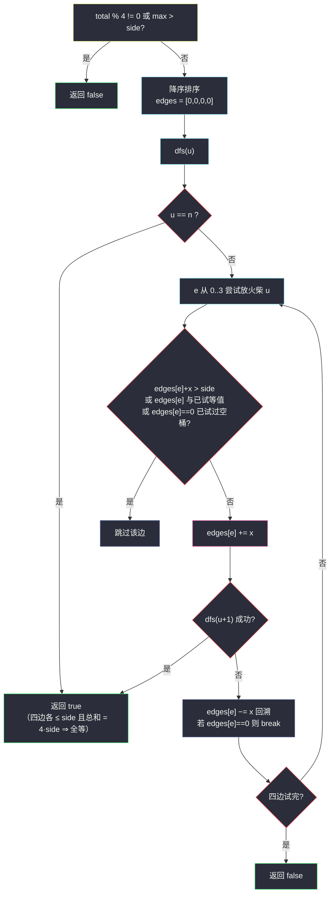

# 473. 火柴拼正方形（Matchsticks to Square）

> 题目来源：[https://leetcode.cn/problems/matchsticks-to-square/](https://leetcode.cn/problems/matchsticks-to-square/)
>
> 灵茶题单小节定位：§B 装箱型回溯（剪枝的艺术）

## 一、问题描述

你将得到一个整数数组 `matchsticks`，其中 `matchsticks[i]` 是第 `i` 个火柴棒的长度。你要用**所有的**火柴棍拼成一个正方形。你**不能折断**任何一根火柴棒，但你可以把它们连在一起，而且每根火柴棒必须**使用一次**。

如果你能使这这个正方形，则返回 `true`，否则返回 `false`。

**示例 1**:

```text
输入: matchsticks = [1,1,2,2,2]
输出: true
解释: 能拼成一个边长为 2 的正方形，每边两根火柴。
```

**示例 2**:

```text
输入: matchsticks = [3,3,3,3,4]
输出: false
解释: 不能用所有火柴拼成正方形。
```

**数据范围**：

- `1 <= matchsticks.length <= 15`
- `1 <= matchsticks[i] <= 10⁸`

**核心思考点**：经典**装箱回溯**（k=4 的等容量装箱判定）。总长必被 4 整除、单根不超边长是可行性门槛；排序降序放（大件先放，冲突早暴露）+ 三个剪枝（同边去重、空桶对称剪枝、目标满边剪枝）让 4¹⁵ ≈ 10⁹ 的理论量级实际毫秒级。n ≤ 15 也暗示状压路线，但 4 桶状压状态爆炸——回溯 + 剪枝才是本题正解。

## 二、暴力解法

### 思路

每根火柴独立选择 4 条边之一——`4ⁿ` 种分配全部枚举，检查每边和是否恰为 `total/4`。

### 代码

```python
from itertools import product

def makesquareBrute(matchsticks: list[int]) -> bool:
    total = sum(matchsticks)
    if total % 4:
        return False
    side = total // 4
    n = len(matchsticks)
    for assign in product(range(4), repeat=n):
        ok = True
        for e in range(4):
            if sum(matchsticks[i] for i in range(n) if assign[i] == e) != side:
                ok = False
                break
        if ok:
            return True
    return False
```

### 复杂度

- 时间：`O(4ⁿ · n)`——`n = 15` 时约 10⁹，超时；小样例对拍。
- 空间：`O(n)`。

## 三、优化探索

### 3.1 门槛判定：先杀掉不可能的输入 ⭐

- 总和 `total % 4 != 0` ⇒ false；
- 最长火柴 `> total/4` ⇒ false（不可折断）。

两个 `O(n)` 检查过筛后，才进入搜索——「先算术后搜索」的顺序意识。

### 3.2 降序排序：大件先放 ⭐⭐

把火柴从大到小排序再回溯。直觉：大根火柴的兼容性最差（可选边少），先固定它们，冲突在浅层暴露、剪枝更狠；小火柴灵活，留在后面「补缝」。实测同一数据降序后搜索节点常常少几个数量级——这与 #2305（饼干分发）的技巧同源，是**装箱回溯的第一剪**。

### 3.3 三个转移层剪枝 ⭐⭐

对第 `u` 根火柴尝试放入边 `e ∈ {0,1,2,3}`：

1. **容量剪枝**：`edges[e] + x > side` 跳过——超边不可能；
2. **同值去重**：`edges[e] == edges[e−1]`（与前面某条边当前长度相同）跳过——放入哪条等长边结果对称，只试一条；
3. **空桶剪枝**：若当前火柴放入**空边**（`edges[e] == 0`）后失败，其余空边无需再试——空边完全对称，一条不通条条不通；同时「这根火柴连空桶都放不进任何组合」意味着它注定无法安置，直接回溯。

三刀下去，`4ⁿ` 的对称重复大量坍缩。加上「某条边恰好拼满时不再对它叠加」由容量剪枝自然涵盖。



## 四、代码实现

### 主解：降序 + 三重剪枝回溯

```python
class Solution:
    def makesquare(self, matchsticks: List[int]) -> bool:
        total = sum(matchsticks)
        if total % 4:
            return False
        side = total // 4
        matchsticks.sort(reverse=True)          # 大件先放
        if matchsticks[0] > side:
            return False
        edges = [0] * 4

        def dfs(u: int) -> bool:
            if u == len(matchsticks):
                return True                     # 容量剪枝保证 ≤ side，总和 = 4·side ⇒ 全等
            x = matchsticks[u]
            tried = set()                       # 本轮已试过的「边当前长度」
            for e in range(4):
                if edges[e] + x > side:
                    continue
                if edges[e] in tried:           # 等长边对称，只试第一条
                    continue
                tried.add(edges[e])
                edges[e] += x
                if dfs(u + 1):
                    return True
                edges[e] -= x
                if edges[e] == 0:               # 放空桶失败 ⇒ 其余空桶也失败
                    break
            return False

        return dfs(0)
```

### 对照：无剪枝朴素版（体会差距）

```python
class Solution:
    def makesquare(self, matchsticks: List[int]) -> bool:
        total = sum(matchsticks)
        if total % 4 or max(matchsticks) > total // 4:
            return False
        side, edges = total // 4, [0] * 4
        n = len(matchsticks)
        def dfs(u):
            if u == n:
                return True
            for e in range(4):
                if edges[e] + matchsticks[u] <= side:
                    edges[e] += matchsticks[u]
                    if dfs(u + 1):
                        return True
                    edges[e] -= matchsticks[u]
            return False
        return dfs(0)
```

（只保留容量剪枝——`n = 15` 时最坏仍可能慢，但题目实际数据能过；三重剪枝版在对抗性数据下稳如泰山。）

### 细节说明

- **`u == n` 即成功**：每步容量剪枝保证 `edges[e] ≤ side`，而四边之和恒等于 `total = 4·side`——两者夹逼出四边全等。不需要显式比较。
- **`tried` 集合按「边长度」去重**：同一轮里两条长度相同的边完全对称；注意是**动态长度**而非边编号，比「`e > 0 and edges[e] == edges[e-1]`」的排序式判断更普适（后者要求边有序）。
- **空桶 break 位置**：在回溯恢复之后判断——`edges[e]` 已减回 0 说明刚才放的就是空桶。
- **`matchsticks[0] > side` 判在排序后**：降序后首元素即最大值。
- **`1 <= matchsticks[i] <= 10⁸`**：数值大没关系，只做加减比较，无溢出风险（Python 任意精度）。
- **n < 4 的小输入**：`total % 4` 与容量筛自动处理（如 `[1]` total=1 不整除 false）。

## 五、例子演示

**示例 1 端到端：matchsticks = [1,1,2,2,2]，total = 8，side = 2，降序 [2,2,2,1,1]**

| 步 | 动作 | edges | 说明 |
|---|---|---|---|
| u=0 | 放 2 → 边0 | [2,0,0,0] | 容量 2 ≤ 2 ✓ |
| u=1 | 边0 满（2+2>2）跳过；放边1 | [2,2,0,0] | |
| u=2 | 边0、1 满；放边2 | [2,2,2,0] | |
| u=3（火柴1） | 边0/1/2 满；放边3 | [2,2,2,1] | |
| u=4（火柴1） | 边3: 1+1=2 ✓ | [2,2,2,2] | |
| u=5 | `u == n` | — | **返回 true** ✅ |

全程零回溯——降序排列让大件依次填满边 0/1/2，小件收尾。

**示例 2：matchsticks = [3,3,3,3,4]，total = 16，side = 4，降序 [4,3,3,3,3]**

| 步 | 动作 | edges |
|---|---|---|
| u=0 | 4 → 边0 | [4,0,0,0] |
| u=1 | 3 → 边0 满(4+3>4)跳；边1 | [4,3,0,0] |
| u=2 | → 边2 | [4,3,3,0] |
| u=3 | → 边3 | [4,3,3,3] |
| u=4（火柴3） | 四边全满（每条 +3 > 4）| 无处可放 |

**返回 false** ✅——16 = 4×4 但 4 这根只能独占一边，剩余 3×4 根无法拼出三边各 4。

**剪枝威力小实验（假想数据 [5,5,5,3,3,3,2,2,2,2]…total=32, side=8）**：若不排序先放 2，各边都能塞，深搜大量无效展开；降序后 5,5,5 先行，边组合 `5+3` 立即锁定结构，节点数骤降。同值去重剪枝在「三边同为 5」时把 3! 种对称顺序砍成 1 种。

## 六、复杂度分析

设 `n = len(matchsticks)`：

- **时间复杂度：`O(4ⁿ)` 理论上界**——实际被三重剪枝压到远小（对抗性数据下毫秒级）；排序 `O(n log n)` 忽略。
- **空间复杂度：`O(n)`**——递归深度 + edges 常数数组。

## 七、对比总结

| 维度 | 暴力 4ⁿ 枚举 | 朴素回溯 | 主解（三重剪枝） |
|---|---|---|---|
| 时间 | `O(4ⁿ·n)` | 指数（容量剪枝） | 指数但实际近多项式 |
| 关键技巧 | — | 门槛判定 + 容量 | + 降序 + 同值去重 + 空桶 break |
| 代码量 | 中 | 短 | 中 |

**套路归纳**：**「等容量装箱判定」四件套**——①门槛判定（整除 + 单件不超）；②降序排列；③同值对称去重（按桶当前值）；④空桶失败即 break。这套组合拳直接迁移到 k=3 的三角形（#698 分等和子集的一般形态）与任意 k 的划分问题。核心心法是**「对称即浪费」**：回溯的指数爆炸大多来自把对称的等价方案各自走一遍，识别并砍掉对称分支是剪枝的第一性原理。

## 八、举一反三

1. **[698. 划分为k个相等的子集](https://leetcode.cn/problems/partition-to-k-equal-sum-subsets/)**：本题 k=4 的泛化——同一套剪枝直接改 k；另有「桶视角 ↔ 物品视角」两种回溯的著名讨论。
2. **[2305. 公平分发饼干](https://leetcode.cn/problems/fair-distribution-of-cookies/)**：本批姊妹篇——装箱从「判定」升级「最小化最大桶」，剪枝思想全盘继承 + ans 剪枝。
3. **[1723. 完成所有工作的最短时间](https://leetcode.cn/problems/find-minimum-time-to-finish-all-jobs/)**：装箱最小化最大值的 Hard 版（k 可变），二分 + 回溯/状压双路线。
4. **[473. 火柴拼正方形本题]()** 已是本尊；更进阶推荐 **[1986. 完成任务的最少工作时间段](https://leetcode.cn/problems/minimum-number-of-work-sessions-to-finish-the-tasks/)**：装箱 + 状压 DP 的组合。
5. **[526. 优美的排列](https://leetcode.cn/problems/beautiful-arrangement/)**：本批姊妹篇——同是 n ≤ 15 的回溯，一个靠整除剪枝、一个靠对称剪枝，两篇合成「回溯剪枝双璧」。

**同族互引**：灵茶题单「装箱回溯」支线的入门题；#2305（本批 `fair-distribution-of-cookies.md`）是最直接的进阶版，先刷本题再去看「最小化目标值」如何引入 ans 剪枝与下界估计。
