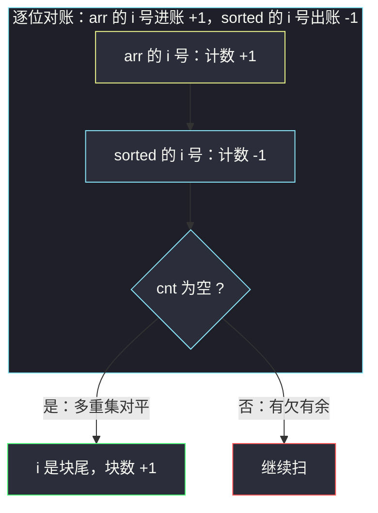
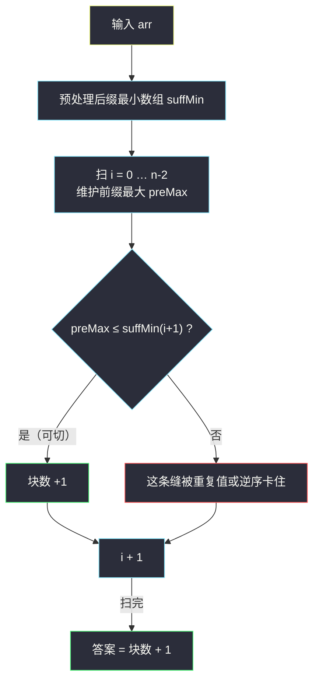

# 最多能完成排序的块 II（排序前缀多重集计数 · 前缀 max × 后缀 min 判缝）

## 一、问题描述

给定一个整数数组 `arr`，元素**可以重复**、值域任意。把数组切成若干段（块），把**每块内部单独排序**，再按原来的块顺序拼接起来，要求结果恰好等于整个数组升序排序后的样子。求最多能切出多少块。

> 🔗 LeetCode 768：https://leetcode.cn/problems/max-chunks-to-make-sorted-ii/
>
> 数据范围：数组长度 `n` 见官方题面（旧版 `1 <= n <= 2000`，近年已放宽到 `10^5` 量级），`0 <= arr[i] < 10^9`，元素可重复、可乱序。

**示例**

```
输入：arr = [2,1,3,4,4]    输出：4
解释：切成 [2,1] [3] [4] [4]，各块排序后拼接 = [1,2,3,4,4] ✓

输入：arr = [5,4,3,2,1]    输出：1
解释：完全逆序，任何一刀切下去都无法拼接有序，只能整块排序。

输入：arr = [2,1,3]        输出：2
解释：[2,1] [3] → 排序拼接 [1,2,3] ✓；而 [2] [1,3] 拼接为 [2,1,3] ✗。
```

**直观理解**

「块」的含义是**自愈段**：段内的乱序可以被段内排序自我消化，段与段之间天然有序。它是 #769（最多能完成排序的块，arr 是 `0..n-1` 的排列）的加强版——#769 里「扫到位置 `i` 时恰好见过前 `i+1` 小的所有数」可以用一个前缀 max 直接判；本题元素可重复，**只看 max 不够了**（见 3.4 的反例），必须判「前缀的多重集是否恰好是全局最小的那批元素」。这正是灵神题单 **一、基础题 · §1.2 进阶** 要练的判定升级。

---

## 二、暴力解法

最朴素的想法：`n-1` 条相邻缝，每条「切 / 不切」共 `2^(n-1)` 种方案，每种方案把各块排序拼接后与 `sorted(arr)` 逐位比对。指数级，直接放弃。

实用一点的暴力：先排序得到 `target = sorted(arr)`，对每个位置 `i` 检查「`arr[0..i]` 排序后是否等于 `target[0..i]`」，是则 `i` 是一个块尾，计数加一：

```python
class Solution:
    def maxChunksToSorted(self, arr: List[int]) -> int:
        target = sorted(arr)
        ans = 0
        for i in range(len(arr)):
            if sorted(arr[:i + 1]) == target[:i + 1]:   # 前缀排序后逐位相等
                ans += 1                                # i 是一个块尾
        return ans
```

### 复杂度

- **时间**：每个 `i` 都要对长度 `i+1` 的切片排序，`O(n^2 log n)`。
- **空间**：`O(n)`。

### 🔴 瓶颈在哪里

- 每个前缀都**从零开始重排**，前缀之间只差「进来一个 `arr[i]`、对账一个 `target[i]`」，完全可以**增量维护**——这就是计数法。
- 更进一步：「前缀多重集 = 排序数组前缀多重集」其实有个更轻的等价刻画：**前缀 max ≤ 后缀 min**（max-min 双判定），连排序和哈希都能省掉。

---

## 三、优化探索（核心章节）

> 📚 本题在灵茶题单中属于 **一、基础题 · §1.2 进阶**。灵神模板要点：**排序后逐前缀比较多重集**（计数对账，diff 归零即为块尾），或等价的 **max-min 双判定**——`max(arr[0..i]) ≤ min(arr[i+1..])` 即可在 `i` 后切一刀。与 §1.1 的 #769（排列版）对照记忆：值可重复后，单看前缀 max 会出假阳性，必须升级成多重集判定。

### 3.1 判缝的充要条件（整题的地基）

**引理**：在 `i` 与 `i+1` 之间切开是合法的 ⟺ `max(arr[0..i]) ≤ min(arr[i+1..n-1])`。

- **必要性**：若拼接后整体有序，左段排序后的最后一个元素必须 ≤ 右段排序后的第一个元素，即左段最大值 ≤ 右段最小值；否则拼接处必然出现逆序。
- **充分性**：左段每个元素 ≤ 右段每个元素 ⟹ 左段排序后整体 ≤ 右段排序后整体 ⟹ 拼接有序。

**推论（多重集版本）**：上述条件 ⟺ 前缀 `arr[0..i]` 的多重集恰是全局最小的 `i+1` 个元素，即与 `sorted(arr)[0..i]` 的多重集相等。

- 「≤」成立时，若有更小的元素 `b` 落在后缀、更大的元素 `a` 落在前缀，则 `a > b` 与「前缀整体 ≤ 后缀整体」矛盾；故前缀必由最小的 `i+1` 个元素组成。反之显然。

**为什么块数 = 合法缝数 + 1（所有合法缝可以同时切）**：把每条合法缝都切上，任意相邻两块都满足「左块整体 ≤ 右块整体」，链式传递后整条拼接有序；同时任何合法划分的每条缝都必须满足引理（必要性）。所以**逐缝独立判断、不需要回溯**，判定次数就是答案。

### 3.2 方法一：排序 + 计数对账（多重集判定的增量实现）

排序一次得 `sorted_arr`，然后像「对账」一样逐位推进：读入 `arr[i]` 记 `+1`，读入 `sorted_arr[i]` 记 `-1`，用字典维护差额；**字典为空**说明前缀多重集对账清零，`i` 是块尾：



实现细节：键值归零就 `del` 掉，字典里只留非零键，`if not cnt` 即判空，避免额外维护「非零键个数」。

### 3.3 方法二：前缀 max × 后缀 min 判缝（免排序的 max-min 双判定）

引理只需要两个量：**前缀最大值**与**后缀最小值**。预处理后缀最小数组 `suffMin[i] = min(arr[i..n-1])`（`suffMin[n] = +∞` 作哨兵），再从左到右扫一遍维护前缀最大 `preMax`，在每条缝 `i | i+1` 上判 `preMax ≤ suffMin[i+1]` 即可：



### 3.4 ⚠️ 陷阱：重复值下「前缀 max 单判定」失效

在 #769（元素是 `0..n-1` 的排列）里，`max(arr[0..i]) == i` 就足够判缝；顺着惯性很容易在 #768 写成 `max(arr[0..i]) == sorted[i]`——**这是错的**。反例 `arr = [1,5,5,3]`：

- `sorted = [1,3,5,5]`，`i = 2` 时 `max(arr[0..2]) = 5 = sorted[2]`，单判定说「可切」；
- 但 `[1] [5,5] [3]` 拼接为 `1,5,5,3`，并非有序。正确答案是 2 块：`[1] [5,5,3]`。

问题出在：max 相同只说明「两边都摸到了 5 这个高度」，**没说明两边各自有几个 5、有没有欠着更小的数**。多重集相等才是本质，它的两个等价落地形式就是「计数对账归零」与「前缀 max ≤ 后缀 min」——这也是本批模板要点里强调「max-min **双**判定」的原因：max 和 min 两个量一起看，等价于把整段大小关系钉死。

### 3.5 重复元素与等号

判缝条件是 `≤` 而不是 `<`：`[2,1,3,4,4]` 在 `i=3` 处 `preMax = 4 = suffMin[4] = 4`，等号成立照样可切（两个 4 分属两块，拼接 `…4,4…` 仍然非降）。写成 `<` 会漏掉这类缝，答案偏小。

### 3.6 一句话核心

> **能切就切：`max(左段) ≤ min(右段)` ⟺ 左段多重集 = 排序数组同长前缀；逐缝独立判定，块数 = 缝数 + 1。**

---

## 四、代码实现

### Python（主解一：排序 + 计数对账，多重集判定）

```python
from collections import defaultdict
from typing import List

class Solution:
    def maxChunksToSorted(self, arr: List[int]) -> int:
        sorted_arr = sorted(arr)
        cnt = defaultdict(int)
        ans = 0
        for x, y in zip(arr, sorted_arr):
            cnt[x] += 1                       # 原数组进账
            if cnt[x] == 0:
                del cnt[x]                    # 归零即删，字典只留非零键
            cnt[y] -= 1                       # 排序数组出账
            if cnt[y] == 0:
                del cnt[y]
            if not cnt:                       # 对账清零：i 是块尾
                ans += 1
        return ans
```

### Python（主解二：前缀 max × 后缀 min，免排序免哈希）

```python
from typing import List

class Solution:
    def maxChunksToSorted(self, arr: List[int]) -> int:
        n = len(arr)
        suff_min = [0] * (n + 1)
        suff_min[n] = float('inf')            # 哨兵：i+1 = n 时右侧无元素
        for i in range(n - 1, -1, -1):
            suff_min[i] = min(arr[i], suff_min[i + 1])

        ans, pre_max = 0, float('-inf')
        for i in range(n - 1):                # 只在 i | i+1 之间试切
            pre_max = max(pre_max, arr[i])
            if pre_max <= suff_min[i + 1]:    # 注意等号：重复值照样可切
                ans += 1
        return ans + 1                        # 块数 = 切缝数 + 1
```

**变量含义**

| 变量 | 含义 |
|------|------|
| `suff_min[i]` | `min(arr[i..n-1])`，从右往左一遍递推 |
| `pre_max` | 扫描过程中的 `max(arr[0..i])` |
| `pre_max <= suff_min[i+1]` | 左段整体 ≤ 右段整体，缝合法 |
| `cnt` | 原数组与排序数组的逐位计数差额字典 |

### Java（前缀 max × 后缀 min 版）

```java
class Solution {
    public int maxChunksToSorted(int[] arr) {
        int n = arr.length;
        int[] suffMin = new int[n + 1];
        suffMin[n] = Integer.MAX_VALUE;
        for (int i = n - 1; i >= 0; i--) {
            suffMin[i] = Math.min(arr[i], suffMin[i + 1]);
        }
        int ans = 0;
        int preMax = Integer.MIN_VALUE;
        for (int i = 0; i < n - 1; i++) {
            preMax = Math.max(preMax, arr[i]);
            if (preMax <= suffMin[i + 1]) ans++;
        }
        return ans + 1;
    }
}
```

---

## 五、具体例子演示

### 例 A：`arr = [2,1,3,4,4]`（主演示，计数对账表）

`sorted_arr = [1,2,3,4,4]`，逐位对账：

| i | 进账 `arr[i]` | 出账 `sorted[i]` | cnt 非零键状态 | 对平？ | 结论 |
|---|---------------|------------------|----------------|--------|------|
| 0 | `+1 @ 2` | `-1 @ 1` | `{2:+1, 1:-1}` | ✗ | 不是缝 |
| 1 | `+1 @ 1` | `-1 @ 2` | `{}`（两键双双归零删除） | ✓ | 块尾①：`[2,1]` |
| 2 | `+1 @ 3` | `-1 @ 3` | `{}` | ✓ | 块尾②：`[3]` |
| 3 | `+1 @ 4` | `-1 @ 4` | `{}` | ✓ | 块尾③：`[4]` |
| 4 | `+1 @ 4` | `-1 @ 4` | `{}` | ✓ | 块尾④：`[4]`（数组终点） |

→ **4 块**：`[2,1] [3] [4] [4]`，拼接 `1,2,3,4,4` ✓。

### 例 A（续）：max-min 判缝表

`preMax` 从左推，`suffMin = [1,1,3,4,4,+∞]`：

| i | `preMax = max(arr[0..i])` | `suffMin[i+1] = min(arr[i+1..])` | `preMax ≤ suffMin[i+1]`? | 判定 |
|---|---------------------------|-----------------------------------|--------------------------|------|
| 0 | 2 | 1 | 2 ≤ 1 ✗ | 不切 |
| 1 | 2 | 3 | 2 ≤ 3 ✓ | 缝① |
| 2 | 3 | 4 | 3 ≤ 4 ✓ | 缝② |
| 3 | 4 | 4 | 4 ≤ 4 ✓（等号！） | 缝③ |

块数 = 3 缝 + 1 = **4** ✓。两种方法完全一致——它们判的是同一个条件（3.1 推论）。

### 例 B：`arr = [5,4,3,2,1]`（一刀都切不了）

`suffMin = [1,1,1,1,1]`，`preMax` 一直是 5：

| i | preMax | suffMin[i+1] | 可切？ |
|---|--------|--------------|--------|
| 0 | 5 | 1 | ✗ |
| 1 | 5 | 1 | ✗ |
| 2 | 5 | 1 | ✗ |
| 3 | 5 | 1 | ✗ |

0 缝 → **1 块**（整体排序）✓。完全逆序时每个前缀都「欠」着更小的数，多重集永远对不平。

### 例 C：`arr = [2,1,3]`

| i | preMax | suffMin[i+1] | 可切？ |
|---|--------|--------------|--------|
| 0 | 2 | 1 | ✗ |
| 1 | 2 | 3 | ✓ |

1 缝 → **2 块**：`[2,1] [3]` ✓。注意 `i=0` 处 `[2] [1,3]` 的切法正是被 `2 > 1` 否定的那个假缝。

### 例 D：`arr = [1,5,5,3]`（3.4 陷阱复盘，三种判定同台对照）

`sorted = [1,3,5,5]`，`suffMin = [1,3,3,3,+∞]`：

| i | preMax | 单判定 `max == sorted[i]`? | suffMin[i+1] | 双判定 `preMax ≤ suffMin`? | 计数对账 |
|---|--------|------------------------------|--------------|------------------------------|----------|
| 0 | 1 | 1 == 1 ✓ | 3 | 1 ≤ 3 ✓ | 平 ✓ |
| 1 | 5 | 5 == 3 ✗ | 3 | 5 ≤ 3 ✗ | `{5:+1, 3:-1}` ✗ |
| 2 | 5 | 5 == 5 ✓ **假阳性！** | 3 | 5 ≤ 3 ✗ | 仍欠 `{5:+1, 3:-1}` ✗ |
| 3 | 5 | 5 == 5 ✓ | —（终点） | — | 平 ✓（终点必平） |

- 单判定数出 3 块 `[1] [5,5] [3]` → 拼接 `1,5,5,3` **非有序，错**；
- 双判定 / 计数法数出 2 块 `[1] [5,5,3]` → 拼接 `1,3,5,5` **正确**。

`i = 2` 的病根：前缀 `{1,5,5}` 与 `{1,3,5}` 各有一个 5（max 相同），但前缀多吞了一个 5、欠着一个还没到的 3。max 看不见这笔账，多重集对账看得一清二楚。

---

## 六、复杂度分析

| 方法 | 时间 | 空间 |
|------|------|------|
| 逐前缀重排比较 | `O(n^2 log n)` | `O(n)` |
| 排序 + 计数对账 | `O(n log n)`（排序主导，对账 `O(n)` 均摊） | `O(n)`（字典 + 排序数组） |
| 前缀 max × 后缀 min | `O(n)`（两遍线性扫描，无排序） | `O(n)`（`suff_min` 数组） |

- 计数对账中每个键至多被「增—归零删除」各一次，`del` 与查询均为均摊 `O(1)`。
- max-min 法的两遍扫描彼此独立，`suff_min` 若允许原地覆写（倒序扫时只读 `arr[i]` 与 `suff_min[i+1]`）可压到 `O(n)` 不可再省——一遍要从右往左推后缀、一遍要从左往右推前缀，方向相反。

---

## 七、对比总结

**分块家族对照**：

| 题 | 元素 | 判缝条件 | 复杂度 |
|----|------|----------|--------|
| #769 最多能完成排序的块 | `0..n-1` 排列 | `max(arr[0..i]) == i`（单判定即可） | `O(n)` |
| #768 本题 | 任意值、可重复 | `max(左段) ≤ min(右段)` ⟺ 前缀多重集 = 排序前缀 | `O(n)` / `O(n log n)` |
| #581 最短无序连续子数组 | 任意值 | 同族对照：找「必须重排的最短区间」而非最多的块 | `O(n)` |

**与前缀/后缀预处理思想的关系**：#962 最大宽度坡（见同目录 `maximum-width-ramp.md`）用「后缀 max 数组 + 从右往左收缩」完成了同一类**方向相反的双扫描**——一边从左推前缀聚合量，一边从右推后缀聚合量，在中间接头判定。两题可以当成一对练习。

**易错点**

1. **单判定假阳性**（3.4）：`max(arr[0..i]) == sorted[i]` 在重复值下不充分，必须 max-min 双判定或计数对账。
2. **等号**：判缝是 `≤`，重复值可切（例 A 的 `i=3`）。
3. **计数对账要「双向记账」**：只记 `arr` 不记 `sorted`（或反之）字典永远清不了零。
4. **别忘了 +1**：块数 = 缝数 + 1；终点必是块尾但不占缝。
5. 哈希版别用「非零键计数器」硬维护，容易在 `+1` 再 `+1` 归零的分支上漏更新——「归零即删 + 判空」最稳。

---

## 八、举一反三

| 题目 | 关系 |
|------|------|
| [769. 最多能完成排序的块](https://leetcode.cn/problems/max-chunks-to-make-sorted/) | 亲姊妹题：排列版（元素 `0..n-1` 互异），单判定 `max == i` 即可，先做它再回看本题的判定升级 |
| [581. 最短无序连续子数组](https://leetcode.cn/problems/shortest-unsorted-continuous-subarray/) | 同为「排序后对比」家族：一个求最多块，一个求最短待排序区间，正反两面 |
| [962. 最大宽度坡](https://leetcode.cn/problems/maximum-width-ramp/) | 同用「前缀/后缀聚合量 + 双向扫描」，见同目录 `maximum-width-ramp.md` |
| [905. 按奇偶排序数组](https://leetcode.cn/problems/sort-array-by-parity/) | 弱化对照：只需按奇偶分两「块」，体会块的有序性要求 |

**思想迁移**

- 看到「分段后各自处理能拼出全局有序」，先写判缝充要条件，再找它的**最省等价实现**：多重集相等（计数）→ 前缀 max ≤ 后缀 min（双向聚合量）。
- 「前缀聚合量 + 后缀聚合量」是 `O(n)` 免排序判序关系的通用杠杆：#768 判缝、#962 找坡、#581 找无序区间，全是它。
- 元素互异时 max 是「身份证」，元素重复时 max 只是「身高」——从排列迁移到任意数组，凡是用到「见过哪些值」的判定都要升级成多重集/计数。
- 口诀：**「左最大、右最小，左不越右就切刀；重复值前莫单判，多重集对账最牢靠。」**
