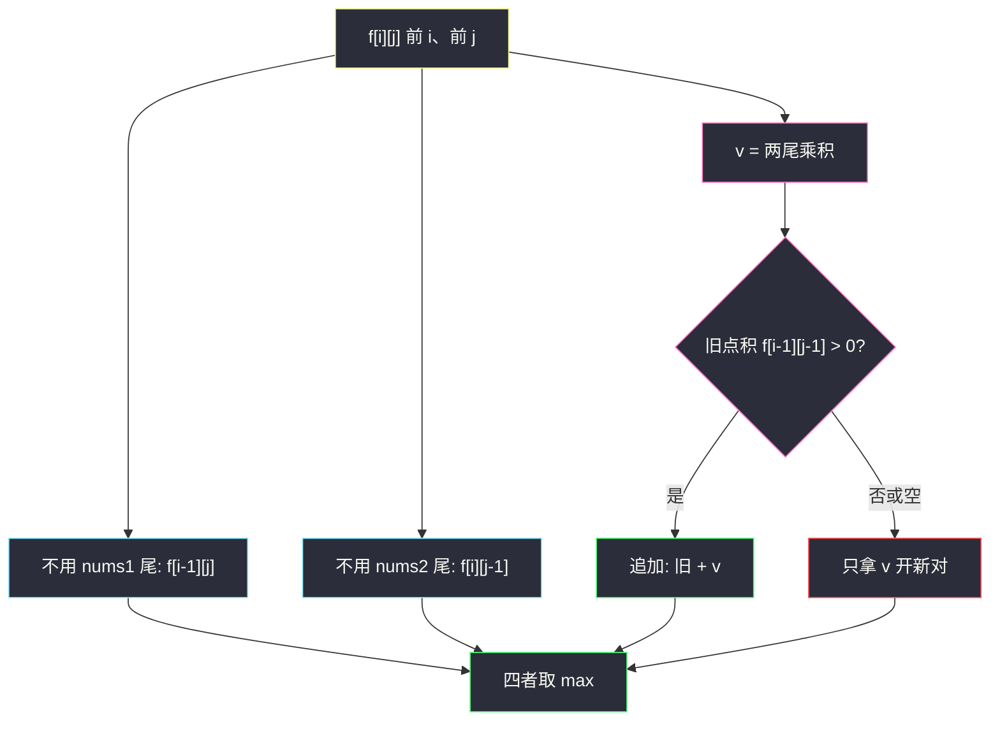

# 1458. 两个子序列的最大点积（Max Dot Product of Two Subsequences）

> 题目来源：[https://leetcode.cn/problems/max-dot-product-of-two-subsequences/](https://leetcode.cn/problems/max-dot-product-of-two-subsequences/)
>
> 灵茶题单小节定位：§4.1 最长公共子序列（LCS）

## 一、问题描述

给你两个数组 `nums1` 和 `nums2`。从每个数组各选一个**长度相同且非空**的子序列，返回它们点积的最大值。

子序列：删掉若干元素（可以不删）后，剩余元素相对顺序不变。例如 `[2,3,5]` 是 `[1,2,3,4,5]` 的子序列，`[1,5,3]` 不是。

点积：等长序列 `a、b` 的 `a[0]*b[0] + a[1]*b[1] + …`。

**数据范围**：

- `1 <= nums1.length, nums2.length <= 500`
- `-1000 <= nums1[i], nums2[j] <= 1000`

**示例 1**：

```text
输入：nums1 = [2,1,-2,5], nums2 = [3,0,-6]
输出：18
解释：子序列 [2,-2] 与 [3,-6]，点积 2*3 + (-2)*(-6) = 18。
```

**示例 2**：

```text
输入：nums1 = [3,-2], nums2 = [2,-6,7]
输出：21
解释：选 [3] 与 [7]，点积 21（比更长的配对更大）。
```

**示例 3**：

```text
输入：nums1 = [-1,-1], nums2 = [1,1]
输出：-1
解释：所有等长配对的点积都是负数，最优是任意一对单元素，(-1)*1 = -1。
```

**核心思考点**：LCS 型二维 DP：考虑 `nums1` 的前 `i` 个与 `nums2` 的前 `j` 个，强制子序列非空。转移四选一——丢 `nums1` 尾、丢 `nums2` 尾、只拿当前这一对、把当前这对接到旧配对后面。负数让「更长不一定更好」：旧点积为负时，宁可丢掉旧的、从当前乘积重新开张。全负时答案就是「最大的那个单对乘积」（两个负数很大，或一正一负里最接近 0 的负积）。

## 二、暴力解法

### 思路

用比特掩码枚举两个数组的非空子序列（掩码自然保序），长度相等才算点积，取最大。与主解独立：暴力在子集上结算，主解在前缀格子上转移。

### 代码

```python
def maxDotProductBrute(a: list[int], b: list[int]) -> int:
    m, n = len(a), len(b)
    ans = -10 ** 18
    for ma in range(1, 1 << m):
        sa = [a[i] for i in range(m) if ma >> i & 1]
        for mb in range(1, 1 << n):
            sb = [b[j] for j in range(n) if mb >> j & 1]
            if len(sa) != len(sb):
                continue
            s = 0
            for x, y in zip(sa, sb):
                s += x * y
            if s > ans:
                ans = s
    return ans
```

### 复杂度

- 时间：`O(2^{m+n} · min(m, n))`。`m, n = 500` 不可用；对拍缩到 `m, n ≤ 7`。
- 空间：`O(m + n)`。

## 三、优化探索

### 3.1 和 LCS 同一张表，分数不同 ⭐

[#1143 最长公共子序列](https://leetcode.cn/problems/longest-common-subsequence/)：`f[i][j]` = 两个前缀的 LCS 长度，匹配时 `f[i-1][j-1] + 1`。本题同样是「从两个前缀里抽等长下标递增的配对」，但每对贡献的是**乘积**而不是 1，且允许「不匹配的值」配对（LCS 要求字符相等，这里任意两数都能乘）。

`f[i][j]` = 只用 `nums1[:i]`、`nums2[:j]` 能得到的最大点积（子序列非空）。空前缀无法构成非空子序列，`f[0][*] = f[*][0] = -∞`。

### 3.2 四条转移 ⭐⭐

记 `v = nums1[i-1] * nums2[j-1]`：

1. **不用** `nums1[i-1]`：`f[i-1][j]`
2. **不用** `nums2[j-1]`：`f[i][j-1]`
3. **只拿这一对**（长度为 1 的子序列）：`v`
4. **接到旧配对后面**：`f[i-1][j-1] + v`

```text
f[i][j] = max( f[i-1][j], f[i][j-1], v, f[i-1][j-1] + v )
```

第 4 条在 `f[i-1][j-1] = -∞` 时毫无意义（被第 3 条覆盖）。当 `f[i-1][j-1]` 是有限负数时，`v` 可能大于 `f[i-1][j-1] + v`——**负的历史点积应该扔掉**。压缩写法：

```text
f[i][j] = max( f[i-1][j], f[i][j-1], max(0, f[i-1][j-1]) + v )
```

`max(0, 旧) + v` 同时表达「开新对」和「在非负历史上追加」。`f` 为 `-∞` 时，在实现里不要真的拿 `-∞` 和 0 比完再加（Python 里 `max(0, -inf)` 是 0，刚好得到 `v`；Java 的 `Integer.MIN_VALUE` 不要直接加 `v`，会溢出）。

不必单独写「两个尾都不用」：它已被 `f[i-1][j]` / `f[i][j-1]` 包含。

### 3.3 全负：答案可以是负数 ⭐

题面要求非空，不能返回 0（「什么都不选」非法）。两个数组异号时，所有乘积为负，最优往往是**绝对值最小的那一对**（例 3 的 `-1`）。两个数组都是大负数时，最优是**两个绝对值最大的负数相乘**（大正数）。主解不用分类讨论：`v` 作为候选已经覆盖「只选一对」，再和更长配对比较即可。

这和 [#152 乘积最大子数组](https://leetcode.cn/problems/maximum-product-subarray/) 一样：负负得正可能更好，但「必须非空」时不能用 0 当缺省。



## 四、代码实现

### 主解：LCS 型二维 DP

```python
class Solution:
    def maxDotProduct(self, nums1: list[int], nums2: list[int]) -> int:
        m, n = len(nums1), len(nums2)
        NEG = -10 ** 18
        f = [[NEG] * (n + 1) for _ in range(m + 1)]
        for i in range(1, m + 1):
            for j in range(1, n + 1):
                v = nums1[i - 1] * nums2[j - 1]
                prev = f[i - 1][j - 1]
                f[i][j] = max(
                    f[i - 1][j],
                    f[i][j - 1],
                    v if prev < 0 else prev + v,
                )
        return f[m][n]
```

`prev < 0` 包含「未定义的 `-∞`」和「真实负点积」：两种都应开新对。`prev == 0` 时追加 `+ v` 与开新对相同。

### 细节说明

- **初始化必须是极小值**，不能是 0：否则全负用例会被 0 冒充「空选」。
- **`v` 单独进 max**：漏掉这一支，例 2 可能用 `[3,-2]·[2,-6] = 18` 而拿不到 `3*7=21`，或全负时把负历史硬加上去更差。
- **顺序**：`i、j` 升序，只依赖左、上、左上。
- **空间**：可滚成两行 / 一行，注意左上要先备份。`m, n ≤ 500`，二维 25 万格足够。
- **乘法范围**：`±1000 * ±1000 = ±1e6`，最长 500，点和积绝对值 ≤ `5e8`，Python int 无忧；Java 用 `long` 更稳，但 `int` 也放得下。

## 五、例子演示

**示例 1：`nums1 = [2,1,-2,5]`，`nums2 = [3,0,-6]`**

成对乘积表（行 = nums1，列 = nums2）：

|  | 3 | 0 | -6 |
|---|---|---|---|
| 2 | 6 | 0 | -12 |
| 1 | 3 | 0 | -6 |
| -2 | -6 | 0 | 12 |
| 5 | 15 | 0 | -30 |

`f[i][j]`（空前缀行/列省略，全是 `-∞`）：

| i\j | 1 (3) | 2 (0) | 3 (-6) |
|---|---|---|---|
| 1 (2) | 6 | 6 | 6 |
| 2 (1) | 6 | 6 | 6 |
| 3 (-2) | 6 | 6 | **18** |
| 4 (5) | 15 | 15 | **18** |

关键格 `f[3][3]`：`v = (-2)*(-6) = 12`，`prev = f[2][2] = 6 > 0`，追加得 18；也大于只拿 12、大于上方/左方的 6。对应 `[2,-2] · [3,-6]`。最后一行把 18 继承下来，`f[4][3] = 18`。

**示例 2**：`[3,-2]` 与 `[2,-6,7]`。`3*7 = 21` 在 `f[1][3]` 出现，之后一直是全局最大——更长的 `[3,-2]·[2,-6] = 18` 反而小。

**示例 3**：`[-1,-1]` 与 `[1,1]`。每格 `v = -1`，`prev` 若已是 `-1` 则开新对仍是 `-1`，追加是 `-2`。答案 `-1`。

**对拍**：`m, n ≤ 6`、值域 `[-8, 8]`，掩码暴力 400 组。其中至少 80 组强制两边全非正、全非负、一正一负；必含长度 1、官方三例。全负数组是最容易把 `f` 初始化成 0 的用例。

## 六、复杂度分析

设 `m、n` 为两数组长度：

- **时间复杂度：`O(m n)`**——每个格子常数转移。
- **空间复杂度：`O(m n)`**，滚动后 `O(min(m, n))`。

## 七、对比总结

| 维度 | 枚举子序列 | LCS 型 DP |
|---|---|---|
| 时间 | `O(2^{m+n} · L)` | `O(mn)` |
| 空选 | 掩码从 1 开始自然排除 | `f` 初值 `-∞` |
| 负历史 | 自动比较所有长度 | 必须 `max(0, prev)+v` 或显式四路 |

**易错点**：

1. 初值 0，全负返回 0。
2. 只写 LCS 的「匹配 +1」，忘了任意两数都能配、分数是乘积。
3. 强制把两个尾接在一起，不提供「只拿 `v`」——负前缀会拖累。
4. 以为要选尽可能长：例 2 是反例。

**套路归纳**：§4.1 的格子还是 `f[i][j]` 看两个前缀尾。LCS 计「配成一对 +1」，本题计「乘积」，并多一个「负的旧和就丢掉」的 `max(0, ·)`。凡是「两个序列抽等长子序列优化某种配对分数」，都是这张表。

## 八、举一反三

1. **[1143. 最长公共子序列](https://leetcode.cn/problems/longest-common-subsequence/)**：同一张表，匹配贡献 1。
2. **[1035. 不相交的线](https://leetcode.cn/problems/uncrossed-lines/)**：数值相等才连线，就是 LCS。
3. **[718. 最长重复子数组](https://leetcode.cn/problems/maximum-length-of-repeated-subarray/)**：改成连续，断了就归零。
4. **[152. 乘积最大子数组](https://leetcode.cn/problems/maximum-product-subarray/)**：单数组、连续、负数翻转；「必须非空」的处理可对照。
5. **[1626. 无矛盾的最佳球队](https://leetcode.cn/problems/best-team-with-no-conflicts/)**：同目录 `best-team-with-no-conflicts.md`，也是「配对 / 衔接」型 DP，约束换成年龄与分数。

**同族互引**：§4.1 把 LCS 的 `+1` 换成乘积，再处理负数与非空。和回文 LPS（`s` 与反串的 LCS）同骨架、不同分数。
