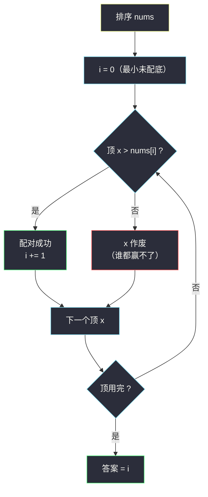

# 最大化数组的伟大值（排序 + 双指针 · 小配大）

## 一、问题描述

给你一个下标从 `0` 开始的整数数组 `nums`。允许将 `nums` 的元素**重新排列**成任意排列 `perm`（元素多重集合不变）。

定义伟大值为满足 `perm[i] > nums[i]` 的下标 `i` 的**数目**（注意比较对象是**原始顺序**的 `nums`）。返回 greatness 的最大值。

> 🔗 LeetCode 2592：https://leetcode.cn/problems/maximize-greatness-of-an-array/
>
> 数据范围：`1 <= nums.length <= 10^5`，`0 <= nums[i] <= 10^9`。

**示例 1**

```
输入：nums = [1,3,5,2,1,3,1]
输出：4
解释：一个可行的 perm = [2,1,1,5,3,1,3]（同为 {1,1,1,2,3,3,5} 的排列）。
逐位比较：2>1 ✓、1>3 ✗、1>5 ✗、5>2 ✓、3>1 ✓、1>3 ✗、3>1 ✓，共 4 个优势位。
```

**示例 2**

```
输入：nums = [1,2,3,4]
输出：3
解释：perm = [2,3,4,1]：2>1 ✓、3>2 ✓、4>3 ✓、1>4 ✗，共 3。
```

**直观理解**

`perm` 是 `nums` 自己的重排，所以这是**一个序列和自己配对**：把 `nums` 的值排序后作为「底」，再把同一批值分配上去做「顶」，让尽量多的位置满足「顶严格大于底」。位置可以任意腾挪（怎么排 `perm` 都合法），问题纯粹是**值层面的配对**——典型 §1.2 单序列配对。

---

## 二、暴力解法

枚举 `nums` 的全部排列，统计每种排列的优势位数取最大：

```python
class Solution:
    def maximizeGreatness(self, nums: List[int]) -> int:
        ans = 0
        for perm in permutations(nums):        # O(n!) 个排列
            ans = max(ans, sum(p > x for p, x in zip(perm, nums)))
            if ans == len(nums):               # 剪枝：已不可能更好
                break
        return ans
```

### 复杂度

- **时间**：`O(n! · n)`，`n = 10^5` 时连边都数不清；只有 `n ≤ 8` 左右才能跑。
- **空间**：`O(n)`。

### 🔴 瓶颈在哪里

位置信息其实是**干扰项**：`perm` 怎么排都合法，优势位只看「顶值 > 底值」的配对数。把两边都排序后再配对，就把 `n!` 种位置安排压缩成一种**值有序的配对场景**——贪心随之浮出水面。

---

## 三、优化探索（核心章节）

> 📚 本题在灵茶题单中属于 **§1.2 单序列配对**（贪心① A 路）：排序后「小配大」——小的数去配**严格大于它的最小数**，与 #870 双序列配对、#2576 二分答案配对同一族。

### 3.1 转化：值层面的配对

`perm` 与 `nums` 是同一个多重集合。把集合排序得 `a[0] ≤ a[1] ≤ ... ≤ a[n-1]`：

- 「底」：被覆盖的一方，也用 `a` 表示（值集合相同）；
- 「顶」：分配出去的值，同样来自 `a`。

一个顶值配一个底值，要求**顶 > 底**，最大化配对数。位置怎么对应回原数组不重要——把赢的配对填到「原数组中对应值的位置」即可，剩余的顶随便填。

### 3.2 贪心：小数配「严格更大的最小数」

双指针：`i` 指向**最小的尚未被覆盖的底** `nums[i]`，顶从小到大遍历 `x`：

- 若 `x > nums[i]`：配对成功，`i` 前进（配对数 +1）；
- 否则 `x ≤ nums[i]`：`x` 连最小的底都赢不了，后面的底只会更大——**`x` 作废**，直接跳过。



### 3.3 为什么是对的（交换论证）

**作废无损**：`x ≤ nums[i]` 且所有未配底 ≥ `nums[i]`，`x` 在任何方案里都贡献不了配对。

**立即配对不劣**：设某最优方案中，当前最小未配底 `nums[i]` 由更大的顶 `y` 覆盖，而当前顶 `x`（能赢 `nums[i]` 的最小顶）被留给了更大的底（或作废）。交换两者的去向：

- `x` 去配 `nums[i]`：由 `x > nums[i]` 直接成立；
- `y ≥ x > nums[i]` 去接替 `x` 原来的位置：若 `x` 原本配的是更大的底且能赢，`y ≥ x` 同样能赢；若 `x` 原本作废，`y` 去作废也不亏。

交换后配对数不减少。对贪心的每一步做此论证（归纳），贪心结果 = 最优值。

### 3.4 与二分答案的关系

本题也可走 #2576 的路：二分答案 `k`，判定「最大 k 个数能否覆盖最小 k 个数」⟺ 排序后对所有 `j < k` 检查 `a[j + (n-k)] > a[j]`。双指针贪心正是这个判定的线性化——它一遍扫出了最大的可行 `k`，省去二分。两题模板对照见第七章。

### 3.5 一句话核心

> **排序后小配大：小顶专挑最小能赢的底，赢不了的顶直接作废；双指针扫一遍，`i` 就是答案。**

---

## 四、代码实现

### Python（主解）

```python
class Solution:
    def maximizeGreatness(self, nums: List[int]) -> int:
        nums.sort()
        i = 0                          # 已配对数，同时指向最小未配底 nums[i]
        for x in nums:                 # 顶从小到大出场
            if x > nums[i]:            # 能赢当前最小未配底
                i += 1                 # 配对 +1
        return i
```

六行定式，无任何附加数据结构。

**变量含义**

| 变量 | 含义 |
|------|------|
| `i` | 双重身份：已完成的配对数 + 最小未配底的下标 |
| `x` | 当前出场的顶（排序后从小到大） |
| `nums[i]` | 当前最小的未配底 |

**循环不变式**：任意时刻，`nums[0..i-1]` 这 `i` 个最小的底都已被更小的顶覆盖，`nums[i]` 是下一个待覆盖目标；已作废的顶全部 ≤ 它们出场时的 `nums[i]`，不可能再贡献配对。

### Java（可选对照）

```java
class Solution {
    public int maximizeGreatness(int[] nums) {
        Arrays.sort(nums);
        int i = 0;
        for (int x : nums) {
            if (x > nums[i]) i++;
        }
        return i;
    }
}
```

---

## 五、具体例子演示

### 示例 1 端到端：`nums = [1,3,5,2,1,3,1]`

排序得 `[1,1,1,2,3,3,5]`（底与顶共用同一序列）。

**排序后每一步的选择过程**

| 步 | 当前候选顶 x | 最小未配底 nums[i] | x > nums[i] ? | 决策 | i（配对数） |
|----|-------------|-------------------|---------------|------|------------|
| 1 | 1 | 1 | 否 | 顶 1 作废 | 0 |
| 2 | 1 | 1 | 否 | 顶 1 作废 | 0 |
| 3 | 1 | 1 | 否 | 顶 1 作废 | 0 |
| 4 | 2 | 1 | **是** | 2 配 1 | 1 |
| 5 | 3 | 1 | **是** | 3 配 1 | 2 |
| 6 | 3 | 1 | **是** | 3 配 1 | 3 |
| 7 | 5 | 2 | **是** | 5 配 2 | 4 |

答案 **4**。最终配对：`2→1`、`3→1`、`3→1`、`5→2`；作废顶 `{1,1,1}` 填到值 `3,3,5` 的位置上。

**还原成一个 perm**：把四个赢的顶放到原数组中值 `1,1,1,2` 的位置（下标 0、2、4、6 中的四个），作废顶放下标 1、3、5：

```text
nums      = [1, 3, 5, 2, 1, 3, 1]
perm      = [2, 1, 1, 5, 3, 1, 3]
比较        ✓   ✗  ✗  ✓  ✓  ✗  ✓   → greatness = 4 ✓
```

### 示例 2 对照：`nums = [1,2,3,4]`

排序不变。逐步：`1 > 1`? 否（作废）；`2 > 1`? 是（i=1）；`3 > 2`? 是（i=2）；`4 > 3`? 是（i=3）。答案 **3**——最大值 `4` 永远没有对手，至少作废一个顶。


---

## 六、复杂度分析

| 方法 | 时间 | 空间 | 说明 |
|------|------|------|------|
| 全排列枚举（暴力） | `O(n! · n)` | `O(n)` | `n > 8` 即不可行 |
| 排序 + 双指针（主解） | `O(n log n)` | `O(1)` | 排序主导，扫描线性 |

若输入已排序，扫描本身 `O(n)`、空间 `O(1)`。Python/Java 的排序均为原地。

---

## 七、对比总结

**一族三兄弟，模板完全同源，只有「配对条件」与「序列个数」不同**：

| 题 | 模式 | 条件 | 产出 |
|----|------|------|------|
| #2592 本篇 | 单序列 + 双指针 | 顶 > 底 | 个数 |
| #2576 最多标记下标（同目录 `find-the-maximum-number-of-marked-indices.md`） | 二分答案 + 判定 | `nums[j] ≥ 2·nums[i]` | 个数 |
| #870 优势洗牌（同目录 `advantage-shuffle.md`） | 双序列（田忌赛马） | 顶 > 对应底 | 具体方案 |

**易错点**

1. **位置错觉**：盯着「`perm[i]` 对 `nums[i]`」的位置绑定不放，想复杂了——`perm` 可任意重排，等价于值集合配对，直接排序双指针；
2. 严格大于：`x > nums[i]` 写成 `≥` 会在重复元素上多算（相等不算优势）；
3. `i` 的双重身份要理解透：它既是「已配对数」又是「下一个待配底下标」，写错更新时机（比如作废时也 `i += 1`）直接全错；
4. 别从「大顶配小底」反着来：从最大顶开始扫会丢失「作废小顶」的信息，两端语义不对称。

**模板（单序列小配大，Python）**

```python
a.sort()
i = 0
for x in a:              # 顶从小到大
    if x > a[i]:         # 严格大于当前最小未配底
        i += 1           # 配对成功
# i 即最大配对数
```

---

## 八、举一反三

| 题目 | 关系 |
|------|------|
| [870. 优势洗牌](https://leetcode.cn/problems/advantage-shuffle/) | 双序列版本，还要构造方案，见同目录 `advantage-shuffle.md`（§1.3 田忌赛马） |
| [2576. 求出最多标记下标](https://leetcode.cn/problems/find-the-maximum-number-of-marked-indices/) | 同族二分答案版，条件换成 `2·nums[i] ≤ nums[j]`，见同目录 `find-the-maximum-number-of-marked-indices.md` |
| [455. 分发饼干](https://leetcode.cn/problems/assign-cookies/) | 双序列配对入门：小饼干喂胃口小的孩子 |
| [881. 救生艇](https://leetcode.cn/problems/boats-to-save-people/) | 排序 + 两端配对（最轻配最重），配对贪心的双端变体 |
| [611. 有效三角形的个数](https://leetcode.cn/problems/valid-triangle-number/) | 排序后固定最大边 + 双指针数配对，同款「小配大」计数 |

**思想迁移**

- 「重排后尽量多的位置满足某种大小关系」= **值层面的最大配对数**：两边排序，小配大；
- 赢不了最小目标的资源**果断作废**，是配对贪心省掉大量无效尝试的关键；
- 口诀：**「单序列配对先排序，小顶专挑最小赢；作废的顶不心疼，双指针一扫答案定。」**
