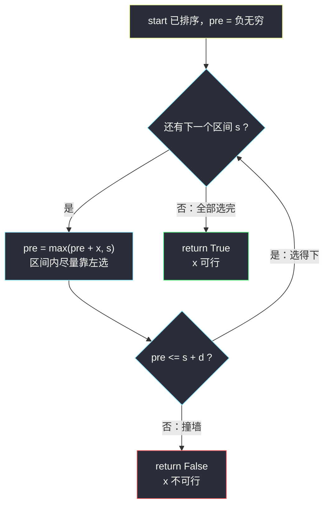
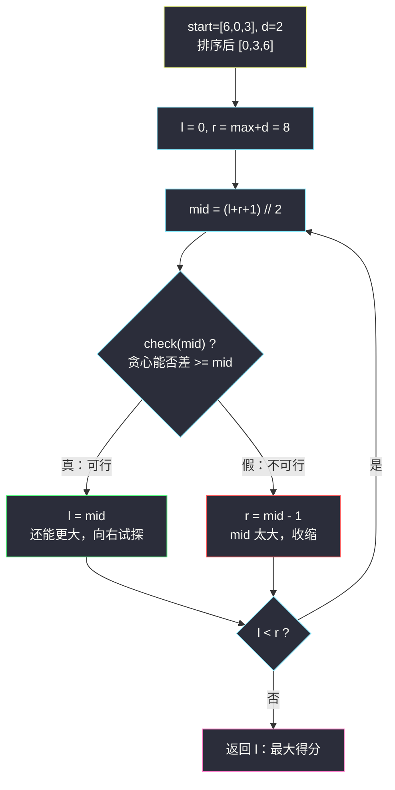

# 范围内整数的最大得分（二分答案 · 最大化最小值）

## 一、问题描述

给你一个整数数组 `start` 和一个整数 `d`。记 `n = start.length`，第 `i` 个整数区间为 `[start[i], start[i] + d]`。

你需要从**每个区间中各选一个整数**（同一个整数可以被不同区间重复选择）。

得分定义为所有两两之差的绝对值中的**最小值**，即任意 `i != j` 的 `|p_i - p_j|` 取最小。

返回能得到的**最大得分**。

> 🔗 LeetCode 3281：https://leetcode.cn/problems/maximize-score-of-numbers-in-ranges/
>
> 数据范围：`2 <= n <= 10^5`，`0 <= start[i] <= 10^9`，`2 <= d <= 10^9`。

**示例 1**

```
输入：start = [6,0,3], d = 2
输出：4
解释：三个区间为 [6,8]、[0,2]、[3,5]。
     分别选 8、0、4，两两之差为 8、4、4，得分 = min(8,4,4) = 4。
```

**示例 2**

```
输入：start = [2,6,13,13], d = 5
输出：5
解释：四个区间为 [2,7]、[6,11]、[13,18]、[13,18]。
     分别选 2、7、13、18，相邻差为 5、6、5，得分 = 5。
```

**直观理解**

注意题目问的不是「每个区间选哪个数」，而是「最小的那个间隔最大能到多少」——答案的候选是 `[0, 约 2*10^9]` 里的一个整数。这依然是**二分答案**：不去枚举选法，而是**在「得分」这个值上二分**，每猜一个得分 `x`，用 `O(n)` 的贪心去判定「能不能让任意两数之差都 ≥ x」。

它和 §2.1「求最小」家族（见同批 `koko-eating-bananas.md`）方向相反：这里是**求满足条件的最大值**，即灵神说的「最大化最小值」形态。

---

## 二、暴力解法

从大到小枚举得分 `x`：对每个 `x` 用贪心判定「是否存在一种选法使两两之差都 ≥ x」，第一个可行的 `x` 就是答案。

```python
class Solution:
    def maxPossibleScore(self, start: List[int], d: int) -> int:
        start.sort()

        def check(x: int) -> bool:          # 判定：最小差能否做到 >= x
            pre = -inf                      # 上一个选中的数
            for s in start:
                pre = max(pre + x, s)       # 在 [s, s+d] 内尽量靠左选
                if pre > s + d:
                    return False
            return True

        for x in range(max(start) + d, 0, -1):   # 从大到小试
            if check(x):
                return x
```

### 复杂度

- **时间**：`O(n * U)`，`U = max(start) + d` 可达 `2 * 10^9`，乘上 `n = 10^5` → 约 `10^14` 次运算，必然超时。
- **空间**：`O(1)`（不计排序）。

### 🔴 瓶颈在哪里

「得分越大越难满足」——可行 / 不可行在得分轴上是**一刀切**的，且具有单调分界。线性从大到小试探太浪费：`10^9` 量级的答案空间，二分只需约 31 次探测。

---

## 三、优化探索（核心章节）

> 📚 本题在灵茶题单中属于 **§2.5 最大化最小值**（二分答案 · 求最大）。模板口诀对齐灵神二分：**求最大 = `check(mid)` 满足则 `l = mid`，否则 `r = mid - 1`**，且 `mid` 必须**向上取整**防死循环（与 §2.2 求最大的 `maximum-candies-allocated-to-k-children.md` 同款；求最小则反过来 `r = mid`，见 `koko-eating-bananas.md`）。

### 3.1 关键观察：check 关于 x 单调

设 `check(x)` = 「存在选法，使任意两数之差都 ≥ x」：

- `x` 越小 → 约束越松 → 越容易满足；
- 若 `check(x)` 为真，则任何 `x' < x` 也为真（同一种选法直接复用）。

于是真值在得分轴上呈**前缀结构**：`[0, ans]` 全真、`(ans, +∞)` 全假。

**要的答案 = 最大的真 x**——标准的「求满足 check 的最大值」。


与 §2.1「求最小」互为镜像：那边是「左红右蓝找最左蓝」，这边是「左蓝右红找最右蓝」。

### 3.2 为什么先排序：最小差只看相邻

`n` 个数两两之差的最小值，一定出现在**排序后相邻的两个数**之间（隔一个数只会更远）。所以先把 `start` 排序，之后只需保证「按顺序处理时，每个新选的数与上一个的差 ≥ x」。

> 排序改变的只是**处理顺序**，不影响「每个区间选一个数」的自由度——得分只与选出的数集合有关，与哪个区间贡献的无关。

### 3.3 贪心 check：每个数尽量靠左选

固定得分 `x` 后，判定问题变成：能否依次为每个区间 `[s, s+d]` 选数，使得数列严格递增且相邻差 ≥ x？

**贪心策略**：按 `start` 从小到大处理，维护上一个选中的数 `pre`；当前区间必须选一个 ≥ `pre + x` 的数，那就选**最小可行的那个**：

```
pre = max(pre + x, s)        # 能贴着 pre+x 就贴着，但不得落进区间左边 s 之前
若 pre > s + d：区间里根本没有 >= pre+x 的数 → 不可行
```

**为什么尽量靠左是最优的**：`pre` 越小，对后续区间的「压迫」越小——任何合法选法中把当前数替换成更小但仍合法的数，后面的选择空间只会变大不会变小（交换论证）。所以贪心失败 ⟺ 不存在合法选法。



### 3.4 上下界怎么取

- **下界**：`1`（`d >= 2` 保证每个区间至少含 2 个整数，`n` 个区间总能选出两两不同的数，得分至少为 1）。代码里 `l` 从 `0`（下界 − 1）起步更稳，让二分天然覆盖极端情况。
- **上界**：最宽松取 `max(start) + d`（所有数都能塞进最大的区间右端之内侧）。更紧的上界是 `⌊(max + d - min) / (n - 1)⌋`——`n` 个数全落在 `[min, max+d]` 里，相邻差都 ≥ x 就必须 `(n-1) * x <= max + d - min`。两者都正确，只是轮数差个常数，本文演示用宽松上界。

### 3.5 求最大模板（含防死循环）

```
求满足 check(x) 的最大 x（区间 (l, r]）：
    l = 下界 - 1, r = 上界
    while l < r:
        mid = (l + r + 1) // 2      # 向上取整！
        if check(mid): l = mid      # mid 可行：答案 >= mid，向右试探
        else:          r = mid - 1  # mid 不可行：答案 < mid，收缩
    答案 = l
```

**为什么 mid 必须向上取整**：当 `l = r - 1` 时，若 `mid = (l+r) // 2 = l` 且 `check(l)` 为真，执行 `l = mid` 后区间不动 → **死循环**。改成 `(l + r + 1) // 2` 后这种情况下 `mid = r`，要么收敛、要么区间严格缩小。这是「求最大」与「求最小」最典型的镜像差异。



### 3.6 一句话核心

> **「任意两数差 ≥ x」对 x 越大越难 → 排序后贪心贴左判定，在 `[0, max+d]` 上跑「求最大」模板（check 真 `l = mid`，mid 上取整）。**

---

## 四、代码实现

### Python（主解）

```python
from math import inf

class Solution:
    def maxPossibleScore(self, start: List[int], d: int) -> int:
        start.sort()

        def check(x: int) -> bool:          # 最小差能否做到 >= x
            pre = -inf                      # 上一个选中的数
            for s in start:
                pre = max(pre + x, s)       # 在 [s, s+d] 内尽量靠左选
                if pre > s + d:
                    return False            # 这个区间放不下
            return True

        l, r = 0, max(start) + d            # 答案 ∈ [1, max+d]，l = 下界-1
        while l < r:
            mid = (l + r + 1) // 2          # 求最大：mid 向上取整
            if check(mid):
                l = mid                     # mid 可行，还能更大
            else:
                r = mid - 1                 # mid 不可行，收缩
        return l
```

**变量含义**

| 变量 | 含义 |
|------|------|
| `x` / `mid` | 猜测的得分（最小间隔下限） |
| `pre` | 已选数中最大的那个（排序后即「上一个」） |
| `max(pre + x, s)` | 当前区间内满足「≥ pre+x 且 ≥ s」的最小选择 |
| `l` | 蓝区右边界：它及以下的得分都可行 |
| `r` | 红区左边界：它以上的得分都不可行 |
| 返回值 `l` | 最大的可行得分 |

### Java（最优解同款写法）

```java
class Solution {
    public int maxPossibleScore(int[] start, int d) {
        Arrays.sort(start);
        long l = 0;
        long r = (long) start[start.length - 1] + d;   // max+d 可达 2e9，必须 long
        while (l < r) {
            long mid = l + (r - l + 1) / 2;            // 求最大：向上取整，防死循环
            if (check(start, mid, d)) l = mid;
            else r = mid - 1;
        }
        return (int) l;                                // 答案保证在 int 范围内
    }

    private boolean check(int[] start, long x, int d) {
        long pre = Long.MIN_VALUE / 2;                 // 负无穷（留余量防 pre+x 溢出）
        for (int s : start) {
            pre = Math.max(pre + x, s);
            if (pre > s + d) return false;
        }
        return true;
    }
}
```

**Java 易错**：上界 `max + d` 最大 `2 * 10^9`，超出 `int`（约 `2.1 * 10^9` 极限贴边），`l`、`r`、`mid` 一律用 `long`；返回时再转 `int`（题目保证答案可表示）。

---

## 五、具体例子演示

### 5.1 示例 1 端到端：start = [6,0,3], d = 2

排序后 `start = [0, 3, 6]`，三个区间 `[0,2]`、`[3,5]`、`[6,8]`。初始 `l = 0`，`r = max+d = 8`。

**每轮 check 的贪心过程**：

| 轮 | 猜 x | 区间 [0,2] 选 | 区间 [3,5] 选 | 区间 [6,8] 选 | check |
|----|------|---------------|---------------|---------------|-------|
| 1 | 4 | max(-∞+4, 0) = **0** | max(0+4, 3) = **4** ≤ 5 | max(4+4, 6) = **8** ≤ 8 | ✓ 真 |
| 2 | 6 | **0** | max(6, 3) = 6 > 5 | — | ✗ 假 |
| 3 | 5 | **0** | max(5, 3) = **5** ≤ 5 | max(5+5, 6) = 10 > 8 | ✗ 假 |

**二分逐轮表**（`mid = (l+r+1) // 2`）：

| 轮次 | l | r | mid | check(mid) | 染色 | 动作 |
|------|---|---|-----|-----------|------|------|
| 1 | 0 | 8 | 4 | ✓ | 蓝 | `l = 4` |
| 2 | 4 | 8 | 6 | ✗ | 红 | `r = 5` |
| 3 | 4 | 5 | 5 | ✗ | 红 | `r = 4` |

`l == r == 4`，返回 **4** ✓。

**还原最优选法**：得分 `x = 4` 时贪心选出 `0, 4, 8`——两两之差 `4, 8, 4`，最小值恰为 4，与示例解释（选 8、0、4）是同一组解。

### 5.2 示例 2 验证：start = [2,6,13,13], d = 5

排序后不变，四个区间 `[2,7]`、`[6,11]`、`[13,18]`、`[13,18]`。

- `check(5)`：选 2 → max(2+5, 6) = **7** ≤ 11 → max(7+5, 13) = **13** ≤ 18 → max(13+5, 13) = **18** ≤ 18 → **真**（选出 2, 7, 13, 18，与示例一致）
- `check(6)`：选 2 → max(8, 6) = 8 ≤ 11 → max(8+6, 13) = **14** ≤ 18 → max(14+6, 13) = 20 > 18 → **假**

可行上界 5、不可行下界 6，分界就在 5 ✓。

注意第三、四个区间**完全相同**（两个 13）：贪心让前一个选 `13`（贴左），后一个自然被顶到 `18`（贴右）——这正是「尽量靠左」给后面留空间的体现。

---

## 六、复杂度分析

| 方法 | 时间 | 空间 | 说明 |
|------|------|------|------|
| 暴力递减 | `O(n * U)`，U = max+d | `O(1)` | `10^14` 量级超时 |
| 二分答案 | `O(n log n + n log U)` | `O(1)` | 排序 `O(n log n)` + 二分约 31 轮 × 每轮 `O(n)` |

空间不计排序的递归栈/缓冲时为 `O(1)`；`U <= 2 * 10^9`，`log2(U) ≈ 31`。

---

## 七、对比总结

**二分答案家族方向对照**（§2.1 → §2.5 递进）：

| 小节 | 形态 | check 真值方向 | 收缩动作 | mid 取整 |
|------|------|----------------|----------|----------|
| §2.1 求最小（#875 等） | 最小化满足值 | 越大越真（左红右蓝） | 真 `r = mid` | 下取整 |
| §2.2 求最大（#2226） | 最大化满足值 | 越小越真（左蓝右红） | 真 `l = mid` | 上取整 |
| §2.4 最小化最大值（#2064） | 求最小 + 「最大 xx ≤ t」check | 越大越真 | 真 `r = mid` | 下取整 |
| **§2.5 最大化最小值（本篇）** | **求最大 + 「最小 xx ≥ t」check** | **越小越真** | **真 `l = mid`** | **上取整** |

「最大化最小值」= **求最大模板** + check 里问「最小的那个量能否 ≥ x」；「最小化最大值」= **求最小模板** + check 里问「最大的那个量能否 ≤ x」。方向搞反，模板必须整体镜像，不能只改一处。

**本篇易错点**

1. **忘记排序**：最小差由相邻数决定，不排序贪心直接错。
2. **贪心方向写反**：要「尽量靠左」（`max(pre+x, s)`），写成「尽量靠右」会无谓地挤压后续区间，把可行的 x 判成不可行。
3. **mid 不向上取整**：`l = r - 1` 时 `check(l)` 为真 → 死循环。
4. Java 上界用 `int` 溢出（`max + d` 可达 `2 * 10^9`）。
5. 第一个数直接选 `start[0]`（排序后最左区间的最左端点），不要从别的区间开始。

**模板（求最大，Python 版）**

```python
def largest_ok(check, lo, hi):          # 答案 ∈ [lo, hi]，check(lo) 必真
    l, r = lo - 1, hi
    while l < r:
        mid = (l + r + 1) // 2          # 向上取整防死循环
        if check(mid): l = mid
        else:          r = mid - 1
    return l
```

---

## 八、举一反三

| 题目 | 关系 |
|------|------|
| [2517. 礼盒的最大甜蜜度](https://leetcode.cn/problems/maximum-tastiness-of-candy-basket/) | **同构经典**：排序 + 二分「最小差」+ 贪心贴左挑选，check 与本篇几乎逐行相同 |
| [1552. 两球之间的磁力](https://leetcode.cn/problems/magnetic-force-between-two-balls/) | **同构经典**：固定位置上选 m 个球最大化最小间距，贪心判定同款 |
| [2064. 分配给商店的最多商品的最小值](https://leetcode.cn/problems/minimized-maximum-of-products-distributed-to-any-store/) | 镜像小节 §2.4「最小化最大值」：求最小模板 + 「最大值 ≤ x」check |
| [2226. 每个小孩最多能分到多少糖果](https://leetcode.cn/problems/maximum-candies-allocated-to-k-children/) | §2.2 求最大模板的直接应用，见同批 `maximum-candies-allocated-to-k-children.md` |
| [875. 爱吃香蕉的珂珂](https://leetcode.cn/problems/koko-eating-bananas/) | §2.1 求最小模板入门，见同批 `koko-eating-bananas.md` |
| [1011. 在 D 天内送达包裹的能力](https://leetcode.cn/problems/capacity-to-ship-packages-within-d-days/) | check 同为 `O(n)` 贪心（逐段装载）的求最小，见同批 `capacity-to-ship-packages-within-d-days.md` |
| [1201. 丑数 III](https://leetcode.cn/problems/ugly-number-iii/) / [878. 第 N 个神奇数字](https://leetcode.cn/problems/nth-magical-number/) | §2.6「第 K 小」：二分对象从「数组上选数」变成「正整数轴上数数」，见同批 `ugly-number-iii.md`、`nth-magical-number.md` |

**思想迁移**

- 看到「**最大化最小值 / 最小化最大值**」八个字，直接反射二分答案：把「最小/最大的那个量」设为二分对象，把「方案是否存在」设为 check。
- check 几乎总是**贪心**：排好序后按「尽量紧 / 尽量松」的一端贴，为后面留最大余地。
- 排序 + 二分 + 贪心判定的三件套，是 §2.5 这一族的通用骨架；换皮题（糖果甜蜜度、磁力、信号塔间距）都长一个样。
- 口诀：**「最值套最值，先想二分；单调分界在，折半见真。」**
