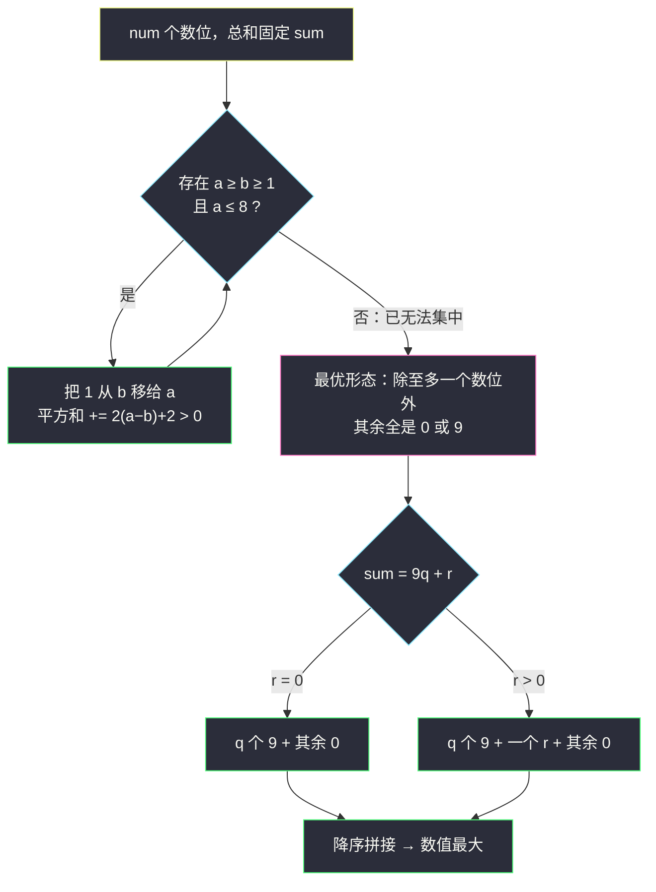

# 数位平方和的最大值（调整法 · 和固定则平方和尽量集中）

## 一、问题描述

给定两个正整数 `num` 与 `sum`。称正整数 `n` 为**好整数**，当且仅当：

- `n` 恰好有 `num` 个数位；
- `n` 的各位数字之和恰好为 `sum`。

好整数 `n` 的**分数**定义为其各位数字的平方和。请返回**分数最大**的好整数；若分数最大的好整数不止一个，返回其中**数值最大**的；若不存在好整数，返回空字符串 `""`。注意 `num` 可达 `2 × 10^5`，因此返回值以字符串形式给出。

> 🔗 LeetCode 3723：https://leetcode.cn/problems/maximize-sum-of-squares-of-digits/
>
> 数据范围：`1 <= num <= 2 × 10^5`，`1 <= sum <= 2 × 10^6`。

**示例 1**

```
输入：num = 2, sum = 3
输出："30"
解释：满足条件的好整数有 12、21、30（首位不为 0）。
     分数分别为 1²+2²=5、2²+1²=5、3²+0²=9，30 的分数最大。
```

**示例 2（自拟）**

```
输入：num = 3, sum = 20
输出："992"
解释：数位和固定为 20，分数最大的是 {9,9,2}（81+81+4=166），降序排列得 992。
```

**示例 3（自拟，无解）**

```
输入：num = 1, sum = 10
输出：""
解释：一位数的数位和至多 9，无法到达 10。
```

**直观理解**

约束「各位之和恰为 `sum`」把 `num` 个数位 `d1..dnum`（每个 `0..9`）绑在同一根预算线上：总和固定，问平方和最大。平方是凸的——**两数之和固定时，差越大，平方和越大**（`a + b = S` 时 `a² + b² = S²/2 + (a−b)²/2`）。所以最大值不在「平均分配」处，而在**极端分配**处：能凑 9 的尽量凑 9，剩下的差额塞给一个数位，其余全填 0。这正是灵茶题单 §4.4 均值不等式/调整法的贪心方向：**和固定时尽量集中到 9 与 0**。

---

## 二、暴力解法

最直接的枚举：逐位尝试 `0..9`，DFS 所有长度为 `num` 的数字串，筛出数位和为 `sum` 者，取分数最大的（并列取数值最大的）。

```python
class Solution:
    def maxSumOfSquaresOfDigits(self, num: int, total: int) -> str:
        best_score, best_num = -1, ""

        def dfs(pos: int, rest: int, path: list, score: int, lead: bool):
            nonlocal best_score, best_num
            if pos == num:
                if rest == 0 and score > best_score:   # 先到的 path 更大（按位贪心保证）
                    best_score, best_num = score, "".join(map(str, path))
                return
            # 剪枝：剩余 rest 必须能被剩下 (num-pos) 位放下
            lo = 1 if (lead and pos == 0) else 0       # 首位非零
            for d in range(min(9, rest), lo - 1, -1):
                path.append(d)
                dfs(pos + 1, rest - d, path, score + d * d, lead and d > 0)
                path.pop()

        dfs(0, total, [], 0, True)
        return best_num
```

（上面的写法在首位从大到小尝试，能保证并列分数时先得到数值最大者，但 `O(10^num)` 级的搜索树本身无法承受。）

### 复杂度

- **时间**：`O(10^num)`，指数级。
- **空间**：`O(num)` 递归栈。

### 🔴 瓶颈在哪里

即使加上记忆化把状态压成 `(已填位数, 剩余和)`，状态数也有 `num × sum = 2 × 10^5 × 2 × 10^6 = 4 × 10^11` 个，转移再乘 10——`n <= 20` 的老题套路在 `num = 2 × 10^5` 的规模下彻底失效。必须放弃「搜索/DP」，直接从**数学性质**推出最优解的形状。

---

## 三、优化探索（核心章节）

> 📚 本题在灵茶题单中属于 **§4.4 均值不等式**（贪心② C 路）。模板要点：**均值不等式/调整法——和固定时两数差越大平方和越大，故尽量集中到 9 与 0**。

### 3.1 无解判定

每个数位至多 9，`num` 个数位的和落在 `[0, 9 * num]`。又约束 `sum >= 1`，所以：

> **无解当且仅当 `sum > 9 * num`。**

注意数据范围里 `sum` 上界 `2 × 10^6` 大于 `9 * 2 × 10^5 = 1.8 × 10^6`，无解情形是真实可达的，这个分支必须保留。

### 3.2 调整法：只要还能「集中」，就还没到最优

设某方案中存在两个数位 `a >= b >= 1` 且 `a <= 8`（即 `a` 还能变大）。把 `b` 的 1 移给 `a`（和不变）：

```
(a + 1)² + (b − 1)² − (a² + b²) = 2(a − b) + 2 > 0
```

平方和**严格增大**。这意味着：

> **最优解中不可能同时存在「还能变大的数位」和「还能变小的数位」。**

换句话说，最优解里除**至多一个**数位落在 `1..8` 之间以外，其余数位必须全贴边界：要么 9（顶格），要么 0（垫底）。

### 3.3 唯一的最优形状

设 `sum = 9q + r`（`q = ⌊sum / 9⌋`，`0 <= r <= 8`）。既然至多一个数位在 `1..8`、其余全为 0 或 9，而总和又恰为 `9q + r`，唯一的候选多重集就是：

- `r = 0`：`q` 个 9，其余全 0；
- `r > 0`：`q` 个 9、一个 `r`，其余全 0。

最大分数为 `81q + r²`。以 `num = 3, sum = 20` 为例（`q = 2, r = 2`），调整法一路只增不减：

| 数位分配 | 平方和 | 还能调整吗 |
|----------|--------|-----------|
| {7,7,6} | 134 | 7 还能变大、6 还能变小 → 继续移 |
| {8,7,5} | 138 | 同上 |
| {9,7,4} | 146 | 同上 |
| {9,8,3} | 154 | 8 还能变大、3 还能变小 → 继续 |
| {9,9,2} | **166** | 1..8 内只剩一个数位 → 停，最优 |

**均值不等式的对照**：均值不等式（平方平均 ≥ 算术平均）给的是**下界**方向——平均分配时平方和最小 `sum² / num`；本题要的是**上界**，凸函数的最大值出现在可行域的**顶点**上（极端分配）。一句话：**均值不等式管「最小」，调整法追「最大」**。



### 3.4 并列时取数值最大：降序排列

分数最大的解是**唯一的多重集**，区别只在排列顺序。位数相同的两个正整数，数值比较就是字典序比较——把数位**降序排列**（大数字在前）即是数值最大者。降序后首位要么是 9（`q >= 1`），要么是 `r >= 1`（`q = 0` 时 `r = sum >= 1`），**首位永远非零**，无前导零问题。

### 3.5 一句话核心

> **先判 `sum > 9 * num` 无解；否则答案是 `q` 个 9、（`r > 0` 时）一个 `r`、其余 0，降序拼接。`O(num)` 一步构造。**

---

## 四、代码实现

### Python（主解：整除分解读出最优形态）

```python
class Solution:
    def maxSumOfSquaresOfDigits(self, num: int, total: int) -> str:
        # total 即题面参数 sum
        if total > 9 * num:                       # 数位和上界 9*num，放不下
            return ""
        q, r = divmod(total, 9)
        if r == 0:                                # 恰好 q 个 9 凑满
            return "9" * q + "0" * (num - q)
        return "9" * q + str(r) + "0" * (num - q - 1)
```

**逐行说明**

| 片段 | 含义 |
|------|------|
| `total > 9 * num` | 无解判定：`num` 位数位和的上界 |
| `q, r = divmod(total, 9)` | 拆出「满格的 9」个数与余数 |
| `"9" * q + "0" * (num - q)` | `r = 0`：9 后面垫零补足位数 |
| `"9" * q + str(r) + "0" * (num - q - 1)` | `r > 0`：余数位夹在 9 与 0 之间 |

**细节**：

1. `r = 0` 时必有 `q >= 1`（因为 `total >= 1`），不会输出全零串。
2. `q = 0` 时（`total <= 8`）答案是 `str(r)` 后跟 `num - 1` 个 0，首位即 `r >= 1`，天然无前导零。
3. 输出长度恰为 `num`：`r = 0` 时 `q + (num - q) = num`；`r > 0` 时 `q + 1 + (num - q - 1) = num`。
4. 本题不需要任何循环遍历输入，「算法」只有一次 `divmod`，其余是字符串拼接。

### Java（最优解环节同款）

```java
class Solution {
    public String maxSumOfSquaresOfDigits(int num, int sum) {
        if (sum > 9L * num) return "";
        int q = sum / 9, r = sum % 9;
        StringBuilder sb = new StringBuilder();
        for (int i = 0; i < q; i++) sb.append('9');
        if (r > 0) {
            sb.append((char) ('0' + r));
            for (int i = 0; i < num - q - 1; i++) sb.append('0');
        } else {
            for (int i = 0; i < num - q; i++) sb.append('0');
        }
        return sb.toString();
    }
}
```

注意 `9L * num`：`9 * 2 × 10^5 = 1.8 × 10^6` 并不溢出 `int`，但写成 `long` 乘法是防手滑的好习惯。

---

## 五、具体例子演示

### 例 1：num = 2，sum = 3（示例 1，端到端）

| 步 | 决策 | 状态 |
|----|------|------|
| 1 | 无解判定：`3 ≤ 9 × 2 = 18`，有解 | 继续 |
| 2 | `divmod(3, 9) = (0, 3)`，即 `q = 0, r = 3` | 待构造：0 个 9 + 一个 3 + 1 个 0 |
| 3 | 降序拼接：`"3" + "0"` | 已构造数位：`3, 0` |
| 4 | 校验：位数 2 ✓，数位和 `3+0=3` ✓，分数 `3²+0²=9` | 输出 `"30"` |

对照其余好整数：`12` 与 `21` 的分数均为 `1+4=5 < 9` ✓；分数 9 的排列有 `30` 与 `03`（后者首位为零非法），数值最大取 `30` ✓。

### 例 2：num = 4，sum = 27（自拟）

| 步 | 决策 | 已构造数位 | 剩余和 | 剩余位 |
|----|------|-----------|--------|--------|
| 1 | 无解判定：`27 ≤ 36` ✓ | — | 27 | 4 |
| 2 | `divmod(27, 9) = (3, 0)`，放 3 个 9 | `9, 9, 9` | 0 | 1 |
| 3 | 垫 0 补足位数 | `9, 9, 9, 0` | 0 | 0 |
| 4 | 输出 `"9990"`，分数 `81 × 3 = 243` | — | — | — |

### 例 3：num = 3，sum = 20（自拟，`r > 0` 的夹层）

| 步 | 决策 | 已构造数位 | 剩余和 | 剩余位 |
|----|------|-----------|--------|--------|
| 1 | 无解判定：`20 ≤ 27` ✓ | — | 20 | 3 |
| 2 | `divmod(20, 9) = (2, 2)`，放 2 个 9 | `9, 9` | 2 | 1 |
| 3 | 余数 `r = 2 ≤ 8`，放一个 2 | `9, 9, 2` | 0 | 0 |
| 4 | 输出 `"992"`，分数 `81 + 81 + 4 = 166` | — | — | — |

（这正是 §3.2 调整链 `{7,7,6} → … → {9,9,2}` 的终点，166 为所有分配中的最大值。）

### 例 4：num = 1，sum = 10（自拟，无解分支）

`10 > 9 × 1 = 9`，直接返回 `""`——此时连「一个数位」都装不下 `sum`。

---

## 六、复杂度分析

| 方法 | 时间 | 空间 | 说明 |
|------|------|------|------|
| DFS 枚举 | `O(10^num)` | `O(num)` | 指数级搜索树 |
| 记忆化 DP | `O(num × sum × 10)` | `O(num × sum)` | 状态数 `4 × 10^11`，不可行 |
| 调整法构造 | `O(num)` | `O(1)`（输出不计） | 一次 `divmod` + 字符串拼接 |

- **时间**：`O(num)`——构造输出串本身的长度就是 `num`，已是最优下界。
- **空间**：除输出串外 `O(1)`。

---

## 七、对比总结

**「和固定 → 平方和」的两极**

| 方向 | 结论 | 工具 |
|------|------|------|
| 平方和**最小** | 各数位尽量平均（`sum²/num` 下界） | 均值不等式（平方平均 ≥ 算术平均） |
| 平方和**最大**（本题） | 各数位尽量极端：全 9 与 0，至多一个夹层 | 调整法 / 凸性（差越大平方和越大） |

**同族对照**

| 题 | 与本题的关系 |
|----|--------------|
| #2519 K 次增加后的最大乘积（见 `maximum-product-after-k-increments.md`） | 均值不等式的「平均」方向：和增加时**积**最大靠各数尽量相等，与本题「集中」方向互为镜像 |
| #1363 形成三的最大倍数（见本批 `largest-multiple-of-three.md`） | 同是「数位多重集 + 降序拼接」，多一层整除约束 |
| #2384 最大回文数字（见 `largest-palindromic-number.md`） | 数位频次构造的回文版 |

**易错点**

1. **忘记无解分支**：`sum > 9 * num` 时返回 `""`，数据范围专门留了这种可能。
2. `r = 0` 与 `r > 0` 的拼接长度公式不同（后者 `r` 本身占一位），直接套一个公式容易差一。
3. 别去排序一个显式的数位列表——`"9"*q + str(r) + "0"*...` 天然降序，无需额外开销。
4. 输出必须补足 `num` 位（含尾部的 0），长度不足或超出都会被判错。

**模板（和固定求凸函数极值，Python 版）**

```python
if sum > 9 * num: return ""        # 无解
q, r = divmod(sum, 9)              # 尽量集中：满格 9 + 至多一个余数
return "9" * q + (str(r) if r else "") + "0" * (num - q - (r > 0))
```

---

## 八、举一反三

| 题目 | 关系 |
|------|------|
| [670. 最大交换](https://leetcode.cn/problems/maximum-swap/) | 数位重排使数值最大的入门款：一次交换怎么换 |
| [738. 单调递增的数字](https://leetcode.cn/problems/monotone-increasing-digits/) | 数位构造 + 贪心填 9 的另一形态（从某位起全填 9） |
| [2542. 最大子序列的分数](https://leetcode.cn/problems/maximum-subsequence-score/) | 「排序后取前 k」与凸性权衡的组合版 |
| [1363. 形成三的最大倍数](https://leetcode.cn/problems/largest-multiple-of-three/) | 本批姊妹篇（`largest-multiple-of-three.md`）：数位 + 整除性 + 字典序最大 |
| [1402. 做菜顺序](https://leetcode.cn/problems/reducing-dishes/) | 本批姊妹篇（`reducing-dishes.md`）：排序不等式（乘积和的极值方向） |

**思想迁移**

- 「**和固定**」是凸函数极值题的信号词：最大值在**边界/极端**，最小值在**平均**——先想调整法一步交换能改变多少。
- 构造题先问「最优解长什么样」，再问「怎么拼」：本题最优多重集唯一，拼接只需降序。
- 口诀：**「和定看凹凸，平均得最小；集中到边角，九后零垫脚。」**
