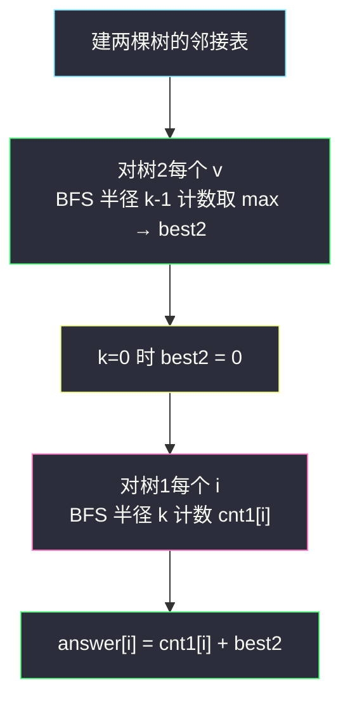
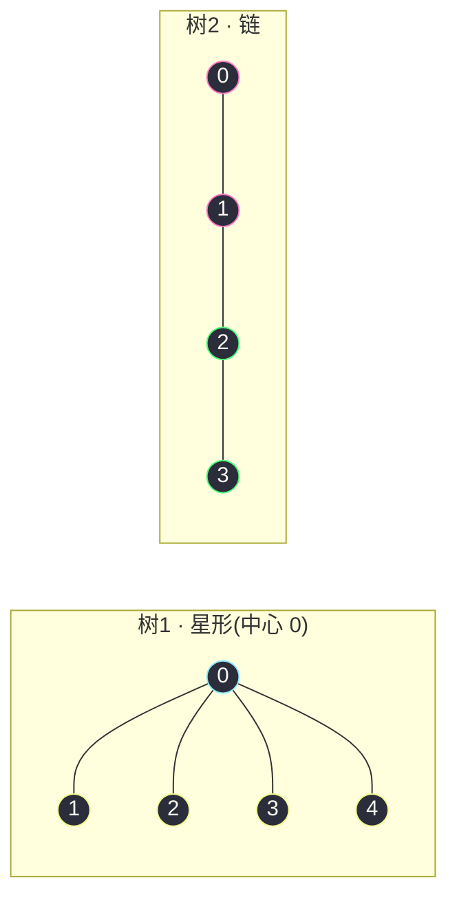

# 3372. 连接两棵树后最大目标节点数目 I(Maximize the Number of Target Nodes After Connecting Trees I)

> 🔗 LeetCode 3372:https://leetcode.cn/problems/maximize-the-number-of-target-nodes-after-connecting-trees-i/
>
> 📚 灵茶题单小节:§ 树上 BFS:距离半径计数(难度分 1701)
>
> 同族文章:[#2385 感染二叉树需要的分钟数](amount-of-time-for-binary-tree-to-be-infected.md)(同为"树上 BFS 按半径扩散",那篇求最远层,本文数半径内节点数)、[#3249 统计好节点的数目](count-the-number-of-good-nodes.md)(无向边表 → 定向 → 计数的标准三步)。

## 一、问题描述

有两棵**无向**树,分别有 `n` 和 `m` 个节点,编号分别为 `[0, n-1]` 与 `[0, m-1]`。给定长度为 `n-1` 与 `m-1` 的二维整数数组 `edges1` 和 `edges2`(`edges[i] = [a, b]` 表示对应树中 `a`、`b` 间有一条边),以及一个整数 `k`。

如果节点 `u` 和节点 `v` 之间路径的**边数 ≤ k**,则称 `u` 是 `v` 的**目标节点**。注意,一个节点一定是它**自己的**目标节点。

请你返回长度为 `n` 的数组 `answer`:`answer[i]` 表示**将第一棵树的节点 `i` 与第二棵树的某个节点连一条边后**,第一棵树中节点 `i` 的目标节点数目的**最大值**。

每个查询相互独立:进行下一次查询前,先把刚添加的边删掉。

**示例 1**

```text
输入:edges1 = [[0,1],[0,2],[2,3],[2,4]], edges2 = [[0,1],[0,2],[0,3],[2,7],[1,4],[4,5],[4,6]], k = 2
输出:[9,7,9,8,8]
解释:i=0 连 tree2 的节点 0(其半径 2 内有 4 个目标);i=1 连节点 0;
i=2 连节点 4;i=3 连节点 4;i=4 连节点 4。
```

**示例 2**

```text
输入:edges1 = [[0,1],[0,2],[0,3],[0,4]], edges2 = [[0,1],[1,2],[2,3]], k = 1
输出:[6,3,3,3,3]
```

> 数据范围:`1 <= n, m <= 1000`,`0 <= k <= 1000`;`edges1`、`edges2` 均构成合法的树。

**直观理解**:"目标节点"就是**半径 `k` 的邻域大小**。连一条桥边后,节点 `i` 的邻域被拆成两半:本树内走 `k` 步能到的,加上桥对岸走 `k-1` 步能到的(过桥本身花掉一步)。而对岸的"最优落点"与 `i` 无关——谁连过去都从同一段子树里挑。所以这题表面是"两棵树的交互",实际是**两组独立的半径计数,一个加号连起来**。

## 二、暴力解法

照定义直译:对每个 `i`,枚举第一棵树所有节点 `u`,跑 BFS 求两点距离,数 `≤ k` 的个数;再枚举第二棵树每个落点 `v`、`v` 的半径 `k-1` 邻域大小取最大,两者相加。

```python
class Solution:
    def maxTargetNodes(self, edges1: List[List[int]], edges2: List[List[int]], k: int) -> List[int]:
        n, m = len(edges1) + 1, len(edges2) + 1

        def build(edges, sz):
            g = [[] for _ in range(sz)]
            for a, b in edges:
                g[a].append(b)
                g[b].append(a)
            return g

        def dist_table(g, src):                 # 完整距离表:src 到每个点
            dist = [-1] * len(g)
            dist[src] = 0
            q = deque([src])
            while q:
                u = q.popleft()
                for w in g[u]:
                    if dist[w] == -1:
                        dist[w] = dist[u] + 1
                        q.append(w)
            return dist

        g1, g2 = build(edges1, n), build(edges2, m)
        ans = []
        for i in range(n):                      # 每个 i 都重算一切,不缓存
            d = dist_table(g1, i)
            self_cnt = sum(1 for x in d if x != -1 and x <= k)
            other = 0
            for v in range(m):                  # 每个 i 都重新枚举对岸落点
                d2 = dist_table(g2, v)
                other = max(other, sum(1 for x in d2 if x != -1 and x <= k - 1))
            ans.append(self_cnt + other)
        return ans
```

### 复杂度

- 时间:`O(n × (n + m × m))`——每个 `i` 跑一趟树 1 的全图 BFS,再对每个对岸落点各跑一趟树 2 全图 BFS;`n = m = 1000` 时约 10⁹ 量级,会超时。
- 空间:`O(n + m)`(邻接表与距离表)。

正确性无懈可击,浪费也一目了然:树 2 的"最优落点价值"对每个 `i` 都一样,却被重算了 `n` 遍;而半径 `k` 之外的层,BFS 还在傻傻地继续扩展。

## 三、优化探索

### 观察 1:桥边把半径切成 k 与 k−1 两半

设 `i` 连上 `v`。第一棵树内的目标仍是"距离 ≤ k";去第二棵树的任意点 `w`,路径必走 `i → v` 这条桥,剩余步数 `k - 1`:

```text
answer[i] = |{u ∈ 树1 : dist1(i, u) ≤ k}| + max over v |{w ∈ 树2 : dist2(v, w) ≤ k - 1}|
```

两半**完全解耦**——第一项只与 `i` 有关,第二项与 `i` 无关,一个加号就是全部交互。`k = 0` 时第二项半径为负、恒取 0,公式自动退化为"只数自己"。

### 观察 2:树 2 只需算一次

`max over v` 的值对所有 `i` 共享:跑 `m` 趟 BFS 取最大,缓存成一个 `best2`。整体从"每查询全量重算"降为"两边各扫一遍"。

### 观察 3:BFS 半径剪枝

数"半径 ≤ k 的节点"不需要全图距离表:队列里一旦当前层距离达到 `k`(对树 2 是 `k - 1`),就不再向外扩展——超出半径的层根本无需访问。树的 BFS 天然按层推进,剪枝只需一行 `if d == limit: continue`。



### 观察 4:还能更快吗

`n = m = 1000` 时 `O(n²)` 约 10⁶,轻松通过——本题(I 版)的定位就是 BFS 计数。但若规模抬到 10⁵(姊妹题 II 版 [#3373](https://leetcode.cn/problems/maximize-the-number-of-target-nodes-after-connecting-trees-ii/) 即如此),逐源 BFS 失效,需换**换根 DP**:自根一次 DFS 统计子树内按距离的计数,再自顶向下把"子树外"的距离分布沿父边平移合并,得到每个节点的全树距离分布,总量 `O(n)`。I 版先把 BFS 写顺,是 II 版的台阶。

### 观察 5:I 版与 II 版的分水岭——什么时候必须换根

多源 BFS 的代价是"每个源点一趟全图"。本题 `n, m ≤ 1000`,总量 `O(n²)` 约百万级,BFS 版绰绰有余;但姊妹题 [#3373](https://leetcode.cn/problems/maximize-the-number-of-target-nodes-after-connecting-trees-ii/) 把规模抬到 `10⁵`、`k` 还逐节点变化,多源 BFS 直接失效。那边的解法是**换根 DP**:先自根一次 DFS 算出根的距离分布,再自顶向下把"父侧子树"的距离分布沿父边平移给每个孩子,总量 `O(n)`。两题共用同一套"半径邻域"语义,却因规模分岔出两套算法——**先看数据范围再定算法复杂度档位**,是竞赛与面试共同的入场券。

### 观察 4 之外的实现取舍

还有一处小权衡:树 2 的 `m` 趟 BFS 与树 1 的 `n` 趟各自独立,可任意交换顺序、甚至可以只在 `k > 0` 时才算树 2——主解已这样处理。若把两棵树的 BFS 写成同一个闭包(本文 `cnt_within` 即如此),代码几乎没有重复;若拆开写两份,反而容易在"k 与 k−1"的细节上抄错一处。

## 四、代码实现

```python
class Solution:
    def maxTargetNodes(self, edges1: List[List[int]], edges2: List[List[int]], k: int) -> List[int]:
        n, m = len(edges1) + 1, len(edges2) + 1

        def build(edges, sz):
            g = [[] for _ in range(sz)]
            for a, b in edges:
                g[a].append(b)
                g[b].append(a)
            return g

        def cnt_within(g, src, limit):          # 距 src 距离 ≤ limit 的节点数
            if limit < 0:                       # k = 0 时对岸半径为负
                return 0
            seen = [False] * len(g)
            seen[src] = True
            q = deque([(src, 0)])
            cnt = 0
            while q:
                u, d = q.popleft()
                cnt += 1                        # 出队即计数
                if d == limit:                  # 半径剪枝:最外层不再扩展
                    continue
                for w in g[u]:
                    if not seen[w]:
                        seen[w] = True
                        q.append((w, d + 1))
            return cnt

        g1, g2 = build(edges1, n), build(edges2, m)

        best2 = 0                                # 对岸最优贡献,与 i 无关
        if k > 0:
            for v in range(m):
                best2 = max(best2, cnt_within(g2, v, k - 1))

        return [cnt_within(g1, i, k) + best2 for i in range(n)]
```

### 细节说明

- **`limit < 0` 卫语句**:`k = 0` 时树 2 半径为 `-1`,直接返回 0,同时外层 `if k > 0` 连 `m` 趟 BFS 都省掉——树 2 无论怎么连都带不来任何目标节点。
- **出队即计数**:节点出队时 `cnt += 1`,而非入队时——两种写法都能数对,但出队计数与"距离 ≤ limit 才可能出队"的剪枝逻辑更贴近;入队计数的版本要在入队前判 `d + 1 <= limit`,边界多绕一层。
- **`d == limit` 剪枝**:`continue` 只跳过扩展,当前节点照常计数——最外层的节点数也要算进去,漏了会把"恰好半径上的目标"全丢掉。
- **`seen` 判重不可省**:无向图 BFS 中邻居会互相指认,没有 `seen` 会反复入队直到队列爆炸。
- **树 2 的 `best2` 用 `max` 初始化为 0**:`m ≥ 1` 保证至少有一个落点,但 `k = 0` 分支已提前短路,0 是"无贡献"的安全哨兵。

## 五、例子演示

**示例 2** `edges1 = [[0,1],[0,2],[0,3],[0,4]]`(星形,中心 0),`edges2 = [[0,1],[1,2],[2,3]]`(链 0-1-2-3),`k = 1` 全流程:



**先算 best2(半径 k−1 = 0)**:树 2 每个落点只数自己 → 恒为 1,`best2 = 1`。

**再算每个 i 的 cnt1(半径 1)**:

| i | 半径 1 邻域 | cnt1 | answer = cnt1 + 1 |
|---|---|---|---|
| 0(中心) | {0, 1, 2, 3, 4} | 5 | **6** |
| 1 | {1, 0} | 2 | 3 |
| 2 | {2, 0} | 2 | 3 |
| 3 | {3, 0} | 2 | 3 |
| 4 | {4, 0} | 2 | 3 |

输出 `[6, 3, 3, 3, 3]` ✅——星形中心"一站直达全树",外围节点只摸得到中心。

**示例 1** 逐 `i` 全表核对(`k = 2`,树 2 半径 1 的最大邻域 best2 = 4:节点 0 摸 {0,1,2,3}、节点 4 摸 {4,1,5,6}):树 1 形如 `0 - {1, 2}`、`2 - {3, 4}`。

| i | 树 1 半径 2 邻域 | cnt1 | answer = cnt1 + 4 |
|---|---|---|---|
| 0 | {0,1,2,3,4}(3、4 距离 2) | 5 | **9** |
| 1 | {1,0,2}(3、4 距离 3 超界) | 3 | **7** |
| 2 | {2,0,3,4,1} | 5 | **9** |
| 3 | {3,2,0,4}(1 距离 3 超界) | 4 | **8** |
| 4 | {4,2,0,3} | 4 | **8** |

输出 `[9, 7, 9, 8, 8]` ✅。注意 `i = 1` 与 `i = 0` 同在树 1 却差 2——外围节点过桥后能少走的那段路,被桥本身的一步抵消了一部分,邻域裁剪的边界感在这张表里一览无余。

**边界用例速查**:

| 用例 | 输入 | 期望 | 考点 |
|---|---|---|---|
| `k = 0` | 任取两棵树 | `[1] * n` | 只数自己,对岸短路 |
| 单节点两树 | `edges = []` 两边 | `1 + best2` | 边数 0 也建得成表 |
| `k ≥ 树直径` | 任取 | `[n + m_best] 类` | 全树都是目标 |
| 星形 vs 链 | 示例 2 | `[6,3,3,3,3]` | 中心优势 |

`k ≥ 树直径`一行:半径覆盖全树后 cnt1 恒为 `n`,答案退化为 `n + best2`,与 `i` 无关——多源 BFS 此时做了 `n` 遍同样的全图扫描,是可优化但不必优化的冷路径;面试时能指出这一点,说明对复杂度的理解已到位。

### 常见错误清单

- **对岸半径忘减 1**:桥边本身耗一步,树 2 邻域应是 `k - 1`;写成 `k` 会把每个 answer 系统性抬高。
- **`k = 0` 没有短路**:半径 −1 的 BFS 若不设卫语句,`cnt` 会把源点自身数进去,凭空多 1。
- **最外层节点漏计**:`d == limit` 时 `continue` 跳过的是**扩展**,若把计数也一并跳过,恰好落在半径上的目标全部丢失。
- **两棵树的节点数算错**:`n = len(edges1) + 1`(边数 + 1),树无环无重边,直接由边数推节点数。
- **把"查询独立"当"连边后重算树 1 结构"**:桥边不会改变树 1 内部的任何距离——`i` 到本树点的路径根本不必走桥(走了只会更长)。第一项与没连边时完全相同。

## 六、复杂度分析

- **时间:`O(n × n + m × m)`**——树 1 的 `n` 趟 BFS(每趟访问 ≤ n 个节点)+ 树 2 的 `m` 趟;`n = m = 1000` 时约 2 × 10⁶ 次基本操作,远低于上限。
- **空间:`O(n + m)`**——邻接表线性,每趟 BFS 的 `seen`/队列即用即弃。

## 七、对比总结

| 解法 | 时间 | 空间 | 备注 |
|---|---|---|---|
| 每查询重算对岸(暴力) | `O(n(n + m²))` | `O(n + m)` | 正确但超时 |
| **best2 缓存 + 半径剪枝 BFS(本文)** | `O(n² + m²)` | `O(n + m)` | I 版标准解 |
| 换根 DP(II 版思路) | `O(n + m)` | `O(n + m)` | 规模 10⁵ 时才需要,I 版用不上 |

| 易错点 | 说明 |
|---|---|
| 对岸半径 k−1 | 过桥耗一步,忘减则系统性偏大 |
| k=0 短路 | 树 2 无贡献,卫语句防多算 |
| 剪枝不剪计数 | 最外层节点仍是目标 |

**一句话**:桥边把"半径 k"切成两半,两半解耦后各做一遍**多源 BFS 计数**——**"连边/加边"类查询,先想清楚哪部分与查询无关,把它抽成公共项**。

## 八、举一反三

- [#3373 连接两棵树后最大目标节点数目 II](https://leetcode.cn/problems/maximize-the-number-of-target-nodes-after-connecting-trees-ii/):`k` 变成逐节点查询且规模 10⁵,逼出换根 DP `O(n)`——本文的 BFS 解是它的前传。
- [#2385 感染二叉树需要的分钟数](amount-of-time-for-binary-tree-to-be-infected.md)(站内):同一副"树上 BFS 按层扩散"骨架,那题问最深一层,本题主数半径内节点——图同、问法异。
- [#3249 统计好节点的数目](count-the-number-of-good-nodes.md)(站内):无向边表定向计数的近亲,体会"边表 → 邻接表 → BFS/DFS"的固定起手式。
- [#863 二叉树中所有距离为 K 的结点](https://leetcode.cn/problems/all-nodes-distance-k-in-binary-tree/):单源半径 k 的"点名"版——把本文的计数换成收集,加一个"父指针方向"的巧思。
- [#1519 Number of Nodes in the Sub-Tree With the Same Label](https://leetcode.cn/problems/number-of-nodes-in-the-sub-tree-with-the-same-label/):子树内计数,DFS 后序合并——与半径计数合读,覆盖树上计数两大套路。

> **框架总结**:"距离 ≤ k"= BFS 第 k 层为止的全部节点。多查询时先问:**查询间共享什么?** 把不变量(如 best2)算一次、变量逐点算,是所有"批量查询"题目的第一刀。
